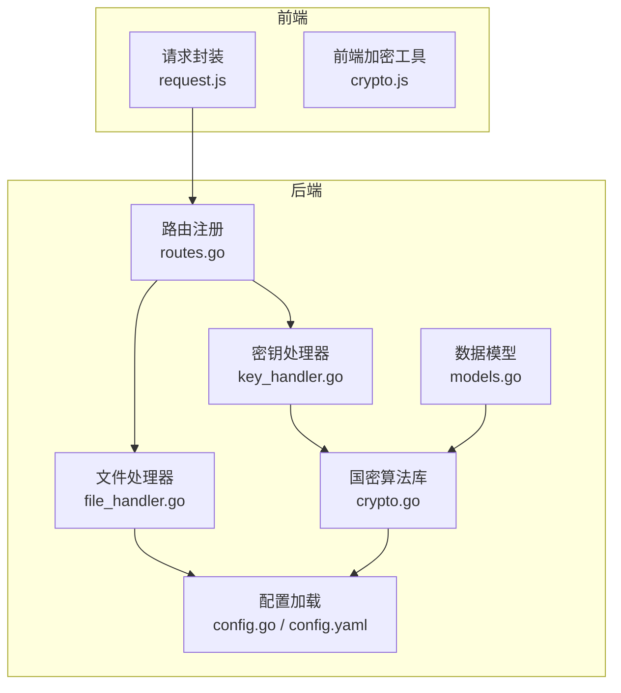
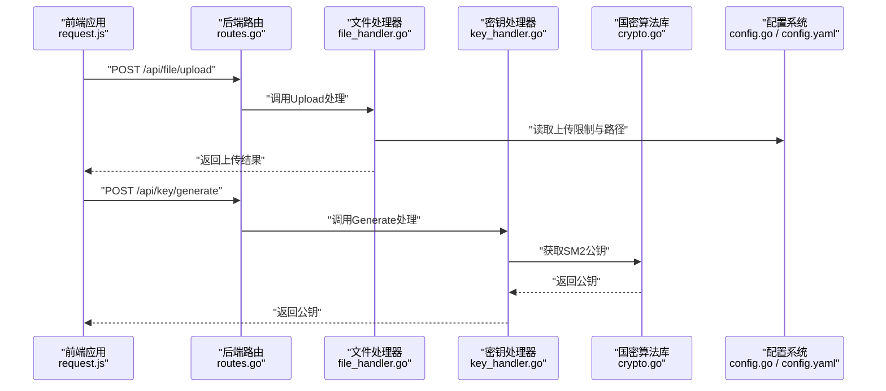
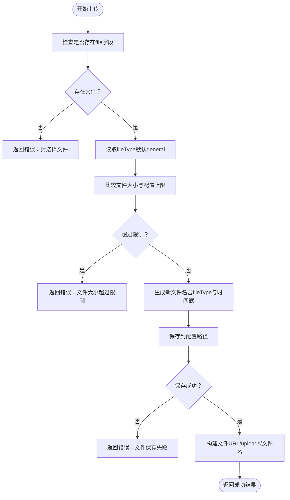
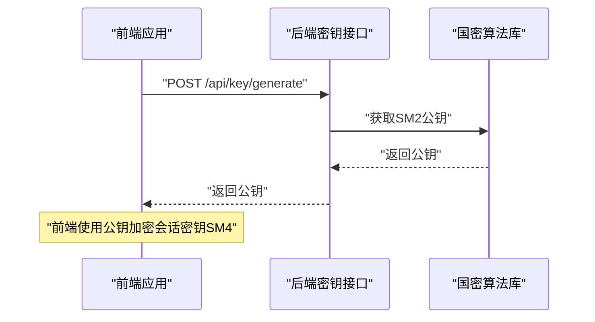
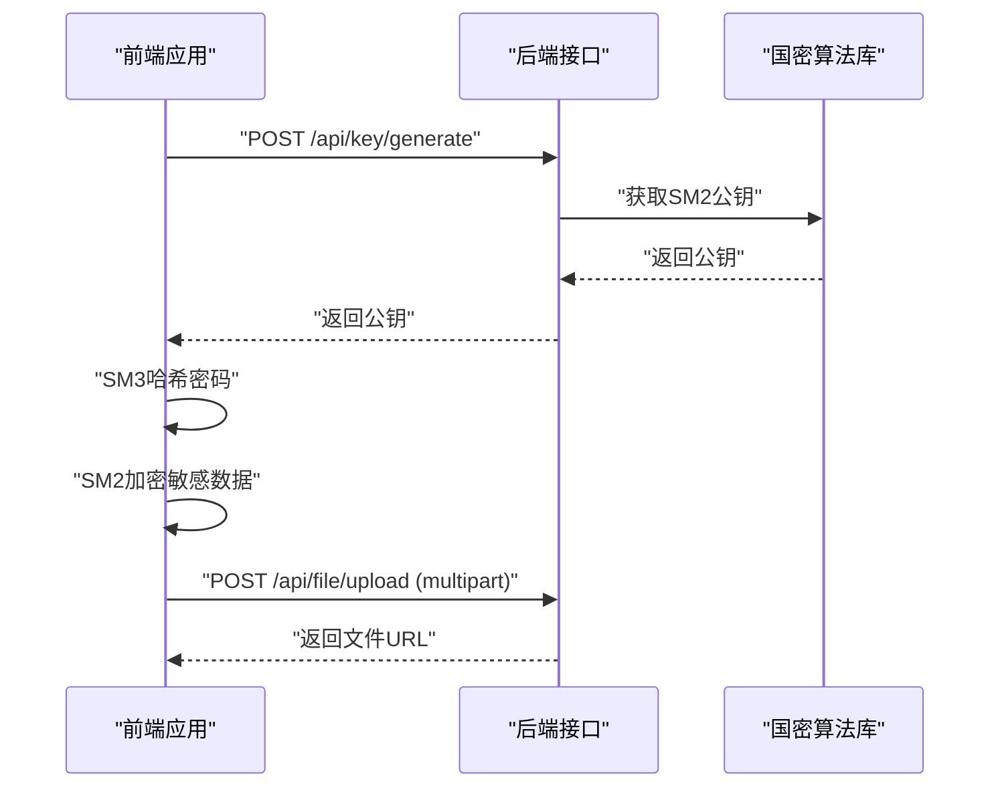
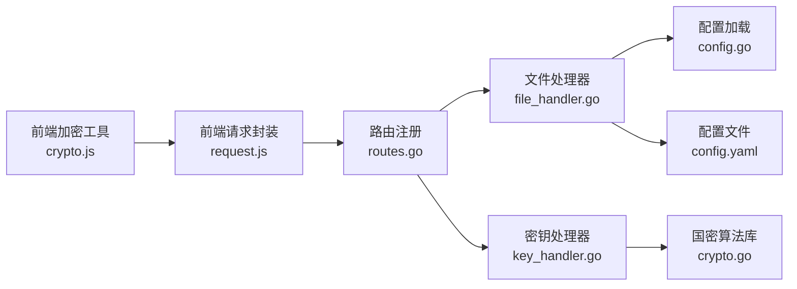

# 文件与密钥API

<cite>
**本文引用的文件**
- [routes.go](file://backed/internal/api/routes.go)
- [file_handler.go](file://backed/internal/api/handler/file_handler.go)
- [key_handler.go](file://backed/internal/api/handler/key_handler.go)
- [crypto.go](file://backed/internal/crypto/crypto.go)
- [config.go](file://backed/pkg/config/config.go)
- [config.yaml](file://backed/config/config.yaml)
- [models.go](file://backed/internal/model/models.go)
- [request.js](file://fonted/utils/request.js)
- [crypto.js](file://fonted/utils/crypto.js)
- [API接口总览.md](file://API接口总览.md)
- [开发文档.md](file://开发文档.md)
</cite>

## 目录
1. [简介](#简介)
2. [项目结构](#项目结构)
3. [核心组件](#核心组件)
4. [架构总览](#架构总览)
5. [详细组件分析](#详细组件分析)
6. [依赖关系分析](#依赖关系分析)
7. [性能与安全考量](#性能与安全考量)
8. [故障排查指南](#故障排查指南)
9. [结论](#结论)
10. [附录](#附录)

## 简介
本文件整合“文件上传”与“国密密钥管理”的API文档，重点说明：
- 文件上传接口的请求格式、大小限制与存储策略
- SM2公钥获取与SM4会话密钥生成的密钥管理流程
- 文件与密钥在国密加密体系中的作用及与用户身份的绑定
- 前端加密上传的完整流程示例（含SM3哈希与SM4加密传输）

## 项目结构
后端采用Gin框架，按模块划分路由；前端使用uni-app，通过封装的请求工具进行API交互。配置通过YAML文件集中管理，包含上传限制、加密密钥与JWT设置。

图表来源
- [routes.go](file://backed/internal/api/routes.go#L1-L95)
- [file_handler.go](file://backed/internal/api/handler/file_handler.go#L1-L58)
- [key_handler.go](file://backed/internal/api/handler/key_handler.go#L1-L24)
- [crypto.go](file://backed/internal/crypto/crypto.go#L1-L121)
- [config.go](file://backed/pkg/config/config.go#L1-L78)
- [config.yaml](file://backed/config/config.yaml#L1-L37)
- [models.go](file://backed/internal/model/models.go#L1-L160)
- [request.js](file://fonted/utils/request.js#L1-L222)
- [crypto.js](file://fonted/utils/crypto.js#L1-L255)

章节来源
- [routes.go](file://backed/internal/api/routes.go#L1-L95)
- [config.go](file://backed/pkg/config/config.go#L1-L78)
- [config.yaml](file://backed/config/config.yaml#L1-L37)

## 核心组件
- 文件上传模块：提供上传接口，校验文件大小与类型，保存至本地路径，并返回文件URL与元信息。
- 密钥管理模块：提供SM2公钥获取接口，供前端加密敏感数据传输。
- 国密算法库：提供SM3哈希、SM4对称加解密、SM2非对称加解密与SM2公钥导出。
- 配置系统：集中管理上传限制、允许类型、上传路径、SM4主密钥与JWT配置。
- 数据模型：定义用户、问诊、病历等实体，体现SM3哈希与SM4加密字段的使用场景。

章节来源
- [file_handler.go](file://backed/internal/api/handler/file_handler.go#L1-L58)
- [key_handler.go](file://backed/internal/api/handler/key_handler.go#L1-L24)
- [crypto.go](file://backed/internal/crypto/crypto.go#L1-L121)
- [config.go](file://backed/pkg/config/config.go#L1-L78)
- [models.go](file://backed/internal/model/models.go#L1-L160)

## 架构总览
后端通过路由组将用户、问诊、病历、通知、密钥与文件模块组织起来，均受鉴权中间件保护。前端通过统一请求封装与加密工具与后端交互。

图表来源
- [routes.go](file://backed/internal/api/routes.go#L68-L82)
- [file_handler.go](file://backed/internal/api/handler/file_handler.go#L18-L57)
- [key_handler.go](file://backed/internal/api/handler/key_handler.go#L15-L23)
- [crypto.go](file://backed/internal/crypto/crypto.go#L114-L121)
- [config.go](file://backed/pkg/config/config.go#L51-L77)
- [config.yaml](file://backed/config/config.yaml#L30-L36)

## 详细组件分析

### 文件上传接口
- 接口路径：/api/file/upload
- 方法：POST
- 认证：需要登录（携带JWT Bearer Token）
- 请求体：
  - multipart/form-data
  - 字段：
    - file：必填，文件对象
    - fileType：可选，默认“general”
    - encrypt：可选布尔值（前端示例中传入true）
- 响应：
  - 成功返回包含文件URL、原始文件名、文件大小、上传时间等信息
  - 失败返回错误码与消息（如未选择文件、大小超限、保存失败）

- 限制与策略
  - 大小限制：来自配置项upload.max_size（单位字节），默认10MB
  - 类型限制：来自配置项upload.allowed_types（MIME类型数组）
  - 存储策略：保存到配置项upload.upload_path指定目录，文件名由fileType与纳秒时间戳拼接生成
  - URL返回：以“/uploads/文件名”形式返回，实际部署需配合静态文件服务器

- 前端上传流程要点
  - 使用uni.uploadFile上传，携带Authorization头
  - formData中包含fileType与encrypt标志
  - 成功后解析后端返回的统一格式数据

图表来源
- [file_handler.go](file://backed/internal/api/handler/file_handler.go#L18-L57)
- [config.go](file://backed/pkg/config/config.go#L51-L55)
- [config.yaml](file://backed/config/config.yaml#L30-L36)
- [request.js](file://fonted/utils/request.js#L128-L175)

章节来源
- [file_handler.go](file://backed/internal/api/handler/file_handler.go#L18-L57)
- [config.go](file://backed/pkg/config/config.go#L51-L55)
- [config.yaml](file://backed/config/config.yaml#L30-L36)
- [request.js](file://fonted/utils/request.js#L128-L175)

### 密钥管理接口
- SM2公钥获取
  - 接口路径：/api/key/generate
  - 方法：POST
  - 认证：需要登录
  - 功能：返回系统SM2公钥（十六进制字符串），供前端加密敏感数据传输
  - 注意：当前后端仅提供公钥获取；私钥管理与下载接口在现有代码中未实现，需结合业务需求补充

- SM4会话密钥生成（概念说明）
  - 根据开发文档，系统支持“生成会话密钥”，用于本次会话的敏感数据加密
  - 该流程通常由前端获取系统公钥后，生成随机SM4会话密钥，再用SM2公钥加密后发送给后端，后端返回会话标识与有效期
  - 当前后端未实现该接口，需按开发文档补充

图表来源
- [key_handler.go](file://backed/internal/api/handler/key_handler.go#L15-L23)
- [crypto.go](file://backed/internal/crypto/crypto.go#L114-L121)
- [开发文档.md](file://开发文档.md#L1023-L1053)

章节来源
- [key_handler.go](file://backed/internal/api/handler/key_handler.go#L15-L23)
- [crypto.go](file://backed/internal/crypto/crypto.go#L114-L121)
- [开发文档.md](file://开发文档.md#L967-L1053)

### 前端加密上传流程（含SM3哈希与SM4传输）
- 步骤概览
  1) 获取系统SM2公钥（用于后续加密）
  2) 对密码进行SM3哈希（前端一次哈希）
  3) 对敏感数据（如症状、病历内容）进行SM2加密（使用公钥）
  4) 上传文件时携带fileType与encrypt标志，后端按规则保存
  5) 后端返回文件URL，前端展示或继续业务流程

- 前端工具与封装
  - request.js：统一请求封装，自动附加Authorization头，处理错误码
  - crypto.js：提供SM3哈希、SM2/SM4加解密占位函数（当前为base64模拟，需替换为真实国密实现）

图表来源
- [request.js](file://fonted/utils/request.js#L1-L222)
- [crypto.js](file://fonted/utils/crypto.js#L1-L255)
- [key_handler.go](file://backed/internal/api/handler/key_handler.go#L15-L23)
- [file_handler.go](file://backed/internal/api/handler/file_handler.go#L18-L57)

章节来源
- [request.js](file://fonted/utils/request.js#L1-L222)
- [crypto.js](file://fonted/utils/crypto.js#L1-L255)

### 数据模型与加密字段映射
- 用户表：password字段使用SM3哈希；email、phone、real_name、id_card等字段使用SM4加密存储
- 问诊与病历：部分字段使用SM4加密存储，病历包含data_hash使用SM3哈希
- 登录日志：login_ip字段使用SM4加密存储

这些字段体现了系统在存储层面的加密策略，与文件上传的SM4存储策略相呼应。

章节来源
- [models.go](file://backed/internal/model/models.go#L1-L160)

## 依赖关系分析
- 路由注册将文件与密钥模块挂载到/api前缀下，并统一应用鉴权中间件
- 文件处理器依赖配置系统提供的上传限制与路径
- 密钥处理器依赖国密算法库导出SM2公钥
- 前端请求封装依赖配置的API基础地址与本地存储的JWT令牌

图表来源
- [routes.go](file://backed/internal/api/routes.go#L68-L82)
- [file_handler.go](file://backed/internal/api/handler/file_handler.go#L18-L57)
- [key_handler.go](file://backed/internal/api/handler/key_handler.go#L15-L23)
- [config.go](file://backed/pkg/config/config.go#L51-L77)
- [config.yaml](file://backed/config/config.yaml#L30-L36)
- [crypto.go](file://backed/internal/crypto/crypto.go#L114-L121)
- [request.js](file://fonted/utils/request.js#L1-L222)
- [crypto.js](file://fonted/utils/crypto.js#L1-L255)

章节来源
- [routes.go](file://backed/internal/api/routes.go#L1-L95)
- [config.go](file://backed/pkg/config/config.go#L1-L78)
- [config.yaml](file://backed/config/config.yaml#L1-L37)

## 性能与安全考量
- 文件上传
  - 大小限制与类型白名单可有效防止大文件与恶意类型上传
  - 本地磁盘存储需配合静态文件服务器与CDN，避免单点瓶颈
  - 建议对上传文件进行二次哈希校验与病毒扫描（当前模型未体现）

- 密钥管理
  - SM2公钥仅用于加密，私钥需安全存储，不可暴露
  - 会话密钥应短生命周期，避免长期复用
  - 传输层建议使用TLS 1.3，结合国密SSL证书提升安全性

- 数据模型
  - SM3哈希用于密码与完整性校验
  - SM4加密用于敏感字段存储，降低数据库泄露风险
  - SM9属性基加密用于病历访问控制（模型中已体现）

章节来源
- [config.yaml](file://backed/config/config.yaml#L30-L36)
- [models.go](file://backed/internal/model/models.go#L1-L160)
- [API接口总览.md](file://API接口总览.md#L1-L259)

## 故障排查指南
- 401未认证
  - 检查前端是否正确携带Authorization头
  - 确认本地存储的token是否有效
- 403禁止访问
  - 检查用户角色与接口权限
- 413请求实体过大
  - 检查文件大小是否超过配置上限
- 500服务器错误
  - 检查文件保存路径权限与磁盘空间
  - 查看后端日志定位具体错误

章节来源
- [request.js](file://fonted/utils/request.js#L180-L222)
- [file_handler.go](file://backed/internal/api/handler/file_handler.go#L31-L46)

## 结论
本系统通过SM2公钥获取、SM3哈希与SM4对称加密，构建了从传输到存储的端到端加密能力。文件上传接口提供了明确的格式、大小与存储策略；密钥管理接口目前实现了SM2公钥获取，会话密钥生成流程可按开发文档补充。前端加密工具提供占位实现，建议尽快替换为真实的国密算法库。

## 附录

### API一览（文件与密钥）
- 文件上传
  - 路径：/api/file/upload
  - 方法：POST
  - 认证：需要登录
  - 请求体：multipart/form-data，包含file、fileType、encrypt
  - 响应：包含fileUrl、fileName、fileSize、uploadTime等
- 密钥生成（SM2公钥）
  - 路径：/api/key/generate
  - 方法：POST
  - 认证：需要登录
  - 响应：包含publicKey

章节来源
- [routes.go](file://backed/internal/api/routes.go#L68-L82)
- [file_handler.go](file://backed/internal/api/handler/file_handler.go#L18-L57)
- [key_handler.go](file://backed/internal/api/handler/key_handler.go#L15-L23)
- [API接口总览.md](file://API接口总览.md#L83-L92)