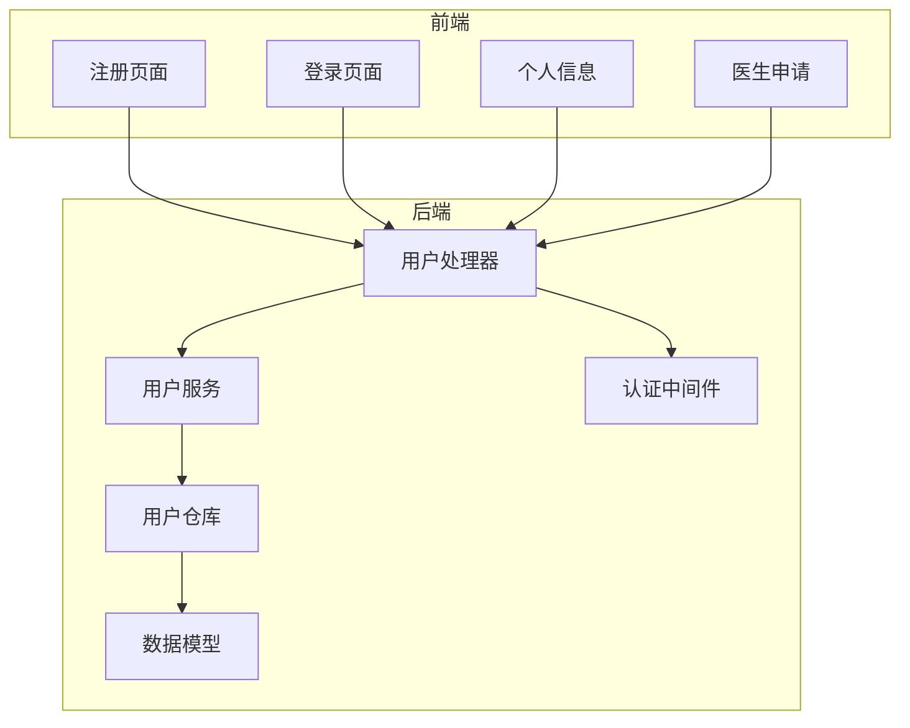
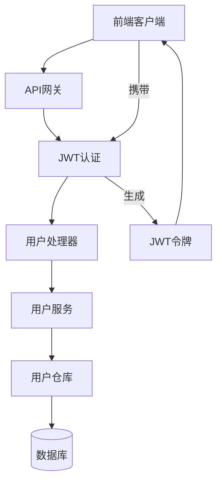
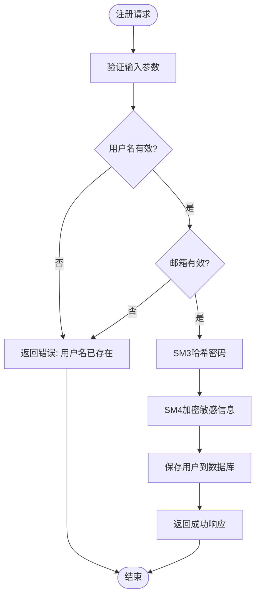
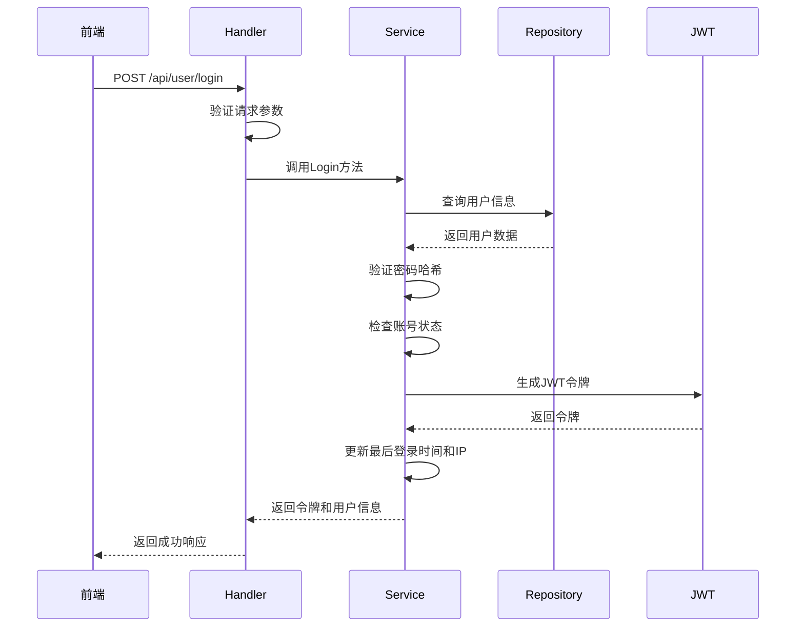
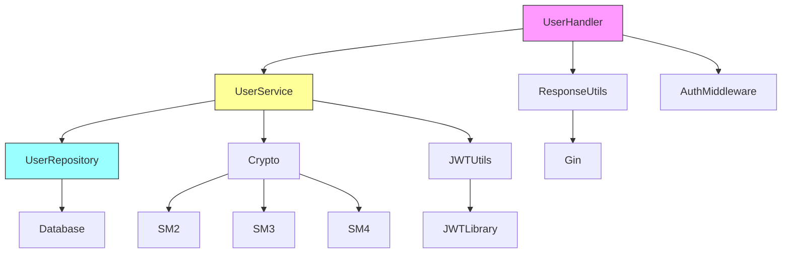

# 用户API

<cite>
**本文档引用文件**  
- [user_handler.go](file://backed/internal/api/handler/user_handler.go)
- [user_service.go](file://backed/internal/service/user_service.go)
- [routes.go](file://backed/internal/api/routes.go)
- [jwt.go](file://backed/pkg/utils/jwt.go)
- [auth.go](file://backed/internal/middleware/auth.go)
- [response.go](file://backed/pkg/utils/response.go)
- [register.vue](file://fonted/pages/register/register.vue)
- [login.vue](file://fonted/pages/login/login.vue)
- [request.js](file://fonted/utils/request.js)
</cite>

## 目录
1. [简介](#简介)
2. [项目结构](#项目结构)
3. [核心组件](#核心组件)
4. [架构概览](#架构概览)
5. [详细组件分析](#详细组件分析)
6. [依赖分析](#依赖分析)
7. [性能考虑](#性能考虑)
8. [故障排除指南](#故障排除指南)
9. [结论](#结论)

## 简介
本文档详细描述了基于国密加密的网上看诊系统的用户模块API，涵盖注册、登录、个人信息管理、密码修改和医生申请等功能。文档详细说明了每个接口的HTTP方法、URL路径、请求头（特别是JWT认证）、请求参数、响应结构和错误码。重点描述了登录接口返回的JWT token结构及其使用方式，以及需要认证的接口如何通过Authorization头传递token。同时提供了前端调用示例和常见问题解决方案。

## 项目结构
用户模块API位于后端的`backed/internal/api/handler/user_handler.go`文件中，通过`routes.go`文件中的路由配置对外暴露。前端页面位于`fonted/pages`目录下，包括注册、登录和个人信息管理等页面。系统采用Gin框架作为Web框架，JWT进行身份认证，并使用国密SM2/SM3/SM4算法保障数据安全。

**图示来源**  
- [user_handler.go](file://backed/internal/api/handler/user_handler.go)
- [routes.go](file://backed/internal/api/routes.go)
- [register.vue](file://fonted/pages/register/register.vue)
- [login.vue](file://fonted/pages/login/login.vue)

**本节来源**  
- [user_handler.go](file://backed/internal/api/handler/user_handler.go)
- [routes.go](file://backed/internal/api/routes.go)

## 核心组件
用户模块的核心组件包括用户处理器（UserHandler）、用户服务（UserService）和用户仓库（UserRepository）。UserHandler负责处理HTTP请求和响应，UserService包含业务逻辑，UserRepository负责与数据库交互。系统使用JWT进行身份认证，所有敏感信息（如邮箱、手机号）都使用SM4算法加密存储。

**本节来源**  
- [user_handler.go](file://backed/internal/api/handler/user_handler.go)
- [user_service.go](file://backed/internal/service/user_service.go)
- [user_repository.go](file://backed/internal/repository/user_repository.go)

## 架构概览
系统采用典型的三层架构：表现层（Handler）、业务逻辑层（Service）和数据访问层（Repository）。前端通过HTTPS与后端API通信，所有需要认证的接口都通过JWT令牌进行身份验证。敏感数据在存储前使用国密SM4算法加密，密码使用SM3哈希算法加盐存储。

**图示来源**  
- [user_handler.go](file://backed/internal/api/handler/user_handler.go)
- [auth.go](file://backed/internal/middleware/auth.go)
- [jwt.go](file://backed/pkg/utils/jwt.go)

## 详细组件分析

### 用户注册分析
用户注册功能允许新用户创建账户。前端在提交前对密码进行SM3哈希处理，后端再次加盐哈希存储。系统检查用户名和邮箱的唯一性，确保没有重复注册。

#### 接口定义

**图示来源**  
- [user_handler.go](file://backed/internal/api/handler/user_handler.go#L21-L47)
- [user_service.go](file://backed/internal/service/user_service.go#L24-L62)

**本节来源**  
- [user_handler.go](file://backed/internal/api/handler/user_handler.go)
- [user_service.go](file://backed/internal/service/user_service.go)
- [register.vue](file://fonted/pages/register/register.vue)

### 用户登录分析
用户登录功能验证用户凭据并返回JWT令牌。系统检查用户名和密码的匹配性，账号状态，然后生成JWT令牌。前端在登录前对密码进行SM3哈希处理。

#### 认证流程

**图示来源**  
- [user_handler.go](file://backed/internal/api/handler/user_handler.go#L49-L82)
- [user_service.go](file://backed/internal/service/user_service.go#L64-L127)
- [jwt.go](file://backed/pkg/utils/jwt.go#L17-L33)

**本节来源**  
- [user_handler.go](file://backed/internal/api/handler/user_handler.go)
- [user_service.go](file://backed/internal/service/user_service.go)
- [jwt.go](file://backed/pkg/utils/jwt.go)
- [login.vue](file://fonted/pages/login/login.vue)

### 个人信息管理分析
个人信息管理功能允许用户更新个人资料。该接口需要JWT认证，确保只有登录用户才能修改自己的信息。系统使用SM4算法加密敏感信息后存储。

**本节来源**  
- [user_handler.go](file://backed/internal/api/handler/user_handler.go#L116-L140)
- [user_service.go](file://backed/internal/service/user_service.go#L168-L198)

### 密码修改分析
密码修改功能允许用户更改密码。系统验证旧密码的正确性，然后使用SM3哈希算法存储新密码。为安全起见，修改密码后需要重新登录。

**本节来源**  
- [user_handler.go](file://backed/internal/api/handler/user_handler.go#L142-L168)
- [user_service.go](file://backed/internal/service/user_service.go#L200-L218)

### 医生申请分析
医生申请功能允许普通用户申请成为认证医生。系统检查用户是否已是医生或已有待审核的申请，然后创建医生申请记录。申请信息中的敏感数据使用SM4算法加密存储。

**本节来源**  
- [user_handler.go](file://backed/internal/api/handler/user_handler.go#L170-L202)
- [user_service.go](file://backed/internal/service/user_service.go#L220-L268)

## 依赖分析
用户模块依赖于多个其他组件，包括数据库访问、JWT认证、国密加密算法等。系统通过清晰的接口定义和依赖注入实现组件间的解耦。

**图示来源**  
- [user_handler.go](file://backed/internal/api/handler/user_handler.go)
- [user_service.go](file://backed/internal/service/user_service.go)
- [user_repository.go](file://backed/internal/repository/user_repository.go)
- [crypto.go](file://backed/internal/crypto/crypto.go)

**本节来源**  
- [user_handler.go](file://backed/internal/api/handler/user_handler.go)
- [user_service.go](file://backed/internal/service/user_service.go)
- [user_repository.go](file://backed/internal/repository/user_repository.go)

## 性能考虑
系统在性能方面做了多项优化：使用JWT无状态认证减少数据库查询，对用户信息查询结果进行适当的字段选择，对敏感信息加密解密操作进行性能测试。建议生产环境使用Redis缓存频繁访问的用户信息，以减少数据库压力。

## 故障排除指南
常见问题及解决方案：

1. **注册时用户名重复**：系统会返回"用户名已存在"错误，前端应提示用户更换用户名。
2. **登录失败**：可能原因包括用户名或密码错误、账号被禁用、验证码错误等，系统会返回相应的错误信息。
3. **JWT令牌过期**：客户端收到401错误后应跳转到登录页面重新登录。
4. **敏感信息显示为空**：检查SM4解密是否正常工作，确保加密密钥正确。

**本节来源**  
- [response.go](file://backed/pkg/utils/response.go)
- [auth.go](file://backed/internal/middleware/auth.go)
- [request.js](file://fonted/utils/request.js)

## 结论
用户模块API设计合理，功能完整，安全性高。通过JWT认证和国密算法加密，有效保障了用户数据的安全。建议在生产环境中增加更多的监控和日志记录，以便及时发现和解决问题。