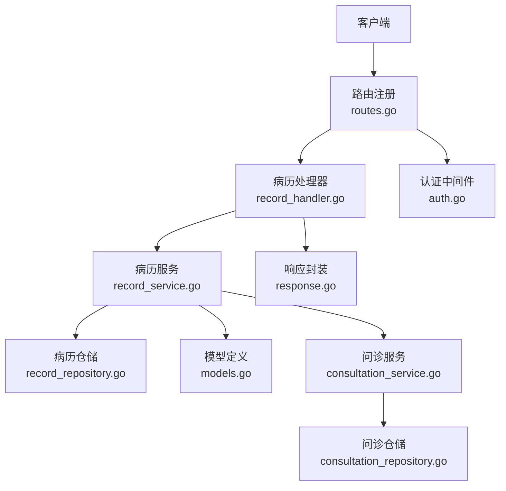
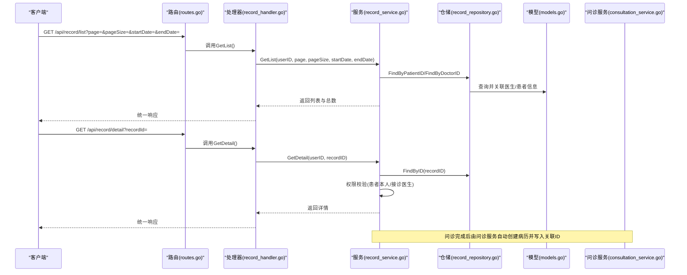
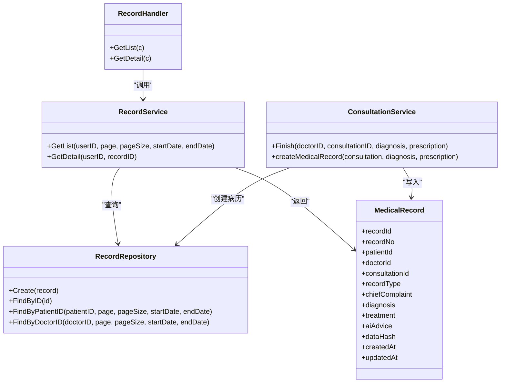

# 病历API

<cite>
**本文引用的文件**
- [routes.go](file://backed/internal/api/routes.go)
- [record_handler.go](file://backed/internal/api/handler/record_handler.go)
- [record_service.go](file://backed/internal/service/record_service.go)
- [record_repository.go](file://backed/internal/repository/record_repository.go)
- [models.go](file://backed/internal/model/models.go)
- [consultation_service.go](file://backed/internal/service/consultation_service.go)
- [consultation_repository.go](file://backed/internal/repository/consultation_repository.go)
- [auth.go](file://backed/internal/middleware/auth.go)
- [response.go](file://backed/pkg/utils/response.go)
- [init.sql](file://backed/init.sql)
- [API测试工具.html](file://API测试工具.html)
- [开发文档.md](file://开发文档.md)
</cite>

## 目录
1. [简介](#简介)
2. [项目结构](#项目结构)
3. [核心组件](#核心组件)
4. [架构总览](#架构总览)
5. [详细组件分析](#详细组件分析)
6. [依赖关系分析](#依赖关系分析)
7. [性能考量](#性能考量)
8. [故障排查指南](#故障排查指南)
9. [结论](#结论)
10. [附录](#附录)

## 简介
本文件面向“病历管理”相关API的使用与实现说明，覆盖以下目标：
- 病历的创建、查询与详情查看流程
- 病历数据结构定义（诊断结果、处方信息、AI建议等字段）
- 权限控制机制（医生与患者的角色差异）
- 请求与响应示例、分页查询参数说明
- 与问诊记录的关联关系及数据一致性保障

## 项目结构
后端采用Gin框架，按“路由-处理器-服务-仓储-模型”的层次组织；病历相关接口位于“/api/record”路径下，均受统一认证中间件保护。

图表来源
- [routes.go](file://backed/internal/api/routes.go#L49-L56)
- [record_handler.go](file://backed/internal/api/handler/record_handler.go#L1-L61)
- [record_service.go](file://backed/internal/service/record_service.go#L1-L137)
- [record_repository.go](file://backed/internal/repository/record_repository.go#L1-L97)
- [models.go](file://backed/internal/model/models.go#L99-L119)
- [consultation_service.go](file://backed/internal/service/consultation_service.go#L239-L276)
- [consultation_repository.go](file://backed/internal/repository/consultation_repository.go#L36-L82)
- [auth.go](file://backed/internal/middleware/auth.go#L9-L43)
- [response.go](file://backed/pkg/utils/response.go#L1-L69)

章节来源
- [routes.go](file://backed/internal/api/routes.go#L49-L56)

## 核心组件
- 路由层：在“/api/record”组下注册病历列表与详情接口，统一使用认证中间件。
- 处理器层：从请求上下文提取用户ID与查询参数，调用服务层并返回统一响应。
- 服务层：根据用户角色决定查询范围（患者仅能查自己的病历；医生可查自己接诊的病历），并对敏感字段进行解密。
- 仓储层：负责数据库查询与聚合统计，支持按时间范围与分页条件过滤。
- 模型层：定义病历实体字段，包含加密字段与AI建议等。
- 问诊服务：完成问诊后自动创建病历，建立病历与问诊的关联。

章节来源
- [routes.go](file://backed/internal/api/routes.go#L49-L56)
- [record_handler.go](file://backed/internal/api/handler/record_handler.go#L20-L61)
- [record_service.go](file://backed/internal/service/record_service.go#L23-L137)
- [record_repository.go](file://backed/internal/repository/record_repository.go#L35-L96)
- [models.go](file://backed/internal/model/models.go#L99-L119)
- [consultation_service.go](file://backed/internal/service/consultation_service.go#L239-L276)

## 架构总览
病历API遵循“认证中间件 -> 路由 -> 处理器 -> 服务 -> 仓储 -> 数据库”的调用链路；服务层在查询与详情时进行角色判定与数据解密，确保敏感信息的安全访问。

图表来源
- [routes.go](file://backed/internal/api/routes.go#L49-L56)
- [record_handler.go](file://backed/internal/api/handler/record_handler.go#L20-L61)
- [record_service.go](file://backed/internal/service/record_service.go#L23-L137)
- [record_repository.go](file://backed/internal/repository/record_repository.go#L14-L96)
- [models.go](file://backed/internal/model/models.go#L99-L119)
- [consultation_service.go](file://backed/internal/service/consultation_service.go#L239-L276)

## 详细组件分析

### 接口定义与权限控制
- 接口路径
  - 列表查询：GET /api/record/list
  - 详情查看：GET /api/record/detail
- 认证要求：均需携带有效的Authorization Bearer Token
- 权限规则
  - 患者：仅能查看自己的病历列表与详情
  - 医生：仅能查看自己接诊过的病历列表与详情
  - 未满足权限将返回404或403

章节来源
- [routes.go](file://backed/internal/api/routes.go#L49-L56)
- [auth.go](file://backed/internal/middleware/auth.go#L9-L43)
- [record_handler.go](file://backed/internal/api/handler/record_handler.go#L20-L61)
- [record_service.go](file://backed/internal/service/record_service.go#L89-L137)

### 分页查询参数
- page：页码，默认1
- pageSize：每页条数，默认10
- startDate：开始日期（可选）
- endDate：结束日期（可选）

章节来源
- [record_handler.go](file://backed/internal/api/handler/record_handler.go#L21-L29)
- [record_repository.go](file://backed/internal/repository/record_repository.go#L35-L66)

### 病历数据结构
- 字段说明（部分）
  - recordId：病历ID
  - recordNo：病历编号
  - chiefComplaint：主诉（SM4加密，解密后展示）
  - diagnosis：诊断（SM4加密，解密后展示）
  - treatment：治疗方案（SM4加密，解密后展示）
  - doctorName：医生姓名
  - doctorDept：医生所在科室
  - aiAdvice：AI建议
  - createdAt：创建时间
- 关联字段
  - patientId：患者ID
  - doctorId：医生ID
  - consultationId：关联的问诊ID（可为空）
  - recordType：病历类型（1:门诊；2:在线问诊；3:住院）
  - dataHash：数据完整性哈希（SM3）

章节来源
- [models.go](file://backed/internal/model/models.go#L99-L119)
- [init.sql](file://backed/init.sql#L190-L225)

### 病历创建流程（与问诊关联）
- 触发时机：医生完成问诊时，自动创建电子病历
- 关键步骤
  - 生成病历编号
  - 解密问诊主诉
  - 对主诉、诊断、治疗方案进行SM4加密
  - 生成SM3数据哈希
  - 写入病历记录并设置关联问诊ID
- 数据一致性保障
  - 问诊完成后才创建病历，避免数据缺失
  - 病历表包含data_hash字段，可用于数据完整性校验
  - 外键约束确保与用户、问诊表的数据一致性

章节来源
- [consultation_service.go](file://backed/internal/service/consultation_service.go#L239-L276)
- [init.sql](file://backed/init.sql#L190-L225)

### 权限控制与数据解密
- 列表权限
  - 患者：按patient_id查询
  - 医生：按doctor_id查询
- 详情权限
  - 仅允许病历对应的患者本人或接诊医生查看
- 数据解密
  - 服务层对敏感字段进行SM4解密后再返回

章节来源
- [record_service.go](file://backed/internal/service/record_service.go#L23-L87)
- [record_service.go](file://backed/internal/service/record_service.go#L89-L137)

### 请求与响应示例
- 列表查询
  - 请求：GET /api/record/list?page=1&pageSize=10&startDate=&endDate=
  - 响应：包含list、total、page、pageSize
- 详情查询
  - 请求：GET /api/record/detail?recordId=123
  - 响应：包含recordId、recordNo、chiefComplaint、diagnosis、treatment、doctorName、doctorDept、aiAdvice、createdAt
- 错误场景
  - 无权限访问：返回404或403
  - 病历不存在：返回404

章节来源
- [record_handler.go](file://backed/internal/api/handler/record_handler.go#L20-L61)
- [response.go](file://backed/pkg/utils/response.go#L1-L69)
- [API测试工具.html](file://API测试工具.html#L443-L517)

## 依赖关系分析

图表来源
- [record_handler.go](file://backed/internal/api/handler/record_handler.go#L1-L61)
- [record_service.go](file://backed/internal/service/record_service.go#L1-L137)
- [record_repository.go](file://backed/internal/repository/record_repository.go#L1-L97)
- [models.go](file://backed/internal/model/models.go#L99-L119)
- [consultation_service.go](file://backed/internal/service/consultation_service.go#L239-L276)

## 性能考量
- 分页与排序
  - 仓储层按创建时间倒序分页查询，适合高频列表场景
- 过滤条件
  - 支持按日期范围过滤，建议在前端传入合理的时间区间以减少数据量
- 关联查询
  - 列表与详情均涉及医生/患者信息的二次查询，建议在数据库层面为相关字段建立索引（已见建表语句）
- 加密与解密
  - 服务层对敏感字段进行SM4解密，注意在高并发场景下的CPU开销

章节来源
- [record_repository.go](file://backed/internal/repository/record_repository.go#L35-L96)
- [init.sql](file://backed/init.sql#L190-L225)

## 故障排查指南
- 401 未授权
  - 检查Authorization头是否为Bearer Token格式
  - 确认Token有效且未过期
- 403/404 无权限
  - 确认当前用户角色与病历归属关系
  - 患者仅能查看自己的病历；医生仅能查看自己接诊的病历
- 404 病历不存在
  - 确认recordId是否正确
- 500 服务器内部错误
  - 查看服务层日志，定位数据库查询或加密解密环节问题
- 分页参数无效
  - page与pageSize必须为正整数；startDate/endDate格式需与后端期望一致

章节来源
- [auth.go](file://backed/internal/middleware/auth.go#L9-L43)
- [record_service.go](file://backed/internal/service/record_service.go#L89-L137)
- [record_handler.go](file://backed/internal/api/handler/record_handler.go#L20-L61)
- [response.go](file://backed/pkg/utils/response.go#L1-L69)

## 结论
- 病历API围绕“认证中间件 + 路由 + 处理器 + 服务 + 仓储 + 模型”的清晰分层实现
- 通过角色与归属关系实现严格的权限控制
- 与问诊流程深度集成，完成问诊即自动生成病历并建立关联
- 数据安全方面采用SM4加密与SM3哈希，保障敏感信息与数据完整性
- 建议在生产环境中完善日志监控与告警，确保异常快速定位

## 附录

### 接口一览（摘要）
- GET /api/record/list
  - 权限：登录用户
  - 参数：page、pageSize、startDate、endDate
  - 返回：list、total、page、pageSize
- GET /api/record/detail
  - 权限：登录用户（患者本人或接诊医生）
  - 参数：recordId
  - 返回：病历详情（含解密后的敏感字段）

章节来源
- [routes.go](file://backed/internal/api/routes.go#L49-L56)
- [record_handler.go](file://backed/internal/api/handler/record_handler.go#L20-L61)
- [record_service.go](file://backed/internal/service/record_service.go#L23-L137)

### 数据模型（病历）
- 字段要点
  - 主诉、诊断、治疗方案、AI建议均为SM4加密存储
  - data_hash用于数据完整性校验
  - recordType区分门诊/在线问诊/住院
  - consultationId与问诊记录关联

章节来源
- [models.go](file://backed/internal/model/models.go#L99-L119)
- [init.sql](file://backed/init.sql#L190-L225)

### 问诊到病历的创建流程
- 完成问诊后，服务层自动创建病历，填充主诉、诊断、治疗方案与AI建议，并写入data_hash
- 若创建失败，不影响问诊完成，仅记录日志

章节来源
- [consultation_service.go](file://backed/internal/service/consultation_service.go#L239-L276)