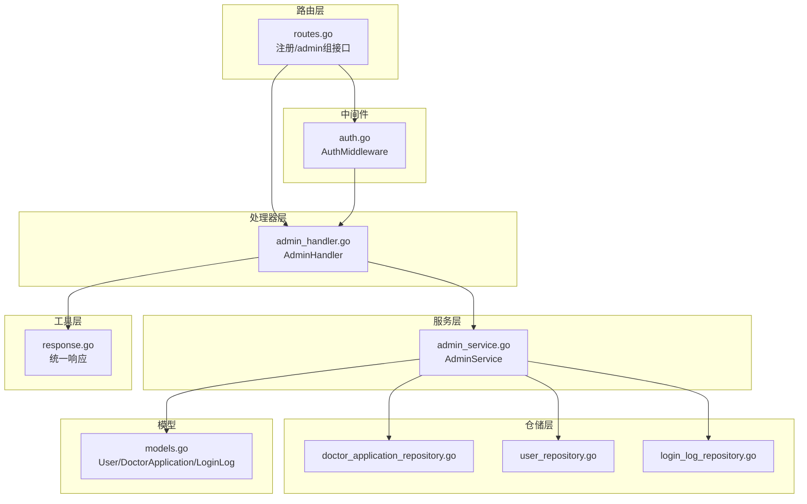
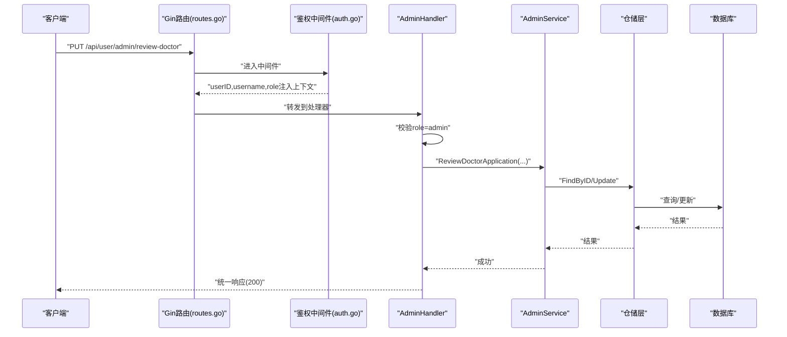
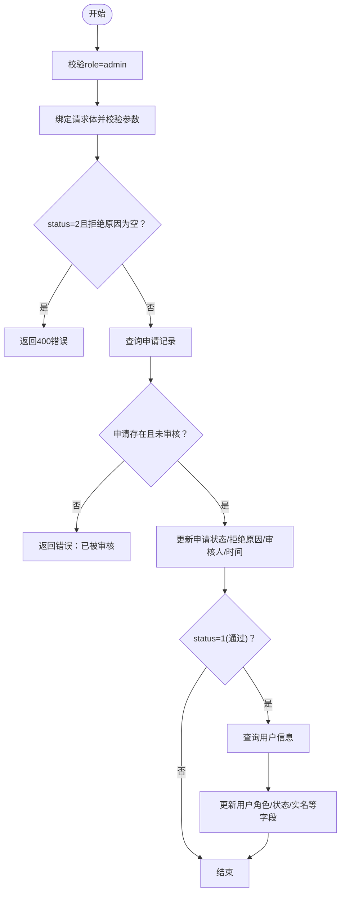
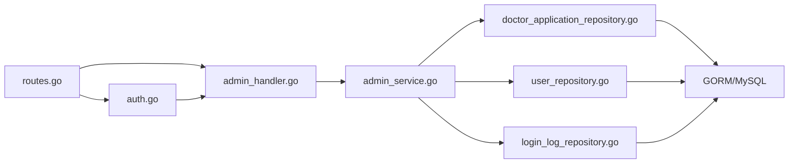

# 管理员API

<cite>
**本文引用的文件**
- [backed/internal/api/routes.go](file://backed/internal/api/routes.go)
- [backed/internal/api/handler/admin_handler.go](file://backed/internal/api/handler/admin_handler.go)
- [backed/internal/service/admin_service.go](file://backed/internal/service/admin_service.go)
- [backed/internal/repository/doctor_application_repository.go](file://backed/internal/repository/doctor_application_repository.go)
- [backed/internal/repository/user_repository.go](file://backed/internal/repository/user_repository.go)
- [backed/internal/repository/login_log_repository.go](file://backed/internal/repository/login_log_repository.go)
- [backed/internal/middleware/auth.go](file://backed/internal/middleware/auth.go)
- [backed/pkg/utils/response.go](file://backed/pkg/utils/response.go)
- [backed/internal/model/models.go](file://backed/internal/model/models.go)
- [backed/config/config.yaml](file://backed/config/config.yaml)
- [backed/pkg/database/database.go](file://backed/pkg/database/database.go)
- [API测试文档.md](file://API测试文档.md)
</cite>

## 目录
1. [简介](#简介)
2. [项目结构](#项目结构)
3. [核心组件](#核心组件)
4. [架构总览](#架构总览)
5. [详细组件分析](#详细组件分析)
6. [依赖关系分析](#依赖关系分析)
7. [性能与安全考量](#性能与安全考量)
8. [故障排查指南](#故障排查指南)
9. [结论](#结论)
10. [附录](#附录)

## 简介
本文件面向管理员角色，系统化梳理后台管理相关API，包括医生申请审核、用户管理、登录日志查看等能力，并明确权限要求（仅管理员可用）、状态变更逻辑（通过/拒绝）、批量操作能力与敏感操作日志记录机制。文档同时提供请求示例与预期响应说明，便于集成对接。

## 项目结构
管理员API位于后端服务的路由层、处理器层、服务层与仓储层之间，采用分层设计：
- 路由层：定义/admin前缀下的受保护接口
- 处理器层：校验权限、解析参数、调用服务层
- 服务层：业务编排、状态变更、敏感信息解密
- 仓储层：数据库访问与分页查询
- 中间件：统一鉴权与CORS处理
- 工具层：统一响应格式与错误码

图表来源
- [backed/internal/api/routes.go](file://backed/internal/api/routes.go#L83-L94)
- [backed/internal/api/handler/admin_handler.go](file://backed/internal/api/handler/admin_handler.go#L1-L186)
- [backed/internal/service/admin_service.go](file://backed/internal/service/admin_service.go#L1-L217)
- [backed/internal/repository/doctor_application_repository.go](file://backed/internal/repository/doctor_application_repository.go#L1-L70)
- [backed/internal/repository/user_repository.go](file://backed/internal/repository/user_repository.go#L1-L121)
- [backed/internal/repository/login_log_repository.go](file://backed/internal/repository/login_log_repository.go#L1-L54)
- [backed/internal/middleware/auth.go](file://backed/internal/middleware/auth.go#L1-L61)
- [backed/pkg/utils/response.go](file://backed/pkg/utils/response.go#L1-L69)
- [backed/internal/model/models.go](file://backed/internal/model/models.go#L1-L160)

章节来源
- [backed/internal/api/routes.go](file://backed/internal/api/routes.go#L83-L94)
- [backed/internal/api/handler/admin_handler.go](file://backed/internal/api/handler/admin_handler.go#L1-L186)
- [backed/internal/service/admin_service.go](file://backed/internal/service/admin_service.go#L1-L217)

## 核心组件
- 路由注册：在/api/user/admin组下注册管理员专属接口，统一使用鉴权中间件
- 处理器：AdminHandler负责权限校验、参数绑定与调用服务层
- 服务：AdminService封装业务逻辑，含医生申请审核、用户列表、用户状态变更、登录日志查询
- 仓储：DoctorApplicationRepository/UserRepository/LoginLogRepository分别提供分页查询与更新能力
- 中间件：AuthMiddleware从Authorization头解析JWT，注入userID、username、role到上下文
- 统一响应：response.go提供Success/SuccessWithMessage/Error等统一格式

章节来源
- [backed/internal/api/routes.go](file://backed/internal/api/routes.go#L83-L94)
- [backed/internal/api/handler/admin_handler.go](file://backed/internal/api/handler/admin_handler.go#L1-L186)
- [backed/internal/service/admin_service.go](file://backed/internal/service/admin_service.go#L1-L217)
- [backed/internal/middleware/auth.go](file://backed/internal/middleware/auth.go#L1-L61)
- [backed/pkg/utils/response.go](file://backed/pkg/utils/response.go#L1-L69)

## 架构总览
管理员API的典型调用链如下：客户端发起请求→路由匹配→鉴权中间件→处理器→服务层→仓储层→数据库→返回统一响应。

图表来源
- [backed/internal/api/routes.go](file://backed/internal/api/routes.go#L83-L94)
- [backed/internal/middleware/auth.go](file://backed/internal/middleware/auth.go#L1-L61)
- [backed/internal/api/handler/admin_handler.go](file://backed/internal/api/handler/admin_handler.go#L20-L52)
- [backed/internal/service/admin_service.go](file://backed/internal/service/admin_service.go#L24-L73)
- [backed/internal/repository/doctor_application_repository.go](file://backed/internal/repository/doctor_application_repository.go#L24-L35)

## 详细组件分析

### 权限要求与鉴权流程
- 路由层为/admin组接口统一挂载AuthMiddleware，确保只有携带有效Bearer Token的用户可访问
- 中间件从Authorization头解析Token，解析出userID、username、role并写入上下文
- 处理器在每个接口内再次校验role是否为admin，非管理员直接返回403

章节来源
- [backed/internal/api/routes.go](file://backed/internal/api/routes.go#L83-L94)
- [backed/internal/middleware/auth.go](file://backed/internal/middleware/auth.go#L1-L61)
- [backed/internal/api/handler/admin_handler.go](file://backed/internal/api/handler/admin_handler.go#L20-L52)
- [backed/pkg/utils/response.go](file://backed/pkg/utils/response.go#L55-L58)

### 医生申请审核
- 接口：PUT /api/user/admin/review-doctor
- 请求体字段：
  - applicationId：申请记录ID（必填）
  - status：审核状态（必填，1通过，2拒绝）
  - rejectReason：拒绝原因（当status=2时必填）
- 业务逻辑：
  - 校验申请存在且未被审核（status=0）
  - 更新申请状态、拒绝原因、审核人ID、审核时间
  - 若通过：将用户角色提升为doctor，同步更新用户实名、身份证、电话、执业证书、职称、科室、专长、简介、证书编号等字段，并置用户状态为正常
- 返回：统一响应，code=200

图表来源
- [backed/internal/api/handler/admin_handler.go](file://backed/internal/api/handler/admin_handler.go#L20-L52)
- [backed/internal/service/admin_service.go](file://backed/internal/service/admin_service.go#L24-L73)
- [backed/internal/repository/doctor_application_repository.go](file://backed/internal/repository/doctor_application_repository.go#L24-L35)
- [backed/internal/repository/user_repository.go](file://backed/internal/repository/user_repository.go#L24-L29)
- [backed/internal/model/models.go](file://backed/internal/model/models.go#L38-L66)

章节来源
- [backed/internal/api/handler/admin_handler.go](file://backed/internal/api/handler/admin_handler.go#L20-L52)
- [backed/internal/service/admin_service.go](file://backed/internal/service/admin_service.go#L24-L73)
- [API测试文档.md](file://API测试文档.md#L156-L174)

### 获取医生申请列表
- 接口：GET /api/user/admin/doctor-applications
- 查询参数：
  - page/pageSize：分页
  - status：筛选状态（0待审核、1已通过、2已拒绝）
- 返回：分页列表，包含敏感字段解密后的展示值、状态文本、创建/审核时间等

章节来源
- [backed/internal/api/handler/admin_handler.go](file://backed/internal/api/handler/admin_handler.go#L54-L84)
- [backed/internal/service/admin_service.go](file://backed/internal/service/admin_service.go#L75-L137)
- [backed/internal/repository/doctor_application_repository.go](file://backed/internal/repository/doctor_application_repository.go#L47-L69)
- [API测试文档.md](file://API测试文档.md#L175-L184)

### 获取用户列表
- 接口：GET /api/user/admin/users
- 查询参数：
  - page/pageSize：分页
  - identify：用户身份过滤（user/admin/doctor/patient）
  - status：用户状态（0正常/1禁用）
  - keyword：用户名/邮箱模糊搜索
- 返回：分页列表，包含敏感字段解密后的邮箱/电话等

章节来源
- [backed/internal/api/handler/admin_handler.go](file://backed/internal/api/handler/admin_handler.go#L86-L118)
- [backed/internal/service/admin_service.go](file://backed/internal/service/admin_service.go#L139-L169)
- [backed/internal/repository/user_repository.go](file://backed/internal/repository/user_repository.go#L90-L120)
- [API测试文档.md](file://API测试文档.md#L185-L194)

### 禁用/启用用户
- 接口：PUT /api/user/admin/status
- 请求体字段：
  - userId：目标用户ID（必填）
  - status：0启用/1禁用（必填）
- 返回：统一响应，code=200

章节来源
- [backed/internal/api/handler/admin_handler.go](file://backed/internal/api/handler/admin_handler.go#L120-L144)
- [backed/internal/service/admin_service.go](file://backed/internal/service/admin_service.go#L172-L181)
- [backed/internal/repository/user_repository.go](file://backed/internal/repository/user_repository.go#L24-L29)
- [API测试文档.md](file://API测试文档.md#L195-L206)

### 获取登录日志
- 接口：GET /api/user/admin/login-logs
- 查询参数：
  - page/pageSize：分页
  - userId：按用户过滤
  - status：登录状态（0失败/1成功）
  - startTime/endTime：时间范围
- 返回：分页列表，包含登录IP解密后的明文、浏览器、操作系统、登录时间等

章节来源
- [backed/internal/api/handler/admin_handler.go](file://backed/internal/api/handler/admin_handler.go#L146-L186)
- [backed/internal/service/admin_service.go](file://backed/internal/service/admin_service.go#L183-L216)
- [backed/internal/repository/login_log_repository.go](file://backed/internal/repository/login_log_repository.go#L19-L53)
- [API测试文档.md](file://API测试文档.md#L207-L210)

### 批量操作说明
- 当前管理员API未提供“批量禁用用户”的显式接口。可通过循环调用“禁用/启用用户”接口实现批量效果，但注意：
  - 单次请求仅支持单个用户状态变更
  - 建议在客户端侧进行并发控制与重试策略
  - 对于大量用户变更，建议结合数据库事务或后台任务队列以提升稳定性与性能

章节来源
- [backed/internal/api/handler/admin_handler.go](file://backed/internal/api/handler/admin_handler.go#L120-L144)
- [backed/internal/service/admin_service.go](file://backed/internal/service/admin_service.go#L172-L181)

### 敏感操作日志记录机制
- 登录日志：系统在用户登录时记录登录日志（IP、位置、浏览器、操作系统、状态、消息、时间），管理员可查询
- 医生申请审核：审核通过/拒绝均会更新申请记录的时间与审核人，便于审计追踪
- 数据加密：用户敏感字段（邮箱、电话、实名、身份证等）在数据库中以SM4加密存储，查询时由服务层解密后返回

章节来源
- [backed/internal/model/models.go](file://backed/internal/model/models.go#L143-L159)
- [backed/internal/service/admin_service.go](file://backed/internal/service/admin_service.go#L183-L216)
- [backed/internal/service/admin_service.go](file://backed/internal/service/admin_service.go#L75-L137)

## 依赖关系分析
- 路由到处理器：/api/user/admin/* → AdminHandler
- 处理器到服务：AdminHandler → AdminService
- 服务到仓储：AdminService → DoctorApplicationRepository/UserRepository/LoginLogRepository
- 仓储到数据库：各Repository通过GORM访问MySQL
- 中间件到处理器：AuthMiddleware在路由层挂载，为/admin组提供统一鉴权

图表来源
- [backed/internal/api/routes.go](file://backed/internal/api/routes.go#L83-L94)
- [backed/internal/api/handler/admin_handler.go](file://backed/internal/api/handler/admin_handler.go#L1-L186)
- [backed/internal/service/admin_service.go](file://backed/internal/service/admin_service.go#L1-L217)
- [backed/internal/repository/doctor_application_repository.go](file://backed/internal/repository/doctor_application_repository.go#L1-L70)
- [backed/internal/repository/user_repository.go](file://backed/internal/repository/user_repository.go#L1-L121)
- [backed/internal/repository/login_log_repository.go](file://backed/internal/repository/login_log_repository.go#L1-L54)
- [backed/internal/middleware/auth.go](file://backed/internal/middleware/auth.go#L1-L61)
- [backed/pkg/database/database.go](file://backed/pkg/database/database.go#L1-L48)

章节来源
- [backed/internal/api/routes.go](file://backed/internal/api/routes.go#L83-L94)
- [backed/internal/middleware/auth.go](file://backed/internal/middleware/auth.go#L1-L61)
- [backed/pkg/database/database.go](file://backed/pkg/database/database.go#L1-L48)

## 性能与安全考量
- 性能
  - 分页查询：doctor-applications/users/login-logs均支持分页，避免一次性加载过多数据
  - 批量操作：建议客户端侧并发控制，避免频繁短时间内的大量请求
- 安全
  - 权限控制：所有/admin接口均需admin角色，中间件统一鉴权
  - 数据加密：敏感字段在数据库中SM4加密，传输层建议HTTPS
  - 日志审计：登录日志与审核记录保留关键信息，便于追踪

章节来源
- [backed/internal/api/handler/admin_handler.go](file://backed/internal/api/handler/admin_handler.go#L54-L186)
- [backed/internal/service/admin_service.go](file://backed/internal/service/admin_service.go#L75-L216)
- [backed/internal/model/models.go](file://backed/internal/model/models.go#L1-L37)

## 故障排查指南
- 401 未授权
  - 现象：缺少Authorization头或Token无效/过期
  - 处理：重新登录获取有效Token
- 403 禁止访问
  - 现象：非admin角色访问/admin接口
  - 处理：使用admin账号登录后重试
- 400 参数错误
  - 现象：请求体缺失必填字段或status=2时未填写拒绝原因
  - 处理：补齐参数后重试
- 500 服务器内部错误
  - 现象：数据库异常或业务逻辑异常
  - 处理：查看服务日志，确认数据库连接与参数合法性

章节来源
- [backed/internal/middleware/auth.go](file://backed/internal/middleware/auth.go#L1-L61)
- [backed/pkg/utils/response.go](file://backed/pkg/utils/response.go#L45-L69)
- [backed/internal/api/handler/admin_handler.go](file://backed/internal/api/handler/admin_handler.go#L20-L52)

## 结论
管理员API围绕“医生申请审核、用户管理、登录日志查看”三大核心场景构建，采用严格的鉴权与分页查询保障安全性与性能。通过清晰的状态变更逻辑与敏感信息解密机制，满足后台管理与审计需求。建议在集成时遵循权限要求与参数约束，并结合现有接口实现批量操作与日志审计。

## 附录

### 接口一览与示例
- 审核医生申请
  - 方法：PUT
  - 路径：/api/user/admin/review-doctor
  - 请求头：Authorization: Bearer <admin_token>
  - 请求体字段：applicationId、status、rejectReason（status=2时必填）
  - 示例参考：[API测试文档.md](file://API测试文档.md#L156-L174)
- 获取医生申请列表
  - 方法：GET
  - 路径：/api/user/admin/doctor-applications
  - 查询参数：page、pageSize、status
  - 示例参考：[API测试文档.md](file://API测试文档.md#L175-L184)
- 获取用户列表
  - 方法：GET
  - 路径：/api/user/admin/users
  - 查询参数：page、pageSize、identify、status、keyword
  - 示例参考：[API测试文档.md](file://API测试文档.md#L185-L194)
- 禁用/启用用户
  - 方法：PUT
  - 路径：/api/user/admin/status
  - 请求体字段：userId、status
  - 示例参考：[API测试文档.md](file://API测试文档.md#L195-L206)
- 获取登录日志
  - 方法：GET
  - 路径：/api/user/admin/login-logs
  - 查询参数：page、pageSize、userId、status、startTime、endTime
  - 示例参考：[API测试文档.md](file://API测试文档.md#L207-L210)

章节来源
- [API测试文档.md](file://API测试文档.md#L156-L210)