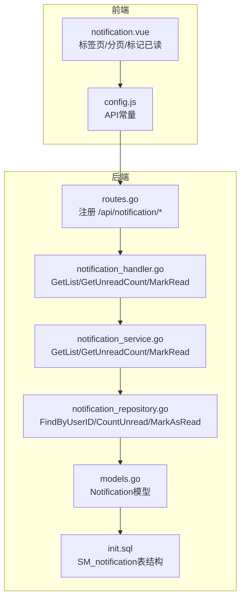
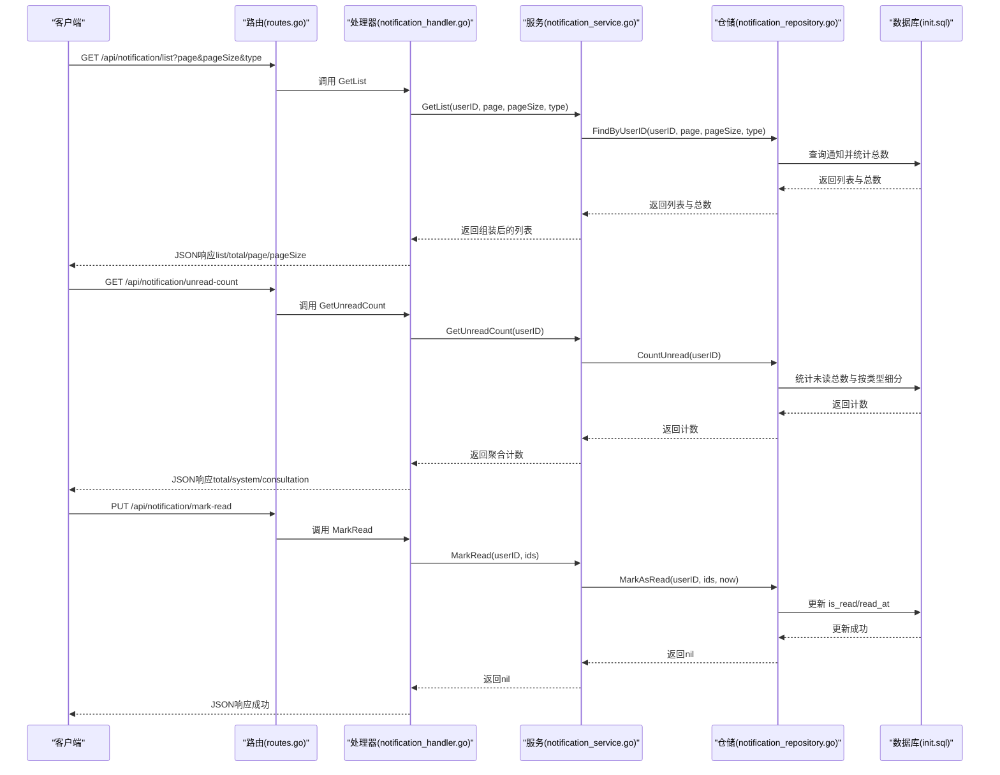
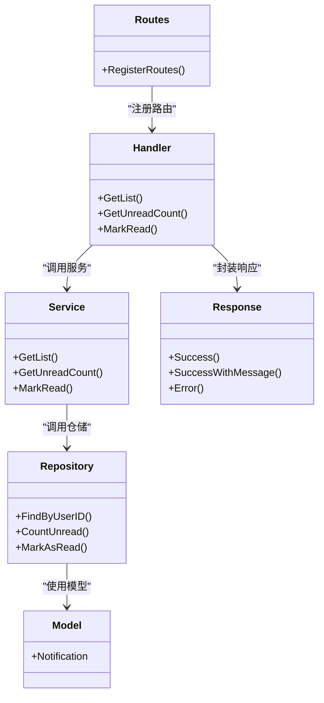

# 通知API

<cite>
**本文引用的文件**
- [notification_handler.go](file://backed/internal/api/handler/notification_handler.go)
- [notification_service.go](file://backed/internal/service/notification_service.go)
- [notification_repository.go](file://backed/internal/repository/notification_repository.go)
- [models.go](file://backed/internal/model/models.go)
- [routes.go](file://backed/internal/api/routes.go)
- [response.go](file://backed/pkg/utils/response.go)
- [notification.vue](file://fonted/pages/notification/notification.vue)
- [config.js](file://fonted/utils/config.js)
- [init.sql](file://backed/init.sql)
</cite>

## 目录
1. [简介](#简介)
2. [项目结构](#项目结构)
3. [核心组件](#核心组件)
4. [架构总览](#架构总览)
5. [详细组件分析](#详细组件分析)
6. [依赖关系分析](#依赖关系分析)
7. [性能与扩展性](#性能与扩展性)
8. [故障排查指南](#故障排查指南)
9. [结论](#结论)
10. [附录](#附录)

## 简介
本文件面向开发者与产品人员，系统化梳理通知API的设计与实现，覆盖以下要点：
- 接口清单：获取通知列表、获取未读数量、批量标记已读
- 通知类型与数据结构：系统通知、问诊状态更新等分类与字段定义
- 分页查询参数与筛选条件
- 未读计数的统计维度与实时性保障
- 生命周期与存储策略：创建、读取、标记已读、索引与过期控制
- 前后端调用示例与常见问题排查

## 项目结构
通知功能位于后端的API层、服务层、仓储层与模型层，并由前端页面驱动调用。路由在统一入口注册，认证中间件确保仅登录用户可访问。

图表来源
- [routes.go](file://backed/internal/api/routes.go#L58-L66)
- [notification_handler.go](file://backed/internal/api/handler/notification_handler.go#L20-L73)
- [notification_service.go](file://backed/internal/service/notification_service.go#L18-L64)
- [notification_repository.go](file://backed/internal/repository/notification_repository.go#L15-L53)
- [models.go](file://backed/internal/model/models.go#L125-L141)
- [init.sql](file://backed/init.sql#L253-L275)

章节来源
- [routes.go](file://backed/internal/api/routes.go#L58-L66)

## 核心组件
- 路由注册：在统一的API组下挂载通知模块的三个接口，均受认证中间件保护
- 处理器：负责参数解析、调用服务层、封装响应
- 服务层：组装数据结构、聚合统计、协调仓储
- 仓储层：基于GORM执行SQL查询与更新
- 模型层：定义通知实体字段与表名
- 前端页面：提供标签切换、分页加载、点击即读、一键已读

章节来源
- [routes.go](file://backed/internal/api/routes.go#L58-L66)
- [notification_handler.go](file://backed/internal/api/handler/notification_handler.go#L20-L73)
- [notification_service.go](file://backed/internal/service/notification_service.go#L18-L64)
- [notification_repository.go](file://backed/internal/repository/notification_repository.go#L15-L53)
- [models.go](file://backed/internal/model/models.go#L125-L141)
- [notification.vue](file://fonted/pages/notification/notification.vue#L90-L140)

## 架构总览
通知API采用经典的三层架构：HTTP请求经路由进入处理器，处理器委托服务层，服务层调用仓储层，仓储层通过GORM访问数据库。响应统一通过通用工具类封装。

图表来源
- [routes.go](file://backed/internal/api/routes.go#L58-L66)
- [notification_handler.go](file://backed/internal/api/handler/notification_handler.go#L20-L73)
- [notification_service.go](file://backed/internal/service/notification_service.go#L18-L64)
- [notification_repository.go](file://backed/internal/repository/notification_repository.go#L15-L53)
- [init.sql](file://backed/init.sql#L253-L275)

## 详细组件分析

### 接口一览与调用示例
- 获取通知列表
  - 方法与路径：GET /api/notification/list
  - 认证：需要登录
  - 查询参数：
    - page：页码，默认1
    - pageSize：每页条数，默认10
    - type：通知类型过滤（可选），如 system、consultation
  - 返回字段：list、total、page、pageSize
  - 前端调用参考：notification.vue 中的 loadList 方法
- 获取未读数量
  - 方法与路径：GET /api/notification/unread-count
  - 认证：需要登录
  - 返回字段：totalUnread、systemUnread、consultationUnread
  - 前端调用参考：notification.vue 中的点击消息或“全部标为已读”前的计数刷新
- 批量标记已读
  - 方法与路径：PUT /api/notification/mark-read
  - 认证：需要登录
  - 请求体：notificationIds（数组，必填）
  - 返回：成功消息

章节来源
- [routes.go](file://backed/internal/api/routes.go#L58-L66)
- [notification_handler.go](file://backed/internal/api/handler/notification_handler.go#L20-L73)
- [notification.vue](file://fonted/pages/notification/notification.vue#L101-L140)
- [config.js](file://fonted/utils/config.js#L52-L56)

### 通知类型与数据结构
- 通知类型
  - system：系统通知
  - consultation：问诊相关通知
  - audit：审核相关通知（数据库定义包含该类型）
  - payment：支付相关通知（数据库定义包含该类型）
- 数据模型字段（来自模型与数据库定义）
  - notificationId：通知ID
  - type：通知类型
  - title：标题
  - content：内容
  - isRead：是否已读
  - createdAt：创建时间
  - relatedId：关联ID（如问诊ID）
  - relatedType：关联类型（如 consultation）
  - priority：优先级（0普通、1重要、2紧急）
  - readAt：读取时间
  - expiredAt：过期时间

章节来源
- [models.go](file://backed/internal/model/models.go#L125-L141)
- [init.sql](file://backed/init.sql#L253-L275)

### 分页查询参数说明
- page：默认1，从第1页开始
- pageSize：默认10，最大值建议由后端限制以避免过大请求
- type：可选，按通知类型过滤
- 排序：按创建时间降序（最新在前）

章节来源
- [notification_handler.go](file://backed/internal/api/handler/notification_handler.go#L20-L39)
- [notification_service.go](file://backed/internal/service/notification_service.go#L18-L44)
- [notification_repository.go](file://backed/internal/repository/notification_repository.go#L15-L32)

### 未读通知计数与实时性
- 统计维度
  - totalUnread：全部未读
  - systemUnread：系统类型未读
  - consultationUnread：问诊类型未读
- 实时性
  - 未读计数接口直接查询数据库，实时性强
  - 前端可在点击消息或批量标记后主动刷新计数，确保UI一致
- 前端实践
  - notification.vue 在点击消息或“全部标为已读”后更新本地状态，同时可再次请求未读计数

章节来源
- [notification_service.go](file://backed/internal/service/notification_service.go#L46-L58)
- [notification_repository.go](file://backed/internal/repository/notification_repository.go#L34-L43)
- [notification.vue](file://fonted/pages/notification/notification/notification.vue#L150-L210)

### 状态更新接口调用示例
- 批量标记已读
  - 请求：PUT /api/notification/mark-read
  - 请求体：{ notificationIds: [1, 2, 3] }
  - 响应：成功消息
- 前端调用参考
  - notification.vue 的 handleClick 与 markAllRead 方法分别演示单条与批量标记

章节来源
- [notification_handler.go](file://backed/internal/api/handler/notification_handler.go#L54-L73)
- [notification.vue](file://fonted/pages/notification/notification.vue#L150-L210)

### 通知生命周期管理策略
- 创建
  - 由业务逻辑在需要时插入通知记录（例如问诊状态变更、审核结果等）
  - 字段包括：user_id、notification_type、title、content、related_id、related_type、priority 等
- 读取
  - 列表按创建时间倒序展示，支持按类型筛选
- 标记已读
  - 批量更新 is_read 与 read_at
- 过期控制
  - 数据库定义了 expired_at 字段，可用于后续扩展到期清理策略（例如定时任务清理过期通知）

章节来源
- [models.go](file://backed/internal/model/models.go#L125-L141)
- [init.sql](file://backed/init.sql#L253-L275)
- [notification_repository.go](file://backed/internal/repository/notification_repository.go#L45-L53)

### 数据存储方案
- 存储引擎与字符集
  - InnoDB、utf8mb4、utf8mb4_unicode_ci
- 主键与外键
  - 主键自增ID；user_id 外键关联用户表
- 索引
  - user_id、is_read、notification_type、priority、created_at 等索引，提升查询与统计效率
- 字段说明
  - 通知类型、标题、内容、关联ID/类型、优先级、是否已读、读取时间、过期时间等

章节来源
- [init.sql](file://backed/init.sql#L253-L275)

## 依赖关系分析
- 路由到处理器：routes.go 将 /api/notification/* 路由到 notification_handler
- 处理器到服务：notification_handler 调用 notification_service
- 服务到仓储：notification_service 调用 notification_repository
- 仓储到模型：notification_repository 使用 Notification 模型与 GORM
- 响应封装：统一使用 response 工具类输出标准JSON结构

图表来源
- [routes.go](file://backed/internal/api/routes.go#L58-L66)
- [notification_handler.go](file://backed/internal/api/handler/notification_handler.go#L20-L73)
- [notification_service.go](file://backed/internal/service/notification_service.go#L18-L64)
- [notification_repository.go](file://backed/internal/repository/notification_repository.go#L15-L53)
- [models.go](file://backed/internal/model/models.go#L125-L141)
- [response.go](file://backed/pkg/utils/response.go#L16-L68)

## 性能与扩展性
- 查询性能
  - 建议对 user_id、is_read、notification_type、created_at 建立复合索引，以优化分页与筛选
- 分页与排序
  - 使用 offset/limit 实现分页，注意大数据量时的性能优化（如基于游标的分页）
- 并发与事务
  - 标记已读为单表更新，建议在高并发场景下保持原子性（当前实现已满足）
- 扩展点
  - 可增加 expired_at 清理策略，定期清理过期通知
  - 可引入消息队列异步写入通知，降低写入延迟

[本节为通用建议，不直接分析具体文件]

## 故障排查指南
- 参数错误
  - MarkRead 接口要求 notificationIds 数组，若为空或格式不正确将返回400
- 权限不足
  - 通知接口均受认证中间件保护，未登录将无法访问
- 数据库异常
  - 查询或更新失败将返回500，检查数据库连接与索引是否存在
- 前端调用
  - notification.vue 提供了完整的调用示例，可对照检查请求参数与响应处理

章节来源
- [notification_handler.go](file://backed/internal/api/handler/notification_handler.go#L54-L73)
- [response.go](file://backed/pkg/utils/response.go#L45-L68)
- [notification.vue](file://fonted/pages/notification/notification.vue#L150-L210)

## 结论
通知API以清晰的分层设计实现了列表查询、未读计数与批量标记已读三大核心能力。类型与数据结构明确，前后端协同良好。建议在生产环境中进一步完善索引、分页策略与过期清理机制，以提升性能与可维护性。

[本节为总结性内容，不直接分析具体文件]

## 附录

### API定义表
- 获取通知列表
  - 方法：GET
  - 路径：/api/notification/list
  - 认证：需要登录
  - 查询参数：page、pageSize、type
  - 返回：list、total、page、pageSize
- 获取未读数量
  - 方法：GET
  - 路径：/api/notification/unread-count
  - 认证：需要登录
  - 返回：totalUnread、systemUnread、consultationUnread
- 批量标记已读
  - 方法：PUT
  - 路径：/api/notification/mark-read
  - 认证：需要登录
  - 请求体：notificationIds（数组）

章节来源
- [routes.go](file://backed/internal/api/routes.go#L58-L66)
- [notification_handler.go](file://backed/internal/api/handler/notification_handler.go#L20-L73)
- [config.js](file://fonted/utils/config.js#L52-L56)