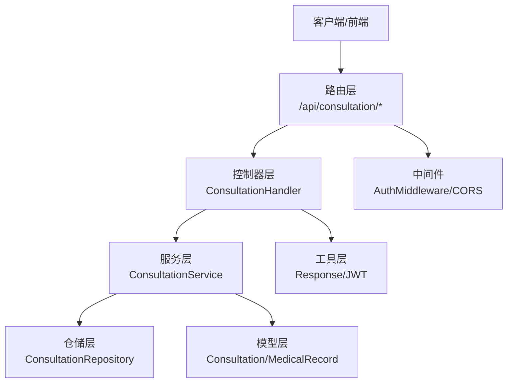
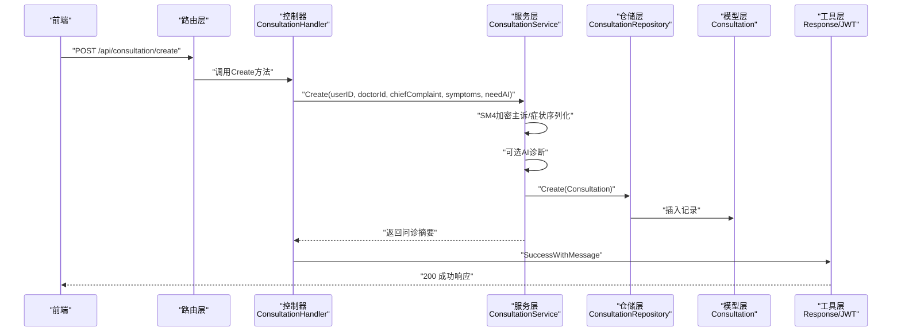
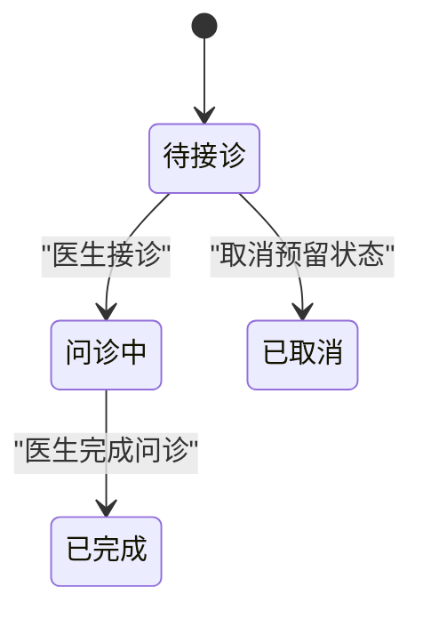
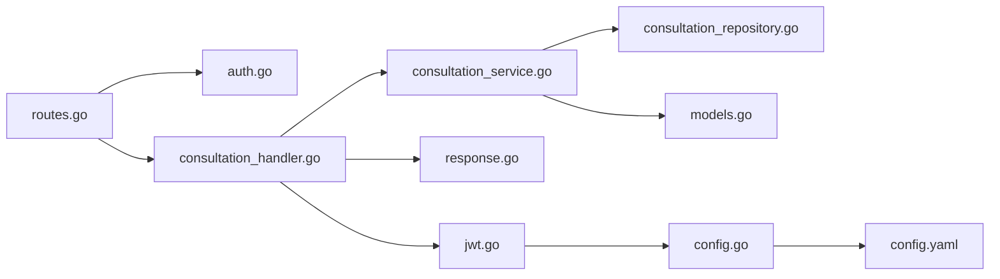
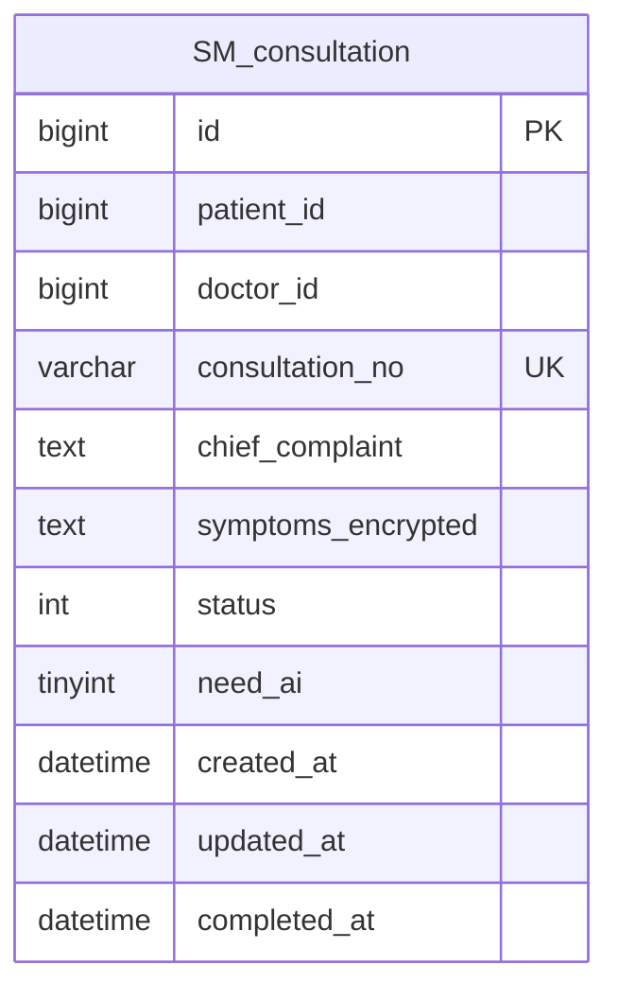

# 问诊API

<cite>
**本文引用的文件**
- [routes.go](file://backed/internal/api/routes.go)
- [consultation_handler.go](file://backed/internal/api/handler/consultation_handler.go)
- [consultation_service.go](file://backed/internal/service/consultation_service.go)
- [consultation_repository.go](file://backed/internal/repository/consultation_repository.go)
- [models.go](file://backed/internal/model/models.go)
- [auth.go](file://backed/internal/middleware/auth.go)
- [jwt.go](file://backed/pkg/utils/jwt.go)
- [response.go](file://backed/pkg/utils/response.go)
- [ai_diagnosis.go](file://backed/internal/service/ai_diagnosis.go)
- [config.go](file://backed/pkg/config/config.go)
- [config.yaml](file://backed/config/config.yaml)
- [consultation-list.vue](file://fonted/pages/consultation/consultation-list.vue)
- [consultation-detail.vue](file://fonted/pages/consultation/consultation-detail.vue)
- [create-consultation.vue](file://fonted/pages/consultation/create-consultation.vue)
- [API接口总览.md](file://API接口总览.md)
</cite>

## 目录
1. [简介](#简介)
2. [项目结构](#项目结构)
3. [核心组件](#核心组件)
4. [架构总览](#架构总览)
5. [详细组件分析](#详细组件分析)
6. [依赖关系分析](#依赖关系分析)
7. [性能考虑](#性能考虑)
8. [故障排查指南](#故障排查指南)
9. [结论](#结论)
10. [附录](#附录)

## 简介
本文件面向开发者，提供“问诊模块”的API文档，覆盖以下三个核心接口：
- 创建问诊
- 获取问诊列表
- 查看问诊详情

文档明确说明：
- 所有接口均需JWT认证
- 请求与响应的数据结构
- 参数约束与必填项
- 分页查询与筛选条件
- 问诊状态流转与业务规则
- 与前端交互的典型流程与示例

## 项目结构
后端采用Gin框架，按职责分层组织：
- 路由层：统一注册各模块路由，强制JWT中间件
- 控制器层：处理HTTP请求，绑定参数，调用服务层
- 服务层：封装业务逻辑，包含加密、AI诊断、状态机等
- 仓储层：数据库访问封装
- 模型层：数据库实体映射
- 中间件：JWT认证与跨域
- 工具：统一响应体、JWT解析与签名

图表来源
- [routes.go](file://backed/internal/api/routes.go#L37-L47)
- [consultation_handler.go](file://backed/internal/api/handler/consultation_handler.go#L1-L136)
- [consultation_service.go](file://backed/internal/service/consultation_service.go#L1-L302)
- [consultation_repository.go](file://backed/internal/repository/consultation_repository.go#L1-L83)
- [models.go](file://backed/internal/model/models.go#L68-L119)
- [auth.go](file://backed/internal/middleware/auth.go#L1-L61)
- [response.go](file://backed/pkg/utils/response.go#L1-L69)
- [jwt.go](file://backed/pkg/utils/jwt.go#L1-L53)

章节来源
- [routes.go](file://backed/internal/api/routes.go#L37-L47)
- [auth.go](file://backed/internal/middleware/auth.go#L1-L61)

## 核心组件
- 路由注册：问诊模块路由在统一组内强制JWT中间件
- 控制器：负责参数绑定、鉴权上下文注入、调用服务层并返回统一响应
- 服务层：实现业务规则、加密/解密、AI诊断、状态机、病历创建
- 仓储层：封装数据库查询、分页、关联查询
- 模型层：定义问诊、病历等实体字段及索引
- 中间件：JWT认证与CORS
- 工具：统一响应体、JWT签发与解析

章节来源
- [routes.go](file://backed/internal/api/routes.go#L37-L47)
- [consultation_handler.go](file://backed/internal/api/handler/consultation_handler.go#L1-L136)
- [consultation_service.go](file://backed/internal/service/consultation_service.go#L1-L302)
- [consultation_repository.go](file://backed/internal/repository/consultation_repository.go#L1-L83)
- [models.go](file://backed/internal/model/models.go#L68-L119)
- [auth.go](file://backed/internal/middleware/auth.go#L1-L61)
- [response.go](file://backed/pkg/utils/response.go#L1-L69)
- [jwt.go](file://backed/pkg/utils/jwt.go#L1-L53)

## 架构总览
下面的序列图展示“创建问诊”从客户端到数据库的完整调用链路。

图表来源
- [routes.go](file://backed/internal/api/routes.go#L37-L47)
- [consultation_handler.go](file://backed/internal/api/handler/consultation_handler.go#L20-L43)
- [consultation_service.go](file://backed/internal/service/consultation_service.go#L28-L86)
- [consultation_repository.go](file://backed/internal/repository/consultation_repository.go#L14-L17)
- [models.go](file://backed/internal/model/models.go#L68-L93)
- [response.go](file://backed/pkg/utils/response.go#L15-L33)
- [jwt.go](file://backed/pkg/utils/jwt.go#L17-L33)

## 详细组件分析

### 认证与请求头
- 所有问诊接口均需携带Authorization头，格式为Bearer <token>
- 中间件负责解析JWT并注入userID/username/role到上下文
- JWT配置来源于配置文件，包含密钥与过期时间

章节来源
- [routes.go](file://backed/internal/api/routes.go#L37-L47)
- [auth.go](file://backed/internal/middleware/auth.go#L1-L61)
- [jwt.go](file://backed/pkg/utils/jwt.go#L17-L53)
- [config.yaml](file://backed/config/config.yaml#L21-L24)

### 接口一：创建问诊
- 方法与路径：POST /api/consultation/create
- 认证：是（Bearer Token）
- 功能：创建问诊记录；可选触发AI智能诊断；返回问诊标识与基础信息

请求参数（JSON）
- doctorId: 整数，可空；若提供则直接指定医生
- chiefComplaint: 字符串，必填；主诉内容（将被SM4加密存储）
- symptoms: 对象，必填；包含以下字段：
  - age: 数值
  - gender: 数值（0/1）
  - bloodPressure: 字符串，格式如“120/80”
  - heartRate: 数值
  - temperature: 数值
  - bloodSugar: 数值
  - otherSymptoms: 字符串
  - images: 字符串数组（可选），图片URL
- needAI: 布尔，可空；默认开启

响应数据（JSON）
- code: 整数，200表示成功
- message: 字符串
- data: 对象
  - consultationId: 整数
  - consultationNo: 字符串
  - status: 整数（0待接诊）
  - createdAt: 字符串（时间戳格式）
  - aiDiagnosis: 对象（仅当needAI=true且AI诊断可用时返回）
    - riskScore: 整数
    - riskLevel: 字符串（high/medium/low/normal）
    - diagnosis: 字符串
    - suggestions: 字符串
    - possibleDiseases: 数组
    - recommendedDept: 字符串
    - urgencyLevel: 字符串
    - detailedAnalysis: 对象
    - lifestyleAdvice: 数组
    - followUpAdvice: 字符串

请求示例（JSON）
- Authorization: Bearer <token>
- Body:
  - doctorId: 1001
  - chiefComplaint: "头疼、发热"
  - symptoms:
    - age: 30
    - gender: 1
    - bloodPressure: "120/80"
    - heartRate: 72
    - temperature: 38.5
    - bloodSugar: 5.6
    - otherSymptoms: "轻微咳嗽"
    - images: ["https://example.com/img1.jpg"]
  - needAI: true

响应示例（JSON）
- 200 OK
- Body:
  - code: 200
  - message: "问诊创建成功"
  - data:
    - consultationId: 12345
    - consultationNo: "CN1700000000"
    - status: 0
    - createdAt: "2024-01-01 12:00:00"
    - aiDiagnosis:
      - riskScore: 45
      - riskLevel: "medium"
      - diagnosis: "疑似感冒"
      - suggestions: "多休息、多喝水..."
      - possibleDiseases: ["普通感冒"]
      - recommendedDept: "全科"
      - urgencyLevel: "attention"
      - detailedAnalysis: {}
      - lifestyleAdvice: ["多休息", "多饮水"]
      - followUpAdvice: "如症状持续建议复诊"

业务规则
- 若needAI为true，服务层会执行AI诊断并填充部分字段；最终详情接口会重新执行AI以补齐字段
- 主诉与症状数据分别进行加密存储
- 状态初始为0（待接诊）

章节来源
- [consultation_handler.go](file://backed/internal/api/handler/consultation_handler.go#L20-L43)
- [consultation_service.go](file://backed/internal/service/consultation_service.go#L28-L86)
- [ai_diagnosis.go](file://backed/internal/service/ai_diagnosis.go#L1-L308)
- [models.go](file://backed/internal/model/models.go#L68-L93)
- [response.go](file://backed/pkg/utils/response.go#L15-L33)

### 接口二：获取问诊列表
- 方法与路径：GET /api/consultation/list
- 认证：是（Bearer Token）
- 功能：按角色与状态分页查询问诊列表

查询参数
- page: 整数，可空；默认1
- pageSize: 整数，可空；默认10
- role: 字符串，可空；默认"patient"
  - "patient"：仅显示该用户的问诊
  - "doctor"：显示该医生的问诊；若未筛选状态，则包含待接诊（doctor_id为空且status=0）
- status: 整数，可空；筛选状态
  - 0：待接诊
  - 1：问诊中
  - 2：已完成
  - 3：已取消

响应数据（JSON）
- code: 整数，200表示成功
- message: 字符串
- data: 对象
  - list: 数组，每项包含
    - consultationId: 整数
    - consultationNo: 字符串
    - patientName: 字符串
    - doctorName: 字符串
    - chiefComplaint: 字符串（已解密）
    - status: 整数
    - statusText: 字符串（待接诊/问诊中/已完成）
    - needAI: 布尔
    - createdAt: 字符串
  - total: 整数
  - page: 整数
  - pageSize: 整数

分页与筛选规则
- 医生视角：
  - 未筛选状态：显示“指定给自己”或“待接诊”两类
  - 筛选状态=0：仅显示“指定给自己且待接诊”
  - 筛选其他状态：仅显示“指定给自己”
- 非医生视角：按status过滤

章节来源
- [consultation_handler.go](file://backed/internal/api/handler/consultation_handler.go#L45-L71)
- [consultation_service.go](file://backed/internal/service/consultation_service.go#L88-L120)
- [consultation_repository.go](file://backed/internal/repository/consultation_repository.go#L31-L82)
- [models.go](file://backed/internal/model/models.go#L68-L93)
- [response.go](file://backed/pkg/utils/response.go#L15-L33)

### 接口三：查看问诊详情
- 方法与路径：GET /api/consultation/detail
- 认证：是（Bearer Token）
- 功能：根据consultationId获取详情；进行权限校验；解密主诉与症状；必要时重新执行AI诊断

查询参数
- consultationId: 整数，必填

响应数据（JSON）
- code: 整数，200表示成功
- message: 字符串
- data: 对象
  - consultationId: 整数
  - consultationNo: 字符串
  - chiefComplaint: 字符串（已解密）
  - symptoms: 对象（已解密）
  - status: 整数
  - statusText: 字符串
  - needAI: 布尔
  - createdAt: 字符串
  - aiDiagnosis: 对象（仅当存在AI诊断或需要补齐时）
    - riskScore: 整数
    - riskLevel: 字符串
    - diagnosis: 字符串
    - suggestions: 字符串
    - possibleDiseases: 数组
    - recommendedDept: 字符串
    - urgencyLevel: 字符串
    - detailedAnalysis: 对象
    - lifestyleAdvice: 数组
    - followUpAdvice: 字符串

权限校验
- 仅限问诊的患者或指定医生访问

章节来源
- [consultation_handler.go](file://backed/internal/api/handler/consultation_handler.go#L73-L91)
- [consultation_service.go](file://backed/internal/service/consultation_service.go#L122-L176)
- [models.go](file://backed/internal/model/models.go#L68-L93)
- [response.go](file://backed/pkg/utils/response.go#L15-L33)

### 问诊状态流转与业务规则
状态定义
- 0：待接诊
- 1：问诊中
- 2：已完成
- 3：已取消

流转规则
- 创建问诊：状态=0
- 医生接诊：状态从0变为1（仅医生可操作）
- 完成问诊：状态从1变为2（仅医生可操作，需提供诊断与可选处方；完成后自动创建病历）

图表来源
- [consultation_service.go](file://backed/internal/service/consultation_service.go#L178-L237)
- [models.go](file://backed/internal/model/models.go#L68-L93)

章节来源
- [consultation_service.go](file://backed/internal/service/consultation_service.go#L178-L237)
- [models.go](file://backed/internal/model/models.go#L68-L93)

## 依赖关系分析
- 路由层依赖中间件进行JWT认证
- 控制器依赖服务层；服务层依赖仓储层与模型层
- 工具层提供统一响应体与JWT解析
- 配置层提供JWT密钥与过期时间

图表来源
- [routes.go](file://backed/internal/api/routes.go#L37-L47)
- [auth.go](file://backed/internal/middleware/auth.go#L1-L61)
- [consultation_handler.go](file://backed/internal/api/handler/consultation_handler.go#L1-L136)
- [consultation_service.go](file://backed/internal/service/consultation_service.go#L1-L302)
- [consultation_repository.go](file://backed/internal/repository/consultation_repository.go#L1-L83)
- [models.go](file://backed/internal/model/models.go#L68-L119)
- [response.go](file://backed/pkg/utils/response.go#L1-L69)
- [jwt.go](file://backed/pkg/utils/jwt.go#L1-L53)
- [config.go](file://backed/pkg/config/config.go#L1-L78)
- [config.yaml](file://backed/config/config.yaml#L21-L24)

章节来源
- [routes.go](file://backed/internal/api/routes.go#L37-L47)
- [auth.go](file://backed/internal/middleware/auth.go#L1-L61)
- [consultation_handler.go](file://backed/internal/api/handler/consultation_handler.go#L1-L136)
- [consultation_service.go](file://backed/internal/service/consultation_service.go#L1-L302)
- [consultation_repository.go](file://backed/internal/repository/consultation_repository.go#L1-L83)
- [models.go](file://backed/internal/model/models.go#L68-L119)
- [response.go](file://backed/pkg/utils/response.go#L1-L69)
- [jwt.go](file://backed/pkg/utils/jwt.go#L1-L53)
- [config.go](file://backed/pkg/config/config.go#L1-L78)
- [config.yaml](file://backed/config/config.yaml#L21-L24)

## 性能考虑
- 分页查询：仓储层使用offset与limit实现分页，注意大页码时的性能
- 关联查询：列表查询中对患者与医生名称进行了二次查询，建议在高并发场景下引入缓存或预加载
- 加密成本：SM4加密/解密与AI诊断均有额外开销，建议在批量处理时合并请求
- 日志输出：服务层存在较多日志打印，生产环境建议降低日志级别

## 故障排查指南
常见错误与定位
- 401 未授权
  - 检查Authorization头是否为Bearer <token>
  - 检查token是否过期或签名不正确
- 400 参数错误
  - 检查请求体JSON格式与字段类型
  - 检查必填字段是否缺失
- 404 问诊不存在
  - 检查consultationId是否正确
- 403 无权限访问
  - 确认当前用户是否为问诊患者或指定医生
- 500 内部错误
  - 查看服务层日志，定位数据库写入或加密环节问题

章节来源
- [response.go](file://backed/pkg/utils/response.go#L45-L69)
- [auth.go](file://backed/internal/middleware/auth.go#L1-L61)
- [consultation_handler.go](file://backed/internal/api/handler/consultation_handler.go#L20-L91)
- [consultation_service.go](file://backed/internal/service/consultation_service.go#L178-L237)

## 结论
本文档梳理了问诊模块的核心接口、认证机制、数据结构、分页与筛选、状态流转与业务规则，并给出了前后端交互参考。开发者可据此快速集成与调试。

## 附录

### 数据模型（问诊）

图表来源
- [models.go](file://backed/internal/model/models.go#L68-L93)

### 前端调用参考
- 列表页（分页与筛选）
  - GET /api/consultation/list?page=1&pageSize=10&role=patient&status=0
- 详情页
  - GET /api/consultation/detail?consultationId=12345
- 创建问诊（示例）
  - POST /api/consultation/create
  - Body: 见“创建问诊”请求示例

章节来源
- [consultation-list.vue](file://fonted/pages/consultation/consultation-list.vue#L197-L236)
- [consultation-detail.vue](file://fonted/pages/consultation/consultation-detail.vue#L211-L219)
- [create-consultation.vue](file://fonted/pages/consultation/create-consultation.vue#L232-L245)
- [API接口总览.md](file://API接口总览.md#L95-L104)