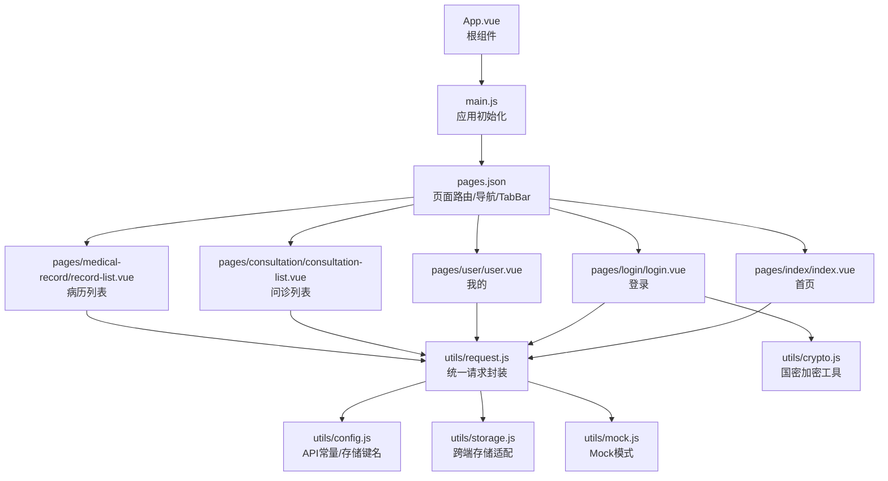
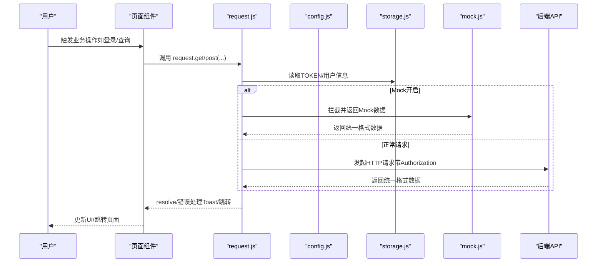
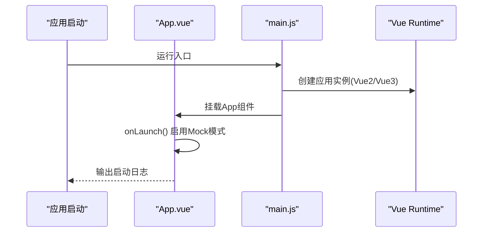
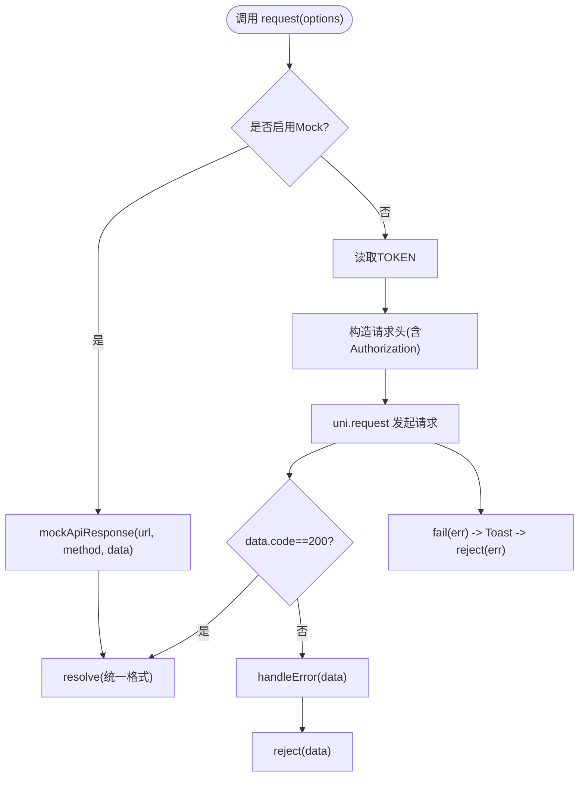
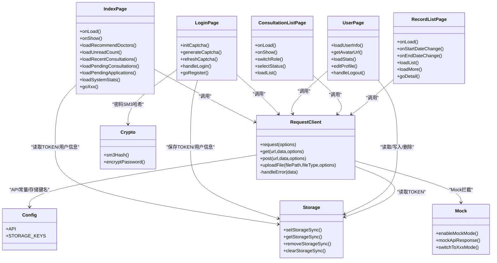
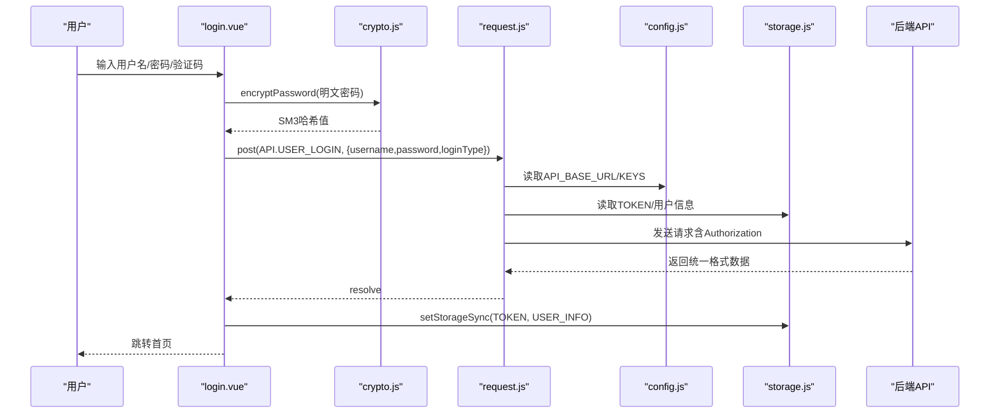
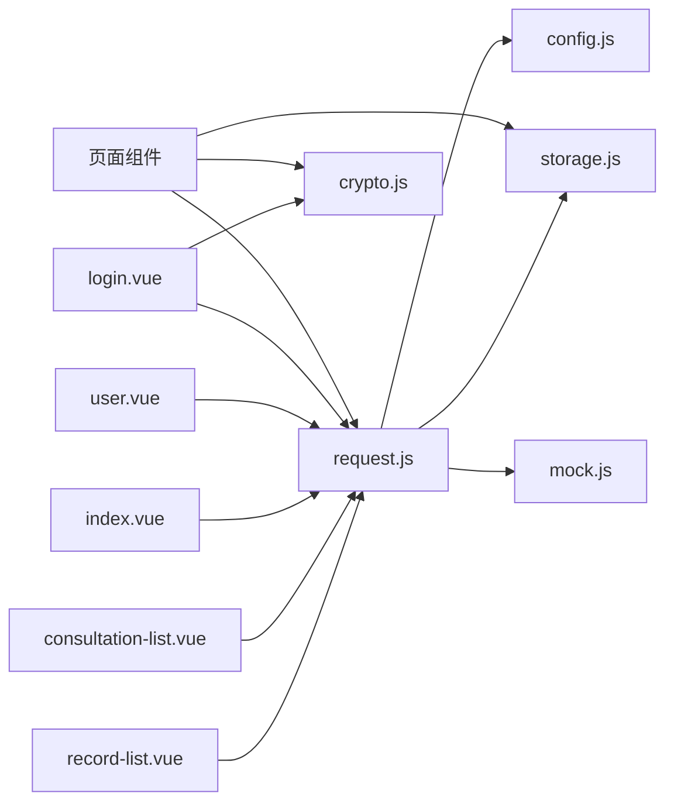

# 前端架构

<cite>
**本文引用的文件**
- [App.vue](file://fonted/App.vue)
- [main.js](file://fonted/main.js)
- [pages.json](file://fonted/pages.json)
- [request.js](file://fonted/utils/request.js)
- [config.js](file://fonted/utils/config.js)
- [storage.js](file://fonted/utils/storage.js)
- [mock.js](file://fonted/utils/mock.js)
- [crypto.js](file://fonted/utils/crypto.js)
- [index.vue](file://fonted/pages/index/index.vue)
- [login.vue](file://fonted/pages/login/login.vue)
- [user.vue](file://fonted/pages/user/user.vue)
- [consultation-list.vue](file://fonted/pages/consultation/consultation-list.vue)
- [record-list.vue](file://fonted/pages/medical-record/record-list.vue)
</cite>

## 目录
1. [简介](#简介)
2. [项目结构](#项目结构)
3. [核心组件](#核心组件)
4. [架构总览](#架构总览)
5. [详细组件分析](#详细组件分析)
6. [依赖关系分析](#依赖关系分析)
7. [性能考量](#性能考量)
8. [故障排查指南](#故障排查指南)
9. [结论](#结论)
10. [附录](#附录)

## 简介
本文件面向前端开发者，系统化梳理基于 uni-app 的 Vue 应用架构，围绕以下主题展开：
- App.vue 作为根组件的作用与生命周期钩子
- main.js 中应用初始化流程（Vue2/Vue3 条件编译）
- pages.json 如何定义页面路由、导航与 TabBar
- utils/request.js 封装的 API 客户端如何处理 HTTP 请求、响应与错误
- 组件树组织方式与 pages 目录下的功能页面
- 前端如何通过 request.js 与后端 API 通信
- 状态管理、API 调用与组件交互的最佳实践

## 项目结构
前端代码位于 fonted 目录，采用 uni-app 多端统一框架，核心文件包括：
- 应用入口与根组件：App.vue、main.js
- 页面路由与导航：pages.json
- 工具层：utils 下的 request.js、config.js、storage.js、mock.js、crypto.js
- 页面组件：pages 下按功能划分的页面，如首页、登录、用户中心、问诊、病历等

图表来源
- [App.vue](file://fonted/App.vue#L1-L28)
- [main.js](file://fonted/main.js#L1-L22)
- [pages.json](file://fonted/pages.json#L1-L183)
- [index.vue](file://fonted/pages/index/index.vue#L1-L120)
- [login.vue](file://fonted/pages/login/login.vue#L1-L120)
- [user.vue](file://fonted/pages/user/user.vue#L1-L120)
- [consultation-list.vue](file://fonted/pages/consultation/consultation-list.vue#L1-L120)
- [record-list.vue](file://fonted/pages/medical-record/record-list.vue#L1-L120)
- [request.js](file://fonted/utils/request.js#L1-L120)
- [config.js](file://fonted/utils/config.js#L1-L65)
- [storage.js](file://fonted/utils/storage.js#L1-L94)
- [mock.js](file://fonted/utils/mock.js#L1-L120)
- [crypto.js](file://fonted/utils/crypto.js#L1-L120)

章节来源
- [App.vue](file://fonted/App.vue#L1-L28)
- [main.js](file://fonted/main.js#L1-L22)
- [pages.json](file://fonted/pages.json#L1-L183)

## 核心组件
- 根组件 App.vue：负责应用启动时的全局初始化，例如启用 Mock 模式、打印启动日志等。
- 应用入口 main.js：根据构建目标（Vue2/Vue3）创建应用实例并挂载。
- 页面路由 pages.json：集中声明页面路径、导航样式、全局样式与 TabBar。
- API 客户端 utils/request.js：统一处理请求头、鉴权、Mock 拦截、错误处理与上传。
- 配置与存储 utils/config.js、utils/storage.js：集中管理 API 常量、存储键名与跨端存储适配。
- Mock 与加密 utils/mock.js、utils/crypto.js：提供开发期 Mock 数据与国密算法工具（示例实现）。

章节来源
- [App.vue](file://fonted/App.vue#L1-L28)
- [main.js](file://fonted/main.js#L1-L22)
- [pages.json](file://fonted/pages.json#L1-L183)
- [request.js](file://fonted/utils/request.js#L1-L120)
- [config.js](file://fonted/utils/config.js#L1-L65)
- [storage.js](file://fonted/utils/storage.js#L1-L94)
- [mock.js](file://fonted/utils/mock.js#L1-L120)
- [crypto.js](file://fonted/utils/crypto.js#L1-L120)

## 架构总览
前端采用“配置驱动路由 + 统一请求封装 + 跨端存储适配”的架构模式：
- 配置驱动：通过 pages.json 统一声明页面与 TabBar，减少硬编码。
- 统一请求：request.js 封装 GET/POST/PUT/DELETE/上传，自动注入 Authorization，统一错误处理。
- 跨端存储：storage.js 在 H5 与非 H5 环境分别使用 localStorage 与 uni-app 原生 API，避免刷新丢失。
- Mock 支持：mock.js 提供开发期 Mock 数据与自动登录，便于前后端并行开发。
- 国密加密：crypto.js 提供 SM3 哈希与 SM2/SM4 加解密占位，login.vue 对密码进行 SM3 哈希。

图表来源
- [login.vue](file://fonted/pages/login/login.vue#L170-L240)
- [index.vue](file://fonted/pages/index/index.vue#L290-L340)
- [request.js](file://fonted/utils/request.js#L1-L120)
- [config.js](file://fonted/utils/config.js#L1-L65)
- [storage.js](file://fonted/utils/storage.js#L1-L94)
- [mock.js](file://fonted/utils/mock.js#L530-L596)

## 详细组件分析

### 根组件与应用初始化（App.vue 与 main.js）
- App.vue：在 onLaunch 中启用 Mock 模式并输出启动提示；onShow/onHide 用于应用显示/隐藏的日志。
- main.js：条件编译支持 Vue2 与 Vue3，分别创建应用实例并挂载；同时引入适配器以兼容异步 API。

图表来源
- [App.vue](file://fonted/App.vue#L1-L28)
- [main.js](file://fonted/main.js#L1-L22)

章节来源
- [App.vue](file://fonted/App.vue#L1-L28)
- [main.js](file://fonted/main.js#L1-L22)

### 页面路由与导航（pages.json）
- pages 数组：声明页面路径与导航样式（标题、自定义导航等）。
- globalStyle：全局导航栏样式（文字颜色、背景色等）。
- tabBar：底部 TabBar，指定页面路径、图标与文本。
- uniIdRouter：保留字段，用于 uni-id-router 扩展。

章节来源
- [pages.json](file://fonted/pages.json#L1-L183)

### API 客户端封装（utils/request.js）
- 统一入口 request(options)：支持 Mock 拦截、自动注入 Authorization、统一错误处理。
- 辅助方法：get/post/put/del、uploadFile（含加密参数）。
- 错误处理：handleError 根据 code 分支处理 401/403/404/500 等，Toast 提示与必要时 reLaunch 到登录页。
- Mock 模式：isMockEnabled 控制开关；enableMockMode 自动登录与提示。

图表来源
- [request.js](file://fonted/utils/request.js#L1-L120)
- [mock.js](file://fonted/utils/mock.js#L260-L340)

章节来源
- [request.js](file://fonted/utils/request.js#L1-L222)
- [mock.js](file://fonted/utils/mock.js#L530-L596)

### 配置与存储（utils/config.js 与 utils/storage.js）
- config.js：集中定义 API 常量（用户、管理员、问诊、病历、通知、文件、国密密钥等）与本地存储键名（token、用户信息、SM2/Paillier 公钥）。
- storage.js：跨端存储适配，区分 H5 与非 H5 环境，提供 setStorageSync/getStorageSync/removeStorageSync/clearStorageSync。

章节来源
- [config.js](file://fonted/utils/config.js#L1-L65)
- [storage.js](file://fonted/utils/storage.js#L1-L94)

### Mock 与加密（utils/mock.js 与 utils/crypto.js）
- mock.js：提供大量 Mock 数据（用户、医生、问诊、病历、通知），支持登录切换（普通用户/医生/管理员）、文件上传 Mock、Mock API 响应统一格式。
- crypto.js：提供 SM3 哈希、SM2/SM4 加解密占位与密码强度校验；login.vue 使用 SM3 对密码进行哈希后再提交。

章节来源
- [mock.js](file://fonted/utils/mock.js#L1-L200)
- [crypto.js](file://fonted/utils/crypto.js#L1-L120)
- [login.vue](file://fonted/pages/login/login.vue#L210-L230)

### 组件树与页面组织（pages 目录）
- pages/index/index.vue：首页聚合入口，按角色展示快捷功能、推荐医生、最近问诊、待接诊、待审核、系统统计等，使用 request.js 调用 API 并通过 storage.js 读取 TOKEN/用户信息。
- pages/login/login.vue：登录页，生成 Canvas 验证码，使用 crypto.js 对密码进行 SM3 哈希，调用 request.js 登录接口，保存 token 与用户信息后跳转首页。
- pages/user/user.vue：我的页面，按角色展示统计与菜单，支持密钥管理（调用 API 生成公钥并保存到 storage），退出登录清理本地数据并 reLaunch 到登录页。
- pages/consultation/consultation-list.vue：问诊列表，支持患者/医生角色切换与状态筛选，分页加载并处理管理员身份提示。
- pages/medical-record/record-list.vue：病历列表，支持日期筛选与分页加载。

图表来源
- [index.vue](file://fonted/pages/index/index.vue#L240-L530)
- [login.vue](file://fonted/pages/login/login.vue#L170-L260)
- [user.vue](file://fonted/pages/user/user.vue#L180-L420)
- [consultation-list.vue](file://fonted/pages/consultation/consultation-list.vue#L120-L200)
- [record-list.vue](file://fonted/pages/medical-record/record-list.vue#L90-L170)
- [request.js](file://fonted/utils/request.js#L1-L120)
- [config.js](file://fonted/utils/config.js#L1-L65)
- [storage.js](file://fonted/utils/storage.js#L1-L94)
- [crypto.js](file://fonted/utils/crypto.js#L1-L120)
- [mock.js](file://fonted/utils/mock.js#L530-L596)

章节来源
- [index.vue](file://fonted/pages/index/index.vue#L240-L530)
- [login.vue](file://fonted/pages/login/login.vue#L170-L260)
- [user.vue](file://fonted/pages/user/user.vue#L180-L420)
- [consultation-list.vue](file://fonted/pages/consultation/consultation-list.vue#L120-L200)
- [record-list.vue](file://fonted/pages/medical-record/record-list.vue#L90-L170)

### 前端与后端通信流程（以登录为例）

图表来源
- [login.vue](file://fonted/pages/login/login.vue#L210-L240)
- [crypto.js](file://fonted/utils/crypto.js#L80-L100)
- [request.js](file://fonted/utils/request.js#L1-L120)
- [config.js](file://fonted/utils/config.js#L1-L65)
- [storage.js](file://fonted/utils/storage.js#L1-L94)

## 依赖关系分析
- 组件到工具：各页面组件依赖 request.js 进行 API 调用，依赖 storage.js 进行本地持久化，部分页面依赖 crypto.js 进行加密。
- 工具到配置：request.js 依赖 config.js 的 API 常量与存储键名；storage.js 依赖 config.js 的 STORAGE_KEYS。
- Mock 与开发：mock.js 提供 Mock 数据与自动登录，便于前后端并行开发；生产环境可通过 isMockEnabled 关闭 Mock。

图表来源
- [index.vue](file://fonted/pages/index/index.vue#L240-L530)
- [login.vue](file://fonted/pages/login/login.vue#L170-L260)
- [user.vue](file://fonted/pages/user/user.vue#L180-L420)
- [consultation-list.vue](file://fonted/pages/consultation/consultation-list.vue#L120-L200)
- [record-list.vue](file://fonted/pages/medical-record/record-list.vue#L90-L170)
- [request.js](file://fonted/utils/request.js#L1-L120)
- [config.js](file://fonted/utils/config.js#L1-L65)
- [storage.js](file://fonted/utils/storage.js#L1-L94)
- [crypto.js](file://fonted/utils/crypto.js#L1-L120)
- [mock.js](file://fonted/utils/mock.js#L530-L596)

章节来源
- [request.js](file://fonted/utils/request.js#L1-L120)
- [config.js](file://fonted/utils/config.js#L1-L65)
- [storage.js](file://fonted/utils/storage.js#L1-L94)
- [mock.js](file://fonted/utils/mock.js#L530-L596)
- [crypto.js](file://fonted/utils/crypto.js#L1-L120)

## 性能考量
- 请求缓存与去重：在高频页面（如首页）可考虑对相同查询参数的结果做内存缓存，避免重复请求。
- 分页加载：列表页已采用分页加载，建议结合滚动到底部触发加载，控制 pageSize 与并发请求数。
- 图片与资源：头像与证书等资源尽量使用 CDN 或服务端生成缩略图，减少首屏压力。
- Mock 模式：开发阶段启用 Mock 可显著提升联调效率，但需在联调阶段及时关闭以验证真实后端行为。
- 存储策略：H5 环境使用 localStorage，注意容量限制与序列化开销；非 H5 环境使用 uni-app API，避免刷新丢失。

## 故障排查指南
- 登录失败/401：检查 TOKEN 是否正确保存与携带；确认后端返回统一格式；查看 request.js 的 handleError 分支逻辑。
- Mock 不生效：确认 isMockEnabled 返回值；确保 enableMockMode 已被调用。
- 存储异常：在 H5 环境检查浏览器是否允许 localStorage；非 H5 环境检查 uni-app API 权限。
- 国密加密：当前 crypto.js 为占位实现，实际项目需集成真正的 SM2/SM3/SM4 库；登录页已对密码进行 SM3 哈希。

章节来源
- [request.js](file://fonted/utils/request.js#L180-L222)
- [mock.js](file://fonted/utils/mock.js#L588-L596)
- [storage.js](file://fonted/utils/storage.js#L1-L94)
- [crypto.js](file://fonted/utils/crypto.js#L1-L120)

## 结论
该前端架构以 pages.json 驱动路由、以 request.js 统一封装请求、以 storage.js 适配跨端存储，并通过 mock.js 提升开发效率。页面组件围绕角色与业务域组织，API 调用与状态管理清晰分离。建议在实际项目中：
- 集成真正的国密算法库，替换 crypto.js 占位实现；
- 在关键页面增加请求缓存与错误重试；
- 优化 Mock 模式开关与自动登录策略，满足联调与演示需求；
- 强化组件间通信规范（如事件总线或轻量状态管理），降低耦合度。

## 附录
- 最佳实践清单
  - 统一使用 request.js 发起请求，避免直接调用 uni.request。
  - 所有敏感数据（如 TOKEN、用户信息）通过 storage.js 读写，避免明文存储。
  - 页面间跳转优先使用 switchTab 与 navigateTo，避免栈溢出。
  - 列表页实现分页加载与空态提示，提升用户体验。
  - 登录页对密码进行 SM3 哈希，后端再做加盐二次哈希。
  - 在 Mock 模式下提供角色切换与自动登录，便于演示。