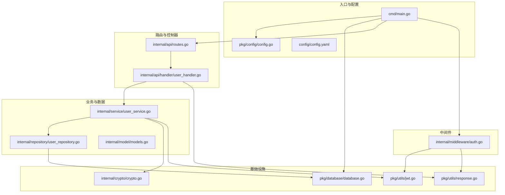
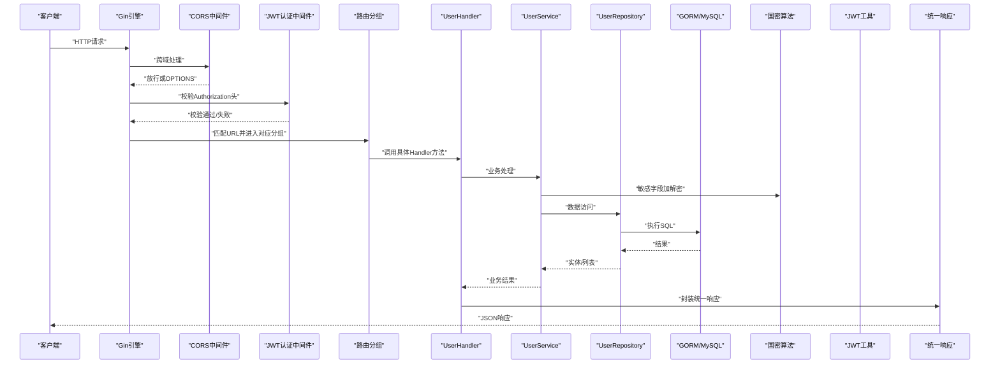
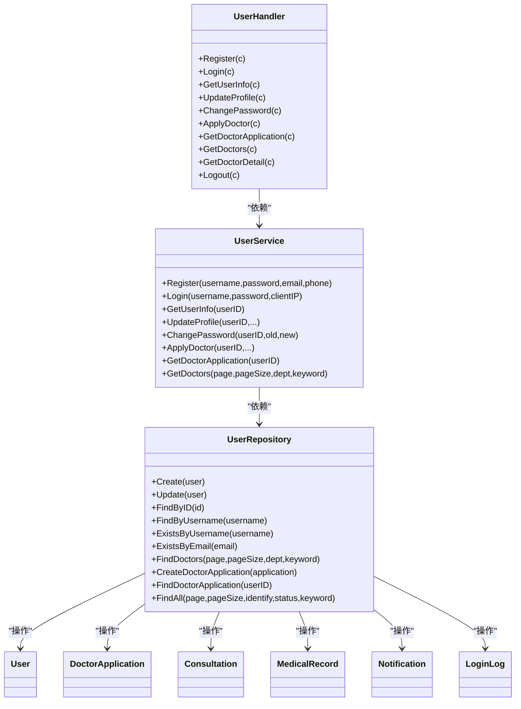
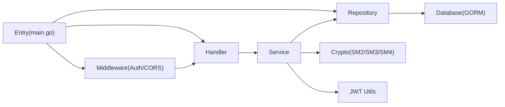

# 后端架构

<cite>
**本文引用的文件**
- [main.go](file://backed/cmd/main.go)
- [routes.go](file://backed/internal/api/routes.go)
- [auth.go](file://backed/internal/middleware/auth.go)
- [config.go](file://backed/pkg/config/config.go)
- [database.go](file://backed/pkg/database/database.go)
- [jwt.go](file://backed/pkg/utils/jwt.go)
- [response.go](file://backed/pkg/utils/response.go)
- [models.go](file://backed/internal/model/models.go)
- [user_service.go](file://backed/internal/service/user_service.go)
- [user_repository.go](file://backed/internal/repository/user_repository.go)
- [user_handler.go](file://backed/internal/api/handler/user_handler.go)
- [crypto.go](file://backed/internal/crypto/crypto.go)
- [config.yaml](file://backed/config/config.yaml)
</cite>

## 目录
1. [简介](#简介)
2. [项目结构](#项目结构)
3. [核心组件](#核心组件)
4. [架构总览](#架构总览)
5. [详细组件分析](#详细组件分析)
6. [依赖关系分析](#依赖关系分析)
7. [性能与安全考量](#性能与安全考量)
8. [故障排查指南](#故障排查指南)
9. [结论](#结论)
10. [附录](#附录)

## 简介
本文件面向后端开发者，系统性梳理基于 Go 的 MVC 分层架构，围绕以下主题展开：
- main.go 作为应用入口，如何加载配置、初始化国密算法、建立数据库连接、设置静态资源与中间件、注册路由并启动服务。
- routes.go 中 API 路由的注册机制与 URL 模式组织方式。
- auth.go 中间件如何实现 JWT 身份认证与权限控制。
- Handler、Service、Repository 三层职责划分与调用链路。
- Gin 框架在请求生命周期中的处理流程。
- 结合项目特性（国密算法、敏感字段加密存储）给出 API 设计、业务逻辑与数据访问的最佳实践。

## 项目结构
后端采用按功能域分层的组织方式：
- cmd：应用入口，负责初始化与运行时配置。
- internal/api：路由与控制器（Handler），对外暴露 REST 接口。
- internal/middleware：中间件（如 JWT 认证、CORS）。
- internal/service：业务逻辑层，封装领域规则与流程编排。
- internal/repository：数据访问层，封装数据库读写细节。
- internal/model：数据模型定义，映射数据库表结构。
- internal/crypto：国密算法封装（SM2/SM3/SM4）。
- pkg/config、pkg/database、pkg/utils：通用配置、数据库连接与工具类。
- config：运行时配置文件（YAML）。

图表来源
- [main.go](file://backed/cmd/main.go#L1-L64)
- [routes.go](file://backed/internal/api/routes.go#L1-L95)
- [auth.go](file://backed/internal/middleware/auth.go#L1-L61)
- [config.go](file://backed/pkg/config/config.go#L1-L78)
- [database.go](file://backed/pkg/database/database.go#L1-L48)
- [jwt.go](file://backed/pkg/utils/jwt.go#L1-L53)
- [response.go](file://backed/pkg/utils/response.go#L1-L69)
- [models.go](file://backed/internal/model/models.go#L1-L160)
- [user_service.go](file://backed/internal/service/user_service.go#L1-L331)
- [user_repository.go](file://backed/internal/repository/user_repository.go#L1-L121)
- [user_handler.go](file://backed/internal/api/handler/user_handler.go#L1-L261)
- [crypto.go](file://backed/internal/crypto/crypto.go#L1-L121)
- [config.yaml](file://backed/config/config.yaml#L1-L37)

章节来源
- [main.go](file://backed/cmd/main.go#L1-L64)
- [config.go](file://backed/pkg/config/config.go#L1-L78)
- [config.yaml](file://backed/config/config.yaml#L1-L37)

## 核心组件
- 应用入口 main.go
  - 加载配置、初始化国密算法、建立数据库连接、设置 Gin 运行模式、注册 CORS 中间件、静态文件服务、注册路由并启动 HTTP 服务器。
- 路由注册 routes.go
  - 以 /api 为根路径，按模块分组（用户、问诊、病历、通知、密钥、文件、管理员），公开与认证接口分离，统一使用 AuthMiddleware。
- 中间件 auth.go
  - JWT 认证中间件从 Authorization 头解析 Bearer Token，校验有效性并将用户信息注入上下文；CORS 中间件处理跨域。
- Handler 层 user_handler.go
  - 对外接口的输入绑定、参数校验、调用 Service 并输出统一响应。
- Service 层 user_service.go
  - 业务规则：注册、登录、信息维护、医生申请等；集成国密算法进行敏感字段加解密；调用 Repository 完成持久化。
- Repository 层 user_repository.go
  - 基于 GORM 的 CRUD 封装，包含分页、条件查询、唯一性校验等。
- 数据模型 models.go
  - 映射用户、医生申请、问诊、病历、通知、登录日志等表，标注加密字段与关联字段。
- 基础设施
  - 配置加载 config.go、数据库连接 database.go、JWT 工具 jwt.go、统一响应 response.go、国密算法 crypto.go。

章节来源
- [main.go](file://backed/cmd/main.go#L1-L64)
- [routes.go](file://backed/internal/api/routes.go#L1-L95)
- [auth.go](file://backed/internal/middleware/auth.go#L1-L61)
- [user_handler.go](file://backed/internal/api/handler/user_handler.go#L1-L261)
- [user_service.go](file://backed/internal/service/user_service.go#L1-L331)
- [user_repository.go](file://backed/internal/repository/user_repository.go#L1-L121)
- [models.go](file://backed/internal/model/models.go#L1-L160)
- [config.go](file://backed/pkg/config/config.go#L1-L78)
- [database.go](file://backed/pkg/database/database.go#L1-L48)
- [jwt.go](file://backed/pkg/utils/jwt.go#L1-L53)
- [response.go](file://backed/pkg/utils/response.go#L1-L69)
- [crypto.go](file://backed/internal/crypto/crypto.go#L1-L121)

## 架构总览
下图展示从 HTTP 请求到数据库的完整调用链，体现 MVC 分层与中间件协作。

图表来源
- [main.go](file://backed/cmd/main.go#L1-L64)
- [routes.go](file://backed/internal/api/routes.go#L1-L95)
- [auth.go](file://backed/internal/middleware/auth.go#L1-L61)
- [user_handler.go](file://backed/internal/api/handler/user_handler.go#L1-L261)
- [user_service.go](file://backed/internal/service/user_service.go#L1-L331)
- [user_repository.go](file://backed/internal/repository/user_repository.go#L1-L121)
- [database.go](file://backed/pkg/database/database.go#L1-L48)
- [crypto.go](file://backed/internal/crypto/crypto.go#L1-L121)
- [jwt.go](file://backed/pkg/utils/jwt.go#L1-L53)
- [response.go](file://backed/pkg/utils/response.go#L1-L69)

## 详细组件分析

### 入口与初始化：main.go
- 加载配置：读取 YAML 配置并反序列化为结构体，供后续模块使用。
- 初始化国密算法：根据配置中的 SM4 密钥初始化，同时生成 SM2 密钥对用于加密/签名。
- 初始化数据库：构造 DSN，使用 GORM 连接 MySQL，并设置连接池参数。
- 静态文件服务：将本地上传目录映射到 /uploads，便于文件访问。
- 中间件与路由：注册 CORS 中间件；根据配置设置 Gin 运行模式；注册 API 路由；启动 HTTP 服务器。

章节来源
- [main.go](file://backed/cmd/main.go#L1-L64)
- [config.go](file://backed/pkg/config/config.go#L1-L78)
- [config.yaml](file://backed/config/config.yaml#L1-L37)
- [database.go](file://backed/pkg/database/database.go#L1-L48)
- [crypto.go](file://backed/internal/crypto/crypto.go#L1-L121)

### 路由注册机制与 URL 模式：routes.go
- 根路径：/api
- 模块分组与公开/认证接口：
  - 用户模块：注册、登录、公开医生列表与详情；认证后支持个人信息、资料修改、密码修改、申请医生、查看申请状态、登出。
  - 问诊模块：创建、列表、详情、接诊、完成。
  - 病历模块：列表、详情。
  - 通知模块：列表、未读数、标记已读。
  - 密钥模块：生成密钥（需认证）。
  - 文件模块：上传（需认证）。
  - 管理员模块：审核医生申请、用户列表、更新用户状态、登录日志。
- 认证策略：除公开接口外，其余均使用 AuthMiddleware。

章节来源
- [routes.go](file://backed/internal/api/routes.go#L1-L95)
- [auth.go](file://backed/internal/middleware/auth.go#L1-L61)

### JWT 认证与权限控制：auth.go
- 认证流程：
  - 从 Authorization 头提取 Bearer Token。
  - 校验格式与有效性；解析失败则返回 401。
  - 成功后将用户标识（ID、用户名、角色）写入上下文，供后续 Handler 使用。
- CORS：
  - 设置允许的 Origin、Headers、Methods，处理预检请求（OPTIONS）。

章节来源
- [auth.go](file://backed/internal/middleware/auth.go#L1-L61)
- [jwt.go](file://backed/pkg/utils/jwt.go#L1-L53)
- [response.go](file://backed/pkg/utils/response.go#L1-L69)

### Handler、Service、Repository 三层职责与调用链
- Handler（控制器）
  - 输入绑定与参数校验，调用 Service 执行业务，组装统一响应。
  - 示例：用户登录、注册、资料更新、密码修改、申请医生、查询医生列表等。
- Service（业务层）
  - 实现业务规则：注册时用户名/邮箱唯一性检查、密码二次哈希（SM3+盐）、敏感字段 SM4 加密、登录签发 JWT、更新最后登录时间与 IP、医生申请编号生成与状态管理、医生列表分页查询等。
  - 与 Repository 协作完成持久化。
  - 与 Crypto 协作完成敏感字段的加解密。
  - 与 JWT 工具协作生成 Token。
- Repository（数据访问层）
  - 基于 GORM 提供 CRUD、条件查询、分页、唯一性校验等能力。
  - 统一封装 SQL，避免在 Service 中直接拼接 SQL。
- Model（数据模型）
  - 映射数据库表，标注字段含义与加密属性，如用户敏感字段（邮箱、电话、实名、身份证、登录 IP）均以加密形式存储。

图表来源
- [user_handler.go](file://backed/internal/api/handler/user_handler.go#L1-L261)
- [user_service.go](file://backed/internal/service/user_service.go#L1-L331)
- [user_repository.go](file://backed/internal/repository/user_repository.go#L1-L121)
- [models.go](file://backed/internal/model/models.go#L1-L160)

章节来源
- [user_handler.go](file://backed/internal/api/handler/user_handler.go#L1-L261)
- [user_service.go](file://backed/internal/service/user_service.go#L1-L331)
- [user_repository.go](file://backed/internal/repository/user_repository.go#L1-L121)
- [models.go](file://backed/internal/model/models.go#L1-L160)

### Gin 框架请求处理流程
- 中间件链：CORS → 认证中间件 → 路由匹配 → 控制器 → 统一响应。
- 参数绑定：使用 Gin 的 ShouldBindJSON 自动校验 JSON 请求体。
- 上下文传递：认证中间件将用户信息写入上下文，Handler 可通过 c.Get("userID") 等读取。
- 响应规范：统一使用 response.go 的 Success/Error 系列函数，保证响应结构一致。

章节来源
- [main.go](file://backed/cmd/main.go#L1-L64)
- [auth.go](file://backed/internal/middleware/auth.go#L1-L61)
- [user_handler.go](file://backed/internal/api/handler/user_handler.go#L1-L261)
- [response.go](file://backed/pkg/utils/response.go#L1-L69)

### API 设计与最佳实践
- 路由组织
  - 以 /api 为根，按模块分组，公开与认证接口分离，清晰表达权限边界。
- 参数校验
  - 在 Handler 层使用 ShouldBindJSON 进行结构化校验，减少重复校验代码。
- 统一响应
  - 使用统一的 Response 结构与错误码体系，便于前端处理与日志追踪。
- 权限控制
  - 通过 AuthMiddleware 统一拦截，避免在每个 Handler 内重复校验。
- 敏感数据保护
  - 用户敏感字段（邮箱、电话、实名、身份证、登录 IP）均采用 SM4 加密存储；密码采用 SM3 哈希加盐。
- 业务幂等与状态机
  - 问诊状态（待接诊、问诊中、已完成、已取消）与医生申请状态（待审核、已通过、已拒绝）明确，便于扩展。

章节来源
- [routes.go](file://backed/internal/api/routes.go#L1-L95)
- [user_handler.go](file://backed/internal/api/handler/user_handler.go#L1-L261)
- [response.go](file://backed/pkg/utils/response.go#L1-L69)
- [user_service.go](file://backed/internal/service/user_service.go#L1-L331)
- [models.go](file://backed/internal/model/models.go#L1-L160)
- [crypto.go](file://backed/internal/crypto/crypto.go#L1-L121)

## 依赖关系分析
- 组件耦合
  - Handler 仅依赖 Service；Service 仅依赖 Repository；Repository 依赖数据库连接；Service 依赖 Crypto 与 JWT 工具。
- 外部依赖
  - Gin：Web 框架与中间件生态。
  - GORM：对象关系映射与数据库连接池。
  - gmsm：国密算法库（SM2/SM3/SM4）。
  - viper：配置读取与反序列化。
- 循环依赖
  - 当前结构清晰，未发现循环依赖迹象。

图表来源
- [main.go](file://backed/cmd/main.go#L1-L64)
- [user_handler.go](file://backed/internal/api/handler/user_handler.go#L1-L261)
- [user_service.go](file://backed/internal/service/user_service.go#L1-L331)
- [user_repository.go](file://backed/internal/repository/user_repository.go#L1-L121)
- [database.go](file://backed/pkg/database/database.go#L1-L48)
- [crypto.go](file://backed/internal/crypto/crypto.go#L1-L121)
- [jwt.go](file://backed/pkg/utils/jwt.go#L1-L53)

章节来源
- [main.go](file://backed/cmd/main.go#L1-L64)
- [user_handler.go](file://backed/internal/api/handler/user_handler.go#L1-L261)
- [user_service.go](file://backed/internal/service/user_service.go#L1-L331)
- [user_repository.go](file://backed/internal/repository/user_repository.go#L1-L121)
- [database.go](file://backed/pkg/database/database.go#L1-L48)
- [crypto.go](file://backed/internal/crypto/crypto.go#L1-L121)
- [jwt.go](file://backed/pkg/utils/jwt.go#L1-L53)

## 性能与安全考量
- 性能
  - 数据库连接池：通过配置 MaxIdleConns 与 MaxOpenConns 控制连接数量，避免高并发下的连接争用。
  - 分页查询：Repository 提供分页能力，避免一次性加载大量数据。
  - 缓存建议：可引入 Redis 存储热点数据与会话信息（当前配置中已预留 redis 字段）。
- 安全
  - JWT：使用 HS256 签名，Secret 与过期时间在配置中集中管理。
  - 国密算法：SM4 对敏感字段进行对称加密，SM3 对密码进行哈希加盐，SM2 用于密钥交换与签名（可扩展）。
  - CORS：严格设置允许的来源与方法，降低跨域风险。
  - 参数校验：在 Handler 层进行结构化校验，减少异常输入带来的风险。
- 可观测性
  - 日志：入口与业务层均有日志输出，便于定位问题。
  - 统一响应：统一的响应结构便于监控与告警。

章节来源
- [database.go](file://backed/pkg/database/database.go#L1-L48)
- [config.yaml](file://backed/config/config.yaml#L1-L37)
- [jwt.go](file://backed/pkg/utils/jwt.go#L1-L53)
- [crypto.go](file://backed/internal/crypto/crypto.go#L1-L121)
- [user_handler.go](file://backed/internal/api/handler/user_handler.go#L1-L261)

## 故障排查指南
- 启动失败
  - 检查配置文件路径与键值是否正确；确认数据库连接参数与网络可达。
  - 查看入口日志输出，关注数据库连接、上传目录创建、服务器监听地址等信息。
- 认证失败
  - 确认请求头 Authorization 是否为 Bearer Token 格式；检查 JWT Secret 与过期时间配置。
  - 中间件返回 401 时，优先检查 Token 是否有效、是否过期。
- 数据库错误
  - 检查连接池参数与 SQL 日志；确认表结构与字段类型与模型定义一致。
- 参数校验失败
  - 查看 Handler 的绑定与校验逻辑，确认请求体结构与必填字段。
- 加解密异常
  - 确认 SM4 Key 与 SM2 密钥对初始化是否成功；检查敏感字段是否正确加解密。

章节来源
- [main.go](file://backed/cmd/main.go#L1-L64)
- [auth.go](file://backed/internal/middleware/auth.go#L1-L61)
- [response.go](file://backed/pkg/utils/response.go#L1-L69)
- [database.go](file://backed/pkg/database/database.go#L1-L48)
- [config.yaml](file://backed/config/config.yaml#L1-L37)

## 结论
该后端架构以 Gin 为核心，结合 MVC 分层与中间件机制，实现了清晰的职责划分与良好的可维护性。通过统一的响应格式、JWT 认证与 CORS 中间件，以及基于国密算法的敏感数据保护，满足了医疗场景下的合规与安全要求。建议在现有基础上进一步引入缓存、分布式锁与审计日志，持续提升系统性能与可观测性。

## 附录
- 配置项概览
  - server：端口与运行模式。
  - database：主机、端口、账号、库名、字符集、连接池参数。
  - redis：主机、端口、密码、库号（预留）。
  - jwt：签名密钥与过期时间。
  - crypto：SM4 密钥、SM2 密钥（首次启动自动生成）。
  - upload：最大文件大小、允许类型、上传目录。

章节来源
- [config.yaml](file://backed/config/config.yaml#L1-L37)
- [config.go](file://backed/pkg/config/config.go#L1-L78)