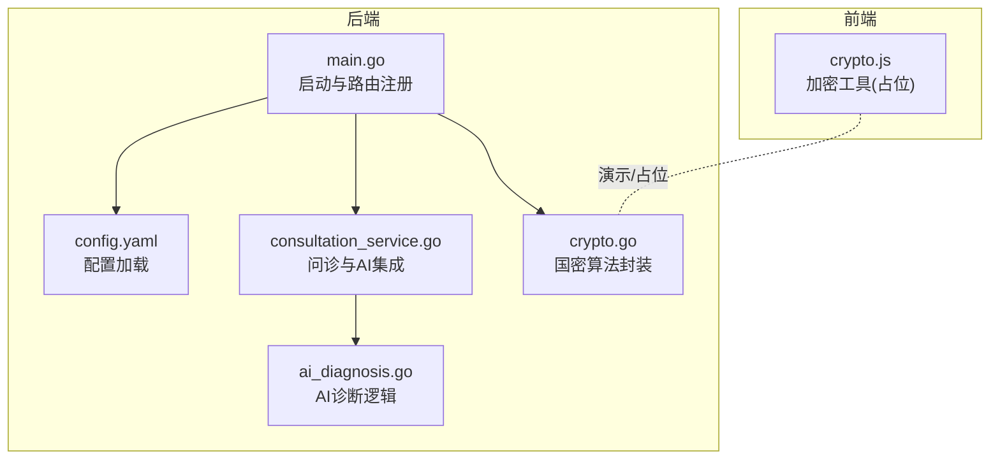
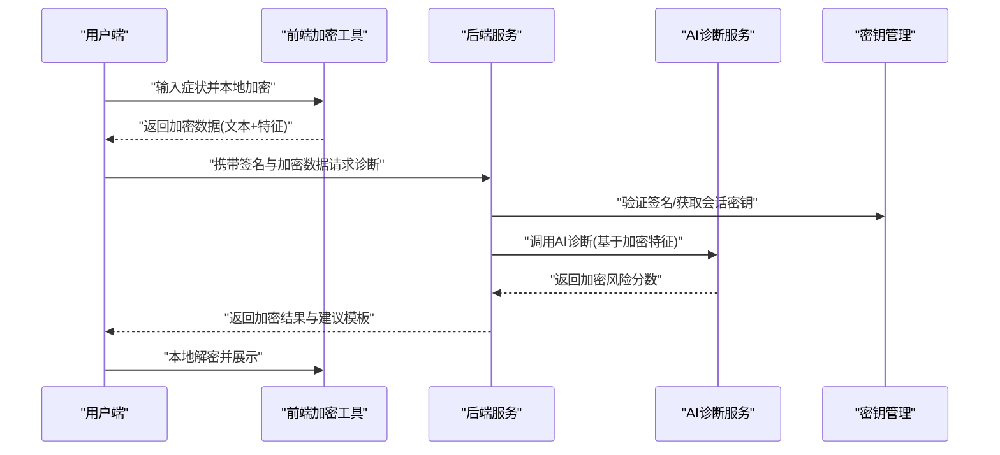
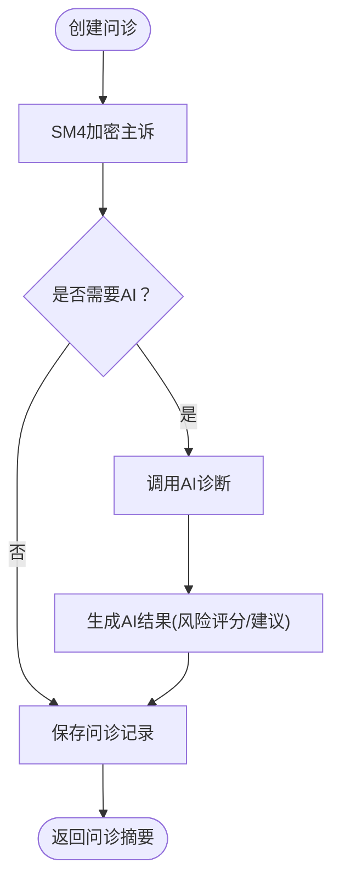
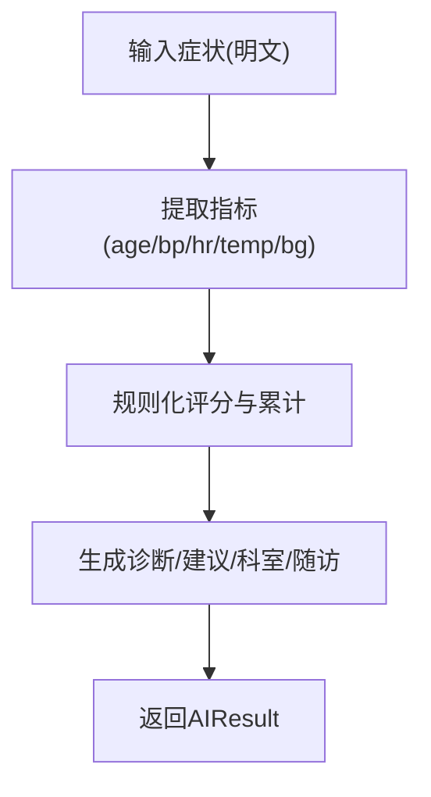
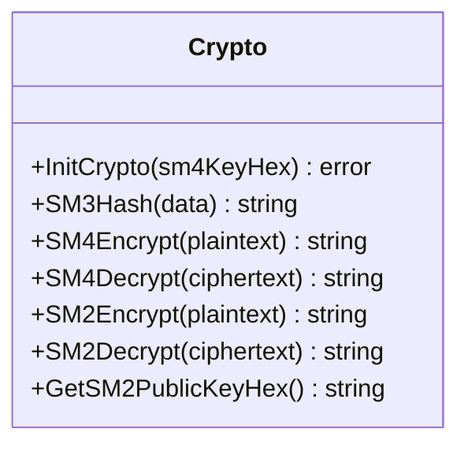
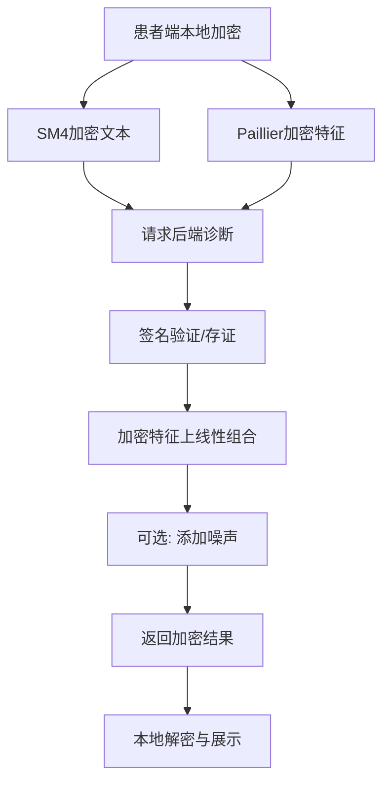
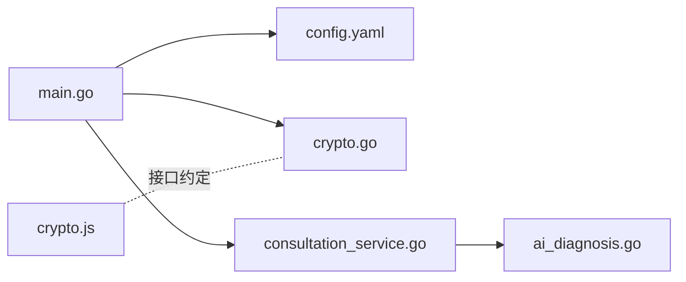

# Paillier同态加密

<cite>
**本文引用的文件**
- [main.go](file://backed/cmd/main.go)
- [config.yaml](file://backed/config/config.yaml)
- [consultation_service.go](file://backed/internal/service/consultation_service.go)
- [ai_diagnosis.go](file://backed/internal/service/ai_diagnosis.go)
- [crypto.go](file://backed/internal/crypto/crypto.go)
- [crypto.js](file://fonted/utils/crypto.js)
- [规划.md](file://规划.md)
</cite>

## 目录
1. [简介](#简介)
2. [项目结构](#项目结构)
3. [核心组件](#核心组件)
4. [架构总览](#架构总览)
5. [组件深度解析](#组件深度解析)
6. [依赖关系分析](#依赖关系分析)
7. [性能考量](#性能考量)
8. [故障排查指南](#故障排查指南)
9. [结论](#结论)
10. [附录](#附录)

## 简介
本文件面向“Paillier同态加密在AI智能诊断服务中的隐私保护应用”，结合仓库现有代码与设计文档，系统阐述如下要点：
- Paillier加法同态特性：在密文上直接进行线性组合（如症状权重求和），无需解密，从而在AI推理过程中保护用户健康数据的机密性。
- 端到端隐私保护流程：用户端或可信环境对输入数据进行Paillier加密；通过SM4加密的文本通道传输；AI服务端在加密状态下完成模型推理；最终将加密结果返回，由用户在本地解密并展示。
- 密钥管理与参数选择：SM2密钥对用于身份认证与会话密钥封装；SM4密钥用于数据传输加密；Paillier公钥用于AI计算；SM3用于数据完整性校验。
- 性能开销与优化：Paillier加解密与模幂运算成本较高，可通过批处理、预计算、缓存等手段优化；与国密算法协同使用（Paillier用于AI计算，SM4用于传输）。
- 实际部署挑战：算法集成、密钥安全、前后端一致性、性能与可用性的平衡。

## 项目结构
后端采用Go语言，按领域分层组织；前端使用uni-app（H5），提供加密工具与界面。核心模块包括：
- 后端入口与配置加载：main.go、config.yaml
- 业务服务：consultation_service.go（问诊与AI诊断集成）、ai_diagnosis.go（AI诊断逻辑）
- 国密算法封装：crypto.go（SM2/SM3/SM4）
- 前端加密工具：crypto.js（SM3/SM2/SM4占位实现）

图表来源
- [main.go](file://backed/cmd/main.go#L1-L64)
- [config.yaml](file://backed/config/config.yaml#L1-L37)
- [consultation_service.go](file://backed/internal/service/consultation_service.go#L1-L120)
- [ai_diagnosis.go](file://backed/internal/service/ai_diagnosis.go#L1-L60)
- [crypto.go](file://backed/internal/crypto/crypto.go#L1-L60)
- [crypto.js](file://fonted/utils/crypto.js#L1-L40)

章节来源
- [main.go](file://backed/cmd/main.go#L1-L64)
- [config.yaml](file://backed/config/config.yaml#L1-L37)

## 核心组件
- 问诊服务：负责创建问诊、调用AI诊断、加密/解密主诉与症状、生成病历与摘要。
- AI诊断服务：基于症状提取风险评分、生成诊断建议、推荐科室与随访建议。
- 国密算法封装：SM2/SM3/SM4，提供初始化、加解密与公钥导出。
- 前端加密工具：提供SM3/SM2/SM4接口占位，便于演示与后续替换为真实实现。

章节来源
- [consultation_service.go](file://backed/internal/service/consultation_service.go#L1-L120)
- [ai_diagnosis.go](file://backed/internal/service/ai_diagnosis.go#L1-L60)
- [crypto.go](file://backed/internal/crypto/crypto.go#L1-L60)
- [crypto.js](file://fonted/utils/crypto.js#L1-L40)

## 架构总览
下图展示从用户输入症状到AI诊断、再到结果返回与本地解密的端到端流程。该流程与设计文档一致，强调“全程密文”与“AI计算不接触明文”。

图表来源
- [consultation_service.go](file://backed/internal/service/consultation_service.go#L28-L86)
- [ai_diagnosis.go](file://backed/internal/service/ai_diagnosis.go#L1-L60)
- [规划.md](file://规划.md#L74-L120)

章节来源
- [consultation_service.go](file://backed/internal/service/consultation_service.go#L28-L86)
- [ai_diagnosis.go](file://backed/internal/service/ai_diagnosis.go#L1-L60)
- [规划.md](file://规划.md#L74-L120)

## 组件深度解析

### 问诊与AI诊断集成
- 创建问诊时，主诉使用SM4加密；症状序列化后保存为加密文本；若开启AI，则调用AI诊断逻辑生成风险评分与建议。
- 问诊详情与列表页对SM4加密数据进行解密展示；AI结果在数据库中以明文字段存储（风险评分、诊断、建议等）。
- 完成问诊后自动创建加密病历，使用SM3对关键数据生成哈希，确保数据完整性。

图表来源
- [consultation_service.go](file://backed/internal/service/consultation_service.go#L28-L86)

章节来源
- [consultation_service.go](file://backed/internal/service/consultation_service.go#L28-L86)

### AI诊断逻辑（明文评分）
- 该模块目前在明文环境下进行症状评分与建议生成，包含年龄、血压、心率、体温、血糖等指标的规则化处理与风险累计。
- 该实现为过渡形态，后续将迁移到“加密特征上的同态计算”。

图表来源
- [ai_diagnosis.go](file://backed/internal/service/ai_diagnosis.go#L1-L60)

章节来源
- [ai_diagnosis.go](file://backed/internal/service/ai_diagnosis.go#L1-L60)

### 国密算法封装（SM2/SM3/SM4）
- SM4：提供ECB模式的加解密与Hex编码转换，用于传输加密与病历加密。
- SM2：生成密钥对、公私钥导出、加解密接口，用于会话密钥封装与签名验证。
- SM3：哈希接口，用于数据完整性校验与签名材料。

图表来源
- [crypto.go](file://backed/internal/crypto/crypto.go#L1-L121)

章节来源
- [crypto.go](file://backed/internal/crypto/crypto.go#L1-L121)

### 前端加密工具（占位）
- 前端crypto.js提供SM3/SM2/SM4接口占位，便于演示与联调；实际项目中应替换为真实国密实现。
- 建议在前端完成“症状文本SM4加密 + 特征Paillier加密”的本地处理，再统一签名后提交后端。

章节来源
- [crypto.js](file://fonted/utils/crypto.js#L1-L40)

### 设计文档中的Paillier同态流程
- 患者端本地加密：症状文本使用SM4会话密钥加密；特征向量使用Paillier公钥加密。
- 后端安全计算代理：验证签名、记录存证；在加密特征上进行线性组合（加权求和）得到加密风险分数；可选加入差分隐私噪声。
- 结果返回与本地解密：后端返回加密分数与建议模板；患者端本地解密并进行阈值判断与展示。

图表来源
- [规划.md](file://规划.md#L74-L120)
- [规划.md](file://规划.md#L122-L173)
- [规划.md](file://规划.md#L174-L207)
- [规划.md](file://规划.md#L230-L267)

章节来源
- [规划.md](file://规划.md#L74-L120)
- [规划.md](file://规划.md#L122-L173)
- [规划.md](file://规划.md#L174-L207)
- [规划.md](file://规划.md#L230-L267)

## 依赖关系分析
- 后端入口main.go负责加载配置、初始化国密、注册路由并启动HTTP服务。
- 问诊服务依赖国密模块进行数据加解密；AI诊断逻辑作为独立函数被问诊服务调用。
- 前端crypto.js与后端crypto.go在接口层面保持一致，便于替换真实实现。

图表来源
- [main.go](file://backed/cmd/main.go#L1-L64)
- [config.yaml](file://backed/config/config.yaml#L1-L37)
- [consultation_service.go](file://backed/internal/service/consultation_service.go#L1-L120)
- [ai_diagnosis.go](file://backed/internal/service/ai_diagnosis.go#L1-L60)
- [crypto.go](file://backed/internal/crypto/crypto.go#L1-L60)
- [crypto.js](file://fonted/utils/crypto.js#L1-L40)

章节来源
- [main.go](file://backed/cmd/main.go#L1-L64)
- [consultation_service.go](file://backed/internal/service/consultation_service.go#L1-L120)

## 性能考量
- Paillier计算成本：模幂运算与大整数乘法开销显著，尤其在特征维度较高时。
- 优化策略：
  - 批处理加密：一次性加密多个特征，减少重复模幂次数。
  - 预计算与缓存：对常用权重与偏置进行预计算；缓存相似症状的加密结果。
  - 并行化：利用多核并行加速加密/解密与线性组合。
  - 参数裁剪：降低特征维度或量化特征值，减少同态计算复杂度。
  - 与SM4协同：传输阶段使用SM4，计算阶段使用Paillier，避免在传输阶段引入同态开销。
- 与国密算法协同：
  - SM2用于会话密钥封装与签名验证；
  - SM4用于传输与存储加密；
  - SM3用于完整性校验与签名材料；
  - Paillier用于AI计算阶段的隐私保护。

章节来源
- [规划.md](file://规划.md#L580-L650)

## 故障排查指南
- 启动与配置
  - 确认配置文件中的SM4密钥格式正确且长度符合要求。
  - 检查后端启动日志，确认Crypto初始化成功。
- 数据加解密
  - 若SM4加解密失败，检查密钥Hex编码与长度；确认前后端密钥一致。
  - 若SM2加解密失败，检查公私钥生成与导出流程。
- 传输与签名
  - 前端应使用真实国密实现替换占位函数；签名验证失败会导致后端拒绝请求。
- AI诊断
  - 当前AI模块在明文环境下运行；若迁移至同态计算，需确保特征向量与权重均为Paillier密文，且线性组合遵循同态性质。

章节来源
- [main.go](file://backed/cmd/main.go#L1-L64)
- [config.yaml](file://backed/config/config.yaml#L1-L37)
- [crypto.go](file://backed/internal/crypto/crypto.go#L1-L121)
- [crypto.js](file://fonted/utils/crypto.js#L1-L40)

## 结论
本项目在现有阶段已具备完善的国密算法基础与端到端流程框架。Paillier同态加密的应用将使AI诊断在“不接触明文”的前提下完成隐私保护计算，显著提升用户健康数据的安全性。建议在后续版本中：
- 将AI诊断逻辑迁移至加密特征上的同态计算；
- 引入Paillier库与密钥管理流程；
- 优化批处理、预计算与缓存策略；
- 在前端替换为真实国密实现，确保端到端一致性与安全性。

## 附录

### 同态计算伪示例（概念性）
以下为“在加密特征上进行线性组合”的伪示例，体现Paillier加法同态的核心思想（不对应具体代码）：
- 输入：加密特征向量E(x1), E(x2), ..., E(xn)，明文权重w1, w2, ..., wn，明文偏置b。
- 步骤：
  - 计算E(x1)^w1，E(x2)^w2，...，E(xn)^wn（模n^2意义下）。
  - 将上述结果相乘得到E(sum)，再乘以E(b)得到E(sum+b)。
  - 返回E(sum+b)作为加密风险分数。

章节来源
- [规划.md](file://规划.md#L122-L173)