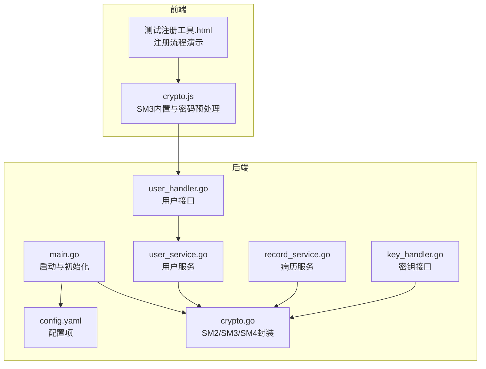
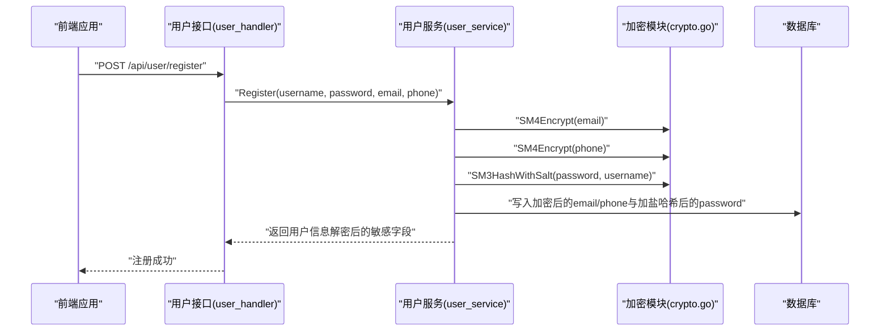
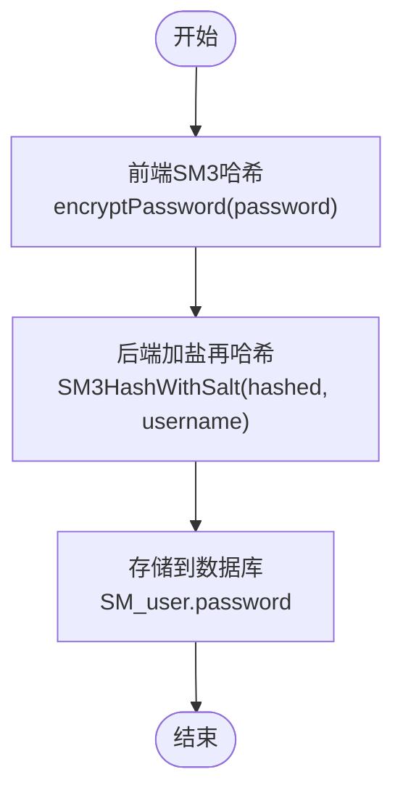
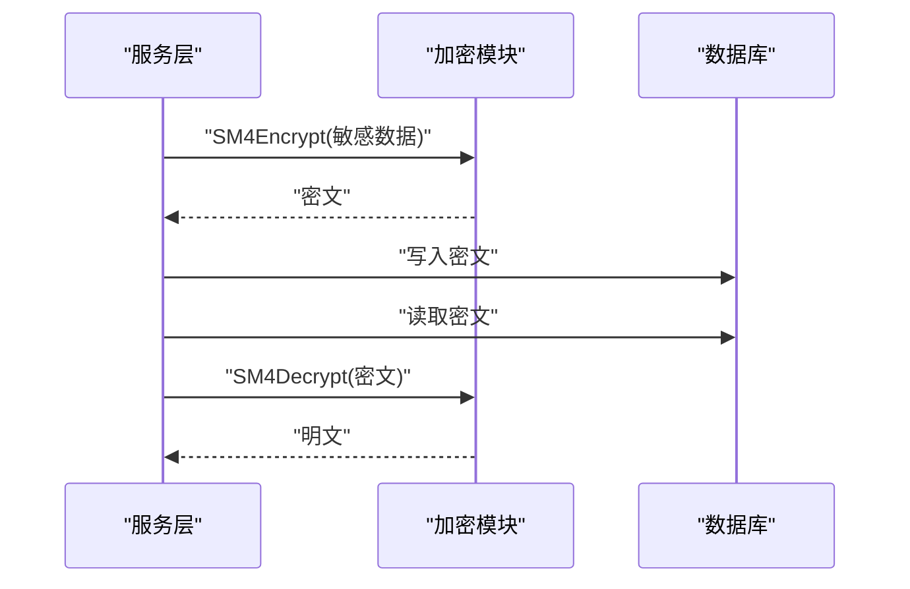
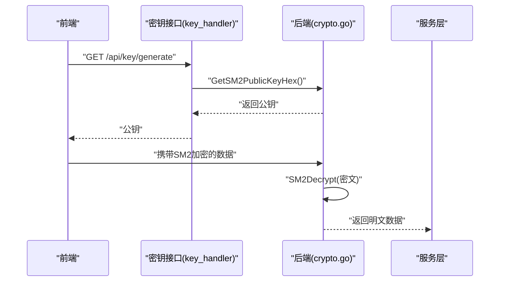
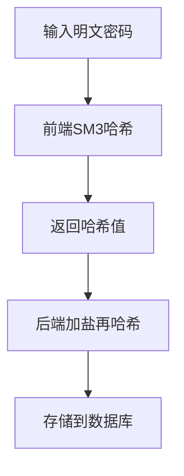
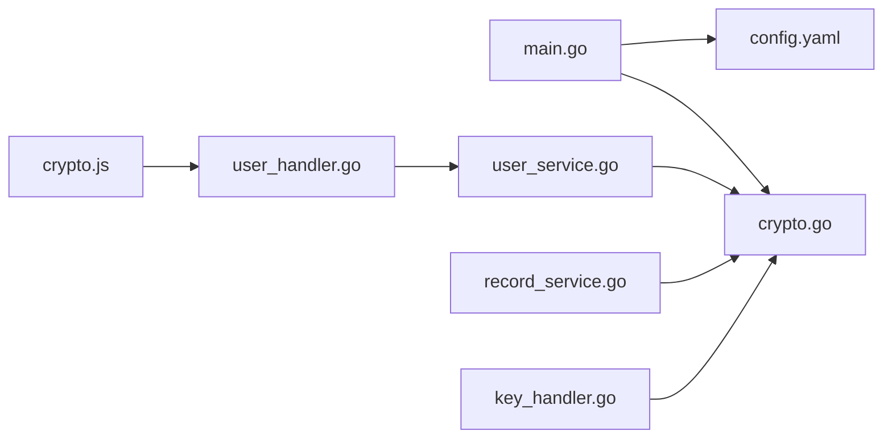

# SM2/SM3/SM4实现

<cite>
**本文引用的文件**
- [crypto.go](file://backed/internal/crypto/crypto.go)
- [main.go](file://backed/cmd/main.go)
- [config.yaml](file://backed/config/config.yaml)
- [user_service.go](file://backed/internal/service/user_service.go)
- [record_service.go](file://backed/internal/service/record_service.go)
- [user_handler.go](file://backed/internal/api/handler/user_handler.go)
- [key_handler.go](file://backed/internal/api/handler/key_handler.go)
- [crypto.js](file://fonted/utils/crypto.js)
- [hash_password.go](file://backed/tools/hash_password.go)
- [测试注册工具.html](file://测试注册工具.html)
- [SM_user_module.sql](file://database/SM_user_module.sql)
- [init.sql](file://backed/init.sql)
- [开发文档.md](file://开发文档.md)
- [规划.md](file://规划.md)
</cite>

## 目录
1. [引言](#引言)
2. [项目结构](#项目结构)
3. [核心组件](#核心组件)
4. [架构总览](#架构总览)
5. [详细组件分析](#详细组件分析)
6. [依赖关系分析](#依赖关系分析)
7. [性能与安全特性](#性能与安全特性)
8. [故障排查指南](#故障排查指南)
9. [结论](#结论)
10. [附录](#附录)

## 引言
本文件围绕系统中SM2、SM3、SM4三类国密算法的具体实现与应用展开，重点覆盖：
- SM3哈希在用户密码存储中的加盐哈希处理流程（含前端SM3与后端加盐再哈希的协同机制）
- SM4对称加密在ECB模式下的敏感数据加密逻辑，以及在用户信息、问诊与病历等场景中的使用
- SM2非对称加密在密钥对生成、公钥分发与前后端安全通信中的作用
- 结合前端crypto.js，说明其内置SM3实现与密码预处理流程，并对比前后端加密协同机制
- 提供实际调用示例与最佳实践，明确当前前端SM2/SM4为模拟实现，集成真实国密库的注意事项

## 项目结构
后端采用Go语言，前端采用uni-app（Vue生态）。加密相关代码主要分布在：
- 后端：crypto.go提供SM2/SM3/SM4封装；main.go负责初始化；服务层在用户与病历模块中使用加密能力
- 前端：crypto.js提供SM3内置实现与密码预处理；测试工具.html演示注册流程

图表来源
- [main.go](file://backed/cmd/main.go#L1-L64)
- [config.yaml](file://backed/config/config.yaml#L1-L37)
- [crypto.go](file://backed/internal/crypto/crypto.go#L1-L121)
- [user_service.go](file://backed/internal/service/user_service.go#L1-L331)
- [record_service.go](file://backed/internal/service/record_service.go#L1-L137)
- [user_handler.go](file://backed/internal/api/handler/user_handler.go#L1-L261)
- [key_handler.go](file://backed/internal/api/handler/key_handler.go#L1-L24)
- [crypto.js](file://fonted/utils/crypto.js#L1-L255)
- [测试注册工具.html](file://测试注册工具.html#L267-L302)

章节来源
- [main.go](file://backed/cmd/main.go#L1-L64)
- [config.yaml](file://backed/config/config.yaml#L1-L37)

## 核心组件
- SM3哈希（SM3Hash、SM3HashWithSalt）：后端密码存储采用“前端一次SM3 + 后端加盐再哈希”的双重保护策略
- SM4对称加密（SM4Encrypt/SM4Decrypt）：在ECB模式下对敏感数据进行加密存储与解密展示
- SM2非对称加密（SM2Encrypt/SM2Decrypt）：密钥对生成、公钥分发与前后端通信中的数据保护
- 前端SM3（crypto.js）：内置SM3实现与密码预处理（encryptPassword）

章节来源
- [crypto.go](file://backed/internal/crypto/crypto.go#L1-L121)
- [user_service.go](file://backed/internal/service/user_service.go#L1-L331)
- [record_service.go](file://backed/internal/service/record_service.go#L1-L137)
- [crypto.js](file://fonted/utils/crypto.js#L1-L255)

## 架构总览
后端在启动时从配置加载SM4密钥并生成SM2密钥对；服务层在用户注册、登录、信息更新、病历读取等环节调用加密函数；前端通过公钥加密敏感数据，后端使用私钥解密。

图表来源
- [user_handler.go](file://backed/internal/api/handler/user_handler.go#L1-L261)
- [user_service.go](file://backed/internal/service/user_service.go#L1-L331)
- [crypto.go](file://backed/internal/crypto/crypto.go#L1-L121)

## 详细组件分析

### SM3哈希：密码存储的加盐再哈希
- 前端一次SM3：前端crypto.js提供sm3Hash与encryptPassword，将明文密码转换为SM3哈希值
- 后端加盐再哈希：后端使用SM3HashWithSalt，将前端哈希值与用户名拼接后再次SM3，得到最终存储值
- 存储策略：数据库SM_user.password字段存储后端加盐哈希结果

图表来源
- [crypto.js](file://fonted/utils/crypto.js#L1-L255)
- [user_service.go](file://backed/internal/service/user_service.go#L1-L331)
- [crypto.go](file://backed/internal/crypto/crypto.go#L1-L121)
- [SM_user_module.sql](file://database/SM_user_module.sql#L124-L174)

章节来源
- [crypto.js](file://fonted/utils/crypto.js#L1-L255)
- [user_service.go](file://backed/internal/service/user_service.go#L1-L331)
- [crypto.go](file://backed/internal/crypto/crypto.go#L1-L121)
- [SM_user_module.sql](file://database/SM_user_module.sql#L124-L174)
- [开发文档.md](file://开发文档.md#L1-L67)

### SM4对称加密：ECB模式下的敏感数据保护
- ECB模式：SM4Encrypt/SM4Decrypt在ECB模式下对敏感数据进行加解密
- 使用场景：
  - 用户注册/登录：邮箱、手机号、真实姓名、登录IP等敏感字段均以SM4加密存储
  - 病历读取：医生/患者查看病历时，对主诉、诊断、治疗方案等字段进行解密展示
- 注意事项：ECB模式安全性较低，建议在生产中迁移到CBC/GCM等更安全模式并引入IV与完整性校验

图表来源
- [user_service.go](file://backed/internal/service/user_service.go#L1-L331)
- [record_service.go](file://backed/internal/service/record_service.go#L1-L137)
- [crypto.go](file://backed/internal/crypto/crypto.go#L1-L121)

章节来源
- [user_service.go](file://backed/internal/service/user_service.go#L1-L331)
- [record_service.go](file://backed/internal/service/record_service.go#L1-L137)
- [init.sql](file://backed/init.sql#L195-L239)

### SM2非对称加密：密钥对生成与公钥分发
- 密钥对生成：InitCrypto从配置加载SM4密钥并生成SM2密钥对
- 公钥分发：GetSM2PublicKeyHex导出公钥（X、Y坐标拼接的十六进制串）
- 前后端通信：前端使用公钥加密敏感数据，后端使用私钥解密
- 当前前端SM2/SM4为模拟实现，集成真实国密库时需替换前端加密/解密函数

图表来源
- [key_handler.go](file://backed/internal/api/handler/key_handler.go#L1-L24)
- [crypto.go](file://backed/internal/crypto/crypto.go#L1-L121)
- [main.go](file://backed/cmd/main.go#L1-L64)
- [config.yaml](file://backed/config/config.yaml#L1-L37)

章节来源
- [key_handler.go](file://backed/internal/api/handler/key_handler.go#L1-L24)
- [crypto.go](file://backed/internal/crypto/crypto.go#L1-L121)
- [main.go](file://backed/cmd/main.go#L1-L64)
- [config.yaml](file://backed/config/config.yaml#L1-L37)

### 前端SM3内置实现与密码预处理
- sm3Hash：基于sm-crypto库的SM3实现，也可参考crypto.js内嵌的SM3算法实现
- encryptPassword：前端一次SM3哈希，返回64位十六进制哈希值，后端再加盐哈希
- 密码强度校验：前端提供基础强度规则（长度、字符类型），建议后端也进行严格校验

图表来源
- [crypto.js](file://fonted/utils/crypto.js#L1-L255)
- [测试注册工具.html](file://测试注册工具.html#L267-L302)
- [hash_password.go](file://backed/tools/hash_password.go#L1-L63)

章节来源
- [crypto.js](file://fonted/utils/crypto.js#L1-L255)
- [测试注册工具.html](file://测试注册工具.html#L267-L302)
- [hash_password.go](file://backed/tools/hash_password.go#L1-L63)

## 依赖关系分析
- 后端启动依赖配置加载与加密模块初始化
- 服务层在多个业务流程中依赖加密模块
- 前端通过接口获取公钥，使用内置SM3进行密码预处理

图表来源
- [main.go](file://backed/cmd/main.go#L1-L64)
- [config.yaml](file://backed/config/config.yaml#L1-L37)
- [crypto.go](file://backed/internal/crypto/crypto.go#L1-L121)
- [user_service.go](file://backed/internal/service/user_service.go#L1-L331)
- [record_service.go](file://backed/internal/service/record_service.go#L1-L137)
- [user_handler.go](file://backed/internal/api/handler/user_handler.go#L1-L261)
- [key_handler.go](file://backed/internal/api/handler/key_handler.go#L1-L24)
- [crypto.js](file://fonted/utils/crypto.js#L1-L255)

章节来源
- [main.go](file://backed/cmd/main.go#L1-L64)
- [crypto.go](file://backed/internal/crypto/crypto.go#L1-L121)
- [user_service.go](file://backed/internal/service/user_service.go#L1-L331)
- [record_service.go](file://backed/internal/service/record_service.go#L1-L137)
- [user_handler.go](file://backed/internal/api/handler/user_handler.go#L1-L261)
- [key_handler.go](file://backed/internal/api/handler/key_handler.go#L1-L24)
- [crypto.js](file://fonted/utils/crypto.js#L1-L255)

## 性能与安全特性
- SM3：哈希计算开销低，适合密码预处理与完整性校验
- SM4 ECB：实现简单、性能较好，但易受重放与统计分析攻击，建议迁移至CBC/GCM并引入IV与完整性标签
- SM2：非对称加密适合密钥交换与小量数据加密，建议配合对称加密使用
- 安全边界：前端模拟实现（SM2/SM4）仅用于演示，生产需集成真实国密库；后端应严格校验输入、最小化暴露面、定期轮换密钥

[本节为通用指导，无需列出章节来源]

## 故障排查指南
- 启动失败：检查配置文件中的SM4密钥格式与长度，确认InitCrypto能正确解码
- 登录失败：核对前端是否正确执行一次SM3哈希，后端是否使用用户名作为盐进行加盐再哈希
- 数据解密异常：确认SM4密钥一致且数据确为SM4加密；若迁移模式，需同步前后端加密/解密模式
- 前端SM2/SM4模拟问题：集成真实国密库后，替换前端加密/解密函数并保持与后端一致的填充与编码规范

章节来源
- [config.yaml](file://backed/config/config.yaml#L1-L37)
- [main.go](file://backed/cmd/main.go#L1-L64)
- [crypto.go](file://backed/internal/crypto/crypto.go#L1-L121)
- [user_service.go](file://backed/internal/service/user_service.go#L1-L331)
- [record_service.go](file://backed/internal/service/record_service.go#L1-L137)

## 结论
本系统在用户密码存储、敏感数据保护与前后端安全通信方面，形成了“前端一次SM3 + 后端加盐再哈希 + SM4对称加密 + SM2非对称加密”的协同体系。当前前端SM2/SM4为模拟实现，建议尽快集成真实国密库以满足生产安全要求；同时优化SM4模式与完整性校验，提升整体安全性与鲁棒性。

[本节为总结性内容，无需列出章节来源]

## 附录

### 实际调用示例（用户注册）
- 前端：调用encryptPassword(password)，得到SM3哈希值
- 后端：在注册接口中，先对邮箱/手机号进行SM4加密，再对密码执行SM3加盐再哈希，最后写入数据库

章节来源
- [user_handler.go](file://backed/internal/api/handler/user_handler.go#L1-L261)
- [user_service.go](file://backed/internal/service/user_service.go#L1-L331)
- [crypto.js](file://fonted/utils/crypto.js#L1-L255)
- [测试注册工具.html](file://测试注册工具.html#L267-L302)

### 数据模型与字段标注
- 用户表：password字段使用SM3加盐哈希；email、phone、real_name、last_login_ip等使用SM4加密
- 病历表：主诉、诊断、治疗方案等字段使用SM4加密；data_hash使用SM3计算完整性哈希

章节来源
- [SM_user_module.sql](file://database/SM_user_module.sql#L124-L174)
- [init.sql](file://backed/init.sql#L195-L239)
- [开发文档.md](file://开发文档.md#L1-L67)

### SM9与属性基加密（扩展思路）
- 规划中提及SM9属性基加密用于病历访问控制，体现细粒度权限管理与数据隔离的设计理念

章节来源
- [规划.md](file://规划.md#L339-L367)