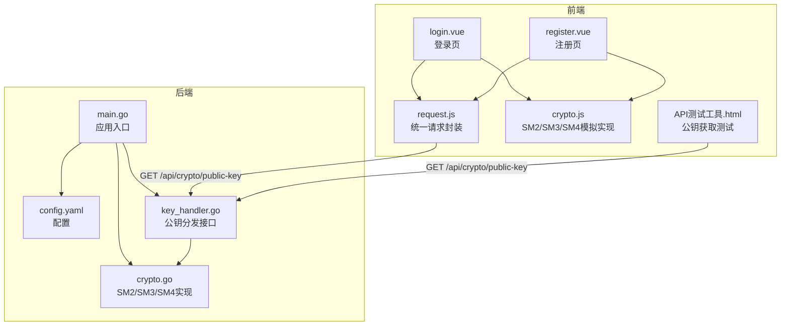
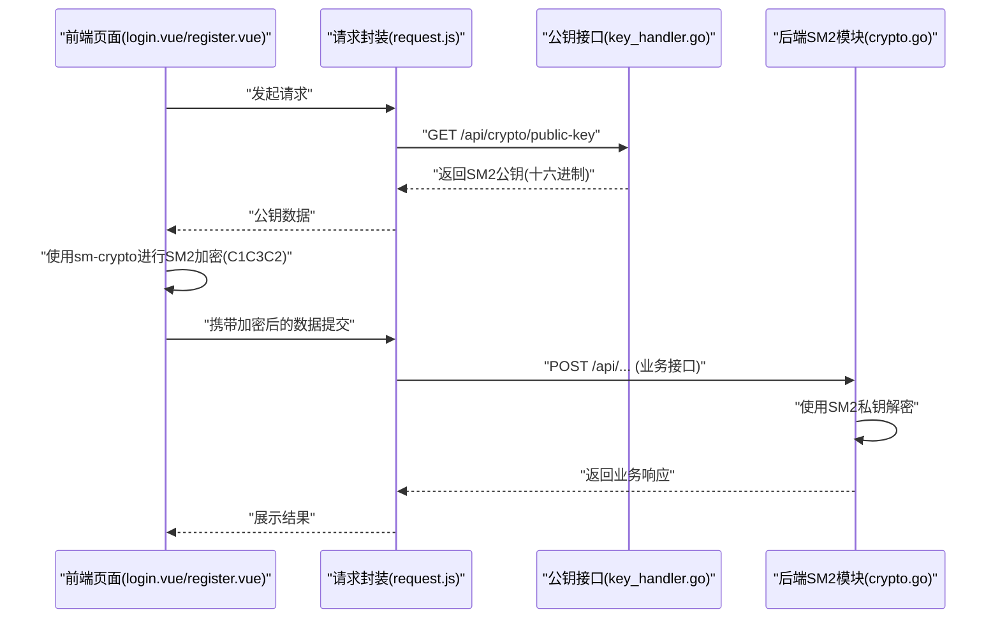
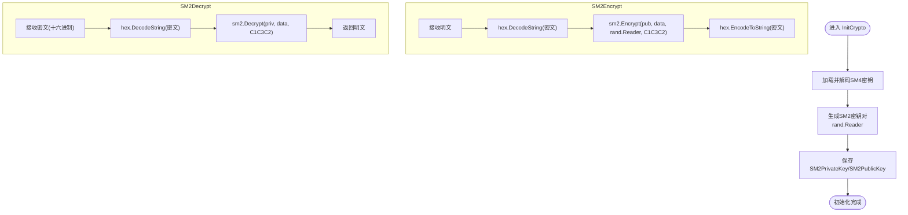
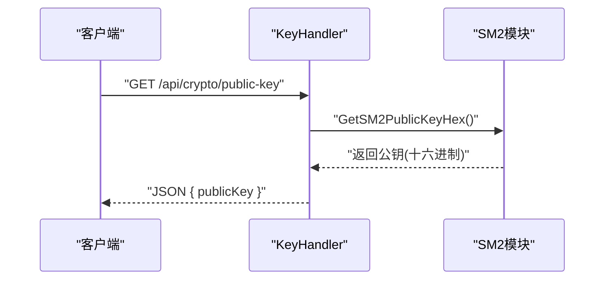
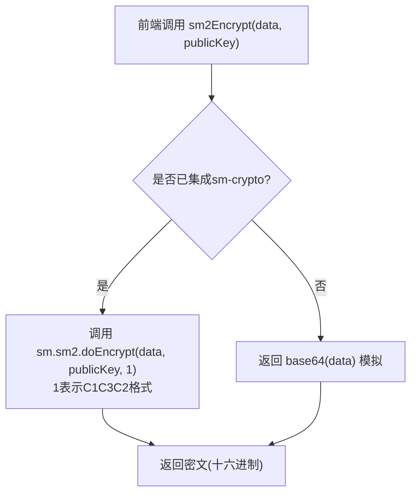
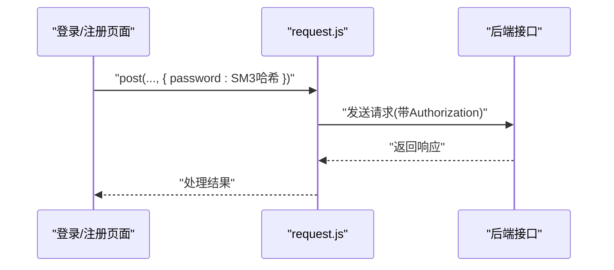
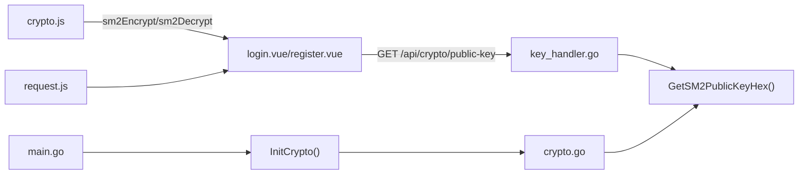

# SM2实现

<cite>
**本文引用的文件列表**
- [crypto.go](file://backed/internal/crypto/crypto.go)
- [main.go](file://backed/cmd/main.go)
- [config.yaml](file://backed/config/config.yaml)
- [key_handler.go](file://backed/internal/api/handler/key_handler.go)
- [crypto.js](file://fonted/utils/crypto.js)
- [request.js](file://fonted/utils/request.js)
- [login.vue](file://fonted/pages/login/login.vue)
- [register.vue](file://fonted/pages/register/register.vue)
- [API测试工具.html](file://API测试工具.html)
</cite>

## 目录
1. [简介](#简介)
2. [项目结构](#项目结构)
3. [核心组件](#核心组件)
4. [架构总览](#架构总览)
5. [详细组件分析](#详细组件分析)
6. [依赖关系分析](#依赖关系分析)
7. [性能考量](#性能考量)
8. [故障排查指南](#故障排查指南)
9. [结论](#结论)
10. [附录](#附录)

## 简介
本文件围绕系统中SM2非对称加密算法的实现进行深入解析，重点覆盖后端crypto.go中的密钥对生成、公钥分发、SM2加密与解密流程；同时结合前端crypto.js现状，说明当前SM2仅以base64模拟实现，强调在生产部署中需集成sm-crypto等真实国密库的重要性。文档还给出SM2在前后端安全通信中的典型场景、协作模式与密钥管理策略，并总结SM2在身份认证与数据机密性保护方面的安全优势与性能开销。

## 项目结构
系统采用前后端分离架构：
- 后端（Go）负责SM2密钥生成、SM2加解密、SM3哈希、SM4对称加密以及HTTP路由与API暴露。
- 前端（Vue/UniApp）负责用户交互、请求封装、密码SM3哈希与SM2/SM4的模拟实现（当前为base64模拟）。

图表来源
- [main.go](file://backed/cmd/main.go#L1-L64)
- [config.yaml](file://backed/config/config.yaml#L1-L37)
- [crypto.go](file://backed/internal/crypto/crypto.go#L1-L121)
- [key_handler.go](file://backed/internal/api/handler/key_handler.go#L1-L24)
- [request.js](file://fonted/utils/request.js#L1-L222)
- [crypto.js](file://fonted/utils/crypto.js#L1-L255)
- [login.vue](file://fonted/pages/login/login.vue#L1-L406)
- [register.vue](file://fonted/pages/register/register.vue#L1-L360)
- [API测试工具.html](file://API测试工具.html#L309-L375)

章节来源
- [main.go](file://backed/cmd/main.go#L1-L64)
- [config.yaml](file://backed/config/config.yaml#L1-L37)

## 核心组件
- 后端SM2模块（crypto.go）：提供SM2密钥生成、SM2加密/解密、SM3哈希、SM4加解密与公钥导出功能。
- 公钥分发接口（key_handler.go）：对外暴露公钥获取API，供前端采集。
- 前端加密工具（crypto.js）：当前为base64模拟实现，标注了集成sm-crypto的真实实现路径。
- 请求封装（request.js）：统一处理鉴权、错误处理与文件上传参数。
- 登录/注册页面（login.vue、register.vue）：演示密码SM3哈希与后续SM2/SM4集成的协作方式。
- 公钥获取测试（API测试工具.html）：演示前端如何通过后端接口获取SM2公钥。

章节来源
- [crypto.go](file://backed/internal/crypto/crypto.go#L1-L121)
- [key_handler.go](file://backed/internal/api/handler/key_handler.go#L1-L24)
- [crypto.js](file://fonted/utils/crypto.js#L1-L255)
- [request.js](file://fonted/utils/request.js#L1-L222)
- [login.vue](file://fonted/pages/login/login.vue#L1-L406)
- [register.vue](file://fonted/pages/register/register.vue#L1-L360)
- [API测试工具.html](file://API测试工具.html#L309-L375)

## 架构总览
后端在启动时初始化国密算法，生成SM2密钥对并缓存；前端通过HTTP接口获取公钥，随后使用sm-crypto进行SM2加密（C1C3C2格式），再将密文提交至后端。后端使用自身SM2私钥解密，配合SM3哈希与SM4对称加密，形成完整的安全通信链路。

图表来源
- [key_handler.go](file://backed/internal/api/handler/key_handler.go#L1-L24)
- [crypto.go](file://backed/internal/crypto/crypto.go#L1-L121)
- [request.js](file://fonted/utils/request.js#L1-L222)
- [login.vue](file://fonted/pages/login/login.vue#L1-L406)
- [register.vue](file://fonted/pages/register/register.vue#L1-L360)

## 详细组件分析

### 后端SM2模块（crypto.go）
- 密钥生成（InitCrypto）
  - 从配置加载SM4密钥并解码。
  - 使用随机数生成器生成SM2密钥对，保存私钥与公钥指针。
- SM2加密（SM2Encrypt）
  - 输入明文，使用SM2公钥与随机数生成器进行加密，采用C1C3C2密文格式，输出十六进制字符串。
- SM2解密（SM2Decrypt）
  - 输入十六进制密文，先解码，再使用SM2私钥按C1C3C2格式解密，输出明文。
- 公钥导出（GetSM2PublicKeyHex）
  - 将SM2公钥的X、Y坐标转换为十六进制拼接字符串，便于前端导入。

图表来源
- [crypto.go](file://backed/internal/crypto/crypto.go#L1-L121)

章节来源
- [crypto.go](file://backed/internal/crypto/crypto.go#L1-L121)

### 公钥分发接口（key_handler.go）
- 提供Generate接口，调用GetSM2PublicKeyHex返回SM2公钥（十六进制字符串），用于前端导入与加密。

图表来源
- [key_handler.go](file://backed/internal/api/handler/key_handler.go#L1-L24)
- [crypto.go](file://backed/internal/crypto/crypto.go#L114-L121)

章节来源
- [key_handler.go](file://backed/internal/api/handler/key_handler.go#L1-L24)
- [crypto.go](file://backed/internal/crypto/crypto.go#L114-L121)

### 前端加密工具（crypto.js）
- 当前状态
  - SM2/SM4加密/解密函数均为base64模拟，带有“请在实际项目中集成真正的SM2/SM4算法”的警告注释。
  - SM3哈希提供两种实现：基于sm-crypto库的内置实现与自定义SM3算法实现。
- 集成建议
  - 在实际项目中，替换base64模拟为sm-crypto提供的SM2/SM4实现，确保密文格式为C1C3C2。
  - 前端在登录/注册等敏感操作中，先获取后端公钥，再使用sm-crypto进行SM2加密，最后提交给后端。

图表来源
- [crypto.js](file://fonted/utils/crypto.js#L1-L255)

章节来源
- [crypto.js](file://fonted/utils/crypto.js#L1-L255)

### 前端请求与页面协作（request.js、login.vue、register.vue）
- 请求封装（request.js）
  - 统一设置Content-Type为application/json，自动注入Authorization头。
  - 支持文件上传并携带encrypt=true参数。
- 登录/注册页面（login.vue、register.vue）
  - 登录时对密码进行SM3哈希，随后可扩展为SM2加密（待前端集成sm-crypto）。
  - 注册时同样进行SM3哈希与密码强度校验。

图表来源
- [request.js](file://fonted/utils/request.js#L1-L222)
- [login.vue](file://fonted/pages/login/login.vue#L1-L406)
- [register.vue](file://fonted/pages/register/register.vue#L1-L360)

章节来源
- [request.js](file://fonted/utils/request.js#L1-L222)
- [login.vue](file://fonted/pages/login/login.vue#L1-L406)
- [register.vue](file://fonted/pages/register/register.vue#L1-L360)

### 公钥获取测试（API测试工具.html）
- 提供测试按钮，演示获取SM2公钥的流程，验证后端接口可用性。

章节来源
- [API测试工具.html](file://API测试工具.html#L309-L375)

## 依赖关系分析
- 后端依赖
  - crypto.go依赖国密库（SM2/SM3/SM4）与随机数生成器。
  - main.go在启动时调用InitCrypto初始化SM2密钥对。
  - key_handler.go依赖crypto.GetSM2PublicKeyHex导出公钥。
- 前端依赖
  - crypto.js依赖sm-crypto库（当前为模拟实现）。
  - request.js依赖全局API_BASE_URL与本地存储工具。
  - 登录/注册页面依赖request.js与crypto.js。

图表来源
- [main.go](file://backed/cmd/main.go#L1-L64)
- [crypto.go](file://backed/internal/crypto/crypto.go#L1-L121)
- [key_handler.go](file://backed/internal/api/handler/key_handler.go#L1-L24)
- [crypto.js](file://fonted/utils/crypto.js#L1-L255)
- [request.js](file://fonted/utils/request.js#L1-L222)
- [login.vue](file://fonted/pages/login/login.vue#L1-L406)
- [register.vue](file://fonted/pages/register/register.vue#L1-L360)

章节来源
- [main.go](file://backed/cmd/main.go#L1-L64)
- [crypto.go](file://backed/internal/crypto/crypto.go#L1-L121)
- [key_handler.go](file://backed/internal/api/handler/key_handler.go#L1-L24)
- [crypto.js](file://fonted/utils/crypto.js#L1-L255)
- [request.js](file://fonted/utils/request.js#L1-L222)
- [login.vue](file://fonted/pages/login/login.vue#L1-L406)
- [register.vue](file://fonted/pages/register/register.vue#L1-L360)

## 性能考量
- SM2加解密为非对称算法，性能开销高于SM4对称加密，适合小量数据或密钥材料传输。
- C1C3C2密文格式在SM2中具备良好的安全性与兼容性，但会增加密文长度。
- 建议在前后端混合使用：前端对敏感数据（如密码）进行SM2加密，后端对大体量数据采用SM4对称加密，以平衡安全与性能。
- 随机数生成器（rand.Reader）对SM2安全性至关重要，应确保系统熵源充足。

## 故障排查指南
- 后端SM2初始化失败
  - 检查配置文件中的SM4密钥格式是否为32位十六进制。
  - 确认InitCrypto调用顺序在路由注册之前。
- 公钥为空
  - 确认InitCrypto已成功执行且SM2PublicKey已赋值。
  - 前端调用GET /api/crypto/public-key时，后端是否返回公钥。
- 前端SM2模拟问题
  - 当前前端仅base64模拟，无法与后端真实SM2解密互通，需集成sm-crypto。
  - 若仍使用模拟实现，后端需相应调整解密逻辑（不推荐）。
- 密文格式不匹配
  - 确保前端使用C1C3C2格式，后端解密时也指定相同格式。
- 随机数问题
  - 若出现加密失败，检查rand.Reader可用性与系统熵源。

章节来源
- [config.yaml](file://backed/config/config.yaml#L1-L37)
- [main.go](file://backed/cmd/main.go#L1-L64)
- [crypto.go](file://backed/internal/crypto/crypto.go#L1-L121)
- [key_handler.go](file://backed/internal/api/handler/key_handler.go#L1-L24)
- [crypto.js](file://fonted/utils/crypto.js#L1-L255)

## 结论
本系统在后端实现了SM2密钥生成、公钥分发与SM2加解密（C1C3C2格式），并在配置层面预留了SM4密钥与SM3哈希能力。前端当前以base64模拟SM2/SM4，尚未接入真实国密库，存在安全风险。建议尽快集成sm-crypto，确保前后端一致的密文格式与安全强度。通过合理的前后端协作与密钥管理策略，SM2可在身份认证与数据机密性保护方面发挥重要作用。

## 附录

### SM2在前后端安全通信中的应用场景示例
- 敏感数据传输加密
  - 前端获取后端公钥后，使用sm-crypto对敏感字段（如密码、身份证号）进行SM2加密，再提交至后端。
  - 后端使用自身SM2私钥解密，再进行业务处理。
- 身份认证
  - 登录/注册时，前端对密码进行SM3哈希，后端再次加盐哈希，结合JWT令牌发放，提升抗重放与中间人攻击能力。
- 文件上传加密
  - 前端对文件内容或元数据进行SM2加密，后端解密后落库或处理。

### 前后端SM2集成协作模式与密钥管理策略
- 协作模式
  - 前端：获取公钥 → SM2加密 → 提交密文 → 接收明文响应。
  - 后端：启动时生成SM2密钥对 → 对外提供公钥 → 接收密文 → SM2解密 → 业务处理。
- 密钥管理
  - SM2私钥仅保存在后端内存中，避免泄露。
  - 公钥通过受控接口分发，限制访问范围与频率。
  - 生产环境定期轮换SM2密钥对，旧私钥及时销毁。
  - SM4密钥与JWT密钥同样遵循最小权限与定期轮换原则。