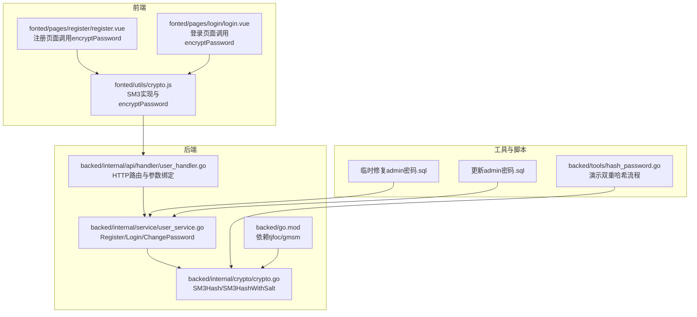
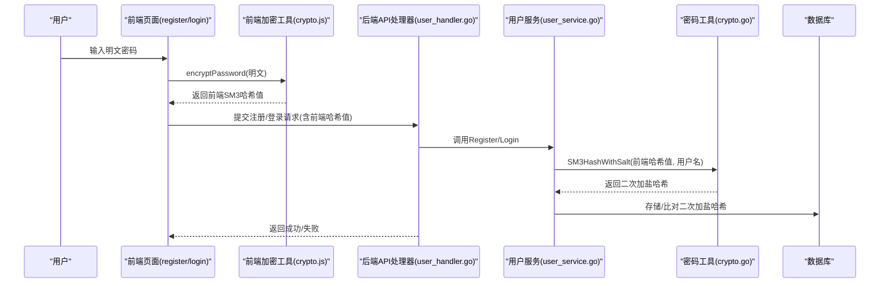
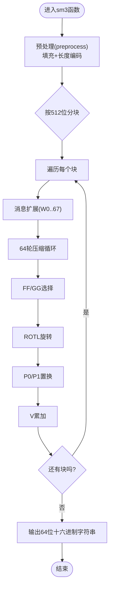
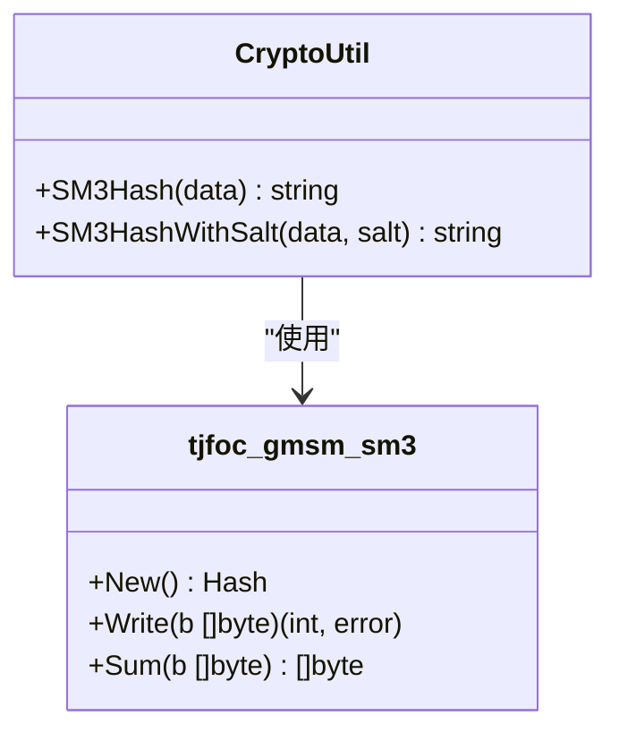
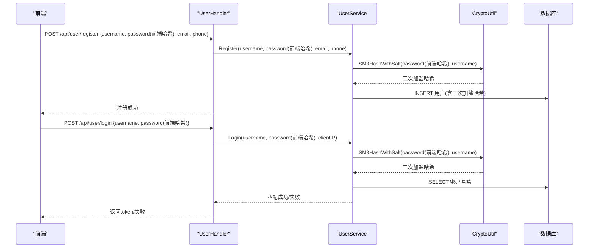
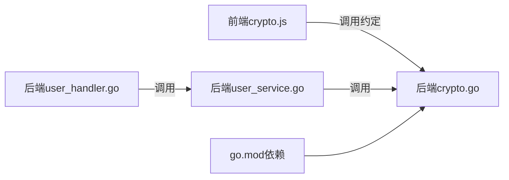

# SM3实现

<cite>
**本文引用的文件**
- [backed/internal/crypto/crypto.go](file://backed/internal/crypto/crypto.go)
- [fonted/utils/crypto.js](file://fonted/utils/crypto.js)
- [backed/internal/service/user_service.go](file://backed/internal/service/user_service.go)
- [backed/internal/api/handler/user_handler.go](file://backed/internal/api/handler/user_handler.go)
- [fonted/pages/register/register.vue](file://fonted/pages/register/register.vue)
- [fonted/pages/login/login.vue](file://fonted/pages/login/login.vue)
- [backed/go.mod](file://backed/go.mod)
- [backed/tools/hash_password.go](file://backed/tools/hash_password.go)
- [临时修复admin密码.sql](file://临时修复admin密码.sql)
- [更新admin密码.sql](file://更新admin密码.sql)
</cite>

## 目录
1. [简介](#简介)
2. [项目结构](#项目结构)
3. [核心组件](#核心组件)
4. [架构总览](#架构总览)
5. [详细组件分析](#详细组件分析)
6. [依赖关系分析](#依赖关系分析)
7. [性能考量](#性能考量)
8. [故障排查指南](#故障排查指南)
9. [结论](#结论)

## 简介
本文件深入解析系统中SM3哈希算法的双重应用机制：前端使用内置SM3算法对明文密码进行一次哈希，后端在接收密码后以用户名作为盐，再次对前端哈希值进行SM3哈希，最终将“二次加盐哈希”存入数据库。该设计在保证密码不可逆的同时，通过“前后端协同”的双层哈希增强抗重放与碰撞攻击能力。本文同时梳理了从注册到登录的完整调用链路，明确各模块职责与安全边界。

## 项目结构
围绕SM3的应用涉及前后端多处关键文件：
- 后端密码处理与服务层：crypto.go、user_service.go、user_handler.go
- 前端密码处理与页面：crypto.js、register.vue、login.vue
- 工具与脚本：tools/hash_password.go、临时修复admin密码.sql、更新admin密码.sql
- 依赖声明：go.mod

图表来源
- [fonted/utils/crypto.js](file://fonted/utils/crypto.js#L1-L255)
- [fonted/pages/register/register.vue](file://fonted/pages/register/register.vue#L1-L214)
- [fonted/pages/login/login.vue](file://fonted/pages/login/login.vue#L1-L265)
- [backed/internal/api/handler/user_handler.go](file://backed/internal/api/handler/user_handler.go#L1-L82)
- [backed/internal/service/user_service.go](file://backed/internal/service/user_service.go#L1-L127)
- [backed/internal/crypto/crypto.go](file://backed/internal/crypto/crypto.go#L1-L121)
- [backed/go.mod](file://backed/go.mod#L1-L20)
- [backed/tools/hash_password.go](file://backed/tools/hash_password.go#L1-L63)
- [临时修复admin密码.sql](file://临时修复admin密码.sql#L1-L19)
- [更新admin密码.sql](file://更新admin密码.sql#L1-L48)

章节来源
- [fonted/utils/crypto.js](file://fonted/utils/crypto.js#L1-L255)
- [backed/internal/crypto/crypto.go](file://backed/internal/crypto/crypto.go#L1-L121)
- [backed/internal/service/user_service.go](file://backed/internal/service/user_service.go#L1-L127)
- [backed/internal/api/handler/user_handler.go](file://backed/internal/api/handler/user_handler.go#L1-L82)
- [backed/go.mod](file://backed/go.mod#L1-L20)
- [backed/tools/hash_password.go](file://backed/tools/hash_password.go#L1-L63)
- [临时修复admin密码.sql](file://临时修复admin密码.sql#L1-L19)
- [更新admin密码.sql](file://更新admin密码.sql#L1-L48)

## 核心组件
- 前端SM3实现与预处理
  - 内置SM3算法实现，包含预处理、消息扩展、压缩函数等阶段，核心操作包括ROTL、P0/P1、FF/GG、T等。
  - encryptPassword函数对明文密码进行一次SM3哈希，返回64位十六进制字符串。
- 后端SM3加盐哈希
  - SM3Hash：对字符串进行SM3哈希并返回十六进制字符串。
  - SM3HashWithSalt：将“前端哈希值+盐（用户名）”再次进行SM3哈希，形成二次加盐哈希。
- 用户服务层
  - Register：接收前端已哈希的密码，后端以用户名为盐再次哈希后入库。
  - Login：接收前端已哈希的密码，后端同样以用户名为盐再次哈希并与数据库存储值比对。
  - ChangePassword：验证旧密码（二次加盐），设置新密码（二次加盐）。
- API处理器
  - 对注册/登录请求进行参数绑定与日志记录，调用服务层完成业务处理。

章节来源
- [fonted/utils/crypto.js](file://fonted/utils/crypto.js#L82-L123)
- [fonted/utils/crypto.js](file://fonted/utils/crypto.js#L124-L255)
- [backed/internal/crypto/crypto.go](file://backed/internal/crypto/crypto.go#L36-L60)
- [backed/internal/crypto/crypto.go](file://backed/internal/crypto/crypto.go#L43-L46)
- [backed/internal/service/user_service.go](file://backed/internal/service/user_service.go#L24-L62)
- [backed/internal/service/user_service.go](file://backed/internal/service/user_service.go#L64-L127)
- [backed/internal/service/user_service.go](file://backed/internal/service/user_service.go#L200-L218)
- [backed/internal/api/handler/user_handler.go](file://backed/internal/api/handler/user_handler.go#L21-L47)
- [backed/internal/api/handler/user_handler.go](file://backed/internal/api/handler/user_handler.go#L49-L82)

## 架构总览
系统采用“前端一次SM3哈希 + 后端二次加盐哈希”的双重安全策略，确保密码在传输与存储过程中均不可逆且具备更强抗碰撞能力。

图表来源
- [fonted/pages/register/register.vue](file://fonted/pages/register/register.vue#L178-L201)
- [fonted/pages/login/login.vue](file://fonted/pages/login/login.vue#L212-L233)
- [fonted/utils/crypto.js](file://fonted/utils/crypto.js#L82-L94)
- [backed/internal/api/handler/user_handler.go](file://backed/internal/api/handler/user_handler.go#L21-L47)
- [backed/internal/api/handler/user_handler.go](file://backed/internal/api/handler/user_handler.go#L49-L82)
- [backed/internal/service/user_service.go](file://backed/internal/service/user_service.go#L24-L62)
- [backed/internal/service/user_service.go](file://backed/internal/service/user_service.go#L64-L127)
- [backed/internal/crypto/crypto.go](file://backed/internal/crypto/crypto.go#L43-L46)

## 详细组件分析

### 前端SM3算法实现与预处理
- 预处理(preprocess)
  - 将输入字符串转换为字节序列，追加填充位与长度编码，按块分组。
- 消息扩展
  - 生成W数组，其中前16个元素来自当前块；后续元素通过P1与ROTL组合生成。
- 压缩函数
  - 使用8个32位寄存器V，迭代64轮，每轮使用FF/GG、T、P0/P1与ROTL等函数。
- 输出
  - 将V与每块累加，最终拼接得到64位十六进制字符串。

图表来源
- [fonted/utils/crypto.js](file://fonted/utils/crypto.js#L124-L255)

章节来源
- [fonted/utils/crypto.js](file://fonted/utils/crypto.js#L124-L255)

### 前端encryptPassword在注册/登录中的作用
- 注册流程
  - 前端页面收集明文密码，调用encryptPassword进行一次SM3哈希，然后向后端提交注册请求。
- 登录流程
  - 前端页面收集明文密码，调用encryptPassword进行一次SM3哈希，然后向后端提交登录请求。
- 安全意义
  - 即使网络传输被截获，攻击者仅获得一次哈希值，无法直接还原明文；后端二次加盐进一步提升安全性。

章节来源
- [fonted/pages/register/register.vue](file://fonted/pages/register/register.vue#L178-L201)
- [fonted/pages/login/login.vue](file://fonted/pages/login/login.vue#L212-L233)
- [fonted/utils/crypto.js](file://fonted/utils/crypto.js#L82-L94)

### 后端SM3Hash与SM3HashWithSalt的实现
- SM3Hash
  - 基于tjfoc/gmsm/sm3库创建哈希实例，写入字节流，返回十六进制字符串。
- SM3HashWithSalt
  - 将“前端哈希值+盐（用户名）”拼接后再次哈希，形成二次加盐哈希。

图表来源
- [backed/internal/crypto/crypto.go](file://backed/internal/crypto/crypto.go#L36-L60)
- [backed/internal/crypto/crypto.go](file://backed/internal/crypto/crypto.go#L43-L46)
- [backed/go.mod](file://backed/go.mod#L1-L20)

章节来源
- [backed/internal/crypto/crypto.go](file://backed/internal/crypto/crypto.go#L36-L60)
- [backed/internal/crypto/crypto.go](file://backed/internal/crypto/crypto.go#L43-L46)
- [backed/go.mod](file://backed/go.mod#L1-L20)

### 用户服务层的密码处理链路
- Register
  - 参数校验通过后，调用SM3HashWithSalt(前端哈希值, 用户名)，将二次加盐哈希存入数据库。
- Login
  - 根据用户名查询用户，计算SM3HashWithSalt(前端哈希值, 用户名)，与数据库存储值比对，通过则签发JWT并记录登录信息。
- ChangePassword
  - 验证旧密码（二次加盐），设置新密码（二次加盐）。

图表来源
- [backed/internal/api/handler/user_handler.go](file://backed/internal/api/handler/user_handler.go#L21-L47)
- [backed/internal/api/handler/user_handler.go](file://backed/internal/api/handler/user_handler.go#L49-L82)
- [backed/internal/service/user_service.go](file://backed/internal/service/user_service.go#L24-L62)
- [backed/internal/service/user_service.go](file://backed/internal/service/user_service.go#L64-L127)
- [backed/internal/crypto/crypto.go](file://backed/internal/crypto/crypto.go#L43-L46)

章节来源
- [backed/internal/api/handler/user_handler.go](file://backed/internal/api/handler/user_handler.go#L21-L47)
- [backed/internal/api/handler/user_handler.go](file://backed/internal/api/handler/user_handler.go#L49-L82)
- [backed/internal/service/user_service.go](file://backed/internal/service/user_service.go#L24-L62)
- [backed/internal/service/user_service.go](file://backed/internal/service/user_service.go#L64-L127)

### 双重哈希流程演示与数据库更新
- 工具演示
  - tools/hash_password.go 展示了“前端一次SM3哈希 + 后端以用户名为盐再次哈希”的完整过程，并输出数据库可更新的SQL片段。
- 数据库修复与更新
  - 临时修复admin密码.sql与更新admin密码.sql提供了针对admin用户的正确二次加盐哈希值，便于快速恢复登录功能。

章节来源
- [backed/tools/hash_password.go](file://backed/tools/hash_password.go#L1-L63)
- [临时修复admin密码.sql](file://临时修复admin密码.sql#L1-L19)
- [更新admin密码.sql](file://更新admin密码.sql#L1-L48)

## 依赖关系分析
- 外部库依赖
  - 后端通过go.mod引入tjfoc/gmsm，提供SM2/SM3/SM4实现，SM3Hash与SM3HashWithSalt基于该库实现。
- 模块耦合
  - 前端crypto.js与后端crypto.go分别独立实现SM3，但约定一致的输入输出格式（64位十六进制字符串）。
  - API层仅负责参数绑定与日志，业务逻辑集中在服务层，服务层依赖密码工具模块。
- 安全边界
  - 前端仅负责一次哈希，后端负责二次加盐哈希与持久化，形成清晰的安全边界。

图表来源
- [fonted/utils/crypto.js](file://fonted/utils/crypto.js#L1-L255)
- [backed/internal/crypto/crypto.go](file://backed/internal/crypto/crypto.go#L1-L121)
- [backed/internal/api/handler/user_handler.go](file://backed/internal/api/handler/user_handler.go#L1-L82)
- [backed/internal/service/user_service.go](file://backed/internal/service/user_service.go#L1-L127)
- [backed/go.mod](file://backed/go.mod#L1-L20)

章节来源
- [backed/go.mod](file://backed/go.mod#L1-L20)
- [backed/internal/crypto/crypto.go](file://backed/internal/crypto/crypto.go#L1-L121)
- [backed/internal/service/user_service.go](file://backed/internal/service/user_service.go#L1-L127)
- [backed/internal/api/handler/user_handler.go](file://backed/internal/api/handler/user_handler.go#L1-L82)

## 性能考量
- 哈希开销
  - SM3为轻量级哈希，单次哈希成本极低，对注册/登录性能影响可忽略。
- 字符串拼接与哈希次数
  - 前端一次哈希 + 后端一次哈希，整体为两次哈希，满足安全需求且性能可控。
- 建议
  - 若未来引入更严格的口令策略，可在后端增加额外的迭代次数（如PBKDF2风格），但需权衡性能与安全。

## 故障排查指南
- 登录失败
  - 确认前端encryptPassword是否正确执行，返回的哈希值是否为64位十六进制。
  - 检查后端SM3HashWithSalt是否以用户名为盐进行二次哈希。
  - 核对数据库中存储的密码是否为“二次加盐哈希”，而非明文或仅一次哈希。
- 注册失败
  - 检查用户名/邮箱唯一性约束是否触发。
  - 确认前端传入的password字段确为前端哈希值。
- 数据库修复
  - 可参考临时修复admin密码.sql与更新admin密码.sql，确保二次加盐哈希值正确。

章节来源
- [backed/internal/service/user_service.go](file://backed/internal/service/user_service.go#L24-L62)
- [backed/internal/service/user_service.go](file://backed/internal/service/user_service.go#L64-L127)
- [临时修复admin密码.sql](file://临时修复admin密码.sql#L1-L19)
- [更新admin密码.sql](file://更新admin密码.sql#L1-L48)

## 结论
本系统通过“前端一次SM3哈希 + 后端二次加盐哈希”的双重机制，有效提升了密码存储与传输的安全性。前端负责预处理与一次哈希，后端负责以用户名为盐的二次哈希与持久化，形成清晰的安全边界与良好的可追溯性。配合API层的日志与服务层的严格校验，系统在保证易用性的同时兼顾了安全性与可维护性。