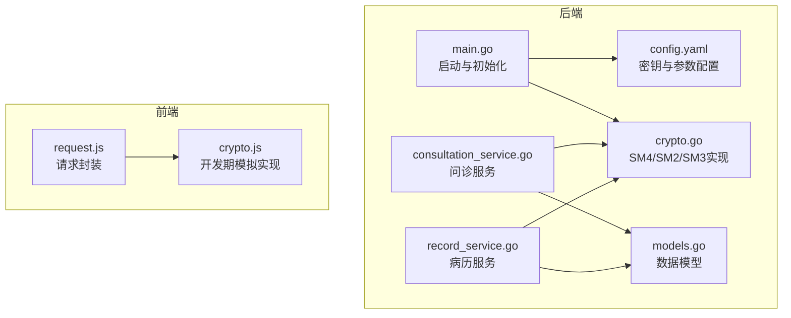
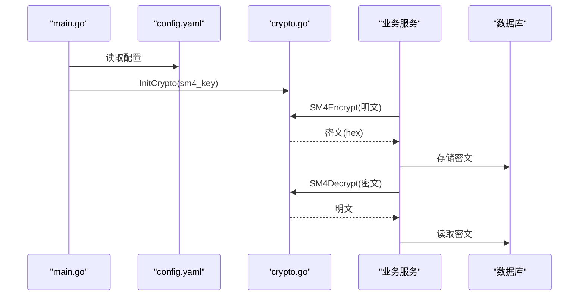
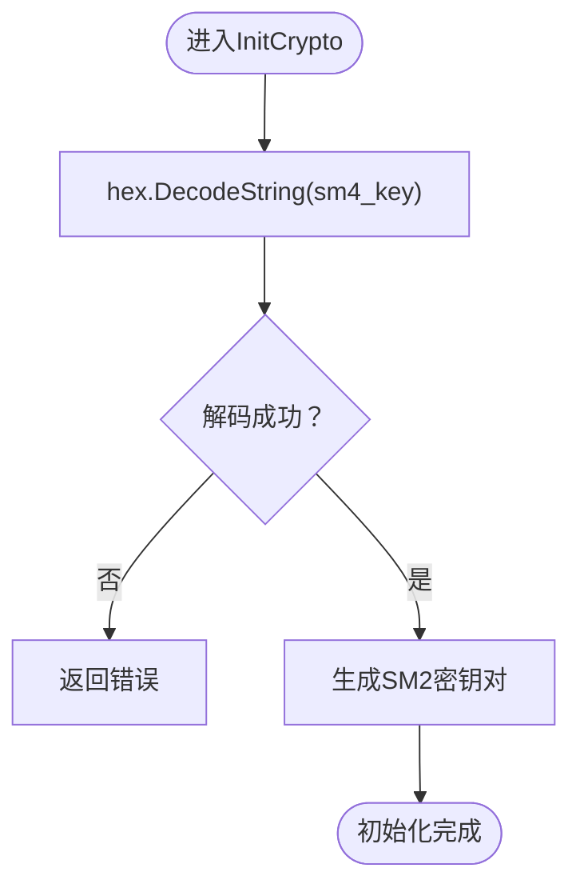
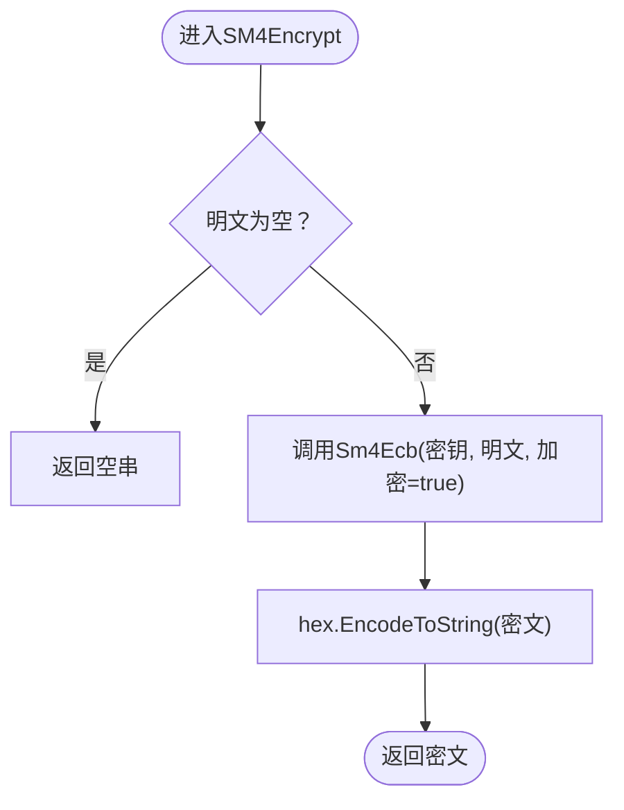
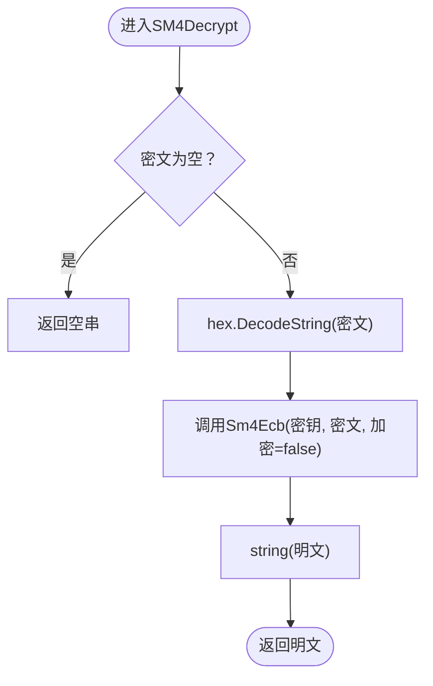
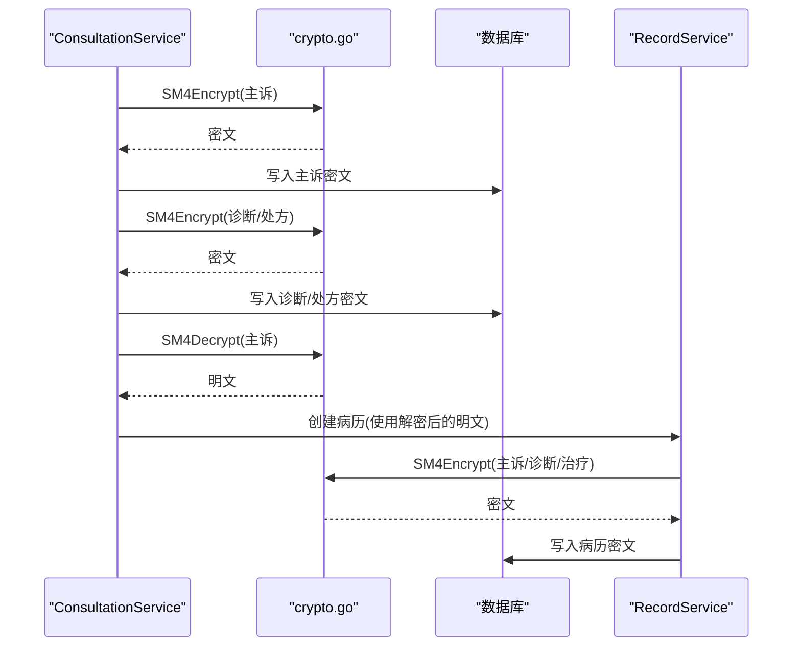
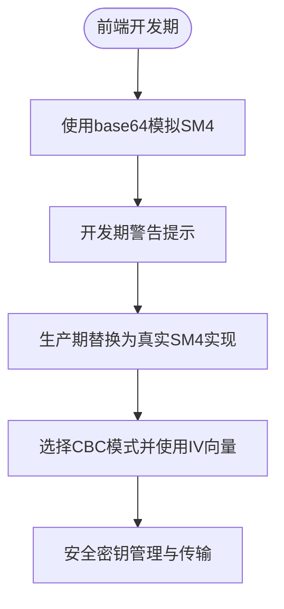
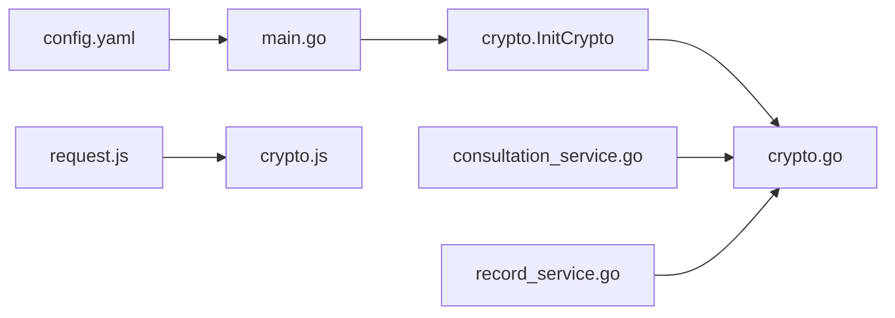

# SM4实现

<cite>
**本文引用的文件**
- [crypto.go](file://backed/internal/crypto/crypto.go)
- [main.go](file://backed/cmd/main.go)
- [config.yaml](file://backed/config/config.yaml)
- [consultation_service.go](file://backed/internal/service/consultation_service.go)
- [record_service.go](file://backed/internal/service/record_service.go)
- [models.go](file://backed/internal/model/models.go)
- [SM_user_module.sql](file://database/SM_user_module.sql)
- [crypto.js](file://fonted/utils/crypto.js)
- [request.js](file://fonted/utils/request.js)
- [hash_password.go](file://backed/tools/hash_password.go)
- [测试SM3加密.html](file://测试SM3加密.html)
</cite>

## 目录
1. [简介](#简介)
2. [项目结构](#项目结构)
3. [核心组件](#核心组件)
4. [架构总览](#架构总览)
5. [详细组件分析](#详细组件分析)
6. [依赖关系分析](#依赖关系分析)
7. [性能考量](#性能考量)
8. [故障排查指南](#故障排查指南)
9. [结论](#结论)
10. [附录](#附录)

## 简介
本文件系统化阐述本项目中SM4对称加密算法的实现与应用，重点解析后端crypto.go中SM4Key的初始化机制（InitCrypto）以及SM4Encrypt/SM4Decrypt函数在ECB模式下的加解密逻辑；说明其用于电子病历、问诊记录等敏感数据的加密存储与传输。同时分析前端crypto.js中sm4Encrypt/sm4Decrypt函数当前使用base64模拟的开发状态，指出在生产环境中必须替换为基于sm-crypto的真实SM4实现，并考虑CBC模式与IV向量的安全性增强。最后给出SM4在RecordService和ConsultationService中加密敏感字段的实际应用场景，对比SM4与SM2在性能与用途上的差异，以及密钥安全管理建议与算法性能优化策略。

## 项目结构
本项目采用Go后端与Vue前端分离架构，SM4加密能力集中在后端crypto模块，前端仅保留开发期的模拟实现。后端通过配置文件加载SM4密钥，启动时初始化加密上下文；业务层在问诊与病历服务中对敏感字段进行加解密。

图表来源
- [main.go](file://backed/cmd/main.go#L1-L64)
- [config.yaml](file://backed/config/config.yaml#L1-L37)
- [crypto.go](file://backed/internal/crypto/crypto.go#L1-L121)
- [consultation_service.go](file://backed/internal/service/consultation_service.go#L1-L302)
- [record_service.go](file://backed/internal/service/record_service.go#L1-L137)
- [models.go](file://backed/internal/model/models.go#L58-L103)
- [crypto.js](file://fonted/utils/crypto.js#L1-L255)
- [request.js](file://fonted/utils/request.js#L1-L222)

章节来源
- [main.go](file://backed/cmd/main.go#L1-L64)
- [config.yaml](file://backed/config/config.yaml#L1-L37)

## 核心组件
- 后端SM4实现与初始化
  - SM4Key全局变量与InitCrypto初始化流程
  - SM4Encrypt/SM4Decrypt在ECB模式下的加解密逻辑
- 业务服务中的SM4应用
  - ConsultationService对主诉、诊断、处方进行加密
  - RecordService对病历主诉、诊断、治疗进行解密展示
- 前端SM4模拟实现
  - crypto.js中sm4Encrypt/sm4Decrypt使用base64模拟，开发期警告提示
- 配置与密钥管理
  - config.yaml中sm4_key配置项与main.go启动时加载

章节来源
- [crypto.go](file://backed/internal/crypto/crypto.go#L1-L121)
- [consultation_service.go](file://backed/internal/service/consultation_service.go#L1-L302)
- [record_service.go](file://backed/internal/service/record_service.go#L1-L137)
- [config.yaml](file://backed/config/config.yaml#L1-L37)
- [main.go](file://backed/cmd/main.go#L1-L64)
- [crypto.js](file://fonted/utils/crypto.js#L1-L255)

## 架构总览
后端启动时从配置加载SM4密钥并初始化加密上下文；业务服务在写入敏感数据时调用SM4Encrypt，在读取时调用SM4Decrypt；前端在开发阶段使用base64模拟SM4，生产环境需替换为真实SM4实现。

图表来源
- [main.go](file://backed/cmd/main.go#L1-L64)
- [config.yaml](file://backed/config/config.yaml#L1-L37)
- [crypto.go](file://backed/internal/crypto/crypto.go#L1-L121)
- [consultation_service.go](file://backed/internal/service/consultation_service.go#L1-L302)
- [record_service.go](file://backed/internal/service/record_service.go#L1-L137)

## 详细组件分析

### 后端SM4初始化与加解密逻辑
- 初始化机制（InitCrypto）
  - 从配置读取SM4密钥（16字节十六进制），hex.DecodeString转换为字节数组
  - 生成SM2密钥对（用于其他场景，非本文重点）
- ECB模式加解密
  - SM4Encrypt：对明文调用Sm4Ecb(true)，返回hex编码的密文
  - SM4Decrypt：对hex编码的密文调用Sm4Ecb(false)，返回明文字符串
- 错误处理
  - hex.DecodeString与Sm4Ecb均可能返回错误，函数对外返回空串或错误

图表来源
- [crypto.go](file://backed/internal/crypto/crypto.go#L1-L34)

图表来源
- [crypto.go](file://backed/internal/crypto/crypto.go#L48-L60)

图表来源
- [crypto.go](file://backed/internal/crypto/crypto.go#L62-L79)

章节来源
- [crypto.go](file://backed/internal/crypto/crypto.go#L1-L121)
- [main.go](file://backed/cmd/main.go#L1-L64)
- [config.yaml](file://backed/config/config.yaml#L1-L37)

### SM4在业务服务中的应用
- 问诊服务（ConsultationService）
  - 创建问诊：对主诉调用SM4Encrypt后存入数据库
  - 完成问诊：对诊断与处方调用SM4Encrypt后存入数据库
  - 列表/详情：对主诉调用SM4Decrypt后返回给前端
  - 自动创建病历：先SM4Decrypt主诉，再对主诉、诊断、治疗分别SM4Encrypt，生成数据哈希
- 病历服务（RecordService）
  - 列表/详情：对主诉、诊断、治疗调用SM4Decrypt后返回给前端

图表来源
- [consultation_service.go](file://backed/internal/service/consultation_service.go#L1-L302)
- [record_service.go](file://backed/internal/service/record_service.go#L1-L137)
- [crypto.go](file://backed/internal/crypto/crypto.go#L1-L121)

章节来源
- [consultation_service.go](file://backed/internal/service/consultation_service.go#L1-L302)
- [record_service.go](file://backed/internal/service/record_service.go#L1-L137)
- [models.go](file://backed/internal/model/models.go#L58-L103)

### 前端SM4模拟实现与生产替换建议
- 现状
  - crypto.js中sm4Encrypt/sm4Decrypt使用base64模拟，开发期警告提示“请在实际项目中集成真正的SM4算法”
- 生产替换
  - 建议使用sm-crypto库的SM4实现，支持CBC模式与IV向量
  - 前端应与后端约定一致的填充方式与编码格式（如hex）
  - 前端需安全地管理密钥，避免硬编码；可采用密钥派生或安全存储方案
- 与后端交互
  - request.js负责统一请求封装，前端加密应在调用API前完成
  - 建议后端提供密钥公钥或密钥交换接口，前端通过安全通道获取密钥

图表来源
- [crypto.js](file://fonted/utils/crypto.js#L1-L255)
- [request.js](file://fonted/utils/request.js#L1-L222)

章节来源
- [crypto.js](file://fonted/utils/crypto.js#L1-L255)
- [request.js](file://fonted/utils/request.js#L1-L222)

### 数据模型与敏感字段映射
- 问诊记录（SM_consultation）
  - 主诉、医生诊断、处方字段标注为SM4加密
- 电子病历（SM_medical_record）
  - 主诉、现病史、既往史、诊断、治疗方案等字段标注为SM4加密
- 访问日志（SM_record_access_log）
  - 访问IP字段标注为SM4加密

章节来源
- [models.go](file://backed/internal/model/models.go#L58-L103)
- [SM_user_module.sql](file://database/SM_user_module.sql#L76-L100)
- [开发文档.md](file://开发文档.md#L1586-L1646)

## 依赖关系分析
- 启动依赖
  - main.go依赖config.yaml加载配置，随后调用crypto.InitCrypto初始化SM4Key
- 业务依赖
  - ConsultationService与RecordService依赖crypto.SM4Encrypt/SM4Decrypt
- 前端依赖
  - crypto.js被request.js间接使用，用于请求前的加密

图表来源
- [config.yaml](file://backed/config/config.yaml#L1-L37)
- [main.go](file://backed/cmd/main.go#L1-L64)
- [crypto.go](file://backed/internal/crypto/crypto.go#L1-L121)
- [consultation_service.go](file://backed/internal/service/consultation_service.go#L1-L302)
- [record_service.go](file://backed/internal/service/record_service.go#L1-L137)
- [request.js](file://fonted/utils/request.js#L1-L222)
- [crypto.js](file://fonted/utils/crypto.js#L1-L255)

章节来源
- [main.go](file://backed/cmd/main.go#L1-L64)
- [config.yaml](file://backed/config/config.yaml#L1-L37)
- [consultation_service.go](file://backed/internal/service/consultation_service.go#L1-L302)
- [record_service.go](file://backed/internal/service/record_service.go#L1-L137)
- [crypto.go](file://backed/internal/crypto/crypto.go#L1-L121)
- [request.js](file://fonted/utils/request.js#L1-L222)
- [crypto.js](file://fonted/utils/crypto.js#L1-L255)

## 性能考量
- SM4在ECB模式下的特点
  - 优点：实现简单、性能稳定
  - 缺点：相同明文块产生相同密文块，易受统计分析攻击；不提供完整性保护
- 业务场景适配
  - 本项目对短文本（如主诉、诊断、处方）使用SM4ECB，满足基本保密需求
  - 对于更敏感或长文本，建议升级为CBC模式并引入IV向量
- 性能优化建议
  - 批量加解密时减少重复初始化开销（当前已全局持有SM4Key）
  - 前端加密尽量在本地完成，减少网络往返
  - 对大对象采用分块加密或压缩后再加密，降低带宽占用

[本节为通用性能讨论，无需列出具体文件来源]

## 故障排查指南
- 启动阶段
  - 若SM4密钥格式不正确，InitCrypto会返回错误；检查config.yaml中sm4_key是否为32位十六进制字符串
- 运行阶段
  - SM4Encrypt/SM4Decrypt返回空串或错误：确认输入非空且hex编码正确
  - 问诊/病历读取异常：检查数据库中密文是否被篡改或截断
- 密码哈希链路
  - 前端SM3哈希与后端加盐二次哈希需保持一致；可通过hash_password.go与测试SM3加密.html辅助验证
- 前端模拟问题
  - 生产环境必须替换为真实SM4实现，否则无法与后端互通

章节来源
- [crypto.go](file://backed/internal/crypto/crypto.go#L1-L121)
- [main.go](file://backed/cmd/main.go#L1-L64)
- [config.yaml](file://backed/config/config.yaml#L1-L37)
- [hash_password.go](file://backed/tools/hash_password.go#L1-L63)
- [测试SM3加密.html](file://测试SM3加密.html#L94-L274)

## 结论
本项目在后端实现了SM4对称加密的初始化与ECB模式加解密，并在问诊与病历服务中对敏感字段进行加密存储与展示。前端当前处于开发期模拟状态，生产环境必须替换为基于sm-crypto的真实SM4实现，并优先采用CBC模式与IV向量提升安全性。SM4适合对称加密场景，SM2更适合密钥交换与签名场景；在本项目中两者职责互补。建议尽快完成前端替换与密钥安全管理，确保端到端加密链路的完整与安全。

[本节为总结性内容，无需列出具体文件来源]

## 附录

### SM4与SM2在本项目的用途与差异
- SM4
  - 用途：对短文本（主诉、诊断、处方、病历关键字段）进行对称加密
  - 模式：当前ECB；建议生产改为CBC+IV
- SM2
  - 用途：密钥对生成与非对称加密（本项目在后端生成密钥对，前端尚未启用）
  - 适用场景：密钥交换、数字签名、加密小量数据

章节来源
- [crypto.go](file://backed/internal/crypto/crypto.go#L1-L121)

### 密钥安全管理建议
- 密钥生成与存储
  - 启动时由后端生成SM2密钥对，SM4密钥从配置文件加载
  - 建议将密钥置于安全存储（如KMS、硬件安全模块），避免明文落盘
- 密钥轮换
  - 定期轮换SM4密钥，旧密钥与新密钥并行过渡一段时间
- 前端密钥管理
  - 不要在前端硬编码密钥；通过安全通道获取或使用SM2密钥交换
- 传输安全
  - 前端与后端通信使用HTTPS/TLS；必要时对密钥进行SM2加密传输

[本节为通用安全建议，无需列出具体文件来源]