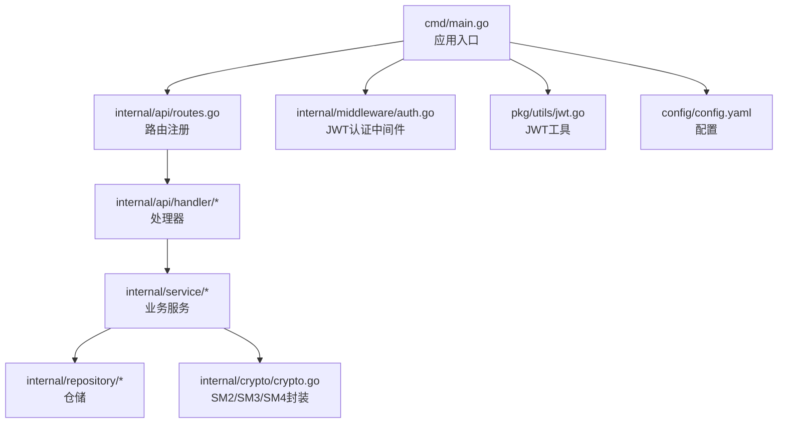
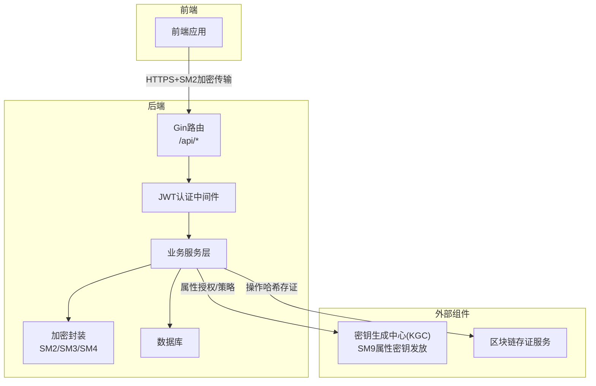
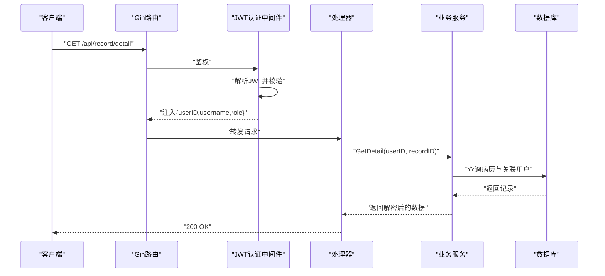
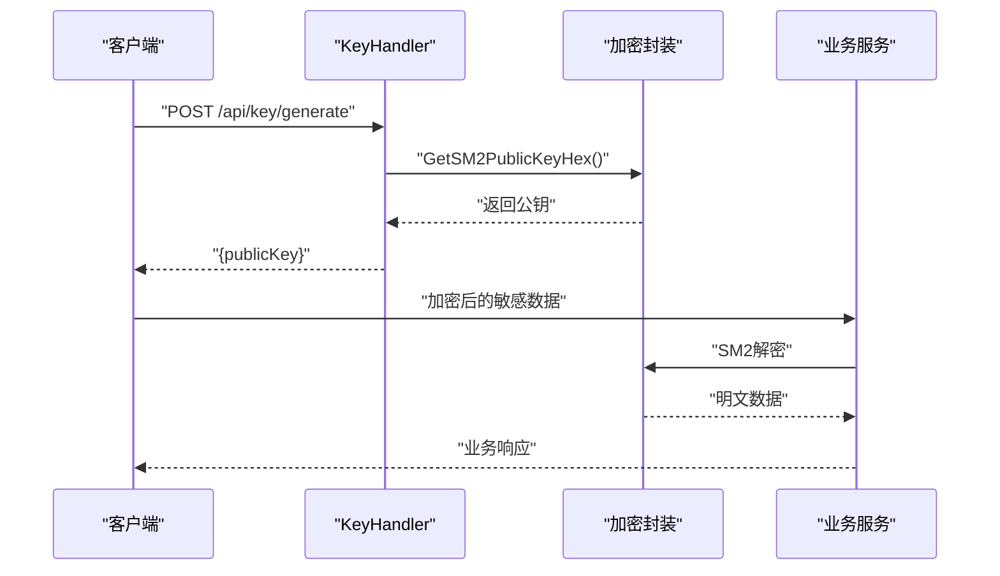
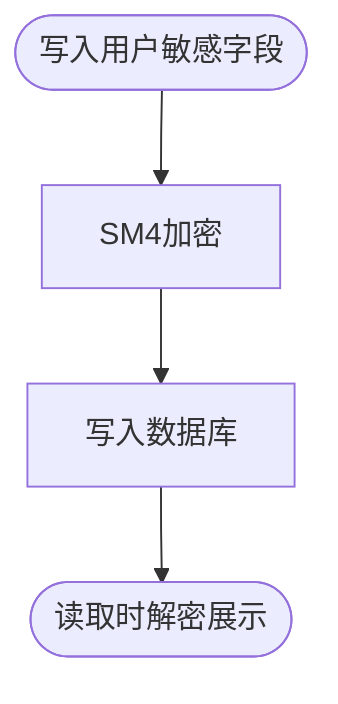
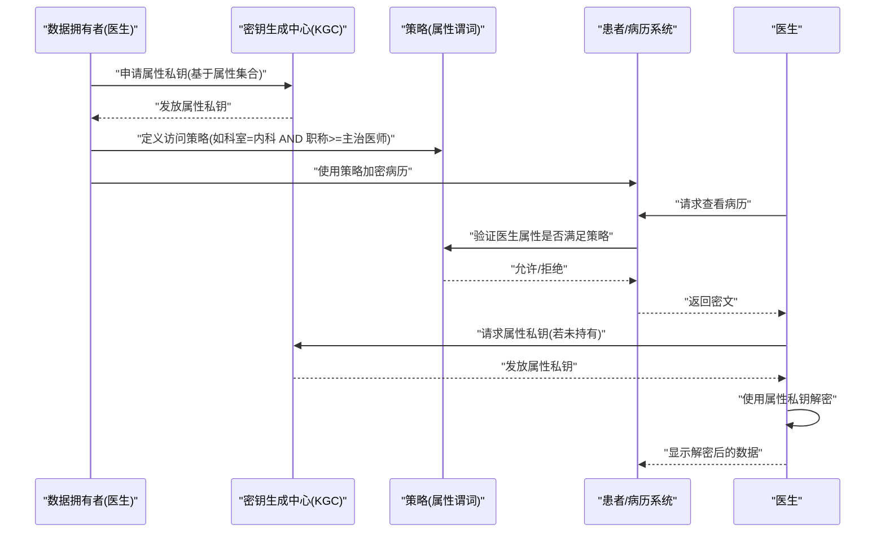
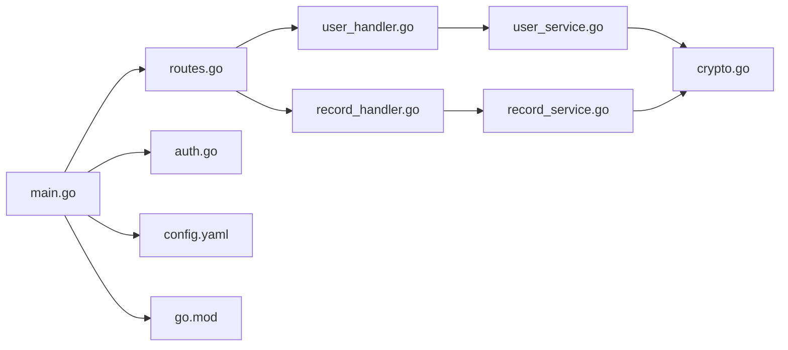

# SM9属性基加密

<cite>
**本文引用的文件**
- [main.go](file://backed/cmd/main.go)
- [routes.go](file://backed/internal/api/routes.go)
- [auth.go](file://backed/internal/middleware/auth.go)
- [jwt.go](file://backed/pkg/utils/jwt.go)
- [crypto.go](file://backed/internal/crypto/crypto.go)
- [models.go](file://backed/internal/model/models.go)
- [user_service.go](file://backed/internal/service/user_service.go)
- [record_service.go](file://backed/internal/service/record_service.go)
- [user_handler.go](file://backed/internal/api/handler/user_handler.go)
- [record_handler.go](file://backed/internal/api/handler/record_handler.go)
- [key_handler.go](file://backed/internal/api/handler/key_handler.go)
- [config.yaml](file://backed/config/config.yaml)
- [go.mod](file://backed/go.mod)
- [SM_user_module.sql](file://database/SM_user_module.sql)
- [规划.md](file://规划.md)
- [开发文档.md](file://开发文档.md)
</cite>

## 目录
1. [引言](#引言)
2. [项目结构](#项目结构)
3. [核心组件](#核心组件)
4. [架构总览](#架构总览)
5. [详细组件分析](#详细组件分析)
6. [依赖关系分析](#依赖关系分析)
7. [性能考虑](#性能考虑)
8. [故障排查指南](#故障排查指南)
9. [结论](#结论)
10. [附录](#附录)

## 引言
本文件面向当前代码库尚未直接实现SM9算法的现实，基于项目的整体安全架构与既定规划，进行前瞻性的SM9属性基加密（ABE）设计说明。SM9作为标识密码体制，具备“无需数字证书、简化密钥管理”的优势，特别适用于本系统中基于角色（用户、医生、管理员）的细粒度访问控制场景。在电子病历等敏感数据共享中，SM9可将访问策略表达为“属性谓词”，例如“职称=主任医师 AND 科室=内科”，只有满足该属性集合的医生才能获得解密能力，从而实现强隐私保护与灵活授权。

本说明将结合现有SM2/SM3/SM4体系，给出SM9的集成路径、密钥生成中心（KGC）设计、属性授权机制以及性能考量，并提供概念性代码示例与架构图，帮助读者理解如何在未来版本中平滑引入SM9。

## 项目结构
后端采用Go语言与Gin框架，按领域分层组织：
- cmd：程序入口，初始化配置、数据库、加密模块与路由
- internal/api：路由与处理器，封装业务接口
- internal/middleware：认证与跨域中间件
- internal/service：业务服务层，协调仓储与加密
- internal/repository：数据访问层（与数据库交互）
- internal/model：数据模型
- internal/crypto：国密算法封装（SM2/SM3/SM4）
- pkg/utils：通用工具（JWT、响应封装）
- config：配置加载
- fonted：前端工程（与本文件无关）

图表来源
- [main.go](file://backed/cmd/main.go#L1-L64)
- [routes.go](file://backed/internal/api/routes.go#L1-L95)
- [auth.go](file://backed/internal/middleware/auth.go#L1-L61)
- [jwt.go](file://backed/pkg/utils/jwt.go#L1-L53)
- [crypto.go](file://backed/internal/crypto/crypto.go#L1-L121)
- [config.yaml](file://backed/config/config.yaml#L1-L37)

章节来源
- [main.go](file://backed/cmd/main.go#L1-L64)
- [routes.go](file://backed/internal/api/routes.go#L1-L95)
- [config.yaml](file://backed/config/config.yaml#L1-L37)

## 核心组件
- 认证与授权：JWT承载用户身份与角色，配合中间件实现受保护接口
- 加密栈：SM2用于通信加密（后端提供公钥），SM3用于哈希与完整性校验，SM4用于数据存储加密
- 数据模型：用户、问诊、病历、通知、登录日志等，敏感字段采用SM4加密存储
- 业务服务：用户服务、病历服务等，负责业务规则与数据解密展示
- 路由与处理器：统一暴露REST接口，按需鉴权

章节来源
- [jwt.go](file://backed/pkg/utils/jwt.go#L1-L53)
- [auth.go](file://backed/internal/middleware/auth.go#L1-L61)
- [crypto.go](file://backed/internal/crypto/crypto.go#L1-L121)
- [models.go](file://backed/internal/model/models.go#L1-L160)
- [user_service.go](file://backed/internal/service/user_service.go#L1-L331)
- [record_service.go](file://backed/internal/service/record_service.go#L1-L137)

## 架构总览
下图展示了当前系统与未来引入SM9的总体架构关系。SM9作为访问控制与解密能力的新增能力，与现有SM2/SM3/SM4形成互补，共同构建端到端安全方案。

图表来源
- [routes.go](file://backed/internal/api/routes.go#L1-L95)
- [auth.go](file://backed/internal/middleware/auth.go#L1-L61)
- [crypto.go](file://backed/internal/crypto/crypto.go#L1-L121)
- [SM_user_module.sql](file://database/SM_user_module.sql#L290-L324)
- [规划.md](file://规划.md#L516-L579)

## 详细组件分析

### 组件A：JWT认证与角色授权（当前实现）
- 认证流程：客户端携带Bearer Token访问受保护接口；中间件解析JWT，提取用户ID、用户名、角色并写入上下文
- 角色控制：业务服务根据角色与数据关联关系进行访问控制（如医生仅能查看自己接诊的病历）
- 与SM9的关系：JWT提供身份与角色，SM9提供属性解密能力；二者可并行使用，前者负责“谁”，后者负责“能否解密”

图表来源
- [auth.go](file://backed/internal/middleware/auth.go#L1-L61)
- [jwt.go](file://backed/pkg/utils/jwt.go#L1-L53)
- [record_handler.go](file://backed/internal/api/handler/record_handler.go#L1-L61)
- [record_service.go](file://backed/internal/service/record_service.go#L1-L137)

章节来源
- [auth.go](file://backed/internal/middleware/auth.go#L1-L61)
- [jwt.go](file://backed/pkg/utils/jwt.go#L1-L53)
- [record_handler.go](file://backed/internal/api/handler/record_handler.go#L1-L61)
- [record_service.go](file://backed/internal/service/record_service.go#L1-L137)

### 组件B：SM2公钥下发与通信加密（当前实现）
- 后端在启动时生成SM2密钥对，提供公钥给前端用于加密敏感数据
- 处理器接口返回SM2公钥，前端使用该公钥加密后再传输至后端
- 后端使用私钥解密，随后进行业务处理

图表来源
- [key_handler.go](file://backed/internal/api/handler/key_handler.go#L1-L24)
- [crypto.go](file://backed/internal/crypto/crypto.go#L1-L121)
- [user_handler.go](file://backed/internal/api/handler/user_handler.go#L1-L261)

章节来源
- [key_handler.go](file://backed/internal/api/handler/key_handler.go#L1-L24)
- [crypto.go](file://backed/internal/crypto/crypto.go#L1-L121)
- [user_handler.go](file://backed/internal/api/handler/user_handler.go#L1-L261)

### 组件C：SM4数据存储加密（当前实现）
- 用户敏感字段（邮箱、手机号、真实姓名、登录IP等）在入库前使用SM4加密，在读取后解密展示
- 病历表中部分字段也采用SM4加密存储，确保数据库层面的隐私保护

图表来源
- [models.go](file://backed/internal/model/models.go#L1-L160)
- [user_service.go](file://backed/internal/service/user_service.go#L1-L331)

章节来源
- [models.go](file://backed/internal/model/models.go#L1-L160)
- [user_service.go](file://backed/internal/service/user_service.go#L1-L331)

### 组件D：SM9属性基加密（未来扩展设计）
以下为基于现有架构的SM9集成方案与概念性流程，便于后续落地实施。

#### 1) SM9与现有体系的集成路径
- 传输层：继续保持HTTPS与SM2公钥交换，确保通信安全
- 存储层：病历数据仍以SM4加密存储；SM9用于访问控制与解密授权
- 认证层：JWT维持身份与角色；SM9补充属性解密授权
- 计算层：AI风险评分仍可在Paillier加密特征上进行，SM9不影响同态计算

#### 2) 密钥生成中心（KGC）设计
- KGC职责：为医生发放属性私钥，使其具备解密与其属性匹配的病历的能力
- 属性模型：医生属性如“科室”、“职称”、“医院”等，构成属性集合
- 策略模型：数据拥有者（医生）为病历设置属性谓词（如“科室=内科 AND 职称>=主治医师”）
- 分发与撤销：KGC按属性发放/撤销私钥；支持周期轮换与吊销

#### 3) 属性授权机制
- 病历加密：数据拥有者使用SM9策略加密病历，生成密文与策略
- 访问请求：医生请求查看病历，系统验证其属性是否满足策略
- 解密授权：满足条件的医生使用其属性私钥解密对应密文

图表来源
- [SM_user_module.sql](file://database/SM_user_module.sql#L290-L324)
- [规划.md](file://规划.md#L516-L579)

#### 4) 与现有SM2/SM3/SM4的协同
- SM2：用于前后端通信加密与身份认证（保持不变）
- SM3：用于完整性校验（保持不变）
- SM4：用于数据存储加密（保持不变）
- SM9：新增用于属性解密授权（与上述三者并行）

章节来源
- [SM_user_module.sql](file://database/SM_user_module.sql#L290-L324)
- [规划.md](file://规划.md#L516-L579)

#### 5) 概念性代码示例（路径参考）
- SM9策略加密与解密（概念性）
  - 策略加密：参考[SM_user_module.sql](file://database/SM_user_module.sql#L290-L324)
  - 属性私钥发放：参考[规划.md](file://规划.md#L516-L579)
  - 解密流程：参考[record_service.go](file://backed/internal/service/record_service.go#L1-L137) 的解密模式

- 与JWT结合的访问控制（当前实现）
  - 中间件解析与注入：参考[auth.go](file://backed/internal/middleware/auth.go#L1-L61)
  - JWT声明与签发：参考[jwt.go](file://backed/pkg/utils/jwt.go#L1-L53)

- SM2公钥下发（当前实现）
  - 公钥获取：参考[key_handler.go](file://backed/internal/api/handler/key_handler.go#L1-L24)
  - 公钥导出：参考[crypto.go](file://backed/internal/crypto/crypto.go#L1-L121)

章节来源
- [record_service.go](file://backed/internal/service/record_service.go#L1-L137)
- [auth.go](file://backed/internal/middleware/auth.go#L1-L61)
- [jwt.go](file://backed/pkg/utils/jwt.go#L1-L53)
- [key_handler.go](file://backed/internal/api/handler/key_handler.go#L1-L24)
- [crypto.go](file://backed/internal/crypto/crypto.go#L1-L121)

## 依赖关系分析
- 外部依赖：Gin、JWT、Viper、GMSM（国密库）、GORM、MySQL驱动
- 内部依赖：路由依赖中间件与处理器；处理器依赖服务；服务依赖仓储与加密封装；加密封装依赖GMSM

图表来源
- [main.go](file://backed/cmd/main.go#L1-L64)
- [routes.go](file://backed/internal/api/routes.go#L1-L95)
- [user_handler.go](file://backed/internal/api/handler/user_handler.go#L1-L261)
- [record_handler.go](file://backed/internal/api/handler/record_handler.go#L1-L61)
- [user_service.go](file://backed/internal/service/user_service.go#L1-L331)
- [record_service.go](file://backed/internal/service/record_service.go#L1-L137)
- [crypto.go](file://backed/internal/crypto/crypto.go#L1-L121)
- [auth.go](file://backed/internal/middleware/auth.go#L1-L61)
- [config.yaml](file://backed/config/config.yaml#L1-L37)
- [go.mod](file://backed/go.mod#L1-L58)

章节来源
- [go.mod](file://backed/go.mod#L1-L58)

## 性能考虑
- SM9运算复杂度高于SM2/SM3/SM4，应避免在高频接口中直接使用
- 建议将SM9用于低频但关键的解密授权环节，其余场景继续使用SM2/SM3/SM4
- 可通过缓存属性授权结果、批量策略验证等方式降低延迟
- 传输层仍采用SM2公钥交换与HTTPS，保证通信安全与性能平衡

## 故障排查指南
- JWT无效或过期：检查密钥与签名算法、过期时间配置
  - 参考：[jwt.go](file://backed/pkg/utils/jwt.go#L1-L53)
- 认证失败：确认Authorization头格式与中间件解析逻辑
  - 参考：[auth.go](file://backed/internal/middleware/auth.go#L1-L61)
- SM2公钥不可用：确认加密模块初始化与公钥导出
  - 参考：[crypto.go](file://backed/internal/crypto/crypto.go#L1-L121)，[key_handler.go](file://backed/internal/api/handler/key_handler.go#L1-L24)
- SM4解密异常：核对密钥长度与编码格式
  - 参考：[crypto.go](file://backed/internal/crypto/crypto.go#L1-L121)，[models.go](file://backed/internal/model/models.go#L1-L160)

章节来源
- [jwt.go](file://backed/pkg/utils/jwt.go#L1-L53)
- [auth.go](file://backed/internal/middleware/auth.go#L1-L61)
- [crypto.go](file://backed/internal/crypto/crypto.go#L1-L121)
- [key_handler.go](file://backed/internal/api/handler/key_handler.go#L1-L24)
- [models.go](file://backed/internal/model/models.go#L1-L160)

## 结论
本项目已具备完善的SM2/SM3/SM4安全基础，能够支撑SM9属性基加密的未来集成。通过将SM9定位为“属性解密授权”的新增能力，与JWT身份与角色控制、SM2通信加密、SM3完整性校验、SM4存储加密形成互补，可在不破坏现有架构的前提下，实现电子病历等敏感数据的细粒度访问控制与隐私保护。建议优先完善KGC设计、属性授权流程与策略管理，并在低频关键环节引入SM9，以获得最佳的安全与性能平衡。

## 附录
- 相关文件与路径参考
  - [main.go](file://backed/cmd/main.go#L1-L64)
  - [routes.go](file://backed/internal/api/routes.go#L1-L95)
  - [auth.go](file://backed/internal/middleware/auth.go#L1-L61)
  - [jwt.go](file://backed/pkg/utils/jwt.go#L1-L53)
  - [crypto.go](file://backed/internal/crypto/crypto.go#L1-L121)
  - [models.go](file://backed/internal/model/models.go#L1-L160)
  - [user_service.go](file://backed/internal/service/user_service.go#L1-L331)
  - [record_service.go](file://backed/internal/service/record_service.go#L1-L137)
  - [user_handler.go](file://backed/internal/api/handler/user_handler.go#L1-L261)
  - [record_handler.go](file://backed/internal/api/handler/record_handler.go#L1-L61)
  - [key_handler.go](file://backed/internal/api/handler/key_handler.go#L1-L24)
  - [config.yaml](file://backed/config/config.yaml#L1-L37)
  - [go.mod](file://backed/go.mod#L1-L58)
  - [SM_user_module.sql](file://database/SM_user_module.sql#L290-L324)
  - [规划.md](file://规划.md#L516-L579)
  - [开发文档.md](file://开发文档.md#L1-L200)