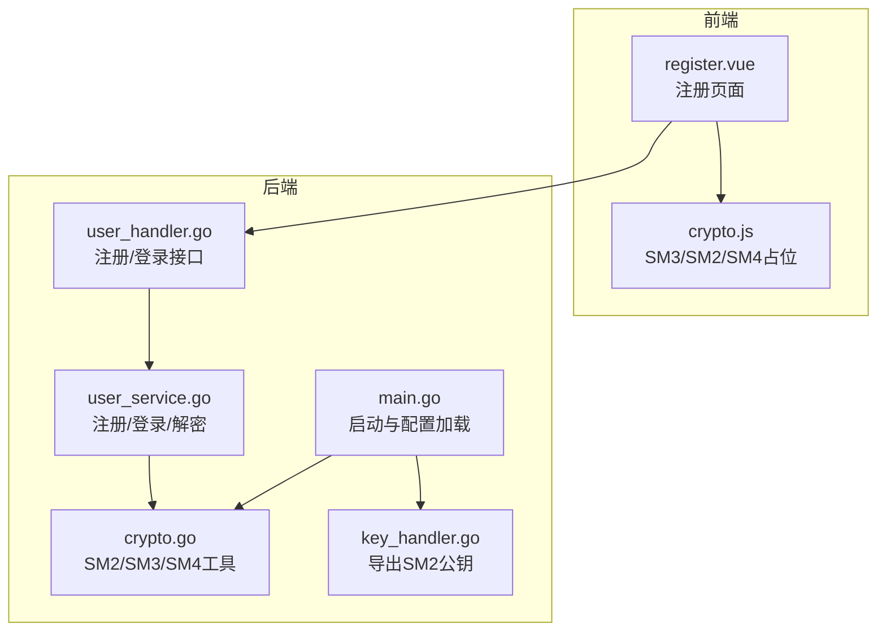
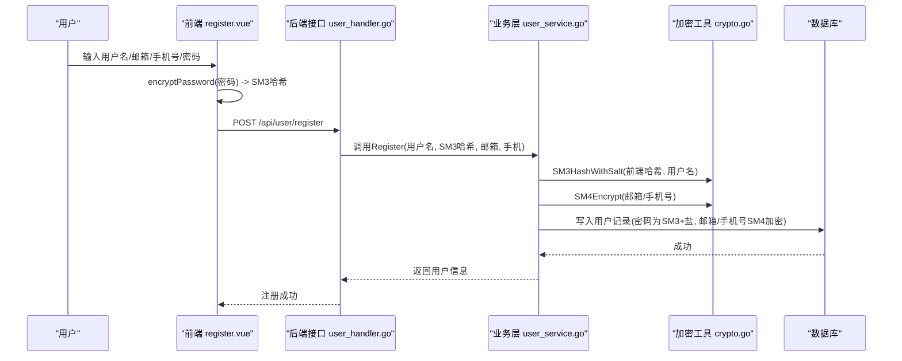
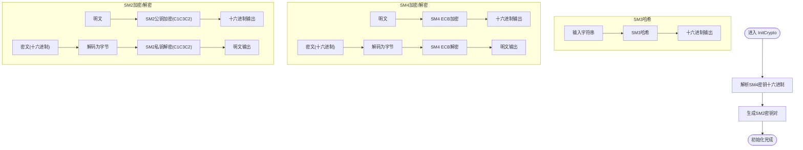
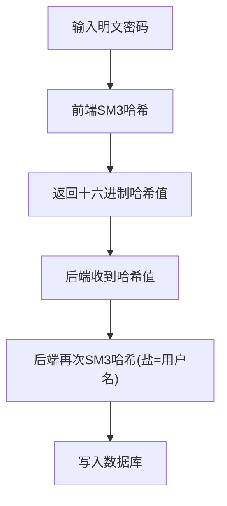
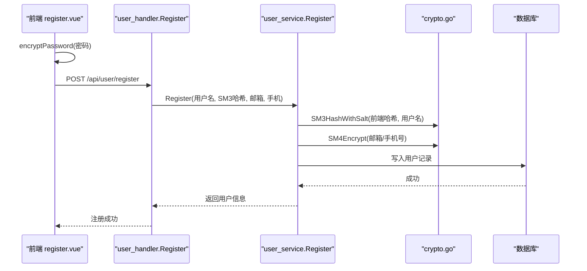
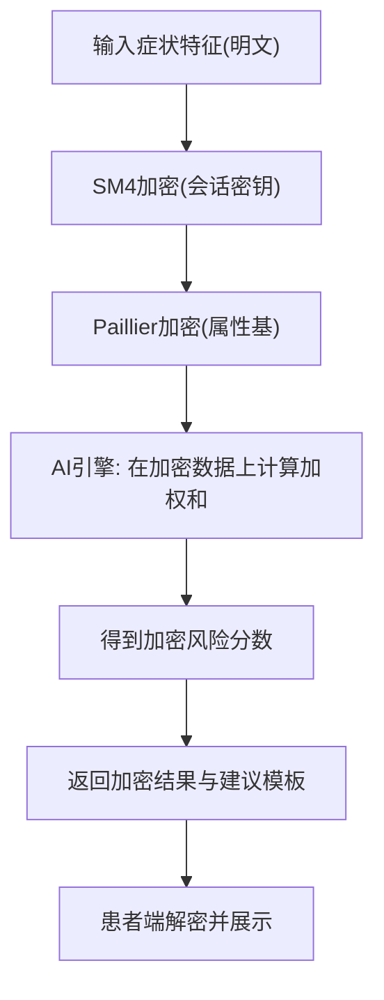
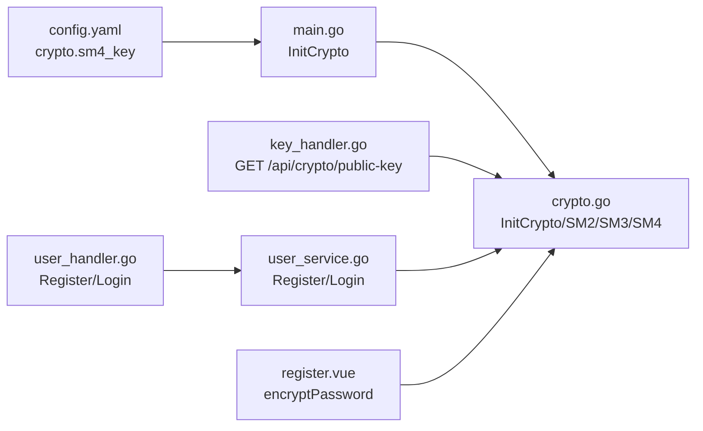

# 国密加密模块

<cite>
**本文引用的文件**
- [crypto.go](file://backed/internal/crypto/crypto.go)
- [main.go](file://backed/cmd/main.go)
- [config.yaml](file://backed/config/config.yaml)
- [user_service.go](file://backed/internal/service/user_service.go)
- [user_handler.go](file://backed/internal/api/handler/user_handler.go)
- [key_handler.go](file://backed/internal/api/handler/key_handler.go)
- [crypto.js](file://fonted/utils/crypto.js)
- [register.vue](file://fonted/pages/register/register.vue)
- [hash_password.go](file://backed/tools/hash_password.go)
- [API接口总览.md](file://API接口总览.md)
- [规划.md](file://规划.md)
- [开发文档.md](file://开发文档.md)
- [init.sql](file://backed/init.sql)
</cite>

## 目录
1. [简介](#简介)
2. [项目结构](#项目结构)
3. [核心组件](#核心组件)
4. [架构总览](#架构总览)
5. [详细组件分析](#详细组件分析)
6. [依赖关系分析](#依赖关系分析)
7. [性能与安全性考量](#性能与安全性考量)
8. [故障排查指南](#故障排查指南)
9. [结论](#结论)
10. [附录](#附录)

## 简介
本文件围绕“基于国密加密的网上看诊系统”的加密模块展开，系统采用国家商用密码算法SM2、SM3、SM4，并在AI智能诊断场景中引入Paillier同态加密，实现端到端隐私保护。本文重点说明：
- 后端crypto.go中SM3密码哈希、SM4敏感数据存储加密、SM2非对称加密的实现；
- 前端crypto.js中SM3哈希与SM2/SM4占位实现（当前为模拟，需替换为真实国密库）；
- 系统在用户注册、登录、数据传输与存储过程中的加密应用；
- Paillier同态加密在AI诊断中的隐私保护作用；
- 开发者使用方法、密钥管理与安全最佳实践。

## 项目结构
后端采用Go语言，前端采用uni-app（Vue）。加密模块主要分布在：
- 后端：crypto.go提供SM2/SM3/SM4工具；main.go在启动时加载配置并初始化加密；user_service.go在业务层使用SM3/SM4；key_handler.go提供SM2公钥导出接口。
- 前端：crypto.js提供SM3哈希与SM2/SM4占位函数；register.vue在注册时调用encryptPassword进行SM3哈希。

图表来源
- [main.go](file://backed/cmd/main.go#L1-L64)
- [crypto.go](file://backed/internal/crypto/crypto.go#L1-L121)
- [key_handler.go](file://backed/internal/api/handler/key_handler.go#L1-L23)
- [user_service.go](file://backed/internal/service/user_service.go#L1-L200)
- [user_handler.go](file://backed/internal/api/handler/user_handler.go#L1-L261)
- [crypto.js](file://fonted/utils/crypto.js#L1-L255)
- [register.vue](file://fonted/pages/register/register.vue#L1-L214)

章节来源
- [main.go](file://backed/cmd/main.go#L1-L64)
- [crypto.go](file://backed/internal/crypto/crypto.go#L1-L121)
- [user_service.go](file://backed/internal/service/user_service.go#L1-L200)
- [user_handler.go](file://backed/internal/api/handler/user_handler.go#L1-L261)
- [key_handler.go](file://backed/internal/api/handler/key_handler.go#L1-L23)
- [crypto.js](file://fonted/utils/crypto.js#L1-L255)
- [register.vue](file://fonted/pages/register/register.vue#L1-L214)

## 核心组件
- 后端加密工具（crypto.go）
  - SM3Hash：对字符串进行SM3哈希，返回十六进制字符串。
  - SM3HashWithSalt：对“前端哈希+用户名”再次SM3哈希，作为最终入库密码。
  - SM4Encrypt/SM4Decrypt：使用SM4 ECB模式对称加密/解密，支持空串返回。
  - SM2Encrypt/SM2Decrypt：使用SM2公钥加密、私钥解密，C1C3C2编码。
  - GetSM2PublicKeyHex：导出SM2公钥坐标拼接的十六进制字符串。
  - InitCrypto：从配置读取SM4密钥十六进制字符串，初始化SM4Key；生成SM2密钥对。
- 前端加密工具（crypto.js）
  - sm3Hash：基于sm-crypto库的SM3实现；当前注释提示需在实际项目中集成真正SM2/SM4。
  - sm2Encrypt/sm2Decrypt/sm4Encrypt/sm4Decrypt：当前为base64模拟，需替换为真实国密库。
  - encryptPassword：前端一次SM3哈希，后端再加盐二次哈希。
- 启动与密钥导出（main.go、key_handler.go）
  - main.go在启动时加载配置并调用InitCrypto初始化SM4密钥与SM2密钥对。
  - key_handler.go提供GET /api/crypto/public-key接口，返回SM2公钥十六进制字符串。

章节来源
- [crypto.go](file://backed/internal/crypto/crypto.go#L1-L121)
- [main.go](file://backed/cmd/main.go#L1-L64)
- [key_handler.go](file://backed/internal/api/handler/key_handler.go#L1-L23)
- [crypto.js](file://fonted/utils/crypto.js#L1-L255)

## 架构总览
系统在用户侧采用“前端SM3哈希 + 后端加盐SM3哈希 + SM4对称加密存储 + SM2非对称加密传输”的组合策略；在AI诊断环节引入Paillier同态加密，实现“在加密数据上进行风险评分计算”，从而保护隐私。

图表来源
- [register.vue](file://fonted/pages/register/register.vue#L160-L206)
- [user_handler.go](file://backed/internal/api/handler/user_handler.go#L21-L47)
- [user_service.go](file://backed/internal/service/user_service.go#L24-L62)
- [crypto.go](file://backed/internal/crypto/crypto.go#L36-L46)
- [crypto.go](file://backed/internal/crypto/crypto.go#L48-L79)

## 详细组件分析

### 后端加密工具（crypto.go）
- 初始化与密钥
  - InitCrypto：解析SM4密钥十六进制字符串，生成SM2密钥对（公钥/私钥）。
  - GetSM2PublicKeyHex：导出公钥坐标拼接的十六进制字符串，供前端加密使用。
- SM3密码哈希
  - SM3Hash：对输入字符串进行SM3哈希，返回十六进制字符串。
  - SM3HashWithSalt：将“前端SM3哈希 + 用户名”再次SM3哈希，作为最终入库密码。
- SM4对称加密
  - SM4Encrypt/SM4Decrypt：使用SM4 ECB模式，支持空串返回；加密结果十六进制字符串。
- SM2非对称加密
  - SM2Encrypt/SM2Decrypt：使用SM2公钥加密、私钥解密，C1C3C2编码；支持空串返回。

图表来源
- [crypto.go](file://backed/internal/crypto/crypto.go#L17-L34)
- [crypto.go](file://backed/internal/crypto/crypto.go#L36-L46)
- [crypto.go](file://backed/internal/crypto/crypto.go#L48-L79)
- [crypto.go](file://backed/internal/crypto/crypto.go#L81-L112)
- [crypto.go](file://backed/internal/crypto/crypto.go#L114-L120)

章节来源
- [crypto.go](file://backed/internal/crypto/crypto.go#L1-L121)

### 前端加密处理（crypto.js）
- SM3哈希：基于sm-crypto库实现SM3，返回64位十六进制字符串。
- SM2/SM4占位：当前为base64模拟，注释提示需在实际项目中集成真正的SM2/SM4算法。
- encryptPassword：前端一次SM3哈希，后端再加盐二次哈希，形成最终入库密码。

图表来源
- [crypto.js](file://fonted/utils/crypto.js#L13-L16)
- [crypto.js](file://fonted/utils/crypto.js#L82-L94)
- [user_service.go](file://backed/internal/service/user_service.go#L37-L43)

章节来源
- [crypto.js](file://fonted/utils/crypto.js#L1-L255)
- [user_service.go](file://backed/internal/service/user_service.go#L24-L62)

### 用户注册与登录流程中的加密应用
- 注册
  - 前端：encryptPassword对密码进行SM3哈希。
  - 后端：SM3HashWithSalt(前端哈希, 用户名)作为最终密码；SM4Encrypt对邮箱、手机号进行加密存储。
- 登录
  - 后端：SM3HashWithSalt(前端哈希, 用户名)与数据库中存储的哈希比对；成功后生成JWT。
  - 敏感信息返回时：SM4Decrypt解密邮箱、手机号等敏感字段。

图表来源
- [register.vue](file://fonted/pages/register/register.vue#L178-L206)
- [user_handler.go](file://backed/internal/api/handler/user_handler.go#L21-L47)
- [user_service.go](file://backed/internal/service/user_service.go#L24-L62)
- [crypto.go](file://backed/internal/crypto/crypto.go#L36-L46)
- [crypto.go](file://backed/internal/crypto/crypto.go#L48-L79)

章节来源
- [register.vue](file://fonted/pages/register/register.vue#L160-L206)
- [user_handler.go](file://backed/internal/api/handler/user_handler.go#L21-L47)
- [user_service.go](file://backed/internal/service/user_service.go#L24-L62)

### 数据传输与存储中的加密应用
- 传输加密
  - 前端使用SM2公钥（通过GET /api/crypto/public-key获取）对敏感数据进行加密后再传输。
  - 后端使用SM2私钥解密，再进行后续处理。
- 存储加密
  - 数据库中敏感字段（如邮箱、手机号、IP地址、病历文本等）均采用SM4加密存储。
  - 数据完整性通过SM3哈希校验（如病历表中的data_hash字段）。

章节来源
- [key_handler.go](file://backed/internal/api/handler/key_handler.go#L1-L23)
- [init.sql](file://backed/init.sql#L195-L216)
- [开发文档.md](file://开发文档.md#L1586-L1646)

### Paillier同态加密在AI智能诊断中的隐私保护
- 设计目标
  - 在不接触明文的前提下，对加密特征进行加权求和与风险评分计算，保护患者隐私。
- 关键流程
  - 患者端：将症状特征加密后提交至AI引擎。
  - AI引擎：在Paillier密文中进行线性组合（权重为明文），得到加密风险分数。
  - 结果返回：将加密风险分数与模板建议一并返回，由患者端解密展示。
- 安全性保障
  - 全程无明文暴露，AI计算不接触明文。
  - 可选添加差分隐私噪声，进一步提升隐私保护。

图表来源
- [规划.md](file://规划.md#L122-L207)
- [规划.md](file://规划.md#L213-L367)
- [API接口总览.md](file://API接口总览.md#L1-L28)

章节来源
- [规划.md](file://规划.md#L122-L207)
- [规划.md](file://规划.md#L213-L367)
- [API接口总览.md](file://API接口总览.md#L1-L28)

## 依赖关系分析
- 后端启动依赖
  - main.go加载配置后调用InitCrypto初始化SM4密钥与SM2密钥对。
- 接口依赖
  - key_handler.go依赖crypto.GetSM2PublicKeyHex导出公钥。
  - user_service.go在注册/登录/查询用户信息时依赖crypto.SM3HashWithSalt与SM4Encrypt/SM4Decrypt。
- 前端依赖
  - register.vue依赖crypto.js.encryptPassword进行SM3哈希；后续应替换为真实SM2/SM4库。

图表来源
- [config.yaml](file://backed/config/config.yaml#L25-L30)
- [main.go](file://backed/cmd/main.go#L15-L24)
- [crypto.go](file://backed/internal/crypto/crypto.go#L17-L34)
- [key_handler.go](file://backed/internal/api/handler/key_handler.go#L1-L23)
- [user_handler.go](file://backed/internal/api/handler/user_handler.go#L21-L82)
- [user_service.go](file://backed/internal/service/user_service.go#L24-L127)
- [register.vue](file://fonted/pages/register/register.vue#L178-L206)

章节来源
- [config.yaml](file://backed/config/config.yaml#L25-L30)
- [main.go](file://backed/cmd/main.go#L15-L24)
- [key_handler.go](file://backed/internal/api/handler/key_handler.go#L1-L23)
- [user_handler.go](file://backed/internal/api/handler/user_handler.go#L21-L82)
- [user_service.go](file://backed/internal/service/user_service.go#L24-L127)
- [register.vue](file://fonted/pages/register/register.vue#L178-L206)

## 性能与安全性考量
- 性能
  - SM4 ECB模式简单高效，适合大体量敏感字段的批量加密/解密；若需更高安全性，可考虑CBC/CTR模式并引入IV。
  - SM2加密/解密开销较大，建议仅用于小数据（如会话密钥、令牌）或在传输层使用SM2保护SM4密钥。
- 安全
  - 密码策略：前端一次SM3哈希 + 后端加盐二次SM3哈希，有效抵御彩虹表攻击。
  - 密钥管理：SM4密钥来自配置文件，需妥善保管；SM2私钥仅在服务端持有，公钥可公开导出。
  - 传输安全：建议结合国密SSL/TLS，确保SM2公钥与敏感数据在传输过程中的机密性与完整性。
  - AI隐私：Paillier同态加密在不接触明文前提下完成计算，显著降低隐私泄露风险。

[本节为通用指导，无需特定文件来源]

## 故障排查指南
- 启动失败（SM4密钥无效）
  - 现象：InitCrypto解析SM4密钥失败。
  - 排查：确认config.yaml中的crypto.sm4_key为32位十六进制字符串；检查main.go是否正确加载配置。
- 登录失败（密码不匹配）
  - 现象：后端比对失败。
  - 排查：确认前端encryptPassword是否正确调用；核对用户名是否一致；检查后端SM3HashWithSalt逻辑。
- SM2公钥获取失败
  - 现象：前端无法获取公钥。
  - 排查：确认key_handler接口可用；检查main.go是否成功初始化SM2密钥对；确认网络连通性。
- 前端SM2/SM4未生效
  - 现象：注册/登录仍使用base64模拟。
  - 排查：按注释提示替换crypto.js中的sm2Encrypt/sm4Encrypt/sm4Decrypt为真实国密库实现。

章节来源
- [config.yaml](file://backed/config/config.yaml#L25-L30)
- [main.go](file://backed/cmd/main.go#L15-L24)
- [user_service.go](file://backed/internal/service/user_service.go#L64-L127)
- [key_handler.go](file://backed/internal/api/handler/key_handler.go#L1-L23)
- [crypto.js](file://fonted/utils/crypto.js#L18-L80)

## 结论
本系统通过SM2/SM3/SM4构建了覆盖“传输、存储、计算”的全链路加密体系，并在AI诊断中引入Paillier同态加密，实现“在加密数据上进行风险评分计算”。后端crypto.go提供了简洁可靠的国密工具集，前端crypto.js目前为占位实现，建议尽快替换为真实国密库。配合严格的密钥管理与传输安全策略，系统在满足合规要求的同时，兼顾了用户体验与性能。

[本节为总结，无需特定文件来源]

## 附录

### 使用方法与最佳实践
- 启动与密钥初始化
  - 在config.yaml中设置crypto.sm4_key为32位十六进制字符串；启动时由main.go调用InitCrypto初始化。
- 前端加密
  - 注册时使用encryptPassword进行SM3哈希；后续替换为真实SM2/SM4库实现。
- 后端业务
  - 注册：SM3HashWithSalt(前端哈希, 用户名)；SM4Encrypt(邮箱/手机号)。
  - 登录：SM3HashWithSalt(前端哈希, 用户名)比对；成功后JWT返回；敏感信息返回前SM4Decrypt。
- 数据库字段
  - 敏感字段采用SM4加密存储；数据完整性采用SM3哈希校验。
- AI诊断
  - 在Paillier密文中进行加权求和与风险评分，结果返回后由患者端解密展示。

章节来源
- [config.yaml](file://backed/config/config.yaml#L25-L30)
- [main.go](file://backed/cmd/main.go#L15-L24)
- [user_service.go](file://backed/internal/service/user_service.go#L24-L127)
- [init.sql](file://backed/init.sql#L195-L216)
- [规划.md](file://规划.md#L122-L207)