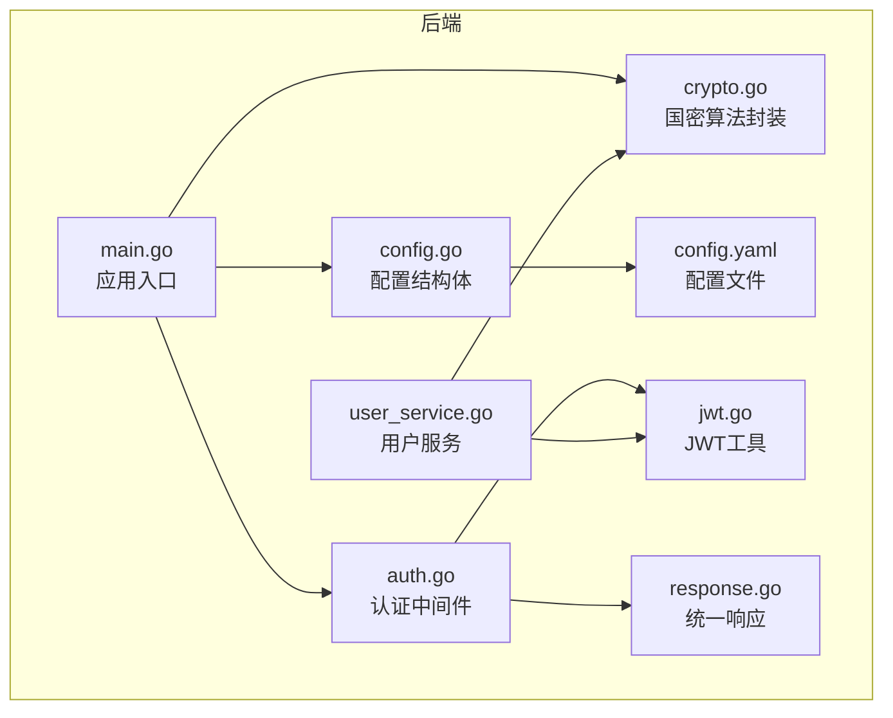
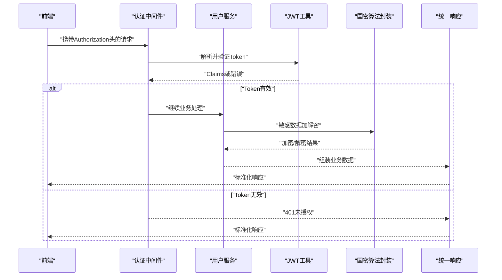
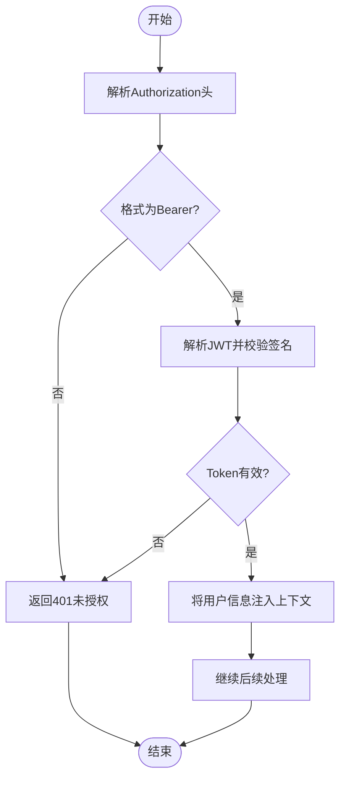
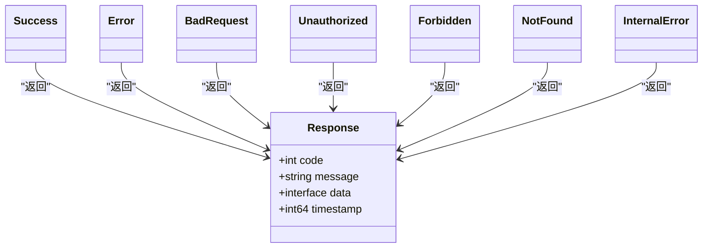
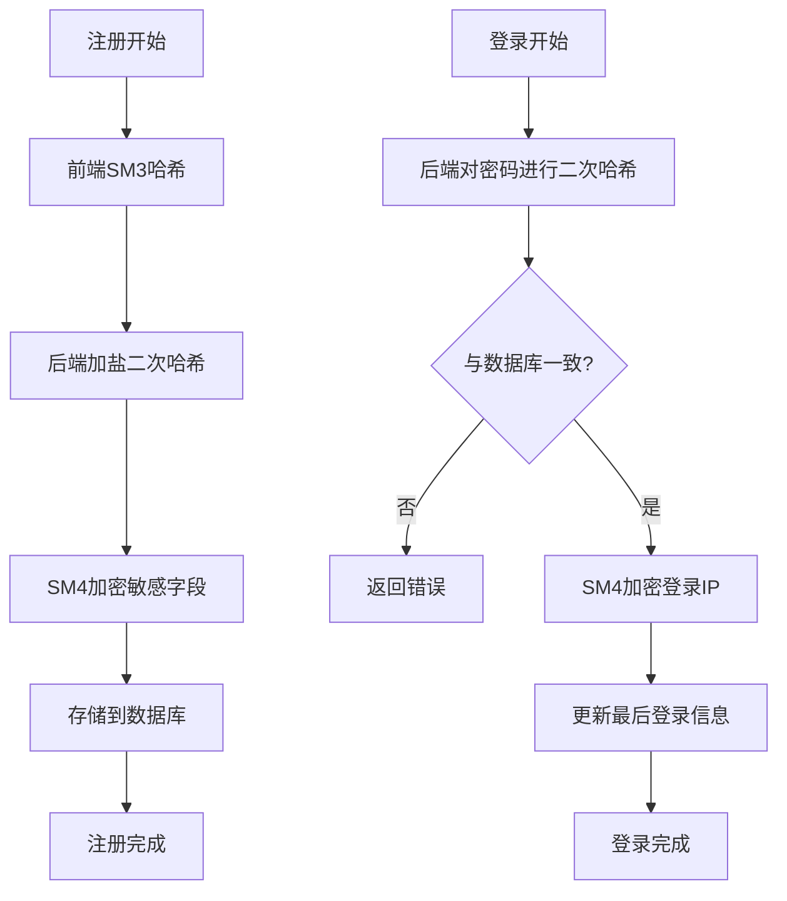
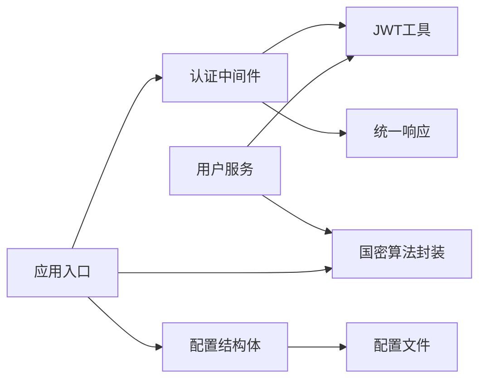

# 安全考虑

<cite>
**本文引用的文件**
- [jwt.go](file://backed/pkg/utils/jwt.go)
- [response.go](file://backed/pkg/utils/response.go)
- [config.yaml](file://backed/config/config.yaml)
- [config.go](file://backed/pkg/config/config.go)
- [crypto.go](file://backed/internal/crypto/crypto.go)
- [auth.go](file://backed/internal/middleware/auth.go)
- [main.go](file://backed/cmd/main.go)
- [user_service.go](file://backed/internal/service/user_service.go)
- [hash_password.go](file://backed/tools/hash_password.go)
- [SM_user_module.sql](file://database/SM_user_module.sql)
- [规划.md](file://规划.md)
- [login.vue](file://fonted/pages/login/login.vue)
- [crypto.js](file://fonted/utils/crypto.js)
- [测试脚本.md](file://测试脚本.md)
</cite>

## 目录
1. [简介](#简介)
2. [项目结构](#项目结构)
3. [核心组件](#核心组件)
4. [架构总览](#架构总览)
5. [详细组件分析](#详细组件分析)
6. [依赖关系分析](#依赖关系分析)
7. [性能与安全权衡](#性能与安全权衡)
8. [故障排查指南](#故障排查指南)
9. [结论](#结论)
10. [附录](#附录)

## 简介
本文件聚焦系统安全性，围绕身份认证、授权与数据保护三大主题展开，结合代码库中的JWT令牌、统一响应格式、配置项、国密算法与常见安全威胁防护，给出面向开发者的最佳实践与漏洞防范指南。文档同时提供可视化图示，帮助不同技术背景的读者理解系统安全设计与实现。

## 项目结构
后端采用Go语言与Gin框架，安全相关能力主要分布在以下模块：
- 认证与授权：JWT工具、认证中间件、CORS中间件
- 统一响应：标准化响应体，便于前端一致处理与安全提示
- 配置管理：集中式配置加载，包含JWT密钥、过期时间、国密参数等
- 数据保护：国密SM3/SM4/SM2算法封装，贯穿注册、登录、信息读写等流程
- 入口与中间件：应用启动时初始化国密、数据库、静态资源与CORS

图表来源
- [main.go](file://backed/cmd/main.go#L1-L64)
- [auth.go](file://backed/internal/middleware/auth.go#L1-L61)
- [jwt.go](file://backed/pkg/utils/jwt.go#L1-L53)
- [response.go](file://backed/pkg/utils/response.go#L1-L69)
- [config.go](file://backed/pkg/config/config.go#L1-L78)
- [config.yaml](file://backed/config/config.yaml#L1-L37)
- [crypto.go](file://backed/internal/crypto/crypto.go#L1-L121)
- [user_service.go](file://backed/internal/service/user_service.go#L1-L200)

章节来源
- [main.go](file://backed/cmd/main.go#L1-L64)
- [config.go](file://backed/pkg/config/config.go#L1-L78)
- [config.yaml](file://backed/config/config.yaml#L1-L37)

## 核心组件
- JWT令牌工具：负责生成、解析与校验，承载用户标识与角色信息
- 统一响应格式：标准化HTTP响应，便于前端统一处理与安全提示
- 配置系统：集中加载与暴露JWT密钥、过期时间、国密参数等
- 国密算法封装：SM3哈希、SM4对称加密、SM2非对称加解密
- 认证中间件：拦截请求，校验Authorization头与JWT有效性
- 用户服务：在注册、登录、信息读取等流程中使用国密算法保护敏感数据

章节来源
- [jwt.go](file://backed/pkg/utils/jwt.go#L1-L53)
- [response.go](file://backed/pkg/utils/response.go#L1-L69)
- [config.go](file://backed/pkg/config/config.go#L1-L78)
- [config.yaml](file://backed/config/config.yaml#L1-L37)
- [crypto.go](file://backed/internal/crypto/crypto.go#L1-L121)
- [auth.go](file://backed/internal/middleware/auth.go#L1-L61)
- [user_service.go](file://backed/internal/service/user_service.go#L1-L200)

## 架构总览
下图展示从客户端到后端的关键交互与安全控制点，包括认证中间件、JWT令牌、统一响应与国密数据保护。

图表来源
- [auth.go](file://backed/internal/middleware/auth.go#L1-L61)
- [jwt.go](file://backed/pkg/utils/jwt.go#L1-L53)
- [response.go](file://backed/pkg/utils/response.go#L1-L69)
- [user_service.go](file://backed/internal/service/user_service.go#L1-L200)
- [crypto.go](file://backed/internal/crypto/crypto.go#L1-L121)

## 详细组件分析

### JWT令牌：生成、验证与刷新
- 生成逻辑
  - Claims包含用户ID、用户名、角色及标准声明（签发时间、过期时间），使用对称签名方法与配置中的密钥生成签名串
  - 过期时间来源于配置项，单位为秒
- 验证逻辑
  - 从Authorization头解析Bearer Token，使用同一密钥进行解析与校验
  - 若解析失败或签名无效，返回未授权
- 刷新机制
  - 当前实现未提供专用刷新接口；建议在生产环境引入刷新令牌（Refresh Token）与黑名单机制，以降低长期持有访问令牌的风险

图表来源
- [auth.go](file://backed/internal/middleware/auth.go#L1-L61)
- [jwt.go](file://backed/pkg/utils/jwt.go#L1-L53)

章节来源
- [jwt.go](file://backed/pkg/utils/jwt.go#L1-L53)
- [auth.go](file://backed/internal/middleware/auth.go#L1-L61)
- [config.yaml](file://backed/config/config.yaml#L21-L24)

### 统一响应格式：安全考虑
- 设计要点
  - 统一的响应体包含状态码、消息、数据与时间戳，便于前端统一处理与日志记录
  - 对错误场景提供明确的状态码映射（如400、401、403、404、500）
- 安全意义
  - 避免泄露过多内部细节，统一错误消息有助于防止信息泄露
  - 时间戳可用于审计与追踪

图表来源
- [response.go](file://backed/pkg/utils/response.go#L1-L69)

章节来源
- [response.go](file://backed/pkg/utils/response.go#L1-L69)

### 配置项：安全相关参数
- JWT配置
  - secret：JWT签名密钥，必须妥善保管且定期轮换
  - expires_in：令牌有效期（秒），建议根据业务场景设置合理值
- 国密配置
  - sm4_key：SM4对称密钥，十六进制字符串，需在部署时替换
  - sm2_private_key/sm2_public_key：首次启动自动生成，需安全保存
- 上传限制
  - max_size：文件最大尺寸
  - allowed_types：允许的MIME类型
  - upload_path：上传目录

章节来源
- [config.yaml](file://backed/config/config.yaml#L1-L37)
- [config.go](file://backed/pkg/config/config.go#L1-L78)

### 国密算法：数据保护与隐私
- 算法能力
  - SM3：哈希摘要，用于密码二次哈希与完整性校验
  - SM4：对称加密，用于敏感字段（邮箱、手机号、真实姓名、登录IP等）的存储与传输
  - SM2：非对称加密，用于前后端通信中的敏感数据保护
- 使用场景
  - 注册：前端对密码进行SM3哈希，后端再以用户名为盐进行二次哈希；敏感信息使用SM4加密存储
  - 登录：后端对提交的密码进行相同的二次哈希比对；登录IP使用SM4加密存储
  - 信息读取：从数据库读取后，对敏感字段进行解密返回
- 安全边界
  - 数据库仅存储密文，管理员无法读取明文
  - 传输层通过HTTPS与国密TLS增强保护
  - 前端在本地进行SM3哈希，后端进行加盐二次哈希，双重保护

图表来源
- [user_service.go](file://backed/internal/service/user_service.go#L1-L200)
- [crypto.go](file://backed/internal/crypto/crypto.go#L1-L121)
- [hash_password.go](file://backed/tools/hash_password.go#L1-L63)
- [SM_user_module.sql](file://database/SM_user_module.sql#L290-L324)

章节来源
- [user_service.go](file://backed/internal/service/user_service.go#L1-L200)
- [crypto.go](file://backed/internal/crypto/crypto.go#L1-L121)
- [hash_password.go](file://backed/tools/hash_password.go#L1-L63)
- [SM_user_module.sql](file://database/SM_user_module.sql#L290-L324)

### 认证中间件：拦截与校验
- 行为
  - 从Authorization头提取Bearer Token
  - 校验格式与有效性，无效则返回401
  - 成功后将用户ID、用户名、角色注入上下文，供后续处理器使用
- CORS
  - 提供跨域支持，但默认允许所有来源，建议在生产环境按需收紧

章节来源
- [auth.go](file://backed/internal/middleware/auth.go#L1-L61)

### 前端配合：密码哈希与存储
- 登录页
  - 前端对密码进行SM3哈希后再提交，后端再进行加盐二次哈希
  - 登录成功后保存token与用户信息至本地存储
- 密码强度校验
  - 前端提供密码强度校验逻辑，提升整体安全基线

章节来源
- [login.vue](file://fonted/pages/login/login.vue#L199-L249)
- [crypto.js](file://fonted/utils/crypto.js#L96-L126)

## 依赖关系分析
- 组件耦合
  - 认证中间件依赖JWT工具进行解析
  - 用户服务在注册/登录/读取信息时依赖国密算法封装
  - 配置系统为JWT与国密参数提供集中来源
- 外部依赖
  - Gin框架提供路由与中间件生态
  - 国密库提供SM3/SM4/SM2实现
  - Viper提供配置加载

图表来源
- [auth.go](file://backed/internal/middleware/auth.go#L1-L61)
- [jwt.go](file://backed/pkg/utils/jwt.go#L1-L53)
- [response.go](file://backed/pkg/utils/response.go#L1-L69)
- [user_service.go](file://backed/internal/service/user_service.go#L1-L200)
- [crypto.go](file://backed/internal/crypto/crypto.go#L1-L121)
- [config.go](file://backed/pkg/config/config.go#L1-L78)
- [config.yaml](file://backed/config/config.yaml#L1-L37)
- [main.go](file://backed/cmd/main.go#L1-L64)

章节来源
- [auth.go](file://backed/internal/middleware/auth.go#L1-L61)
- [jwt.go](file://backed/pkg/utils/jwt.go#L1-L53)
- [response.go](file://backed/pkg/utils/response.go#L1-L69)
- [user_service.go](file://backed/internal/service/user_service.go#L1-L200)
- [crypto.go](file://backed/internal/crypto/crypto.go#L1-L121)
- [config.go](file://backed/pkg/config/config.go#L1-L78)
- [config.yaml](file://backed/config/config.yaml#L1-L37)
- [main.go](file://backed/cmd/main.go#L1-L64)

## 性能与安全权衡
- JWT过期时间
  - 较短的过期时间提升安全性，但增加刷新频率；较长的过期时间降低用户体验
  - 建议结合业务场景设置合理的expires_in，并在生产环境引入刷新令牌
- 国密算法开销
  - SM3/SM4/SM2均为国密算法，计算成本高于部分通用算法；可通过批量处理与缓存优化
- CORS策略
  - 生产环境建议限制允许的Origin与Headers，避免过度宽松导致跨域风险

[本节为通用指导，无需列出具体文件来源]

## 故障排查指南
- Token未携带或格式错误
  - 症状：返回401未授权
  - 排查：确认Authorization头格式为Bearer <token>，并在前端正确保存与传递
- CORS跨域问题
  - 症状：浏览器跨域报错
  - 排查：检查CORS中间件配置，必要时限制允许的Origin与Methods
- 数据库连接失败
  - 症状：启动时报Access denied
  - 排查：核对配置文件中的数据库凭据与数据库是否已初始化
- 密码哈希不匹配
  - 症状：登录失败
  - 排查：确认前端已进行SM3哈希，后端使用用户名作为盐进行二次哈希

章节来源
- [auth.go](file://backed/internal/middleware/auth.go#L1-L61)
- [测试脚本.md](file://测试脚本.md#L219-L255)

## 结论
本系统通过JWT认证、统一响应与国密算法形成较为完整的安全体系：前端进行SM3哈希，后端进行加盐二次哈希，敏感数据采用SM4加密存储，传输与通信通过HTTPS与SM2增强保护。建议在生产环境中补充刷新令牌、收紧CORS策略、强化密钥管理与轮换，并持续进行安全审计与渗透测试，以应对不断演进的威胁环境。

[本节为总结性内容，无需列出具体文件来源]

## 附录

### 安全最佳实践清单
- 密钥与配置
  - JWT密钥与SM4密钥必须安全存储与轮换，避免硬编码在源码或配置文件中
  - 配置文件在生产环境应只读，且通过环境变量或密钥管理服务注入
- 认证与授权
  - 引入刷新令牌与黑名单，限制单次访问令牌的生命周期
  - 对高权限接口实施细粒度授权与审计
- 数据保护
  - 仅在必要时解密敏感数据，尽量在加密域内完成计算
  - 对上传文件进行严格类型与大小限制，并进行病毒扫描
- 日志与监控
  - 记录关键安全事件（登录失败、越权访问、密钥轮换等），并设置告警
- 前端安全
  - 保持密码强度校验与输入净化，避免XSS与CSRF
  - 对敏感操作进行二次确认与CAPTCHA校验

### 常见威胁与缓解
- 重放攻击
  - 使用一次性nonce与时间戳，服务端校验窗口期内请求
- 中间人攻击
  - 强制HTTPS与国密TLS，校验证书链与主机名
- 数据库泄露
  - 全字段SM4加密存储，最小化明文暴露面
- 内部人员滥用
  - 基于属性的访问控制与操作审计，最小权限原则
- AI模型逆向
  - 加密数据计算与差分隐私，限制模型输出粒度

章节来源
- [规划.md](file://规划.md#L474-L579)
- [SM_user_module.sql](file://database/SM_user_module.sql#L290-L324)