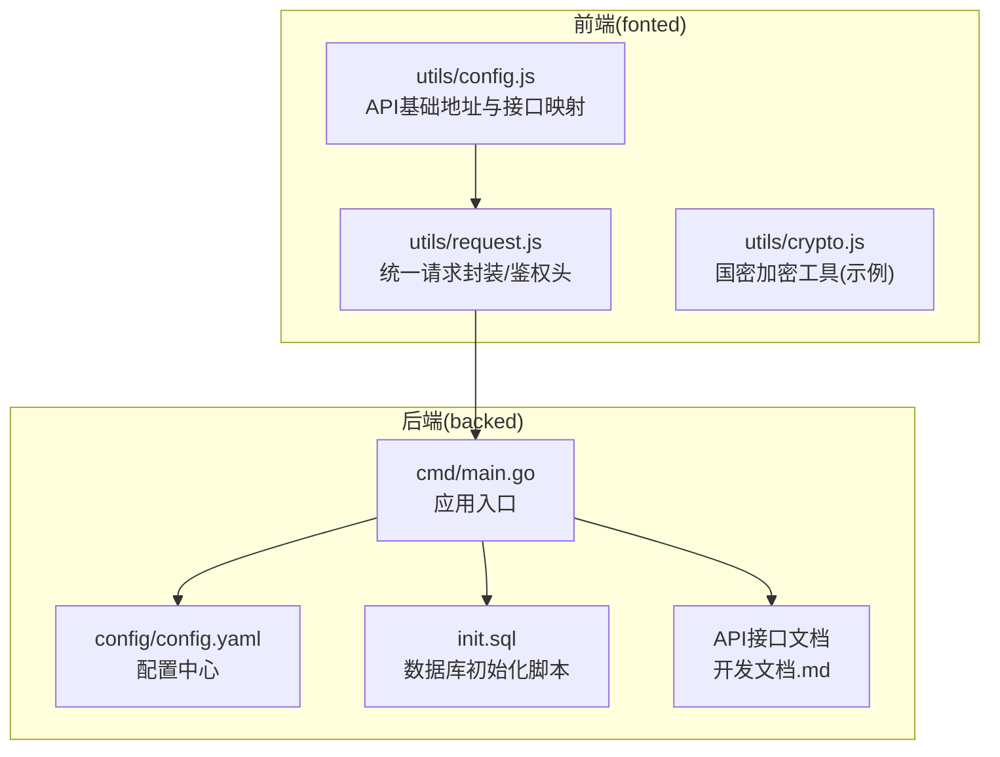
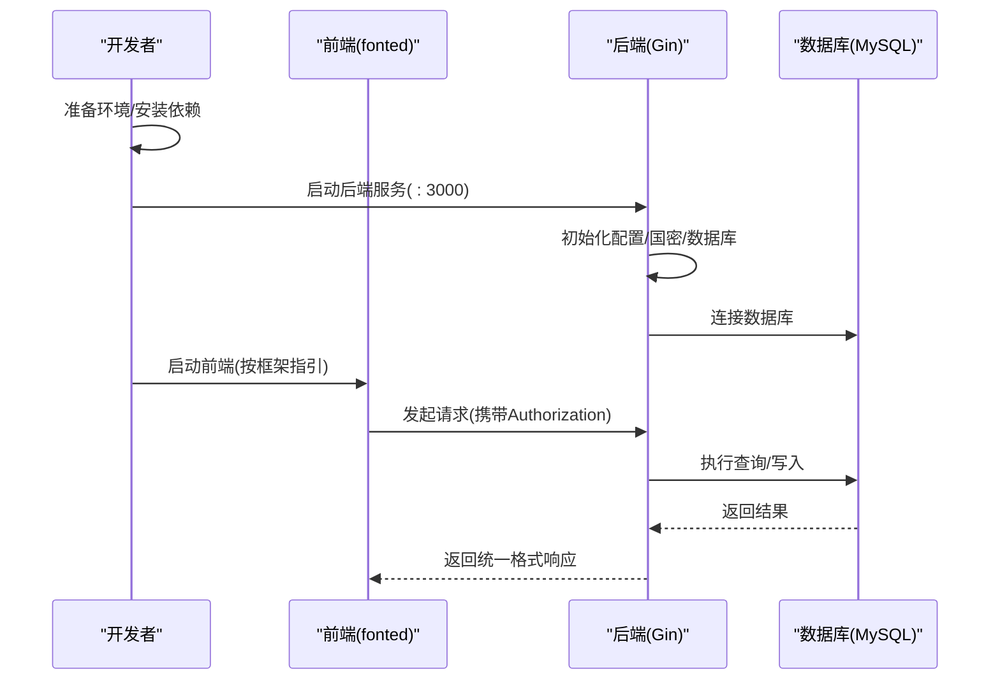
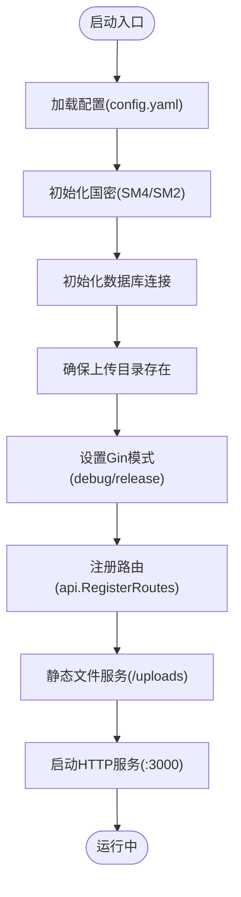

# 快速入门

<cite>
**本文引用的文件**
- [快速启动指南.md](file://backed/快速启动指南.md)
- [前后端联调指南.md](file://前后端联调指南.md)
- [README.md（后端）](file://backed/README.md)
- [main.go](file://backed/cmd/main.go)
- [config.yaml](file://backed/config/config.yaml)
- [init.sql](file://backed/init.sql)
- [config.js](file://fonted/utils/config.js)
- [request.js](file://fonted/utils/request.js)
- [crypto.js](file://fonted/utils/crypto.js)
- [开发文档.md](file://开发文档.md)
</cite>

## 目录
1. [简介](#简介)
2. [项目结构](#项目结构)
3. [核心组件](#核心组件)
4. [架构总览](#架构总览)
5. [详细组件分析](#详细组件分析)
6. [依赖关系分析](#依赖关系分析)
7. [性能与安全注意事项](#性能与安全注意事项)
8. [故障排查指南](#故障排查指南)
9. [结论](#结论)
10. [附录](#附录)

## 简介
本快速入门面向新开发者，目标是在最短时间内完成环境准备、代码克隆、依赖安装、数据库初始化与应用启动，并进行基础功能测试。文档依据“快速启动指南.md”和“前后端联调指南.md”，给出可操作的步骤、默认端口、前后端启动命令以及基本联调测试方法，帮助你快速上手开发与测试。

## 项目结构
项目采用前后端分离架构：
- 后端（Go + Gin）位于 backed/ 目录，提供REST API、国密加密、JWT鉴权、数据库连接与静态文件服务。
- 前端（uni-app/Vue）位于 fonted/ 目录，通过统一请求封装与后端交互，使用本地存储保存Token与用户信息。

图表来源
- [main.go](file://backed/cmd/main.go#L1-L64)
- [config.yaml](file://backed/config/config.yaml#L1-L37)
- [init.sql](file://backed/init.sql#L1-L200)
- [config.js](file://fonted/utils/config.js#L1-L65)
- [request.js](file://fonted/utils/request.js#L1-L222)
- [crypto.js](file://fonted/utils/crypto.js#L1-L255)
- [开发文档.md](file://开发文档.md#L1-L200)

章节来源
- [README.md（后端）](file://backed/README.md#L1-L120)
- [快速启动指南.md](file://backed/快速启动指南.md#L1-L120)
- [前后端联调指南.md](file://前后端联调指南.md#L1-L120)

## 核心组件
- 后端服务
  - 启动入口：cmd/main.go
  - 配置中心：config/config.yaml
  - 数据库初始化：init.sql
  - 默认端口：3000
- 前端服务
  - API基础地址：utils/config.js
  - 请求封装与鉴权：utils/request.js
  - 国密加密工具（示例）：utils/crypto.js

章节来源
- [main.go](file://backed/cmd/main.go#L1-L64)
- [config.yaml](file://backed/config/config.yaml#L1-L37)
- [config.js](file://fonted/utils/config.js#L1-L65)
- [request.js](file://fonted/utils/request.js#L1-L222)
- [crypto.js](file://fonted/utils/crypto.js#L1-L255)

## 架构总览
后端以Gin为核心，加载配置、初始化国密与数据库、注册路由并启动HTTP服务；前端通过统一请求封装自动附加Authorization头，访问后端API。

图表来源
- [main.go](file://backed/cmd/main.go#L1-L64)
- [config.yaml](file://backed/config/config.yaml#L1-L37)
- [request.js](file://fonted/utils/request.js#L1-L222)

## 详细组件分析

### 后端启动与配置
- 启动命令
  - 进入后端目录并运行：go run cmd/main.go
  - 预期输出包含“Server is running on :3000”
- 端口与模式
  - 默认端口：3000
  - 模式：debug（可在config.yaml中调整为release）
- 关键配置项
  - 数据库连接：host/port/username/password/database
  - JWT密钥与过期时间
  - SM4加密密钥（生产环境必须替换）
  - 上传目录与文件类型限制
- 数据库初始化
  - 执行init.sql创建数据库与表结构
  - 默认管理员账号：admin/Admin123!@#

章节来源
- [快速启动指南.md](file://backed/快速启动指南.md#L79-L120)
- [README.md（后端）](file://backed/README.md#L168-L190)
- [config.yaml](file://backed/config/config.yaml#L1-L37)
- [init.sql](file://backed/init.sql#L1-L200)

### 前端启动与联调
- 前端API基础地址
  - utils/config.js中定义API_BASE_URL为http://localhost:3000
- 请求封装与鉴权
  - utils/request.js会在有Token时自动添加Authorization: Bearer <token>
  - 统一错误处理：401跳转登录页
- 国密加密工具
  - utils/crypto.js提供SM3/SM4/SM2示例（开发阶段），实际项目应接入真实国密库
- 启动前端
  - 根据所用框架（如HBuilderX/uni-app CLI）执行相应命令启动开发服务器

章节来源
- [config.js](file://fonted/utils/config.js#L1-L65)
- [request.js](file://fonted/utils/request.js#L1-L222)
- [crypto.js](file://fonted/utils/crypto.js#L1-L255)
- [前后端联调指南.md](file://前后端联调指南.md#L77-L120)

### 基础功能测试
- 登录测试
  - 使用默认管理员账号admin/Admin123!@#
  - 请求：POST /api/user/login
  - 成功后返回token，后续请求需在Header中携带Authorization: Bearer <token>
- 注册测试
  - 请求：POST /api/user/register
  - 前端应先对密码进行SM3哈希再发送（开发文档与联调指南均有说明）
- 获取用户信息
  - 请求：GET /api/user/info
  - 需携带Authorization头
- 医生列表
  - 请求：GET /api/user/doctors
- 申请成为医生
  - 请求：POST /api/user/apply-doctor
  - 文件上传：POST /api/file/upload（前端封装已包含Authorization）

章节来源
- [快速启动指南.md](file://backed/快速启动指南.md#L93-L143)
- [前后端联调指南.md](file://前后端联调指南.md#L91-L180)
- [开发文档.md](file://开发文档.md#L143-L200)

## 依赖关系分析
后端启动流程的关键依赖链如下：

图表来源
- [main.go](file://backed/cmd/main.go#L1-L64)
- [config.yaml](file://backed/config/config.yaml#L1-L37)

章节来源
- [main.go](file://backed/cmd/main.go#L1-L64)

## 性能与安全注意事项
- 性能
  - 登录与查询接口响应时间应满足指南中的阈值
  - 建议开启Redis缓存、数据库索引优化与GZIP压缩
- 安全
  - 生产环境必须修改默认管理员密码、JWT密钥、SM4密钥
  - 建议启用HTTPS与限制数据库访问权限
  - 前端密码需先做SM3哈希，后端再做加盐哈希，敏感字段在数据库中以SM4加密存储

章节来源
- [快速启动指南.md](file://backed/快速启动指南.md#L182-L191)
- [README.md（后端）](file://backed/README.md#L384-L393)
- [前后端联调指南.md](file://前后端联调指南.md#L400-L430)

## 故障排查指南
- 端口被占用
  - 修改config.yaml中的server.port为其他可用端口
- 数据库连接失败
  - 检查MySQL服务是否运行、用户名密码是否正确、数据库SM是否存在
- Go命令不存在
  - 确认已安装Go并加入PATH
- 依赖下载慢
  - 可配置GOPROXY代理
- 前端请求失败（网络错误/401未授权）
  - 确认后端已启动、CORS已配置、Authorization头格式正确
- 加密数据解密失败
  - 检查SM4密钥配置、前后端密钥一致、查看后端日志

章节来源
- [快速启动指南.md](file://backed/快速启动指南.md#L152-L175)
- [前后端联调指南.md](file://前后端联调指南.md#L184-L246)

## 结论
按照本文档的步骤，你可以快速完成环境准备、数据库初始化、后端与前端启动，并完成基础功能测试。建议在开发过程中逐步完善国密算法的实际集成、完善前端Mock开关与联调流程，并在进入生产前完成安全加固与性能优化。

## 附录
- 默认端口
  - 后端：3000
  - 前端：按框架启动命令启动（通常为本地开发端口）
- 默认账号
  - 管理员：admin/Admin123!@#（首次登录后请立即修改密码）
- 常用命令
  - 后端：go run cmd/main.go
  - 前端：按框架指引启动开发服务器（例如HBuilderX或uni-app CLI）