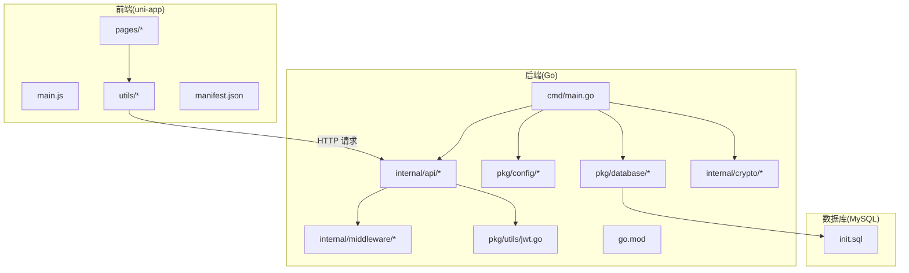
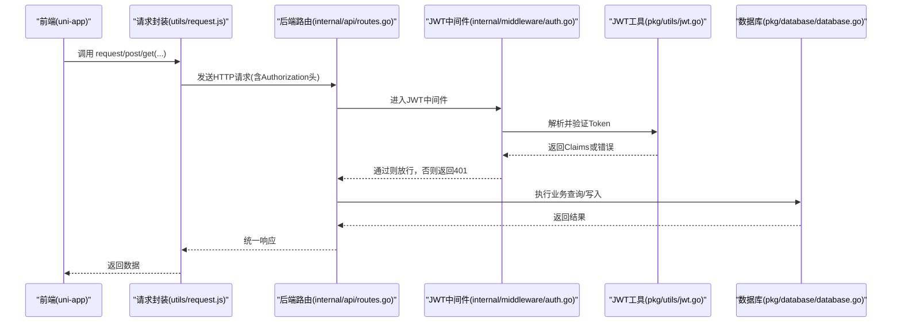
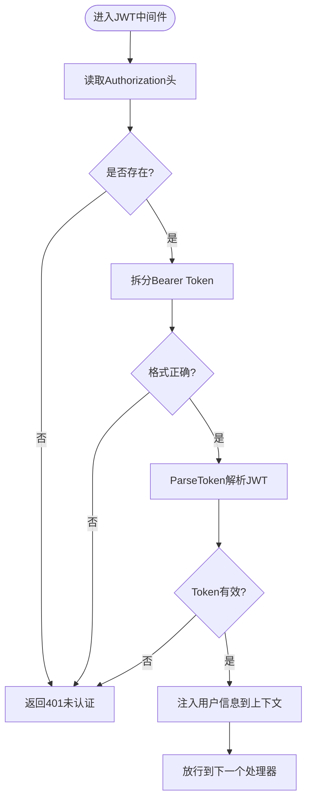
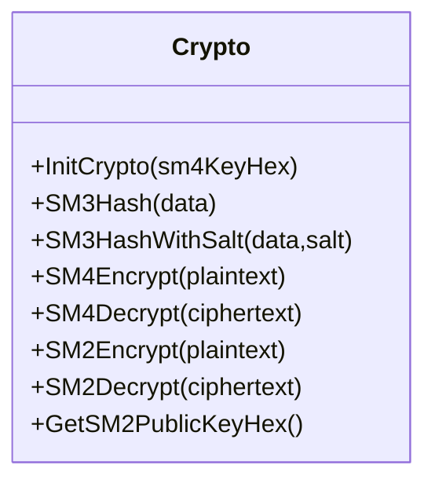
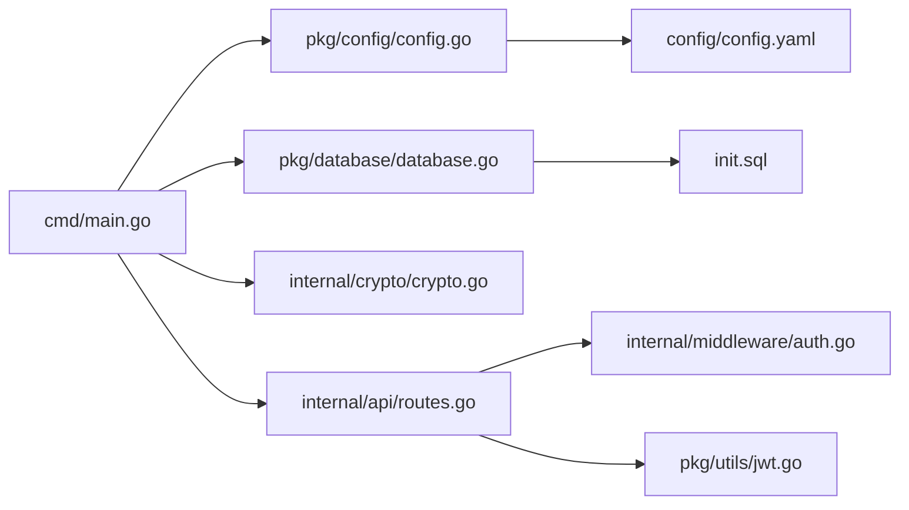

# 技术栈

<cite>
**本文引用的文件**
- [go.mod](file://backed/go.mod)
- [main.go](file://backed/cmd/main.go)
- [routes.go](file://backed/internal/api/routes.go)
- [auth.go](file://backed/internal/middleware/auth.go)
- [config.go](file://backed/pkg/config/config.go)
- [config.yaml](file://backed/config/config.yaml)
- [database.go](file://backed/pkg/database/database.go)
- [jwt.go](file://backed/pkg/utils/jwt.go)
- [crypto.go](file://backed/internal/crypto/crypto.go)
- [init.sql](file://backed/init.sql)
- [request.js](file://fonted/utils/request.js)
- [config.js](file://fonted/utils/config.js)
- [login.vue](file://fonted/pages/login/login.vue)
- [index.vue](file://fonted/pages/index/index.vue)
- [manifest.json](file://fonted/manifest.json)
</cite>

## 目录
1. [引言](#引言)
2. [项目结构](#项目结构)
3. [核心组件](#核心组件)
4. [架构总览](#架构总览)
5. [详细组件分析](#详细组件分析)
6. [依赖关系分析](#依赖关系分析)
7. [性能考虑](#性能考虑)
8. [故障排查指南](#故障排查指南)
9. [结论](#结论)

## 引言
本技术栈文档聚焦于本项目的前后端核心技术选型与协作方式，涵盖：
- 后端：Go 语言、Gin Web 框架、GORM ORM、Viper 配置管理、tjfoc/gmsm 国密算法库
- 前端：uni-app 框架及配套工具链
- 数据库：MySQL 与 GORM 的集成
- 认证：JWT 令牌机制
- 配置：config.yaml 与 Viper 的协同
- 安全：基于国密 SM2/SM3/SM4 的数据加密策略

目标是帮助开发者理解各技术的作用、协同方式、应用场景与最佳实践，并提供排障与性能优化建议。

## 项目结构
项目采用“后端 Go + 前端 uni-app”的双端分离架构，后端提供 RESTful API，前端通过统一请求封装与后端交互；数据库为 MySQL，配合 GORM 实现 ORM 映射与连接池管理；配置由 Viper 从 YAML 文件加载；认证采用 JWT；安全方面引入 tjfoc/gmsm 实现国密算法。

图表来源
- [main.go](file://backed/cmd/main.go#L1-L64)
- [routes.go](file://backed/internal/api/routes.go#L1-L95)
- [config.go](file://backed/pkg/config/config.go#L1-L78)
- [database.go](file://backed/pkg/database/database.go#L1-L48)
- [jwt.go](file://backed/pkg/utils/jwt.go#L1-L53)
- [crypto.go](file://backed/internal/crypto/crypto.go#L1-L121)
- [config.yaml](file://backed/config/config.yaml#L1-L37)
- [request.js](file://fonted/utils/request.js#L1-L222)
- [config.js](file://fonted/utils/config.js#L1-L65)
- [login.vue](file://fonted/pages/login/login.vue#L1-L406)
- [index.vue](file://fonted/pages/index/index.vue#L1-L800)
- [manifest.json](file://fonted/manifest.json#L1-L73)
- [init.sql](file://backed/init.sql#L1-L478)

章节来源
- [main.go](file://backed/cmd/main.go#L1-L64)
- [routes.go](file://backed/internal/api/routes.go#L1-L95)
- [config.go](file://backed/pkg/config/config.go#L1-L78)
- [database.go](file://backed/pkg/database/database.go#L1-L48)
- [jwt.go](file://backed/pkg/utils/jwt.go#L1-L53)
- [crypto.go](file://backed/internal/crypto/crypto.go#L1-L121)
- [config.yaml](file://backed/config/config.yaml#L1-L37)
- [request.js](file://fonted/utils/request.js#L1-L222)
- [config.js](file://fonted/utils/config.js#L1-L65)
- [login.vue](file://fonted/pages/login/login.vue#L1-L406)
- [index.vue](file://fonted/pages/index/index.vue#L1-L800)
- [manifest.json](file://fonted/manifest.json#L1-L73)
- [init.sql](file://backed/init.sql#L1-L478)

## 核心组件
- 后端运行入口与路由装配：后端通过入口文件加载配置、初始化国密、数据库与静态资源，随后注册路由并启动服务。
- Gin Web 框架：负责路由注册、中间件（CORS、JWT 认证）与 HTTP 请求处理。
- GORM ORM：负责 MySQL 连接、连接池配置与模型映射。
- Viper 配置管理：从 YAML 文件加载 server、database、redis、jwt、crypto、upload 等配置项。
- 国密算法库 tjfoc/gmsm：提供 SM2/SM3/SM4 算法，用于密钥生成、哈希与加解密。
- JWT 工具：生成与解析 JWT，携带用户标识与角色信息。
- 前端 uni-app：通过统一请求封装与后端交互，按角色展示不同功能入口。

章节来源
- [main.go](file://backed/cmd/main.go#L1-L64)
- [routes.go](file://backed/internal/api/routes.go#L1-L95)
- [auth.go](file://backed/internal/middleware/auth.go#L1-L61)
- [config.go](file://backed/pkg/config/config.go#L1-L78)
- [config.yaml](file://backed/config/config.yaml#L1-L37)
- [database.go](file://backed/pkg/database/database.go#L1-L48)
- [jwt.go](file://backed/pkg/utils/jwt.go#L1-L53)
- [crypto.go](file://backed/internal/crypto/crypto.go#L1-L121)
- [request.js](file://fonted/utils/request.js#L1-L222)
- [config.js](file://fonted/utils/config.js#L1-L65)

## 架构总览
后端启动流程：加载配置 → 初始化国密算法 → 初始化数据库 → 设置 Gin 模式与中间件 → 注册路由 → 启动 HTTP 服务。前端通过统一请求封装发起 API 调用，携带 Authorization 头，后端通过 JWT 中间件进行鉴权。

图表来源
- [request.js](file://fonted/utils/request.js#L1-L222)
- [routes.go](file://backed/internal/api/routes.go#L1-L95)
- [auth.go](file://backed/internal/middleware/auth.go#L1-L61)
- [jwt.go](file://backed/pkg/utils/jwt.go#L1-L53)
- [database.go](file://backed/pkg/database/database.go#L1-L48)

章节来源
- [main.go](file://backed/cmd/main.go#L1-L64)
- [routes.go](file://backed/internal/api/routes.go#L1-L95)
- [auth.go](file://backed/internal/middleware/auth.go#L1-L61)
- [jwt.go](file://backed/pkg/utils/jwt.go#L1-L53)
- [request.js](file://fonted/utils/request.js#L1-L222)

## 详细组件分析

### 后端技术栈与版本
- Go 语言：项目使用 Go 1.21，保证了较新的标准库与生态支持。
- Gin Web 框架：用于快速搭建 REST API，支持中间件与路由分组。
- GORM ORM：提供 MySQL 驱动与模型映射能力，支持连接池配置与事务。
- Viper 配置管理：从 YAML 文件读取配置，映射到结构体，支持运行时热更新（本项目通过一次性加载）。
- tjfoc/gmsm 国密算法库：提供 SM2/SM3/SM4 算法，满足国产化安全需求。

章节来源
- [go.mod](file://backed/go.mod#L1-L58)
- [main.go](file://backed/cmd/main.go#L1-L64)
- [config.go](file://backed/pkg/config/config.go#L1-L78)
- [config.yaml](file://backed/config/config.yaml#L1-L37)
- [crypto.go](file://backed/internal/crypto/crypto.go#L1-L121)

### Gin 与路由组织
- 路由分组：用户、问诊、病历、通知、密钥、文件上传、管理员等模块均以 /api/{module} 分组，清晰隔离。
- 认证中间件：除公开接口外，其余接口均通过 AuthMiddleware 进行 JWT 校验。
- CORS 中间件：允许跨域请求，简化前后端联调。

章节来源
- [routes.go](file://backed/internal/api/routes.go#L1-L95)
- [auth.go](file://backed/internal/middleware/auth.go#L1-L61)

### GORM 与 MySQL 集成
- 连接参数：从配置中读取主机、端口、用户名、密码、数据库名与字符集。
- 连接池：设置最大空闲连接数、最大打开连接数与连接生命周期。
- 数据模型：数据库初始化脚本定义了用户、问诊、病历、通知等核心表，包含敏感字段的加密与完整性校验设计。

章节来源
- [database.go](file://backed/pkg/database/database.go#L1-L48)
- [init.sql](file://backed/init.sql#L1-L478)

### Viper 配置管理
- 配置文件：config.yaml 定义 server、database、redis、jwt、crypto、upload 等配置项。
- 结构体映射：pkg/config/config.go 定义结构体并通过 viper.Unmarshal 绑定。
- 加载流程：入口文件加载配置后传递给数据库、加密与路由初始化。

章节来源
- [config.yaml](file://backed/config/config.yaml#L1-L37)
- [config.go](file://backed/pkg/config/config.go#L1-L78)
- [main.go](file://backed/cmd/main.go#L1-L64)

### JWT 认证机制
- 生成：pkg/utils/jwt.go 生成 HS256 签名的 JWT，包含用户ID、用户名、角色与过期时间。
- 解析：中间件从 Authorization 头提取 Bearer Token 并调用 ParseToken 校验有效性。
- 上下文注入：通过中间件将用户信息注入上下文，供后续处理器使用。

图表来源
- [auth.go](file://backed/internal/middleware/auth.go#L1-L61)
- [jwt.go](file://backed/pkg/utils/jwt.go#L1-L53)

章节来源
- [jwt.go](file://backed/pkg/utils/jwt.go#L1-L53)
- [auth.go](file://backed/internal/middleware/auth.go#L1-L61)

### 国密算法与安全策略
- SM2：用于密钥对生成与加解密，前端登录时可获取公钥用于加密传输。
- SM3：用于哈希与完整性校验，数据库层对敏感字段使用 SM3 校验。
- SM4：用于对称加密，存储敏感字段（如邮箱、手机号、身份证、登录IP等）。
- 初始化：入口文件加载配置后初始化 SM4 密钥与 SM2 密钥对。

图表来源
- [crypto.go](file://backed/internal/crypto/crypto.go#L1-L121)

章节来源
- [crypto.go](file://backed/internal/crypto/crypto.go#L1-L121)
- [main.go](file://backed/cmd/main.go#L1-L64)
- [init.sql](file://backed/init.sql#L1-L478)

### 前端技术栈与 uni-app
- 框架：基于 Vue 3，使用 manifest.json 指定 vueVersion 为 3，支持多端编译（App、小程序、快应用等）。
- 请求封装：utils/request.js 统一封装 GET/POST/PUT/DELETE/上传等方法，自动添加 Authorization 头，统一错误处理。
- API 常量：utils/config.js 定义后端接口路径常量，便于集中维护。
- 登录页：pages/login/login.vue 对密码进行 SM3 哈希后再提交，提升传输安全性。
- 首页：pages/index/index.vue 根据用户角色动态展示快捷入口与数据。

章节来源
- [manifest.json](file://fonted/manifest.json#L1-L73)
- [request.js](file://fonted/utils/request.js#L1-L222)
- [config.js](file://fonted/utils/config.js#L1-L65)
- [login.vue](file://fonted/pages/login/login.vue#L1-L406)
- [index.vue](file://fonted/pages/index/index.vue#L1-L800)

## 依赖关系分析
后端依赖关系：入口文件依赖配置、数据库、加密与路由模块；路由依赖中间件与业务处理器；JWT 工具依赖配置；数据库驱动依赖 GORM 与 MySQL 驱动；配置依赖 Viper；加密依赖 tjfoc/gmsm。

图表来源
- [main.go](file://backed/cmd/main.go#L1-L64)
- [config.go](file://backed/pkg/config/config.go#L1-L78)
- [database.go](file://backed/pkg/database/database.go#L1-L48)
- [crypto.go](file://backed/internal/crypto/crypto.go#L1-L121)
- [routes.go](file://backed/internal/api/routes.go#L1-L95)
- [auth.go](file://backed/internal/middleware/auth.go#L1-L61)
- [jwt.go](file://backed/pkg/utils/jwt.go#L1-L53)
- [config.yaml](file://backed/config/config.yaml#L1-L37)
- [init.sql](file://backed/init.sql#L1-L478)

章节来源
- [go.mod](file://backed/go.mod#L1-L58)
- [main.go](file://backed/cmd/main.go#L1-L64)
- [routes.go](file://backed/internal/api/routes.go#L1-L95)
- [auth.go](file://backed/internal/middleware/auth.go#L1-L61)
- [config.go](file://backed/pkg/config/config.go#L1-L78)
- [database.go](file://backed/pkg/database/database.go#L1-L48)
- [jwt.go](file://backed/pkg/utils/jwt.go#L1-L53)
- [crypto.go](file://backed/internal/crypto/crypto.go#L1-L121)
- [config.yaml](file://backed/config/config.yaml#L1-L37)
- [init.sql](file://backed/init.sql#L1-L478)

## 性能考虑
- 连接池：GORM 通过 SQL 层面设置最大空闲/打开连接数与生命周期，避免频繁创建连接带来的开销。
- 中间件顺序：CORS 在前，减少不必要的业务处理；JWT 校验在路由分组内统一执行，避免重复逻辑。
- 静态资源：后端提供 /uploads 静态目录，前端直接访问上传文件，降低二次处理成本。
- 前端缓存：前端通过本地存储保存 token 与用户信息，减少重复登录与请求。
- 国密算法：SM4/SM2/SM3 的使用在安全与性能之间平衡，建议在批量数据处理时注意异步与并发控制。

[本节为通用指导，不直接分析具体文件]

## 故障排查指南
- 配置加载失败：检查 config.yaml 路径与键名是否正确，确认 viper.SetConfigPath 与 Unmarshal 是否成功。
- 数据库连接失败：核对主机、端口、用户名、密码与数据库名；检查字符集与时区设置；确认连接池参数合理。
- JWT 无效：确认 Authorization 头格式为 Bearer Token；检查 Secret 与过期时间配置；核对签发方与解析方一致。
- 国密初始化失败：确认 SM4 Key 为 32 位十六进制字符串；SM2 私钥/公钥生成是否成功。
- 前端请求失败：检查 API_BASE_URL 与接口路径；确认请求头 Authorization 是否正确；查看统一错误处理逻辑。

章节来源
- [config.go](file://backed/pkg/config/config.go#L1-L78)
- [config.yaml](file://backed/config/config.yaml#L1-L37)
- [database.go](file://backed/pkg/database/database.go#L1-L48)
- [jwt.go](file://backed/pkg/utils/jwt.go#L1-L53)
- [auth.go](file://backed/internal/middleware/auth.go#L1-L61)
- [request.js](file://fonted/utils/request.js#L1-L222)

## 结论
本项目通过 Go + Gin + GORM + Viper + tjfoc/gmsm 的组合，构建了高性能、可扩展且符合国产化安全要求的后端 API；前端采用 uni-app，具备良好的跨端适配能力。JWT 与国密算法贯穿认证与数据安全，配置管理与连接池优化提升了系统稳定性与性能。建议在生产环境中进一步完善密钥轮换、日志审计与监控告警体系，并持续关注依赖版本升级与安全补丁。