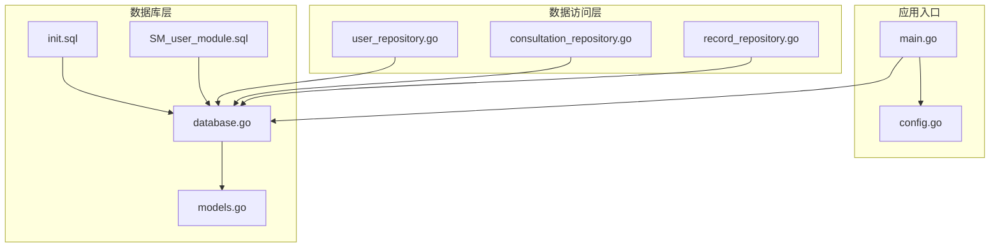
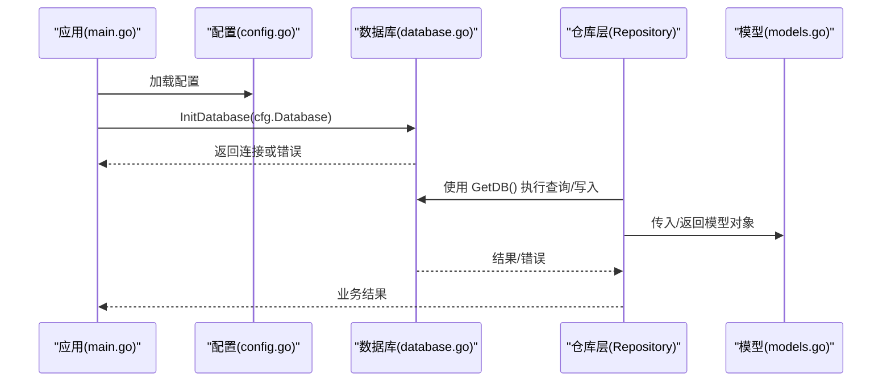
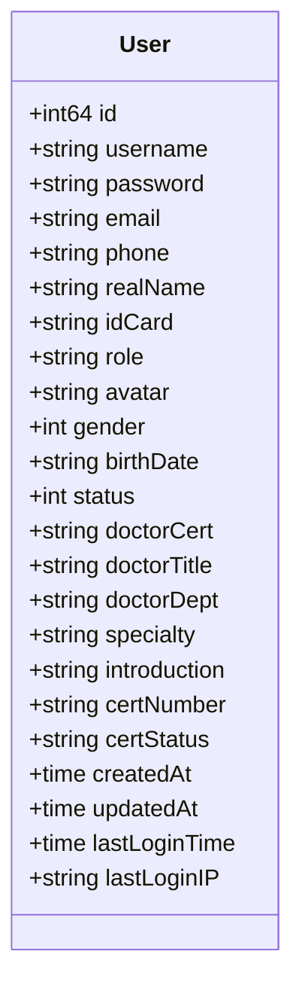
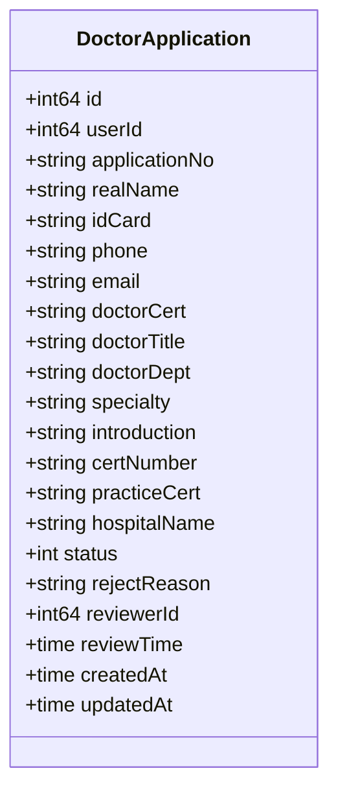
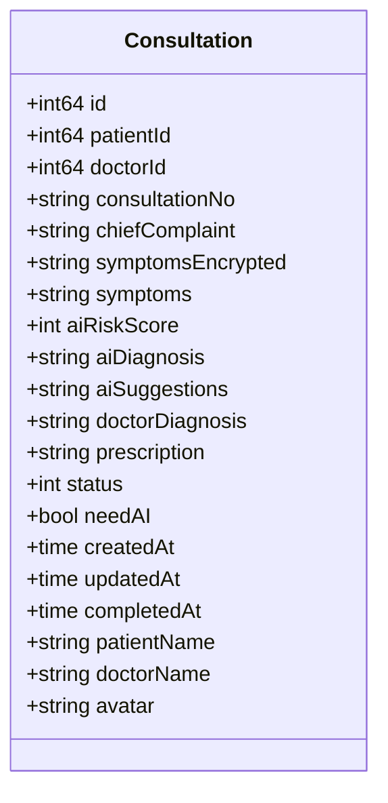
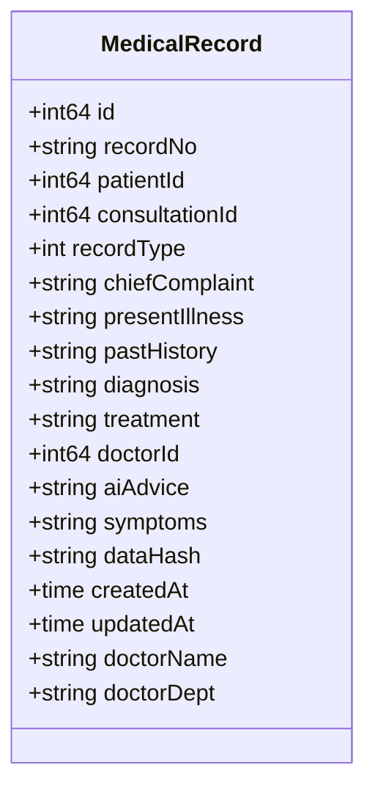
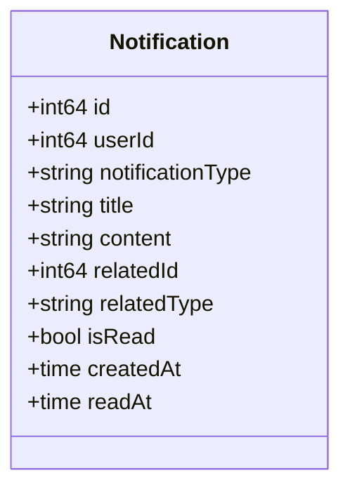
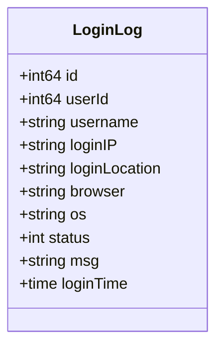
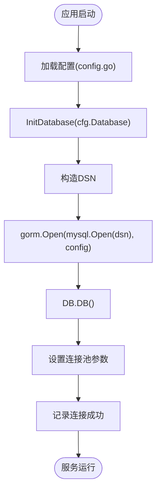
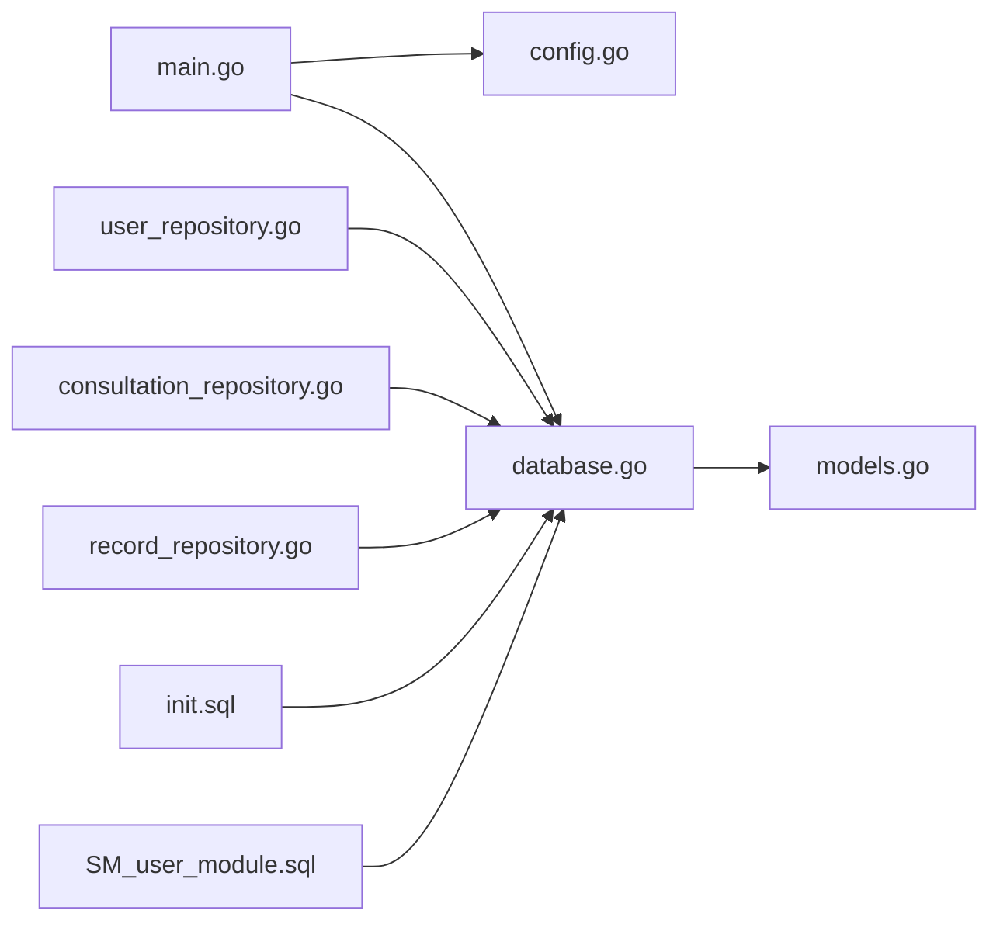

# 数据库设计

<cite>
**本文引用的文件**
- [models.go](file://backed/internal/model/models.go)
- [database.go](file://backed/pkg/database/database.go)
- [init.sql](file://backed/init.sql)
- [SM_user_module.sql](file://database/SM_user_module.sql)
- [config.go](file://backed/pkg/config/config.go)
- [main.go](file://backed/cmd/main.go)
- [user_repository.go](file://backed/internal/repository/user_repository.go)
- [consultation_repository.go](file://backed/internal/repository/consultation_repository.go)
- [record_repository.go](file://backed/internal/repository/record_repository.go)
</cite>

## 目录
1. [简介](#简介)
2. [项目结构](#项目结构)
3. [核心组件](#核心组件)
4. [架构总览](#架构总览)
5. [详细组件分析](#详细组件分析)
6. [依赖分析](#依赖分析)
7. [性能考虑](#性能考虑)
8. [故障排查指南](#故障排查指南)
9. [结论](#结论)
10. [附录](#附录)

## 简介
本文件面向开发者与数据库设计人员，系统化梳理本项目的数据库设计与实现，重点覆盖以下方面：
- GORM 模型定义与字段语义（User、Consultation、MedicalRecord 等）
- 数据库初始化 SQL（init.sql 与 SM_user_module.sql 的表结构与字段设计）
- 数据库连接与初始化流程（database.go）
- 表间关系、索引与约束
- 数据访问最佳实践与常见问题排查

## 项目结构
围绕数据库设计的关键文件分布如下：
- GORM 模型：backed/internal/model/models.go
- 数据库初始化 SQL：backed/init.sql、database/SM_user_module.sql
- 数据库连接与初始化：backed/pkg/database/database.go
- 应用入口与配置加载：backed/cmd/main.go、backed/pkg/config/config.go
- 数据访问层（Repository）：backed/internal/repository/*.go

图表来源
- [main.go](file://backed/cmd/main.go#L1-L64)
- [config.go](file://backed/pkg/config/config.go#L1-L78)
- [database.go](file://backed/pkg/database/database.go#L1-L48)
- [models.go](file://backed/internal/model/models.go#L1-L160)
- [init.sql](file://backed/init.sql#L1-L478)
- [SM_user_module.sql](file://database/SM_user_module.sql#L1-L325)
- [user_repository.go](file://backed/internal/repository/user_repository.go#L1-L121)
- [consultation_repository.go](file://backed/internal/repository/consultation_repository.go#L1-L83)
- [record_repository.go](file://backed/internal/repository/record_repository.go#L1-L97)

章节来源
- [main.go](file://backed/cmd/main.go#L1-L64)
- [config.go](file://backed/pkg/config/config.go#L1-L78)
- [database.go](file://backed/pkg/database/database.go#L1-L48)

## 核心组件
本项目的核心数据模型围绕“用户、问诊、病历、通知、登录日志、医生申请”等实体展开，采用 GORM 标签定义字段类型、索引与约束，并通过 SQL 脚本完成建表与外键约束。

- User（用户）
  - 字段要点：用户名唯一、密码字段、邮箱/电话/实名/身份证等敏感字段标注加密用途、角色标识、医生相关信息、状态与时间戳等。
  - 索引：用户名唯一索引、邮箱唯一索引、identify/status/doctor_dept 等常用过滤字段索引。
  - 外键：医生申请表、问诊表、病历表、通知表、登录日志表均通过 user.id 引用。

- DoctorApplication（医生申请）
  - 字段要点：申请编号唯一、实名/身份证/电话/邮箱等敏感字段、职称/科室/简介/证书号/执业证号/医院名称、状态与审核信息。
  - 索引：user_id、status、application_no、created_at。
  - 外键：user_id 引用 SM_user(id)，审核人 reviewer_id 引用 SM_user(id)（删除设为空）。

- Consultation（问诊记录）
  - 字段要点：问诊编号唯一、主诉/症状特征（加密用于 AI）、AI 风险评分/诊断/建议、医生诊断/处方、状态、是否需要 AI、时间戳与完成时间。
  - 索引：patient_id、doctor_id、status、consultation_no、created_at。
  - 外键：patient_id、doctor_id 引用 SM_user(id)（医生可为空），消息表引用 SM_consultation(id)。

- MedicalRecord（电子病历）
  - 字段要点：病历编号唯一、记录类型、主诉/现病史/既往史/家族史/体格检查/辅助检查/诊断/治疗方案/处方、医生ID、AI 建议、数据完整性哈希、锁定状态。
  - 索引：patient_id、consultation_id、record_no、doctor_id、created_at。
  - 外键：patient_id、consultation_id、doctor_id 引用 SM_user(id) 或 SM_consultation(id)。

- Notification（系统通知）
  - 字段要点：通知类型、标题/内容、关联对象、是否已读、时间戳。
  - 索引：user_id、is_read、notification_type、priority、created_at。

- LoginLog（登录日志）
  - 字段要点：用户/用户名、登录 IP/位置/浏览器/操作系统、状态与消息、登录时间。
  - 索引：user_id、login_time、status、username。

章节来源
- [models.go](file://backed/internal/model/models.go#L1-L160)
- [init.sql](file://backed/init.sql#L1-L478)
- [SM_user_module.sql](file://database/SM_user_module.sql#L1-L325)

## 架构总览
数据库层通过 GORM 连接 MySQL，应用启动时加载配置并初始化数据库连接；Repository 层通过 GORM 对模型执行 CRUD 操作；SQL 脚本负责建表、索引与约束。

图表来源
- [main.go](file://backed/cmd/main.go#L1-L64)
- [config.go](file://backed/pkg/config/config.go#L1-L78)
- [database.go](file://backed/pkg/database/database.go#L1-L48)
- [user_repository.go](file://backed/internal/repository/user_repository.go#L1-L121)
- [consultation_repository.go](file://backed/internal/repository/consultation_repository.go#L1-L83)
- [record_repository.go](file://backed/internal/repository/record_repository.go#L1-L97)

## 详细组件分析

### User（用户）模型与表
- 模型字段与含义
  - 主键自增 ID，用户名唯一且非空，密码字段长度与加密用途标注，邮箱/电话/实名/身份证等敏感字段标注加密用途，角色字段映射到数据库 identify，医生相关字段（证书、职称、科室、特长、简介、证书号等）。
  - 性别、出生日期、状态、头像、时间戳、最后登录时间与 IP 等。
- 表结构要点
  - 唯一索引：username、email。
  - 普通索引：identify、status、doctor_dept、created_at、deleted_at。
  - 外键：与医生申请、问诊、病历、通知、登录日志等表关联。
- GORM 映射
  - TableName 返回 SM_user，字段标签包含类型、索引、默认值、列名等。

图表来源
- [models.go](file://backed/internal/model/models.go#L1-L36)

章节来源
- [models.go](file://backed/internal/model/models.go#L1-L36)
- [init.sql](file://backed/init.sql#L16-L62)
- [SM_user_module.sql](file://database/SM_user_module.sql#L16-L40)

### DoctorApplication（医生申请）模型与表
- 模型字段与含义
  - 申请编号唯一，实名/身份证/电话/邮箱等敏感字段，职称/科室/简介/证书号/执业证号/医院名称，状态与审核信息（审核人、审核时间、拒绝原因）。
- 表结构要点
  - 唯一索引：application_no。
  - 普通索引：user_id、status、created_at。
  - 外键：user_id 引用 SM_user(id)（级联删除），reviewer_id 引用 SM_user(id)（删除设为空）。
- GORM 映射
  - TableName 返回 SM_doctor_application。

图表来源
- [models.go](file://backed/internal/model/models.go#L38-L66)
- [init.sql](file://backed/init.sql#L64-L95)
- [SM_user_module.sql](file://database/SM_user_module.sql#L42-L64)

章节来源
- [models.go](file://backed/internal/model/models.go#L38-L66)
- [init.sql](file://backed/init.sql#L64-L95)
- [SM_user_module.sql](file://database/SM_user_module.sql#L42-L64)

### Consultation（问诊记录）模型与表
- 模型字段与含义
  - 问诊编号唯一，主诉/症状特征（加密用于 AI）、AI 风险评分/诊断/建议、医生诊断/处方、状态、是否需要 AI、时间戳与完成时间；关联字段用于前端展示患者/医生名称与头像。
- 表结构要点
  - 唯一索引：consultation_no。
  - 普通索引：patient_id、doctor_id、status、created_at。
  - 外键：patient_id、doctor_id 引用 SM_user(id)（医生可为空）。
- GORM 映射
  - TableName 返回 SM_consultation。

图表来源
- [models.go](file://backed/internal/model/models.go#L68-L97)
- [init.sql](file://backed/init.sql#L121-L156)
- [SM_user_module.sql](file://database/SM_user_module.sql#L84-L108)

章节来源
- [models.go](file://backed/internal/model/models.go#L68-L97)
- [init.sql](file://backed/init.sql#L121-L156)
- [SM_user_module.sql](file://database/SM_user_module.sql#L84-L108)

### MedicalRecord（电子病历）模型与表
- 模型字段与含义
  - 病历编号唯一，记录类型（门诊/在线问诊/住院），主诉/现病史/既往史/家族史/体格检查/辅助检查/诊断/治疗方案/处方，医生ID、AI 建议、数据完整性哈希、锁定状态与时间戳。
- 表结构要点
  - 唯一索引：record_no。
  - 普通索引：patient_id、consultation_id、doctor_id、created_at。
  - 外键：patient_id、consultation_id、doctor_id 引用 SM_user(id) 或 SM_consultation(id)。
- GORM 映射
  - TableName 返回 SM_medical_record。

图表来源
- [models.go](file://backed/internal/model/models.go#L99-L123)
- [init.sql](file://backed/init.sql#L189-L225)
- [SM_user_module.sql](file://database/SM_user_module.sql#L131-L156)

章节来源
- [models.go](file://backed/internal/model/models.go#L99-L123)
- [init.sql](file://backed/init.sql#L189-L225)
- [SM_user_module.sql](file://database/SM_user_module.sql#L131-L156)

### Notification（系统通知）模型与表
- 模型字段与含义
  - 通知类型、标题/内容、关联对象、是否已读、时间戳与读取时间。
- 表结构要点
  - 普通索引：user_id、is_read、notification_type、priority、created_at。
  - 外键：user_id 引用 SM_user(id)（级联删除）。
- GORM 映射
  - TableName 返回 SM_notification。

图表来源
- [models.go](file://backed/internal/model/models.go#L125-L141)
- [init.sql](file://backed/init.sql#L253-L275)
- [SM_user_module.sql](file://database/SM_user_module.sql#L177-L195)

章节来源
- [models.go](file://backed/internal/model/models.go#L125-L141)
- [init.sql](file://backed/init.sql#L253-L275)
- [SM_user_module.sql](file://database/SM_user_module.sql#L177-L195)

### LoginLog（登录日志）模型与表
- 模型字段与含义
  - 用户/用户名、登录 IP/位置/浏览器/操作系统、状态与消息、登录时间。
- 表结构要点
  - 普通索引：user_id、login_time、status、username。
  - 外键：user_id 引用 SM_user(id)（可为空）。
- GORM 映射
  - TableName 返回 SM_login_log。

图表来源
- [models.go](file://backed/internal/model/models.go#L143-L159)
- [init.sql](file://backed/init.sql#L97-L116)
- [SM_user_module.sql](file://database/SM_user_module.sql#L66-L82)

章节来源
- [models.go](file://backed/internal/model/models.go#L143-L159)
- [init.sql](file://backed/init.sql#L97-L116)
- [SM_user_module.sql](file://database/SM_user_module.sql#L66-L82)

### 数据库连接与初始化
- 初始化流程
  - 从配置加载数据库参数（主机、端口、用户名、密码、数据库名、字符集、最大空闲/打开连接数）。
  - 构造 DSN 并使用 GORM 打开 MySQL 连接。
  - 获取底层 sql.DB，设置最大空闲连接数、最大打开连接数与连接最大生命周期。
  - 记录连接成功日志。
- 入口调用
  - main.go 在启动时加载配置并调用 InitDatabase，随后注册路由与启动服务。

图表来源
- [main.go](file://backed/cmd/main.go#L1-L64)
- [config.go](file://backed/pkg/config/config.go#L1-L78)
- [database.go](file://backed/pkg/database/database.go#L1-L48)

章节来源
- [main.go](file://backed/cmd/main.go#L1-L64)
- [config.go](file://backed/pkg/config/config.go#L1-L78)
- [database.go](file://backed/pkg/database/database.go#L1-L48)

### 数据访问最佳实践
- 使用 Repository 封装数据访问逻辑，避免直接在服务层操作 GORM。
- 查询时尽量利用索引字段（如 user_id、status、created_at 等）以减少全表扫描。
- 关联查询时注意 N+1 查询问题，必要时使用预加载或一次性批量查询。
- 写入操作建议使用事务包裹，保证一致性。
- 对敏感字段（邮箱、电话、实名、身份证、登录 IP 等）遵循加密存储与最小暴露原则。

章节来源
- [user_repository.go](file://backed/internal/repository/user_repository.go#L1-L121)
- [consultation_repository.go](file://backed/internal/repository/consultation_repository.go#L1-L83)
- [record_repository.go](file://backed/internal/repository/record_repository.go#L1-L97)

## 依赖分析
- 组件耦合
  - main.go 依赖 config.go 与 database.go，形成“配置 → 连接”的单向依赖。
  - Repository 依赖 database.GetDB()，间接依赖 models.go 中的模型定义。
  - SQL 脚本定义了表结构、索引与外键，驱动 GORM 的自动迁移与查询性能。
- 外部依赖
  - GORM v1.25.x 与 mysql 驱动 v1.5.x。
- 潜在循环依赖
  - 当前结构清晰，无明显循环依赖迹象。

图表来源
- [main.go](file://backed/cmd/main.go#L1-L64)
- [config.go](file://backed/pkg/config/config.go#L1-L78)
- [database.go](file://backed/pkg/database/database.go#L1-L48)
- [models.go](file://backed/internal/model/models.go#L1-L160)
- [user_repository.go](file://backed/internal/repository/user_repository.go#L1-L121)
- [consultation_repository.go](file://backed/internal/repository/consultation_repository.go#L1-L83)
- [record_repository.go](file://backed/internal/repository/record_repository.go#L1-L97)
- [init.sql](file://backed/init.sql#L1-L478)
- [SM_user_module.sql](file://database/SM_user_module.sql#L1-L325)

章节来源
- [main.go](file://backed/cmd/main.go#L1-L64)
- [config.go](file://backed/pkg/config/config.go#L1-L78)
- [database.go](file://backed/pkg/database/database.go#L1-L48)

## 性能考虑
- 索引设计
  - 高频过滤字段（如 user_id、status、created_at、username、email、consultation_no、record_no）均建立索引，有助于提升查询性能。
- 连接池
  - 通过 SetMaxIdleConns/SetMaxOpenConns/SetConnMaxLifetime 控制连接池，避免连接过多导致资源紧张。
- 查询优化
  - 使用分页查询（offset/limit）时，结合 created_at 或主键索引排序，避免大 offset 导致的性能下降。
  - 关联查询时尽量限制返回字段，减少网络与序列化开销。
- 存储与加密
  - 敏感字段采用 SM4 加密存储，数据完整性采用 SM3 哈希校验，兼顾安全与性能。

[本节为通用指导，不直接分析具体文件]

## 故障排查指南
- 连接失败
  - 检查配置文件中的主机、端口、用户名、密码、数据库名与字符集是否正确。
  - 确认数据库服务可用且允许远程连接。
- 迁移失败
  - 确认 init.sql/SM_user_module.sql 已正确执行，表结构与索引满足模型定义。
  - 若字段类型或约束不一致，先清理旧表或调整脚本后再迁移。
- 查询慢
  - 检查是否命中索引，必要时添加复合索引或调整查询条件。
  - 对大结果集分页查询时，优先使用主键或索引列排序。
- 数据一致性
  - 外键约束缺失或不生效时，确认数据库引擎为 InnoDB 且外键语法正确。
  - 对涉及多表写入的业务，使用事务保证原子性。

章节来源
- [database.go](file://backed/pkg/database/database.go#L1-L48)
- [init.sql](file://backed/init.sql#L1-L478)
- [SM_user_module.sql](file://database/SM_user_module.sql#L1-L325)

## 结论
本项目采用 GORM 模型与 SQL 脚本双轨设计，既保证了模型层面的类型安全与便捷开发，又通过 SQL 明确表达表结构、索引与约束，确保查询性能与数据一致性。配合合理的连接池与数据访问层封装，能够支撑在线问诊场景下的高并发与高安全性需求。建议在生产环境中持续监控索引使用情况与查询性能，并根据业务增长迭代索引与查询策略。

[本节为总结性内容，不直接分析具体文件]

## 附录
- 常用查询参考
  - 查询用户：按 identify 与 status 过滤，支持关键词搜索。
  - 查询问诊：按 patient_id/doctor_id 与 status 过滤，支持分页与排序。
  - 查询病历：按 patient_id/doctor_id 与时间范围过滤，支持分页与排序。
- 安全与合规
  - 敏感字段加密存储与完整性校验贯穿核心表，符合国密算法要求。
  - 登录日志与病历访问日志保留审计轨迹，便于追踪与合规审查。

[本节为通用指导，不直接分析具体文件]