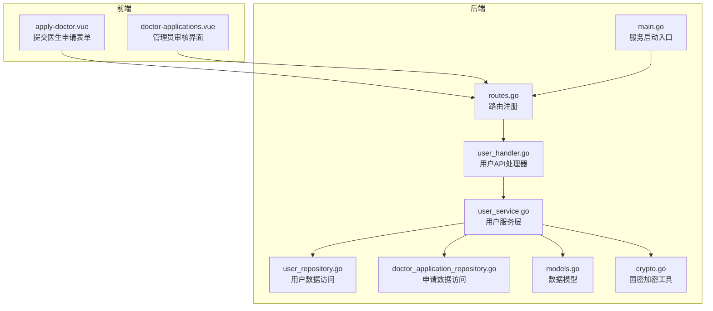
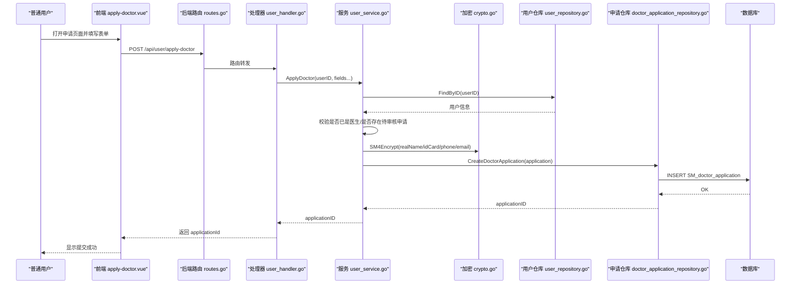
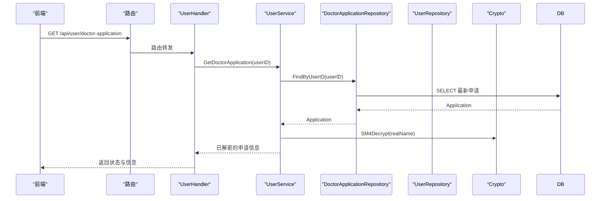
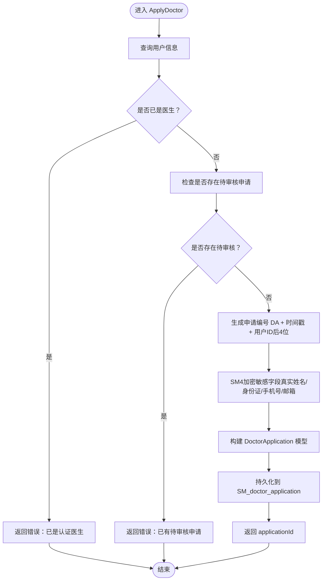
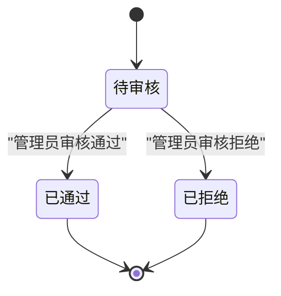
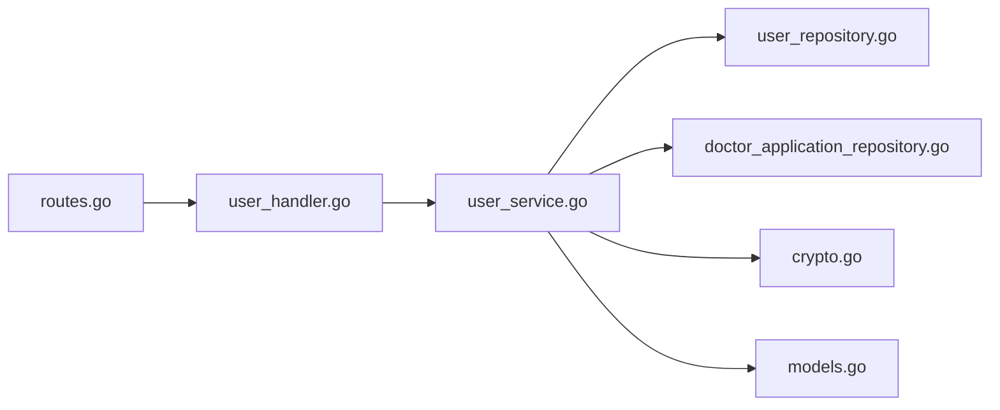

# 医生申请

<cite>
**本文引用的文件**
- [backed/internal/api/handler/user_handler.go](file://backed/internal/api/handler/user_handler.go)
- [backed/internal/service/user_service.go](file://backed/internal/service/user_service.go)
- [backed/internal/repository/user_repository.go](file://backed/internal/repository/user_repository.go)
- [backed/internal/repository/doctor_application_repository.go](file://backed/internal/repository/doctor_application_repository.go)
- [backed/internal/model/models.go](file://backed/internal/model/models.go)
- [backed/internal/crypto/crypto.go](file://backed/internal/crypto/crypto.go)
- [fonted/pages/user/apply-doctor.vue](file://fonted/pages/user/apply-doctor.vue)
- [fonted/pages/admin/doctor-applications.vue](file://fonted/pages/admin/doctor-applications.vue)
- [backed/internal/api/routes.go](file://backed/internal/api/routes.go)
- [backed/cmd/main.go](file://backed/cmd/main.go)
- [API接口总览.md](file://API接口总览.md)
- [查看最新申请.sql](file://查看最新申请.sql)
- [检查医生申请数据.sql](file://检查医生申请数据.sql)
</cite>

## 目录
1. [简介](#简介)
2. [项目结构](#项目结构)
3. [核心组件](#核心组件)
4. [架构总览](#架构总览)
5. [详细组件分析](#详细组件分析)
6. [依赖分析](#依赖分析)
7. [性能考虑](#性能考虑)
8. [故障排查指南](#故障排查指南)
9. [结论](#结论)
10. [附录](#附录)

## 简介
本章节面向“普通用户申请成为认证医生”的完整流程，覆盖从前端表单提交、后端接口处理、服务层业务逻辑、数据访问层持久化，到管理员审核与医生列表查询的全过程。文档特别强调以下关键点：
- 前端表单字段与后端模型字段映射关系
- 申请状态机（待审核、已通过、已拒绝）
- SM4对敏感信息（真实姓名、身份证、手机号等）的加密存储
- 申请失败的常见原因与解决方案

## 项目结构
围绕“医生申请”功能，涉及前后端关键文件如下图所示：

图表来源
- [backed/internal/api/routes.go](file://backed/internal/api/routes.go#L1-L95)
- [backed/internal/api/handler/user_handler.go](file://backed/internal/api/handler/user_handler.go#L1-L261)
- [backed/internal/service/user_service.go](file://backed/internal/service/user_service.go#L1-L331)
- [backed/internal/repository/user_repository.go](file://backed/internal/repository/user_repository.go#L1-L121)
- [backed/internal/repository/doctor_application_repository.go](file://backed/internal/repository/doctor_application_repository.go#L1-L70)
- [backed/internal/model/models.go](file://backed/internal/model/models.go#L1-L160)
- [backed/internal/crypto/crypto.go](file://backed/internal/crypto/crypto.go#L1-L121)
- [backed/cmd/main.go](file://backed/cmd/main.go#L1-L64)

章节来源
- [backed/internal/api/routes.go](file://backed/internal/api/routes.go#L1-L95)
- [backed/cmd/main.go](file://backed/cmd/main.go#L1-L64)

## 核心组件
- 前端组件
  - apply-doctor.vue：负责收集真实姓名、身份证号、手机号、职称、科室、擅长领域、个人介绍、执业证号、资格证书图片等字段，并在提交前进行基础校验。
  - doctor-applications.vue：管理员侧展示申请列表、详情、通过/拒绝操作。
- 后端处理器
  - user_handler.go：提供申请提交、申请状态查询、医生列表查询等接口。
- 服务层
  - user_service.go：实现业务规则（是否已是医生、是否存在待审核申请、生成申请编号、SM4加密敏感信息、持久化等）。
- 数据访问层
  - user_repository.go：用户表相关查询与更新；FindDoctors用于医生列表查询。
  - doctor_application_repository.go：医生申请记录的创建、更新、按用户查询、待审核存在性检查等。
- 数据模型
  - models.go：定义User与DoctorApplication模型字段，含加密字段与状态字段。
- 加密工具
  - crypto.go：提供SM3哈希、SM4加解密等能力。

章节来源
- [fonted/pages/user/apply-doctor.vue](file://fonted/pages/user/apply-doctor.vue#L1-L240)
- [fonted/pages/admin/doctor-applications.vue](file://fonted/pages/admin/doctor-applications.vue#L1-L200)
- [backed/internal/api/handler/user_handler.go](file://backed/internal/api/handler/user_handler.go#L170-L236)
- [backed/internal/service/user_service.go](file://backed/internal/service/user_service.go#L220-L330)
- [backed/internal/repository/user_repository.go](file://backed/internal/repository/user_repository.go#L52-L88)
- [backed/internal/repository/doctor_application_repository.go](file://backed/internal/repository/doctor_application_repository.go#L1-L70)
- [backed/internal/model/models.go](file://backed/internal/model/models.go#L1-L160)
- [backed/internal/crypto/crypto.go](file://backed/internal/crypto/crypto.go#L1-L121)

## 架构总览
从“普通用户申请成为认证医生”的视角，系统整体交互如下：

图表来源
- [backed/internal/api/routes.go](file://backed/internal/api/routes.go#L1-L95)
- [backed/internal/api/handler/user_handler.go](file://backed/internal/api/handler/user_handler.go#L170-L202)
- [backed/internal/service/user_service.go](file://backed/internal/service/user_service.go#L220-L268)
- [backed/internal/repository/user_repository.go](file://backed/internal/repository/user_repository.go#L24-L36)
- [backed/internal/repository/doctor_application_repository.go](file://backed/internal/repository/doctor_application_repository.go#L14-L17)
- [backed/internal/crypto/crypto.go](file://backed/internal/crypto/crypto.go#L48-L79)

## 详细组件分析

### 前端表单与后端模型映射
- apply-doctor.vue 提交字段与 DoctorApplication 模型字段映射关系（部分字段）：
  - realName ↔ real_name（SM4加密）
  - idCard ↔ id_card（SM4加密）
  - phone ↔ phone（SM4加密）
  - doctorTitle ↔ doctor_title
  - doctorDept ↔ doctor_dept
  - specialty ↔ specialty
  - introduction ↔ doctor_intro
  - certNumber ↔ cert_number
  - doctorCert ↔ doctor_cert（图片URL）
- 提交流程要点：
  - 前端对必填项进行基础校验（如手机号格式、证书上传等）。
  - 证书图片通过文件上传接口获取URL后，随表单一起提交。
  - 后端接收后，使用SM4对敏感字段进行加密存储。

章节来源
- [fonted/pages/user/apply-doctor.vue](file://fonted/pages/user/apply-doctor.vue#L1-L240)
- [backed/internal/model/models.go](file://backed/internal/model/models.go#L38-L66)

### 后端API：ApplyDoctor 与 GetDoctorApplication
- ApplyDoctor（提交申请）
  - 请求：需登录态，Body包含realName、idCard、phone、doctorTitle、doctorDept、specialty、introduction、certNumber、certImage。
  - 处理：调用 userService.ApplyDoctor，返回 applicationId。
- GetDoctorApplication（查询申请状态）
  - 请求：需登录态。
  - 处理：调用 userService.GetDoctorApplication，返回状态、状态文本、申请人信息、创建时间、审核时间（如有）、拒绝原因等。

图表来源
- [backed/internal/api/handler/user_handler.go](file://backed/internal/api/handler/user_handler.go#L204-L215)
- [backed/internal/service/user_service.go](file://backed/internal/service/user_service.go#L270-L303)
- [backed/internal/repository/doctor_application_repository.go](file://backed/internal/repository/doctor_application_repository.go#L31-L36)
- [backed/internal/crypto/crypto.go](file://backed/internal/crypto/crypto.go#L62-L79)

章节来源
- [backed/internal/api/handler/user_handler.go](file://backed/internal/api/handler/user_handler.go#L170-L215)
- [backed/internal/service/user_service.go](file://backed/internal/service/user_service.go#L270-L303)

### 服务层：ApplyDoctor 业务逻辑
- 核心步骤
  1) 检查用户是否已是医生角色，若是则报错。
  2) 检查是否存在待审核的申请，若存在则报错。
  3) 生成唯一申请编号（DA + 时间戳 + 用户ID后四位）。
  4) 使用SM4对敏感字段（真实姓名、身份证、手机号、邮箱）进行加密。
  5) 将申请信息写入 SM_doctor_application 表，返回 applicationId。
- 异常处理
  - 若检查阶段发现重复待审核或已是医生，直接返回错误。
  - 持久化失败时返回错误。

图表来源
- [backed/internal/service/user_service.go](file://backed/internal/service/user_service.go#L220-L268)
- [backed/internal/crypto/crypto.go](file://backed/internal/crypto/crypto.go#L48-L79)
- [backed/internal/model/models.go](file://backed/internal/model/models.go#L38-L66)

章节来源
- [backed/internal/service/user_service.go](file://backed/internal/service/user_service.go#L220-L268)

### 数据访问层：CreateDoctorApplication 与 FindDoctorApplication
- CreateDoctorApplication
  - 功能：将 DoctorApplication 记录插入数据库。
  - 位置：doctor_application_repository.go 的 Create 方法。
- FindDoctorApplication
  - 功能：按用户ID查询最近一条申请记录（按创建时间倒序取第一条）。
  - 位置：doctor_application_repository.go 的 FindByUserID 方法。
- 用户仓库 FindDoctors
  - 功能：查询已认证医生列表（identify=doctor 且 status=0），支持按科室与关键词筛选。
  - 位置：user_repository.go 的 FindDoctors 方法。

章节来源
- [backed/internal/repository/doctor_application_repository.go](file://backed/internal/repository/doctor_application_repository.go#L14-L36)
- [backed/internal/repository/user_repository.go](file://backed/internal/repository/user_repository.go#L52-L73)

### 医生列表查询 GetDoctors
- 接口：GET /api/user/doctors
- 参数：page、pageSize、dept、keyword
- 逻辑：调用 user_service.GetDoctors，内部通过 user_repository.FindDoctors 查询，返回医生列表与总数。
- 注意：返回的 realName 字段会进行 SM4 解密后再返回给前端。

章节来源
- [backed/internal/api/handler/user_handler.go](file://backed/internal/api/handler/user_handler.go#L217-L236)
- [backed/internal/service/user_service.go](file://backed/internal/service/user_service.go#L305-L330)
- [backed/internal/repository/user_repository.go](file://backed/internal/repository/user_repository.go#L52-L73)

### 管理员审核与状态机
- 状态机
  - 0：待审核
  - 1：已通过
  - 2：已拒绝
- 管理员接口
  - 审核：PUT /api/user/admin/review-doctor（传入 applicationId、status、rejectReason）
  - 列表：GET /api/user/admin/doctor-applications（支持按 status 分页查询）
- 前端界面
  - doctor-applications.vue：展示申请列表、详情、通过/拒绝操作；拒绝时要求填写拒绝原因。

图表来源
- [backed/internal/model/models.go](file://backed/internal/model/models.go#L38-L66)
- [fonted/pages/admin/doctor-applications.vue](file://fonted/pages/admin/doctor-applications.vue#L1-L200)

章节来源
- [fonted/pages/admin/doctor-applications.vue](file://fonted/pages/admin/doctor-applications.vue#L1-L200)
- [backed/internal/model/models.go](file://backed/internal/model/models.go#L38-L66)

## 依赖分析
- 组件耦合
  - UserHandler 依赖 UserService；UserService 依赖 UserRepository 与 DoctorApplicationRepository，并使用 Crypto 工具。
  - 路由层仅负责请求转发与鉴权中间件，不包含业务逻辑。
- 外部依赖
  - 数据库：GORM ORM 访问 MySQL。
  - 国密算法：SM2/SM3/SM4 由 crypto.go 提供。
- 可能的循环依赖
  - 当前代码未见循环导入；各层职责清晰，依赖方向自上而下。

图表来源
- [backed/internal/api/routes.go](file://backed/internal/api/routes.go#L1-L95)
- [backed/internal/api/handler/user_handler.go](file://backed/internal/api/handler/user_handler.go#L1-L261)
- [backed/internal/service/user_service.go](file://backed/internal/service/user_service.go#L1-L331)
- [backed/internal/repository/user_repository.go](file://backed/internal/repository/user_repository.go#L1-L121)
- [backed/internal/repository/doctor_application_repository.go](file://backed/internal/repository/doctor_application_repository.go#L1-L70)
- [backed/internal/crypto/crypto.go](file://backed/internal/crypto/crypto.go#L1-L121)
- [backed/internal/model/models.go](file://backed/internal/model/models.go#L1-L160)

章节来源
- [backed/internal/api/routes.go](file://backed/internal/api/routes.go#L1-L95)
- [backed/internal/api/handler/user_handler.go](file://backed/internal/api/handler/user_handler.go#L1-L261)
- [backed/internal/service/user_service.go](file://backed/internal/service/user_service.go#L1-L331)

## 性能考虑
- 数据库索引
  - DoctorApplication 表 status 字段应建立索引，以支持管理员按状态分页查询。
  - User 表 identify 与 doctor_dept 字段可用于医生列表筛选。
- 查询优化
  - 医生列表查询使用分页与条件过滤，避免一次性拉取大量数据。
- 加密成本
  - SM4 加解密在高频场景下会有额外 CPU 开销，建议在批量查询医生列表时尽量减少不必要的解密次数（例如仅在需要展示时解密）。

[本节为通用指导，无需列出具体文件来源]

## 故障排查指南
- 常见失败原因与解决
  - 已是认证医生：若用户角色已是 doctor，申请会被拒绝。请确认用户身份。
    - 参考：[backed/internal/service/user_service.go](file://backed/internal/service/user_service.go#L228-L230)
  - 存在待审核申请：同一用户不能同时存在多个待审核申请。请等待审核完成或撤销后重试。
    - 参考：[backed/internal/service/user_service.go](file://backed/internal/service/user_service.go#L232-L236)
  - 参数校验失败：前端表单未满足必填或格式要求（如手机号格式）。请修正后再提交。
    - 参考：[fonted/pages/user/apply-doctor.vue](file://fonted/pages/user/apply-doctor.vue#L167-L210)
  - 证书上传失败：上传接口异常或网络问题。请重试或更换图片格式。
    - 参考：[fonted/pages/user/apply-doctor.vue](file://fonted/pages/user/apply-doctor.vue#L155-L165)
  - 数据库异常：申请持久化失败。请检查数据库连接与权限。
    - 参考：[backed/internal/repository/doctor_application_repository.go](file://backed/internal/repository/doctor_application_repository.go#L14-L17)
- 审核相关
  - 拒绝时未填写拒绝原因：管理员拒绝申请时必须填写拒绝原因。
    - 参考：[fonted/pages/admin/doctor-applications.vue](file://fonted/pages/admin/doctor-applications.vue#L318-L337)
  - 状态显示不一致：可通过 SQL 查询确认数据库中的状态值。
    - 参考：[查看最新申请.sql](file://查看最新申请.sql#L1-L27)，[检查医生申请数据.sql](file://检查医生申请数据.sql#L1-L58)

章节来源
- [backed/internal/service/user_service.go](file://backed/internal/service/user_service.go#L228-L236)
- [fonted/pages/user/apply-doctor.vue](file://fonted/pages/user/apply-doctor.vue#L167-L210)
- [fonted/pages/admin/doctor-applications.vue](file://fonted/pages/admin/doctor-applications.vue#L318-L337)
- [backed/internal/repository/doctor_application_repository.go](file://backed/internal/repository/doctor_application_repository.go#L14-L17)
- [查看最新申请.sql](file://查看最新申请.sql#L1-L27)
- [检查医生申请数据.sql](file://检查医生申请数据.sql#L1-L58)

## 结论
- 该功能实现了从普通用户到认证医生的闭环：前端表单收集、后端接口校验与加密、服务层业务规则、数据访问层持久化，以及管理员审核与医生列表查询。
- SM4加密贯穿敏感字段存储，确保隐私安全；状态机清晰，便于追踪申请进度。
- 建议在生产环境中进一步完善：
  - 审核通知机制（邮件/站内信）
  - 申请历史与审计日志
  - 更细粒度的权限控制与操作审计

[本节为总结性内容，无需列出具体文件来源]

## 附录

### API 接口清单（与医生申请相关）
- 普通用户接口
  - POST /api/user/apply-doctor：提交医生申请
  - GET /api/user/doctor-application：查询申请状态
  - GET /api/user/doctors：获取认证医生列表
  - GET /api/user/doctor/:userId：获取医生详情
- 管理员接口
  - PUT /api/user/admin/review-doctor：审核医生申请
  - GET /api/user/admin/doctor-applications：获取医生申请列表

章节来源
- [API接口总览.md](file://API接口总览.md#L47-L80)
- [backed/internal/api/routes.go](file://backed/internal/api/routes.go#L1-L95)