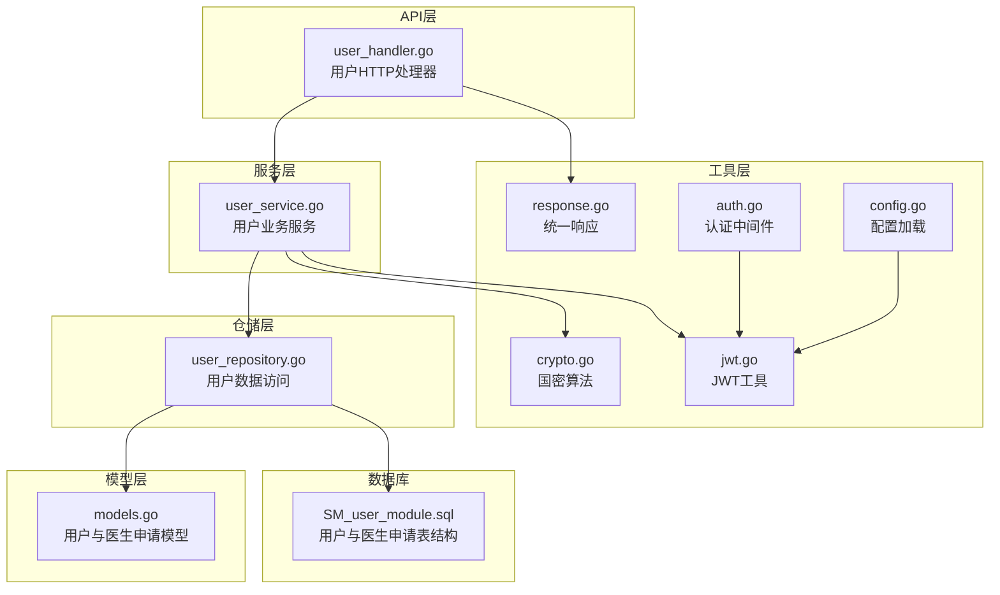
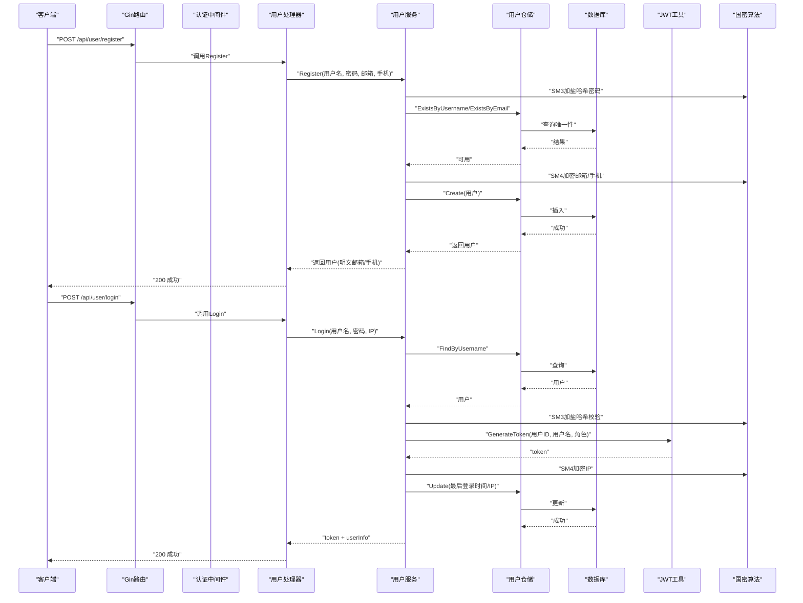
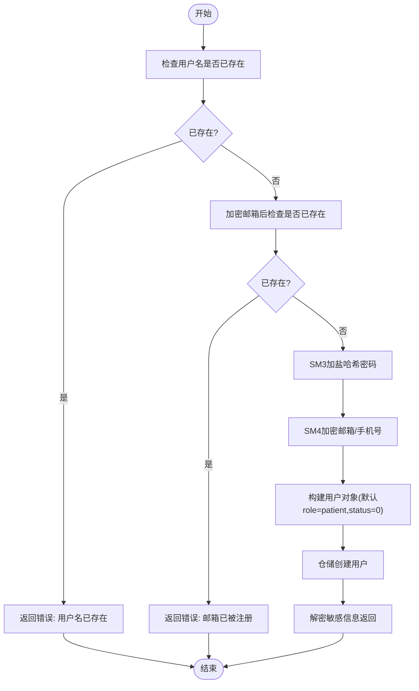
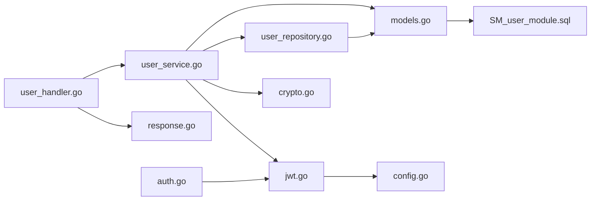

# 用户模块

<cite>
**本文引用的文件**
- [user_handler.go](file://backed/internal/api/handler/user_handler.go)
- [user_service.go](file://backed/internal/service/user_service.go)
- [user_repository.go](file://backed/internal/repository/user_repository.go)
- [models.go](file://backed/internal/model/models.go)
- [jwt.go](file://backed/pkg/utils/jwt.go)
- [auth.go](file://backed/internal/middleware/auth.go)
- [routes.go](file://backed/internal/api/routes.go)
- [response.go](file://backed/pkg/utils/response.go)
- [crypto.go](file://backed/internal/crypto/crypto.go)
- [config.go](file://backed/pkg/config/config.go)
- [SM_user_module.sql](file://database/SM_user_module.sql)
</cite>

## 目录
1. [简介](#简介)
2. [项目结构](#项目结构)
3. [核心组件](#核心组件)
4. [架构总览](#架构总览)
5. [详细组件分析](#详细组件分析)
6. [依赖关系分析](#依赖关系分析)
7. [性能考虑](#性能考虑)
8. [故障排查指南](#故障排查指南)
9. [结论](#结论)
10. [附录](#附录)

## 简介
本文件围绕用户模块的完整实现进行深入解析，覆盖用户注册、登录、信息管理以及医生申请等核心功能。文档从三层架构视角出发，详细说明API处理器、业务服务层与数据访问层的职责划分与协作流程，并结合国密算法（SM3、SM4、SM2）在密码加密、敏感数据存储与传输中的应用，帮助开发者快速理解并正确集成用户管理功能。

## 项目结构
用户模块位于后端工程的内部包中，采用“处理器-服务-仓储-模型-工具”的分层组织方式：
- 处理器层：负责HTTP请求解析、参数校验、调用服务层并返回统一响应格式
- 服务层：封装业务规则，执行密码加密、JWT签发、用户状态管理与敏感数据加解密
- 仓储层：封装数据库访问，提供用户与医生申请的CRUD与查询能力
- 模型层：定义数据库实体结构及表映射
- 工具层：提供JWT生成/解析、统一响应封装、国密算法工具等

图表来源
- [user_handler.go](file://backed/internal/api/handler/user_handler.go#L1-L261)
- [user_service.go](file://backed/internal/service/user_service.go#L1-L331)
- [user_repository.go](file://backed/internal/repository/user_repository.go#L1-L121)
- [models.go](file://backed/internal/model/models.go#L1-L160)
- [jwt.go](file://backed/pkg/utils/jwt.go#L1-L53)
- [crypto.go](file://backed/internal/crypto/crypto.go#L1-L121)
- [response.go](file://backed/pkg/utils/response.go#L1-L69)
- [auth.go](file://backed/internal/middleware/auth.go#L1-L61)
- [config.go](file://backed/pkg/config/config.go#L1-L78)
- [SM_user_module.sql](file://database/SM_user_module.sql#L1-L325)

章节来源
- [routes.go](file://backed/internal/api/routes.go#L1-L95)

## 核心组件
- 用户处理器（user_handler.go）
  - 提供注册、登录、获取用户信息、更新资料、修改密码、申请医生、查询医生申请、获取医生列表、获取医生详情、退出登录等接口
  - 统一使用响应工具返回标准结构
- 用户服务（user_service.go）
  - 实现注册、登录、信息查询、资料更新、密码修改、医生申请与查询等业务逻辑
  - 负责SM3加盐哈希、SM4敏感数据加解密、JWT签发与用户状态校验
- 用户仓储（user_repository.go）
  - 提供用户创建、更新、按ID/用户名查询、唯一性校验、医生列表查询、医生申请创建与查询等数据库操作
- 模型（models.go）
  - 定义用户表与医生申请表的字段、索引与表名映射
- JWT工具（jwt.go）
  - 生成与解析JWT，携带用户ID、用户名与角色，设置过期时间
- 认证中间件（auth.go）
  - 从Authorization头解析Bearer Token，校验有效性并将用户信息注入上下文
- 统一响应（response.go）
  - 封装成功/错误响应，统一返回结构与时间戳
- 国密算法（crypto.go）
  - 提供SM3哈希、SM4加解密、SM2加解密与SM2公钥导出等能力
- 配置（config.go）
  - 加载JWT密钥与过期时间等配置项

章节来源
- [user_handler.go](file://backed/internal/api/handler/user_handler.go#L1-L261)
- [user_service.go](file://backed/internal/service/user_service.go#L1-L331)
- [user_repository.go](file://backed/internal/repository/user_repository.go#L1-L121)
- [models.go](file://backed/internal/model/models.go#L1-L160)
- [jwt.go](file://backed/pkg/utils/jwt.go#L1-L53)
- [auth.go](file://backed/internal/middleware/auth.go#L1-L61)
- [response.go](file://backed/pkg/utils/response.go#L1-L69)
- [crypto.go](file://backed/internal/crypto/crypto.go#L1-L121)
- [config.go](file://backed/pkg/config/config.go#L1-L78)

## 架构总览
用户模块遵循经典的分层架构，请求自HTTP入口进入处理器，经认证中间件注入用户上下文后，交由服务层执行业务逻辑，服务层通过仓储层访问数据库，并在必要时调用国密算法工具进行数据加解密与签名验证。

图表来源
- [routes.go](file://backed/internal/api/routes.go#L1-L95)
- [user_handler.go](file://backed/internal/api/handler/user_handler.go#L1-L261)
- [user_service.go](file://backed/internal/service/user_service.go#L1-L331)
- [user_repository.go](file://backed/internal/repository/user_repository.go#L1-L121)
- [jwt.go](file://backed/pkg/utils/jwt.go#L1-L53)
- [crypto.go](file://backed/internal/crypto/crypto.go#L1-L121)

## 详细组件分析

### 用户处理器（user_handler.go）
- 注册接口
  - 参数绑定：用户名、密码、邮箱、手机号
  - 调用服务层注册，返回用户ID、用户名、邮箱等信息
- 登录接口
  - 参数绑定：用户名、密码、登录类型
  - 记录调试日志，调用服务层登录，返回token、用户信息与有效期
- 获取用户信息
  - 支持查询他人（医生信息），支持当前用户查询；从上下文中提取userID
- 更新资料
  - 从上下文获取userID，绑定头像、性别、出生日期、实名、电话、邮箱等字段，调用服务层更新
- 修改密码
  - 校验确认密码一致性，调用服务层修改密码
- 申请成为医生
  - 绑定实名、身份证、电话、证书图、职称、科室、专业、简介、证书编号等，调用服务层创建申请
- 查询医生申请
  - 根据userID查询最近一次申请记录
- 获取医生列表
  - 支持分页、科室筛选、关键词搜索，返回列表与总数
- 获取医生详情
  - 通过userId参数查询医生用户信息
- 退出登录
  - JWT为无状态，返回成功提示

章节来源
- [user_handler.go](file://backed/internal/api/handler/user_handler.go#L1-L261)

### 用户服务（user_service.go）
- 注册流程
  - 唯一性校验：用户名、邮箱（加密后）均需唯一
  - 密码：前端已SM3哈希，后端再次使用SM3加盐（盐为用户名）进行二次哈希
  - 敏感信息：邮箱、手机号、身份证、真实姓名、登录IP等使用SM4加密
  - 默认角色为patient，状态为0（正常）
  - 返回用户对象（解密敏感信息以明文形式）
- 登录流程
  - 根据用户名查询用户，校验状态（禁用账户不可登录）
  - 使用SM3加盐哈希验证密码
  - 生成JWT token，包含用户ID、用户名、角色与过期时间
  - 更新最后登录时间与登录IP（SM4加密）
  - 返回token与解密后的敏感信息
- 获取用户信息
  - 通过ID查询用户，解密邮箱、手机号、真实姓名等敏感字段，组装返回信息
- 更新资料
  - 对传入字段进行条件更新，敏感字段使用SM4加密
- 修改密码
  - 校验旧密码（SM3加盐），通过则对新密码进行相同处理并保存
- 医生申请
  - 校验是否已是医生、是否存在待审核申请
  - 生成申请编号（DA+时间戳+用户ID后四位）
  - 加密实名、身份证、电话、邮箱等敏感信息，创建申请记录
  - 返回申请ID
- 查询医生申请
  - 查询最近一次申请，解密实名，返回状态文本与审核相关信息
- 获取医生列表
  - 过滤identify=doctor且status=0，支持科室与关键词检索，返回列表与总数

图表来源
- [user_service.go](file://backed/internal/service/user_service.go#L1-L120)
- [crypto.go](file://backed/internal/crypto/crypto.go#L1-L121)
- [user_repository.go](file://backed/internal/repository/user_repository.go#L1-L60)

章节来源
- [user_service.go](file://backed/internal/service/user_service.go#L1-L331)

### 用户仓储（user_repository.go）
- 用户相关
  - Create/Update：创建与更新用户
  - FindByID/FindByUsername：按ID与用户名查询
  - ExistsByUsername/ExistsByEmail：唯一性校验
  - FindDoctors：按科室与关键词查询医生列表（identify=doctor且status=0）
- 医生申请相关
  - CreateDoctorApplication：创建申请
  - FindDoctorApplication：按用户ID查询最近一次申请（按创建时间倒序）

章节来源
- [user_repository.go](file://backed/internal/repository/user_repository.go#L1-L121)

### 模型（models.go）
- 用户表（SM_user）
  - 字段涵盖用户名、密码（SM3哈希）、邮箱/手机号/身份证/真实姓名（SM4加密）、身份标识、头像、性别、出生日期、状态、医生相关字段、创建/更新时间、最后登录时间与IP等
  - 表名为SM_user
- 医生申请表（SM_doctor_application）
  - 字段包含用户ID、申请编号、实名/身份证/电话（SM4加密）、邮箱、证书、职称、科室、专业、简介、证书编号、状态、拒绝原因、审核人与时间等
  - 表名为SM_doctor_application

章节来源
- [models.go](file://backed/internal/model/models.go#L1-L160)

### JWT与认证中间件
- JWT工具
  - Claims包含用户ID、用户名、角色与标准声明（签发时间、过期时间）
  - GenerateToken：根据配置的Secret与过期时间生成token
  - ParseToken：解析并校验token
- 认证中间件
  - 从Authorization头解析Bearer token
  - 校验失败返回401
  - 成功则将userID、username、role写入上下文，放行

章节来源
- [jwt.go](file://backed/pkg/utils/jwt.go#L1-L53)
- [auth.go](file://backed/internal/middleware/auth.go#L1-L61)
- [config.go](file://backed/pkg/config/config.go#L1-L78)

### 统一响应与路由
- 统一响应
  - Success/SuccessWithMessage/Error/BadRequest/Unauthorized/Forbidden/NotFound/InternalError等封装
- 路由注册
  - 用户模块公开接口：注册、登录、医生列表、医生详情
  - 需认证接口：个人信息、更新资料、修改密码、申请医生、查询医生申请、退出登录
  - 认证中间件应用于需要鉴权的路由组

章节来源
- [response.go](file://backed/pkg/utils/response.go#L1-L69)
- [routes.go](file://backed/internal/api/routes.go#L1-L95)

## 依赖关系分析
- 处理器依赖服务层与响应工具
- 服务层依赖仓储层、模型、JWT工具与国密算法
- 仓储层依赖数据库连接与模型
- 中间件依赖JWT解析工具
- 配置提供JWT密钥与过期时间

图表来源
- [user_handler.go](file://backed/internal/api/handler/user_handler.go#L1-L261)
- [user_service.go](file://backed/internal/service/user_service.go#L1-L331)
- [user_repository.go](file://backed/internal/repository/user_repository.go#L1-L121)
- [models.go](file://backed/internal/model/models.go#L1-L160)
- [jwt.go](file://backed/pkg/utils/jwt.go#L1-L53)
- [auth.go](file://backed/internal/middleware/auth.go#L1-L61)
- [config.go](file://backed/pkg/config/config.go#L1-L78)
- [SM_user_module.sql](file://database/SM_user_module.sql#L1-L325)

## 性能考虑
- 数据库索引
  - 用户表：username、email唯一索引，identify、status、doctor_dept等索引，有助于注册唯一性检查与医生列表查询
  - 医生申请表：user_id、status索引，提升申请查询效率
- 缓存策略
  - 对热点用户信息可在服务层引入缓存（如Redis），减少数据库压力
- 日志与监控
  - 登录与敏感操作建议增加审计日志，便于追踪与异常定位
- 密钥管理
  - SM4密钥与JWT Secret应安全存储，定期轮换，避免硬编码

## 故障排查指南
- 登录失败
  - 检查用户名是否存在与状态是否正常
  - 确认密码哈希计算是否使用了正确的盐（用户名）与SM3加盐
  - 校验JWT密钥与过期时间配置
- 注册失败
  - 确认用户名与邮箱唯一性检查逻辑
  - 检查SM4加密是否成功，数据库中邮箱/手机号等字段是否为密文
- 更新资料失败
  - 确认传入字段是否为空，敏感字段是否正确SM4加密
- 医生申请重复或冲突
  - 检查是否存在待审核申请，避免重复提交
- 认证失败
  - 检查Authorization头格式与Bearer token有效性
  - 校验JWT签名与过期时间

章节来源
- [user_service.go](file://backed/internal/service/user_service.go#L1-L331)
- [user_repository.go](file://backed/internal/repository/user_repository.go#L1-L121)
- [jwt.go](file://backed/pkg/utils/jwt.go#L1-L53)
- [auth.go](file://backed/internal/middleware/auth.go#L1-L61)

## 结论
用户模块通过清晰的分层设计与国密算法的深度集成，实现了安全可靠的用户注册、登录、信息管理与医生申请流程。处理器负责接口契约与响应标准化，服务层承载业务规则与安全策略，仓储层抽象数据访问，配合JWT与中间件保障会话安全。开发者可据此快速扩展与维护用户相关功能。

## 附录
- 数据库表结构参考
  - 用户表与医生申请表的字段、索引与约束定义见数据库脚本
- 国密算法要点
  - 密码：前端SM3哈希 + 后端SM3加盐哈希
  - 敏感数据：邮箱、手机号、身份证、真实姓名、登录IP等使用SM4加密
  - 通信：SM2非对称加密（公钥由后端提供）
- 配置项
  - JWT密钥与过期时间、SM4密钥与SM2密钥对等

章节来源
- [SM_user_module.sql](file://database/SM_user_module.sql#L1-L325)
- [crypto.go](file://backed/internal/crypto/crypto.go#L1-L121)
- [config.go](file://backed/pkg/config/config.go#L1-L78)