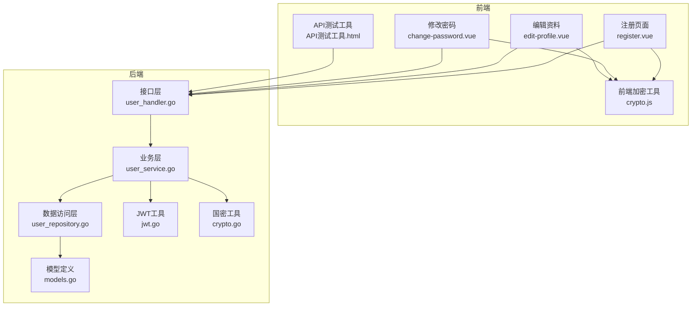
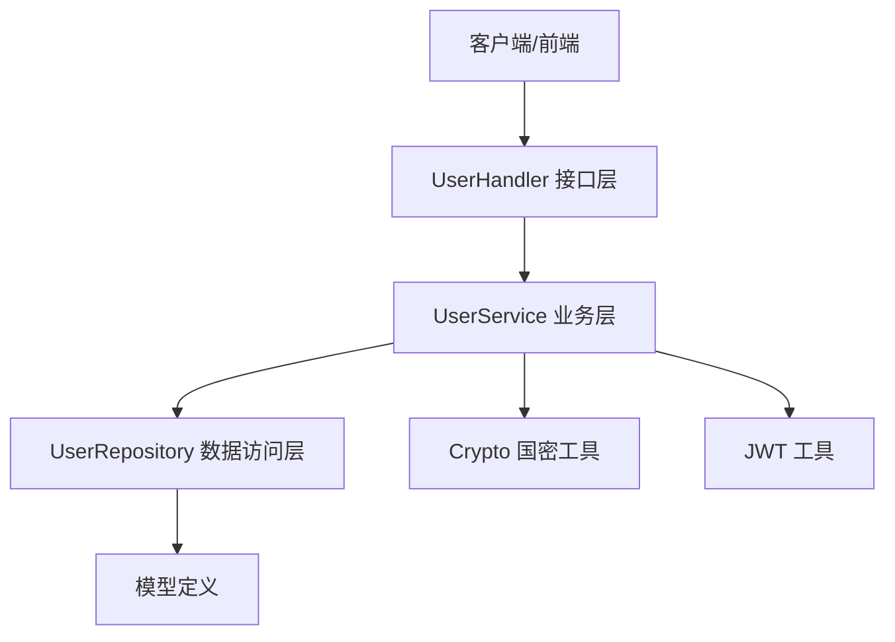
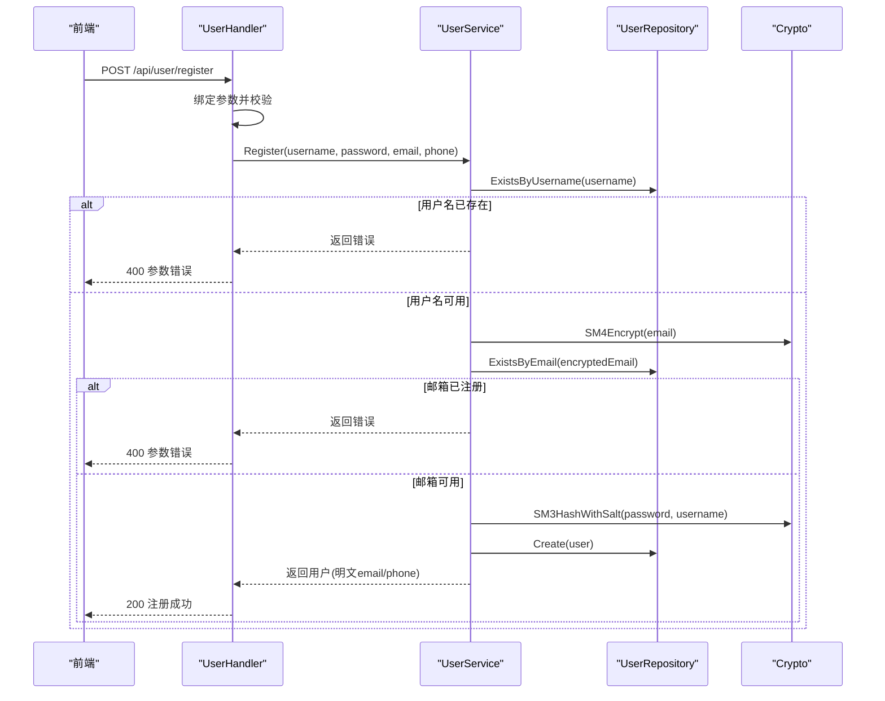
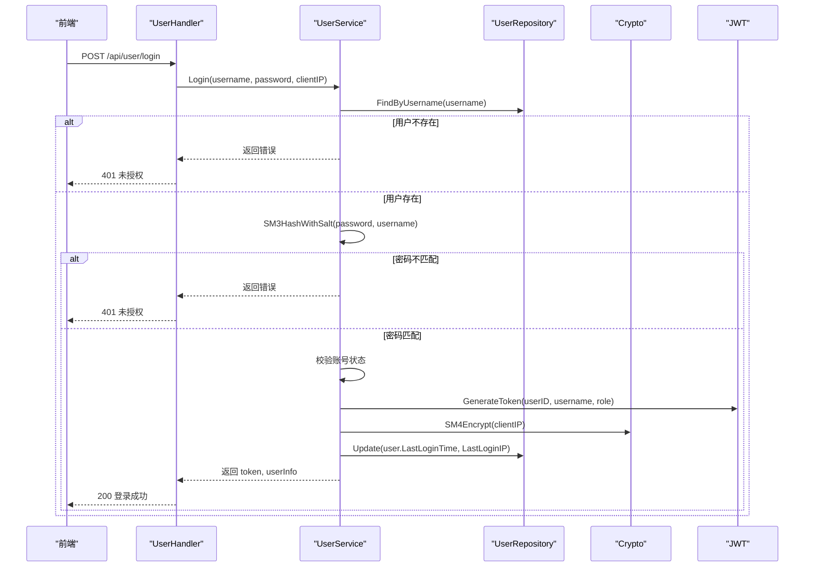
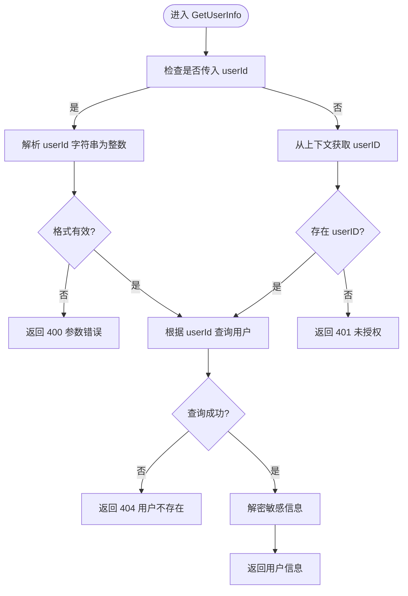
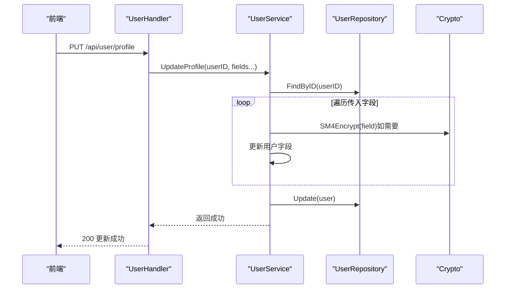
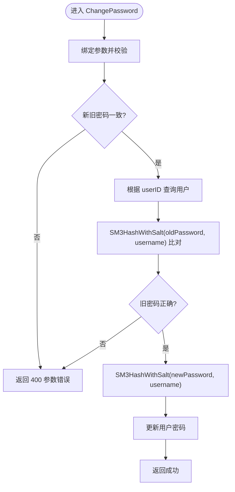
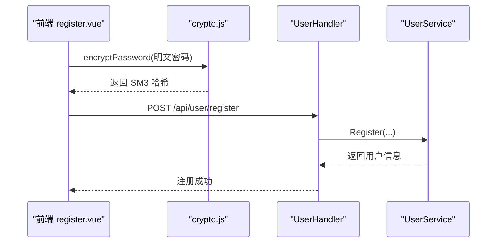
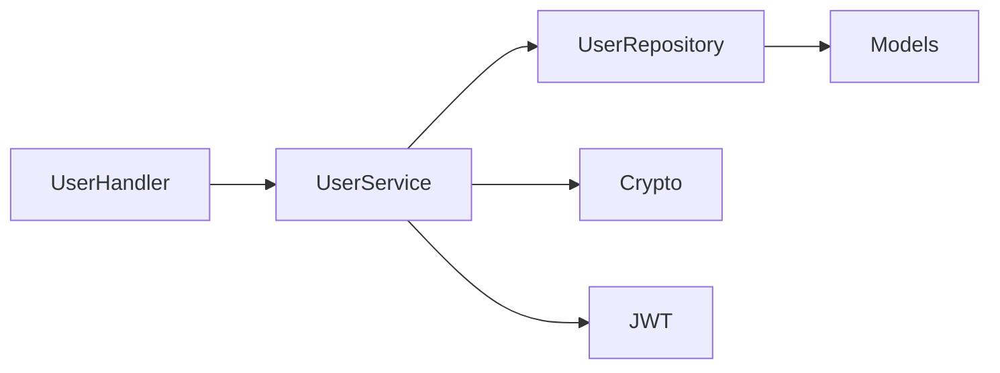

# 用户管理

<cite>
**本文引用的文件**
- [user_handler.go](file://backed/internal/api/handler/user_handler.go)
- [user_service.go](file://backed/internal/service/user_service.go)
- [user_repository.go](file://backed/internal/repository/user_repository.go)
- [models.go](file://backed/internal/model/models.go)
- [crypto.go](file://backed/internal/crypto/crypto.go)
- [jwt.go](file://backed/pkg/utils/jwt.go)
- [register.vue](file://fonted/pages/register/register.vue)
- [crypto.js](file://fonted/utils/crypto.js)
- [API测试工具.html](file://API测试工具.html)
- [API测试文档.md](file://backed/API测试文档.md)
- [edit-profile.vue](file://fonted/pages/user/edit-profile.vue)
- [change-password.vue](file://fonted/pages/user/change-password.vue)
</cite>

## 目录
1. [简介](#简介)
2. [项目结构](#项目结构)
3. [核心组件](#核心组件)
4. [架构总览](#架构总览)
5. [详细组件分析](#详细组件分析)
6. [依赖关系分析](#依赖关系分析)
7. [性能考量](#性能考量)
8. [故障排查指南](#故障排查指南)
9. [结论](#结论)
10. [附录](#附录)

## 简介
本文件围绕“用户管理”功能，系统性梳理用户注册、登录、个人信息获取与更新、密码修改以及退出登录等核心流程。重点解析后端 handler、service、repository 层的实现逻辑，说明 SM3 加盐哈希、SM4 敏感信息加密、JWT 令牌生成与校验等安全机制；同时结合前端注册工具页面与前端加密工具，阐述前后端协同的完整链路，并提供常见问题排查方法。

## 项目结构
用户管理相关代码分布如下：
- 后端
  - 接口层：user_handler.go
  - 业务层：user_service.go
  - 数据访问层：user_repository.go
  - 模型定义：models.go
  - 加密工具：crypto.go
  - JWT 工具：jwt.go
- 前端
  - 注册页面：register.vue
  - 加密工具：crypto.js
  - 修改密码页面：change-password.vue
  - 编辑资料页面：edit-profile.vue
  - API 测试工具：API测试工具.html
  - API 测试文档：API测试文档.md

图表来源
- [user_handler.go](file://backed/internal/api/handler/user_handler.go#L1-L261)
- [user_service.go](file://backed/internal/service/user_service.go#L1-L331)
- [user_repository.go](file://backed/internal/repository/user_repository.go#L1-L121)
- [models.go](file://backed/internal/model/models.go#L1-L160)
- [crypto.go](file://backed/internal/crypto/crypto.go#L1-L121)
- [jwt.go](file://backed/pkg/utils/jwt.go#L1-L53)
- [register.vue](file://fonted/pages/register/register.vue#L1-L360)
- [crypto.js](file://fonted/utils/crypto.js#L1-L255)
- [API测试工具.html](file://API测试工具.html#L1-L550)

章节来源
- [user_handler.go](file://backed/internal/api/handler/user_handler.go#L1-L261)
- [user_service.go](file://backed/internal/service/user_service.go#L1-L331)
- [user_repository.go](file://backed/internal/repository/user_repository.go#L1-L121)
- [models.go](file://backed/internal/model/models.go#L1-L160)
- [crypto.go](file://backed/internal/crypto/crypto.go#L1-L121)
- [jwt.go](file://backed/pkg/utils/jwt.go#L1-L53)
- [register.vue](file://fonted/pages/register/register.vue#L1-L360)
- [crypto.js](file://fonted/utils/crypto.js#L1-L255)
- [API测试工具.html](file://API测试工具.html#L1-L550)

## 核心组件
- 接口层（Handler）
  - 提供 REST API：注册、登录、获取用户信息、更新资料、修改密码、退出登录等
  - 参数绑定与基础校验、错误响应封装
- 业务层（Service）
  - 注册：用户名/邮箱唯一性检查、SM3 加盐哈希密码、SM4 加密敏感信息入库
  - 登录：查询用户、SM3 加盐哈希比对、JWT 令牌签发、最后登录时间/IP 更新
  - 个人信息：按需解密敏感信息返回
  - 密码修改：旧密码校验、新密码 SM3 加盐哈希更新
- 数据访问层（Repository）
  - 基于 GORM 的 CRUD、条件查询、分页查询、计数统计
- 模型（Model）
  - 用户表、医生申请表、问诊表、病历表、通知表、登录日志表等
- 加密与鉴权
  - SM3 哈希（加盐）、SM4 对称加密、JWT 签发与解析

章节来源
- [user_handler.go](file://backed/internal/api/handler/user_handler.go#L21-L168)
- [user_service.go](file://backed/internal/service/user_service.go#L24-L218)
- [user_repository.go](file://backed/internal/repository/user_repository.go#L14-L88)
- [models.go](file://backed/internal/model/models.go#L7-L66)
- [crypto.go](file://backed/internal/crypto/crypto.go#L36-L121)
- [jwt.go](file://backed/pkg/utils/jwt.go#L10-L53)

## 架构总览
后端采用典型的三层架构：接口层负责请求接入与响应封装，业务层承载领域逻辑，数据访问层屏蔽数据库细节。加密与鉴权由独立工具模块提供，保证跨层复用与一致性。

图表来源
- [user_handler.go](file://backed/internal/api/handler/user_handler.go#L1-L261)
- [user_service.go](file://backed/internal/service/user_service.go#L1-L331)
- [user_repository.go](file://backed/internal/repository/user_repository.go#L1-L121)
- [models.go](file://backed/internal/model/models.go#L1-L160)
- [crypto.go](file://backed/internal/crypto/crypto.go#L1-L121)
- [jwt.go](file://backed/pkg/utils/jwt.go#L1-L53)

## 详细组件分析

### 注册 Register
- 请求参数
  - username、password、email、phone（必填，email 格式校验）
- 业务流程
  - 检查用户名是否已存在
  - 将 email 进行 SM4 加密后查询邮箱是否被注册
  - 使用 SM3 对 password 进行加盐哈希（盐为 username）
  - SM4 加密 email、phone 存储
  - 创建用户并返回明文 email、phone（用于前端展示）
- 响应
  - 成功返回用户基本信息（userId、username、email）

图表来源
- [user_handler.go](file://backed/internal/api/handler/user_handler.go#L21-L47)
- [user_service.go](file://backed/internal/service/user_service.go#L24-L62)
- [user_repository.go](file://backed/internal/repository/user_repository.go#L14-L50)
- [crypto.go](file://backed/internal/crypto/crypto.go#L36-L60)

章节来源
- [user_handler.go](file://backed/internal/api/handler/user_handler.go#L21-L47)
- [user_service.go](file://backed/internal/service/user_service.go#L24-L62)
- [user_repository.go](file://backed/internal/repository/user_repository.go#L14-L50)
- [crypto.go](file://backed/internal/crypto/crypto.go#L36-L60)

### 登录 Login
- 请求参数
  - username、password、loginType（可选）
- 业务流程
  - 根据 username 查询用户
  - 使用 SM3 加盐哈希比对密码
  - 校验账号状态（禁用则拒绝）
  - 生成 JWT 令牌（含过期时间）
  - SM4 加密客户端 IP 并更新最后登录时间/IP
  - 解密敏感信息返回 userInfo
- 响应
  - 成功返回 token、tokenType、expiresIn、userInfo

图表来源
- [user_handler.go](file://backed/internal/api/handler/user_handler.go#L49-L82)
- [user_service.go](file://backed/internal/service/user_service.go#L64-L127)
- [user_repository.go](file://backed/internal/repository/user_repository.go#L24-L36)
- [crypto.go](file://backed/internal/crypto/crypto.go#L36-L60)
- [jwt.go](file://backed/pkg/utils/jwt.go#L17-L33)

章节来源
- [user_handler.go](file://backed/internal/api/handler/user_handler.go#L49-L82)
- [user_service.go](file://backed/internal/service/user_service.go#L64-L127)
- [user_repository.go](file://backed/internal/repository/user_repository.go#L24-L36)
- [crypto.go](file://backed/internal/crypto/crypto.go#L36-L60)
- [jwt.go](file://backed/pkg/utils/jwt.go#L17-L33)

### 获取用户信息 GetUserInfo
- 请求参数
  - userId（可选，若不传则取当前登录用户）
- 业务流程
  - 若传 userId：校验格式并查询该用户
  - 若未传 userId：从上下文中取 userID，校验登录态
  - 解密敏感信息（email、phone、realName）后返回
- 响应
  - 成功返回用户完整信息

图表来源
- [user_handler.go](file://backed/internal/api/handler/user_handler.go#L84-L114)
- [user_service.go](file://backed/internal/service/user_service.go#L129-L166)
- [user_repository.go](file://backed/internal/repository/user_repository.go#L24-L36)

章节来源
- [user_handler.go](file://backed/internal/api/handler/user_handler.go#L84-L114)
- [user_service.go](file://backed/internal/service/user_service.go#L129-L166)
- [user_repository.go](file://backed/internal/repository/user_repository.go#L24-L36)

### 更新用户资料 UpdateProfile
- 请求参数
  - avatar、realName、gender、birthDate、phone、email（部分可选）
- 业务流程
  - 根据 userID 查询用户
  - 对传入的敏感字段（realName、phone、email）进行 SM4 加密
  - 保存更新
- 响应
  - 成功返回“更新成功”

图表来源
- [user_handler.go](file://backed/internal/api/handler/user_handler.go#L116-L140)
- [user_service.go](file://backed/internal/service/user_service.go#L168-L198)
- [user_repository.go](file://backed/internal/repository/user_repository.go#L19-L22)
- [crypto.go](file://backed/internal/crypto/crypto.go#L48-L79)

章节来源
- [user_handler.go](file://backed/internal/api/handler/user_handler.go#L116-L140)
- [user_service.go](file://backed/internal/service/user_service.go#L168-L198)
- [user_repository.go](file://backed/internal/repository/user_repository.go#L19-L22)
- [crypto.go](file://backed/internal/crypto/crypto.go#L48-L79)

### 修改密码 ChangePassword
- 请求参数
  - oldPassword、newPassword、confirmPassword（必填且新旧密码一致）
- 业务流程
  - 根据 userID 查询用户
  - SM3 加盐哈希校验旧密码
  - 新密码再次 SM3 加盐哈希并更新
- 响应
  - 成功返回“密码修改成功，请重新登录”

图表来源
- [user_handler.go](file://backed/internal/api/handler/user_handler.go#L142-L168)
- [user_service.go](file://backed/internal/service/user_service.go#L200-L218)

章节来源
- [user_handler.go](file://backed/internal/api/handler/user_handler.go#L142-L168)
- [user_service.go](file://backed/internal/service/user_service.go#L200-L218)

### 退出登录 Logout
- 说明
  - JWT 为无状态令牌，后端不做服务端撤销，前端删除本地 token 即可
- 响应
  - 成功返回“退出成功”

章节来源
- [user_handler.go](file://backed/internal/api/handler/user_handler.go#L256-L260)

### 前后端协同与前端加密链路
- 注册链路
  - 前端使用 SM3 对明文密码进行一次哈希，然后携带 username、hashedPassword、email、phone 发送到后端
  - 后端再次对密码进行 SM3 加盐哈希（盐为 username），并与数据库存储的哈希比对
- 登录链路
  - 前端同样对密码进行 SM3 哈希后发送
  - 后端比对 SM3 加盐哈希，成功后签发 JWT
- 修改密码链路
  - 前端对旧密码与新密码分别进行 SM3 哈希，后端验证旧密码并更新新密码哈希

图表来源
- [register.vue](file://fonted/pages/register/register.vue#L178-L206)
- [crypto.js](file://fonted/utils/crypto.js#L82-L94)
- [user_handler.go](file://backed/internal/api/handler/user_handler.go#L21-L47)
- [user_service.go](file://backed/internal/service/user_service.go#L24-L62)

章节来源
- [register.vue](file://fonted/pages/register/register.vue#L178-L206)
- [crypto.js](file://fonted/utils/crypto.js#L82-L94)
- [API测试工具.html](file://API测试工具.html#L359-L409)

## 依赖关系分析
- 组件耦合
  - Handler 仅依赖 Service 的公开方法，职责清晰
  - Service 依赖 Repository、Crypto、JWT 工具，承担核心业务规则
  - Repository 依赖 GORM 与数据库连接，提供数据访问能力
- 外部依赖
  - gmsm 国密算法库（SM2/SM3/SM4）
  - golang-jwt/JWT 库
  - Gin Web 框架
- 潜在风险
  - 前端加密工具目前为模拟实现，生产需替换为真正的 SM3/SM4 实现
  - JWT 密钥与过期策略需集中配置与轮换

图表来源
- [user_handler.go](file://backed/internal/api/handler/user_handler.go#L1-L261)
- [user_service.go](file://backed/internal/service/user_service.go#L1-L331)
- [user_repository.go](file://backed/internal/repository/user_repository.go#L1-L121)
- [models.go](file://backed/internal/model/models.go#L1-L160)
- [crypto.go](file://backed/internal/crypto/crypto.go#L1-L121)
- [jwt.go](file://backed/pkg/utils/jwt.go#L1-L53)

章节来源
- [user_handler.go](file://backed/internal/api/handler/user_handler.go#L1-L261)
- [user_service.go](file://backed/internal/service/user_service.go#L1-L331)
- [user_repository.go](file://backed/internal/repository/user_repository.go#L1-L121)
- [models.go](file://backed/internal/model/models.go#L1-L160)
- [crypto.go](file://backed/internal/crypto/crypto.go#L1-L121)
- [jwt.go](file://backed/pkg/utils/jwt.go#L1-L53)

## 性能考量
- 数据库查询
  - ExistsByUsername/ExistsByEmail 使用 COUNT 判断，复杂度 O(n)；建议在 username/email 建立唯一索引以降低冲突概率
- 加密成本
  - SM3/SM4 为轻量级算法，单次调用开销较小；批量注册/登录场景建议避免重复加密
- JWT
  - 无状态鉴权，减少服务端状态存储；注意合理设置过期时间与刷新策略
- 建议
  - 对高频查询字段建立索引
  - 对敏感字段解密仅在必要时进行，避免重复解密
  - 前端加密库替换为原生实现，减少模拟层带来的不确定性

[本节为通用指导，不直接分析具体文件]

## 故障排查指南
- 注册失败
  - 用户名已存在：检查用户名唯一性
  - 邮箱已被注册：检查 email 是否已加密后存在
  - 参数错误：确认必填字段与格式校验
- 登录失败
  - 用户名或密码错误：确认前端是否正确进行 SM3 哈希，后端加盐哈希是否一致
  - 账号被禁用：检查用户状态
  - 未授权：确认请求头 Authorization 是否携带 Bearer Token
- 获取用户信息失败
  - 用户不存在：确认 userId 或上下文 userID 是否正确
  - 未登录：确认 token 是否有效
- 更新资料失败
  - 数据库写入异常：检查字段映射与加密逻辑
- 修改密码失败
  - 旧密码错误：确认 SM3 加盐哈希是否与存储一致
  - 新旧密码不一致：确认前端二次哈希与后端比对逻辑
- 前端加密问题
  - 当前前端加密工具为模拟实现，生产需替换为真正的 SM3/SM4 实现
  - API 测试工具中也使用了模拟 SM3 哈希，仅用于演示

章节来源
- [user_handler.go](file://backed/internal/api/handler/user_handler.go#L21-L168)
- [user_service.go](file://backed/internal/service/user_service.go#L24-L218)
- [user_repository.go](file://backed/internal/repository/user_repository.go#L14-L88)
- [crypto.go](file://backed/internal/crypto/crypto.go#L36-L121)
- [jwt.go](file://backed/pkg/utils/jwt.go#L17-L53)
- [API测试文档.md](file://backed/API测试文档.md#L1-L424)
- [API测试工具.html](file://API测试工具.html#L359-L409)

## 结论
本用户管理模块通过明确的三层架构与国密算法组合，实现了从注册、登录到资料维护与密码变更的完整闭环。前后端协同采用 SM3 哈希与 SM4 加密，配合 JWT 令牌实现安全鉴权。建议尽快替换前端加密库为真实国密实现，并完善数据库索引与日志监控，持续提升安全性与可观测性。

[本节为总结性内容，不直接分析具体文件]

## 附录
- API 测试参考
  - 可参考 API 测试文档与测试工具页面，快速验证注册、登录、获取信息、更新资料、修改密码等流程
- 前端页面要点
  - 注册页面：表单校验、SM3 哈希、提交注册
  - 修改密码页面：表单校验、SM3 哈希、提示重新登录
  - 编辑资料页面：加载用户信息、提交更新

章节来源
- [API测试文档.md](file://backed/API测试文档.md#L1-L424)
- [API测试工具.html](file://API测试工具.html#L1-L550)
- [register.vue](file://fonted/pages/register/register.vue#L120-L206)
- [change-password.vue](file://fonted/pages/user/change-password.vue#L136-L258)
- [edit-profile.vue](file://fonted/pages/user/edit-profile.vue#L90-L226)