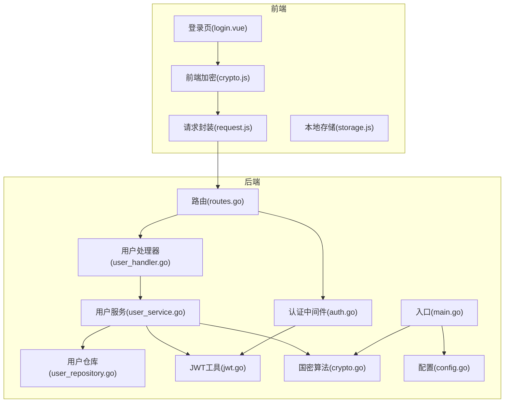
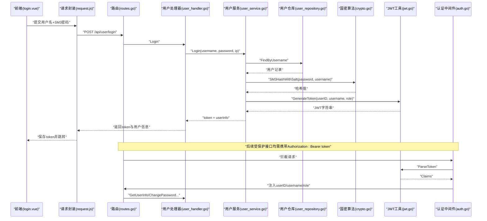
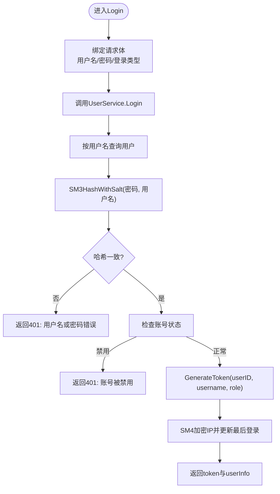
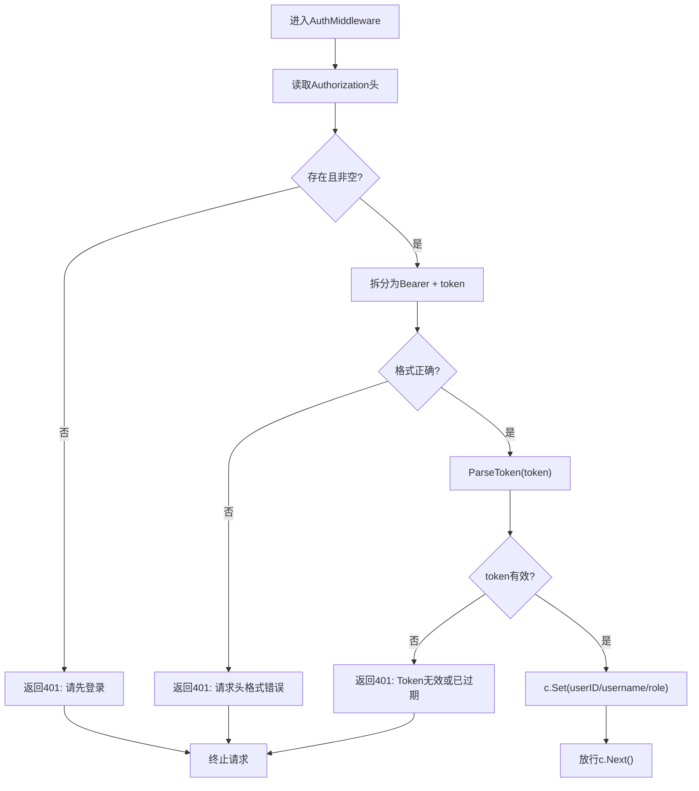
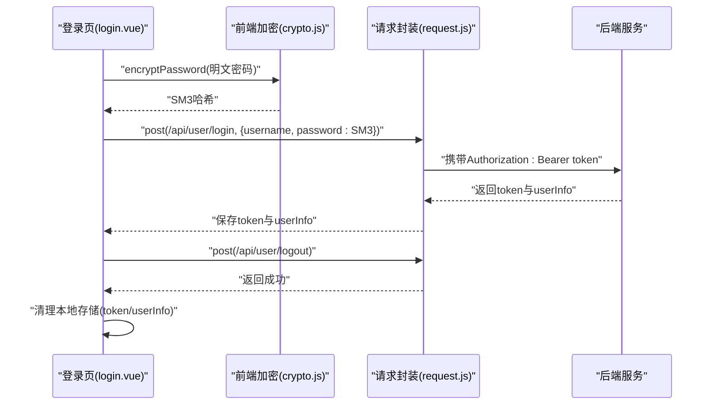
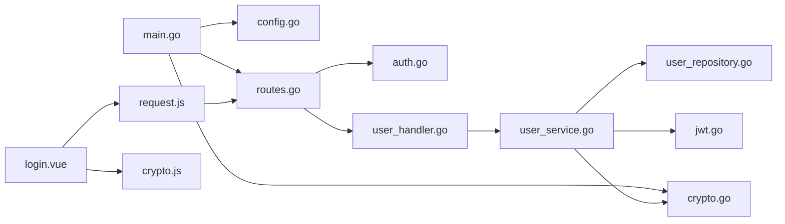

# 身份认证机制

<cite>
**本文引用的文件**
- [main.go](file://backed/cmd/main.go)
- [routes.go](file://backed/internal/api/routes.go)
- [user_handler.go](file://backed/internal/api/handler/user_handler.go)
- [user_service.go](file://backed/internal/service/user_service.go)
- [auth.go](file://backed/internal/middleware/auth.go)
- [jwt.go](file://backed/pkg/utils/jwt.go)
- [crypto.go](file://backed/internal/crypto/crypto.go)
- [config.go](file://backed/pkg/config/config.go)
- [user_repository.go](file://backed/internal/repository/user_repository.go)
- [request.js](file://fonted/utils/request.js)
- [storage.js](file://fonted/utils/storage.js)
- [login.vue](file://fonted/pages/login/login.vue)
- [crypto.js](file://fonted/utils/crypto.js)
</cite>

## 目录
1. [简介](#简介)
2. [项目结构](#项目结构)
3. [核心组件](#核心组件)
4. [架构总览](#架构总览)
5. [详细组件分析](#详细组件分析)
6. [依赖关系分析](#依赖关系分析)
7. [性能与安全特性](#性能与安全特性)
8. [故障排查与调试](#故障排查与调试)
9. [结论](#结论)

## 简介
本文件围绕系统“基于JWT的认证流程与国密算法安全保障”展开，重点解析以下内容：
- Login接口如何调用UserService进行用户名密码验证，使用SM3加盐哈希比对密码，并通过jwt.go生成包含用户ID、用户名和角色的JWT令牌；
- auth中间件如何拦截请求、解析JWT令牌并验证其有效性，将用户ID注入上下文供后续处理器使用；
- 前端在请求头中携带Bearer Token的调用方式，以及Logout接口虽为无状态但前端需清除本地存储的设计原理；
- 结合SM2/SM3/SM4加密体系，说明密码传输（SM3）、存储（SM3加盐）和敏感信息保护（SM4）的多层次安全策略；
- 提供认证失败的调试日志分析方法与常见问题解决方案。

## 项目结构
后端采用分层架构：API层负责HTTP路由与请求处理，Service层负责业务逻辑，Repository层负责数据访问，Crypto层提供国密算法能力，Utils层提供JWT与通用工具，Middleware层提供认证与跨域等中间件。

图表来源
- [main.go](file://backed/cmd/main.go#L1-L64)
- [routes.go](file://backed/internal/api/routes.go#L1-L95)
- [user_handler.go](file://backed/internal/api/handler/user_handler.go#L1-L261)
- [user_service.go](file://backed/internal/service/user_service.go#L1-L331)
- [auth.go](file://backed/internal/middleware/auth.go#L1-L61)
- [jwt.go](file://backed/pkg/utils/jwt.go#L1-L53)
- [crypto.go](file://backed/internal/crypto/crypto.go#L1-L121)
- [config.go](file://backed/pkg/config/config.go#L1-L78)
- [user_repository.go](file://backed/internal/repository/user_repository.go#L1-L121)
- [request.js](file://fonted/utils/request.js#L1-L222)
- [storage.js](file://fonted/utils/storage.js#L1-L94)
- [login.vue](file://fonted/pages/login/login.vue#L1-L406)
- [crypto.js](file://fonted/utils/crypto.js#L1-L255)

章节来源
- [main.go](file://backed/cmd/main.go#L1-L64)
- [routes.go](file://backed/internal/api/routes.go#L1-L95)

## 核心组件
- 登录处理器：接收用户名、密码与登录类型，调用服务层执行验证与签发令牌。
- 用户服务：负责查询用户、密码校验（SM3加盐哈希）、签发JWT、更新登录信息与敏感信息解密。
- 认证中间件：从Authorization头解析Bearer Token，校验有效性并将用户信息注入上下文。
- JWT工具：定义Claims结构，生成与解析JWT。
- 国密算法：提供SM3哈希、SM4加解密、SM2加解密（示例）能力。
- 前端请求封装：自动在请求头添加Authorization: Bearer token；统一错误处理与跳转。
- 前端登录页：对密码进行SM3哈希，提交给后端；保存token与用户信息至本地存储。

章节来源
- [user_handler.go](file://backed/internal/api/handler/user_handler.go#L49-L82)
- [user_service.go](file://backed/internal/service/user_service.go#L64-L127)
- [auth.go](file://backed/internal/middleware/auth.go#L9-L43)
- [jwt.go](file://backed/pkg/utils/jwt.go#L10-L53)
- [crypto.go](file://backed/internal/crypto/crypto.go#L36-L121)
- [request.js](file://fonted/utils/request.js#L24-L43)
- [login.vue](file://fonted/pages/login/login.vue#L212-L239)

## 架构总览
下面以序列图展示“登录—签发—鉴权—使用”的完整流程。

图表来源
- [login.vue](file://fonted/pages/login/login.vue#L212-L239)
- [request.js](file://fonted/utils/request.js#L24-L43)
- [routes.go](file://backed/internal/api/routes.go#L14-L35)
- [user_handler.go](file://backed/internal/api/handler/user_handler.go#L49-L82)
- [user_service.go](file://backed/internal/service/user_service.go#L64-L127)
- [user_repository.go](file://backed/internal/repository/user_repository.go#L31-L36)
- [crypto.go](file://backed/internal/crypto/crypto.go#L43-L46)
- [jwt.go](file://backed/pkg/utils/jwt.go#L18-L33)
- [auth.go](file://backed/internal/middleware/auth.go#L9-L43)

## 详细组件分析

### 登录流程与JWT签发
- 处理器接收用户名、密码与登录类型，记录调试日志，调用服务层Login方法。
- 服务层根据用户名查询用户，使用SM3加盐哈希比对密码，检查账号状态，生成JWT并更新最后登录时间与IP（SM4加密）。
- 返回token、tokenType、过期时间与用户信息；处理器记录成功日志并返回。

图表来源
- [user_handler.go](file://backed/internal/api/handler/user_handler.go#L49-L82)
- [user_service.go](file://backed/internal/service/user_service.go#L64-L127)
- [crypto.go](file://backed/internal/crypto/crypto.go#L43-L46)
- [jwt.go](file://backed/pkg/utils/jwt.go#L18-L33)

章节来源
- [user_handler.go](file://backed/internal/api/handler/user_handler.go#L49-L82)
- [user_service.go](file://backed/internal/service/user_service.go#L64-L127)
- [jwt.go](file://backed/pkg/utils/jwt.go#L18-L33)

### 认证中间件与上下文注入
- 中间件从Authorization头解析Bearer Token，校验格式与有效性；若有效则将用户ID、用户名、角色注入上下文，供后续处理器使用。
- 未携带或格式错误、解析失败均返回401。

图表来源
- [auth.go](file://backed/internal/middleware/auth.go#L9-L43)
- [jwt.go](file://backed/pkg/utils/jwt.go#L35-L53)

章节来源
- [auth.go](file://backed/internal/middleware/auth.go#L9-L43)
- [jwt.go](file://backed/pkg/utils/jwt.go#L35-L53)

### 前端请求头与本地存储
- 前端请求封装会在非noAuth场景下自动添加Authorization: Bearer token；统一错误处理遇到401会跳转登录页。
- 登录页对密码进行SM3哈希后提交；成功后保存token与用户信息至本地存储；Logout仅返回成功，前端需主动清理本地存储。

图表来源
- [login.vue](file://fonted/pages/login/login.vue#L212-L239)
- [crypto.js](file://fonted/utils/crypto.js#L82-L94)
- [request.js](file://fonted/utils/request.js#L24-L43)
- [storage.js](file://fonted/utils/storage.js#L1-L94)

章节来源
- [login.vue](file://fonted/pages/login/login.vue#L212-L239)
- [request.js](file://fonted/utils/request.js#L24-L43)
- [storage.js](file://fonted/utils/storage.js#L1-L94)
- [crypto.js](file://fonted/utils/crypto.js#L82-L94)

### 国密算法与安全策略
- 密码传输（SM3）：前端对明文密码进行SM3哈希后再传输，降低明文泄露风险。
- 密码存储（SM3加盐）：后端使用“SM3HashWithSalt(密码, 用户名)”生成哈希，即使数据库泄露也难以逆推明文。
- 敏感信息保护（SM4）：邮箱、电话、真实姓名等敏感字段使用SM4加密存储；服务层在返回时解密，避免明文泄露。
- JWT签名：使用HS256与配置中的Secret进行签名，保证令牌完整性与防篡改。

章节来源
- [user_service.go](file://backed/internal/service/user_service.go#L24-L62)
- [user_service.go](file://backed/internal/service/user_service.go#L129-L166)
- [user_service.go](file://backed/internal/service/user_service.go#L168-L218)
- [crypto.go](file://backed/internal/crypto/crypto.go#L36-L121)
- [jwt.go](file://backed/pkg/utils/jwt.go#L18-L33)

## 依赖关系分析
- 入口程序加载配置与初始化国密算法，注册路由与中间件，启动HTTP服务。
- 路由将用户模块的公开接口与受保护接口分别挂载，受保护接口统一应用认证中间件。
- 处理器依赖服务层；服务层依赖仓库层、JWT工具与国密算法；前端通过请求封装与后端交互。

图表来源
- [main.go](file://backed/cmd/main.go#L1-L64)
- [config.go](file://backed/pkg/config/config.go#L1-L78)
- [routes.go](file://backed/internal/api/routes.go#L1-L95)
- [auth.go](file://backed/internal/middleware/auth.go#L9-L43)
- [user_handler.go](file://backed/internal/api/handler/user_handler.go#L1-L261)
- [user_service.go](file://backed/internal/service/user_service.go#L1-L331)
- [user_repository.go](file://backed/internal/repository/user_repository.go#L1-L121)
- [jwt.go](file://backed/pkg/utils/jwt.go#L1-L53)
- [crypto.go](file://backed/internal/crypto/crypto.go#L1-L121)
- [request.js](file://fonted/utils/request.js#L1-L222)
- [login.vue](file://fonted/pages/login/login.vue#L1-L406)
- [crypto.js](file://fonted/utils/crypto.js#L1-L255)

章节来源
- [main.go](file://backed/cmd/main.go#L1-L64)
- [routes.go](file://backed/internal/api/routes.go#L1-L95)

## 性能与安全特性
- 性能：JWT为无状态令牌，中间件解析开销小；SM3哈希与SM4加解密在服务端执行，前端仅做SM3哈希，整体开销可控。
- 安全：多层加密策略（传输层SM3、存储层SM3加盐、敏感字段SM4），配合JWT签名与过期控制，提升抗攻击能力。
- 可扩展：支持在JWT中扩展更多声明（如角色、权限），便于RBAC扩展。

[本节为通用讨论，无需列出具体文件来源]

## 故障排查与调试
- 登录失败
  - 现象：返回401，日志显示“用户名或密码错误”或“账号被禁用”。
  - 排查要点：
    - 检查前端是否对密码进行了SM3哈希后再提交；
    - 检查后端日志中“前端发送的密码/后端计算的哈希/数据库存储的哈希”三者是否一致；
    - 确认用户状态未被禁用；
    - 确认JWT Secret与配置一致。
- Token无效或过期
  - 现象：中间件返回401，提示Token无效或已过期。
  - 排查要点：
    - 检查Authorization头格式是否为“Bearer <token>”；
    - 检查前端是否正确保存与携带token；
    - 检查JWT过期时间配置；
    - 检查服务端时间与时钟同步。
- 本地存储未清理导致重复登录
  - 现象：Logout后仍可访问受保护接口。
  - 处理：前端Logout后应主动清理本地存储的token与用户信息。

章节来源
- [user_handler.go](file://backed/internal/api/handler/user_handler.go#L62-L82)
- [user_service.go](file://backed/internal/service/user_service.go#L64-L127)
- [auth.go](file://backed/internal/middleware/auth.go#L9-L43)
- [jwt.go](file://backed/pkg/utils/jwt.go#L18-L53)
- [request.js](file://fonted/utils/request.js#L180-L221)
- [login.vue](file://fonted/pages/login/login.vue#L212-L239)

## 结论
该系统通过“前端SM3哈希+后端SM3加盐哈希+JWT无状态令牌+SM4敏感信息加密”的组合，构建了较为完整的身份认证与数据安全体系。登录流程清晰、中间件统一拦截、前端请求自动携带令牌，Logout虽为无状态但仍需前端清理本地存储，确保会话生命周期可控。建议在生产环境中：
- 前端替换为真正SM2/SM4实现（当前为示例）；
- 强化日志脱敏与审计；
- 对异常登录尝试增加风控策略（如限流、验证码）。