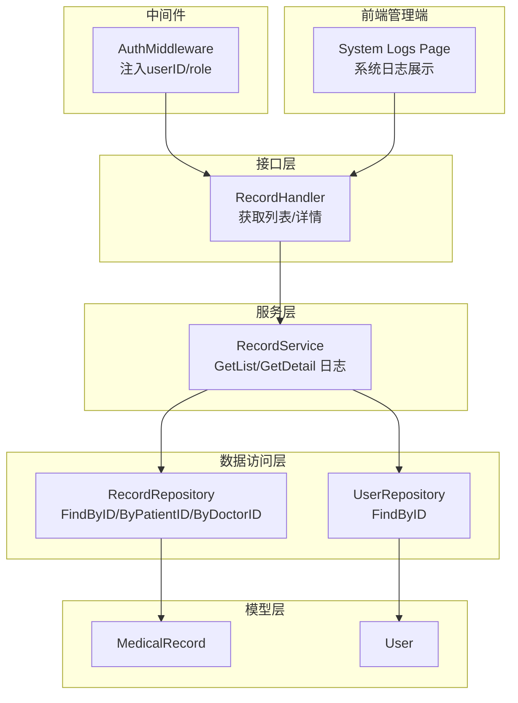
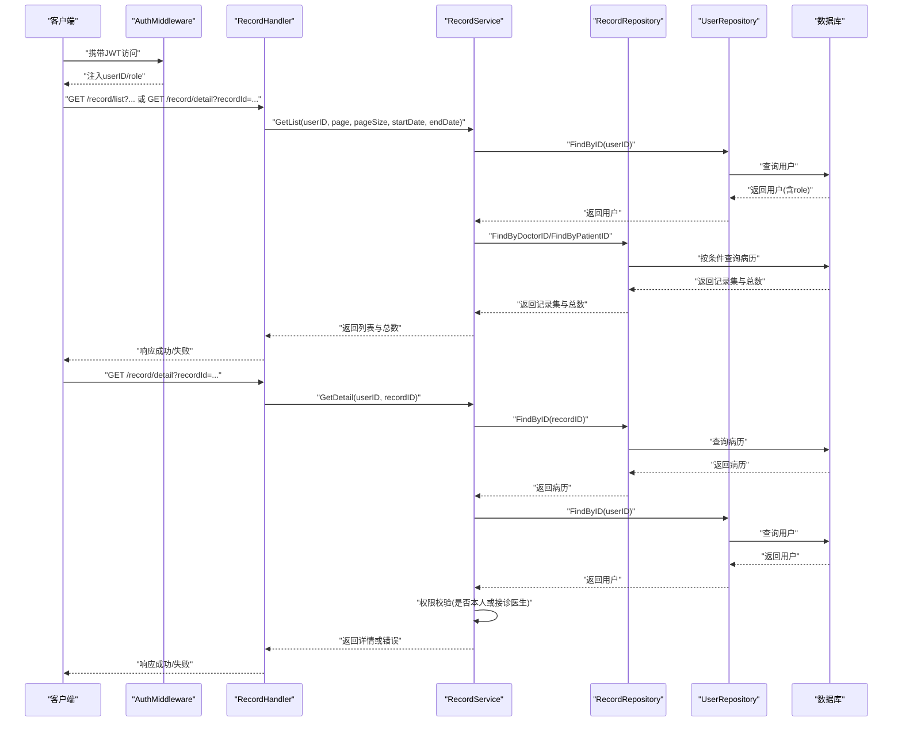
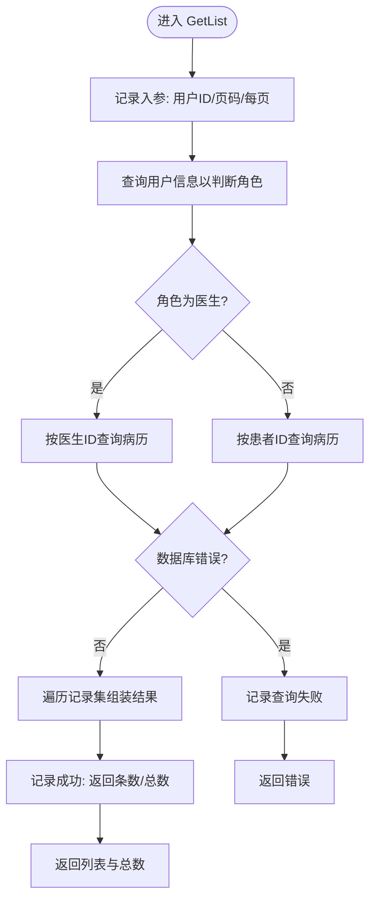
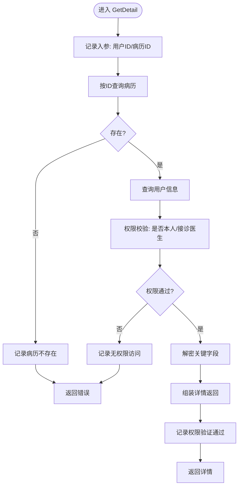
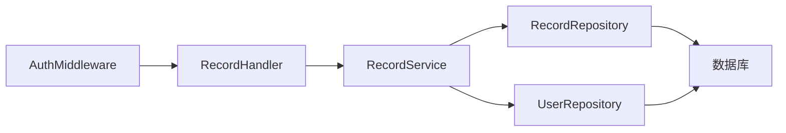

# 审计日志

<cite>
**本文引用的文件**
- [record_service.go](file://backed/internal/service/record_service.go)
- [record_handler.go](file://backed/internal/api/handler/record_handler.go)
- [auth.go](file://backed/internal/middleware/auth.go)
- [models.go](file://backed/internal/model/models.go)
- [record_repository.go](file://backed/internal/repository/record_repository.go)
- [jwt.go](file://backed/pkg/utils/jwt.go)
- [system-logs.vue](file://fonted/pages/admin/system-logs.vue)
</cite>

## 目录
1. [简介](#简介)
2. [项目结构](#项目结构)
3. [核心组件](#核心组件)
4. [架构总览](#架构总览)
5. [详细组件分析](#详细组件分析)
6. [依赖关系分析](#依赖关系分析)
7. [性能考量](#性能考量)
8. [故障排查指南](#故障排查指南)
9. [结论](#结论)
10. [附录](#附录)

## 简介
本文件聚焦于病历模块的审计日志功能，系统性梳理 record_service.go 中通过标准库日志记录的关键操作事件，覆盖“病历列表查询(GetList)”与“病历详情访问(GetDetail)”两类场景。文档从日志格式与内容结构出发，逐项解析日志中包含的上下文信息（用户ID、病历ID、操作类型、角色判断结果、权限验证状态），并结合前端管理端“系统日志”页面，说明这些日志在安全审计、故障排查与行为追踪中的实际价值。最后给出日志增强建议，以满足医疗信息系统对合规性的更高要求。

## 项目结构
围绕病历审计日志的相关代码分布在以下层次：
- 接口层：HTTP处理器负责接收请求参数并将用户上下文传递给服务层
- 服务层：业务逻辑与日志记录的核心实现
- 数据访问层：封装数据库查询与关联信息补全
- 中间件：统一鉴权，向请求上下文注入用户标识与角色
- 模型层：定义病历与用户等实体字段
- 前端管理端：系统日志页面用于展示与筛选审计日志

图表来源
- [record_handler.go](file://backed/internal/api/handler/record_handler.go#L20-L61)
- [record_service.go](file://backed/internal/service/record_service.go#L23-L137)
- [record_repository.go](file://backed/internal/repository/record_repository.go#L19-L97)
- [auth.go](file://backed/internal/middleware/auth.go#L9-L42)
- [models.go](file://backed/internal/model/models.go#L99-L121)
- [system-logs.vue](file://fonted/pages/admin/system-logs.vue#L102-L126)

章节来源
- [record_handler.go](file://backed/internal/api/handler/record_handler.go#L20-L61)
- [record_service.go](file://backed/internal/service/record_service.go#L23-L137)
- [record_repository.go](file://backed/internal/repository/record_repository.go#L19-L97)
- [auth.go](file://backed/internal/middleware/auth.go#L9-L42)
- [models.go](file://backed/internal/model/models.go#L99-L121)
- [system-logs.vue](file://fonted/pages/admin/system-logs.vue#L102-L126)

## 核心组件
- 记录点一：GetList 列表查询
  - 关键日志：记录用户ID、页码、每页数量；根据角色区分“医生接诊病历”与“患者自病历”的查询路径；记录查询失败与成功时的条目数量与总数
  - 上下文信息：用户ID、页码、每页数量、角色（doctor/patient）、查询结果条数、总记录数
- 记录点二：GetDetail 详情访问
  - 关键日志：记录用户ID与病历ID；记录病历不存在、权限不足、权限验证通过等状态；记录解密前后的关键字段（主诉、诊断、治疗）
  - 上下文信息：用户ID、病历ID、角色、患者ID、接诊医生ID、权限验证结果（是否为本人或接诊医生）

章节来源
- [record_service.go](file://backed/internal/service/record_service.go#L23-L137)

## 架构总览
下图展示了从接口到服务再到数据访问与模型的完整调用链，并标注了审计日志落点。

图表来源
- [record_handler.go](file://backed/internal/api/handler/record_handler.go#L20-L61)
- [record_service.go](file://backed/internal/service/record_service.go#L23-L137)
- [record_repository.go](file://backed/internal/repository/record_repository.go#L19-L97)
- [auth.go](file://backed/internal/middleware/auth.go#L9-L42)

## 详细组件分析

### 组件A：RecordService.GetList（病历列表查询）
- 日志落点与内容要点
  - 入参记录：用户ID、页码、每页数量
  - 角色判断：医生/患者，分别走不同查询分支
  - 失败与成功：查询失败时记录错误；查询成功时记录返回条数与总数
- 关键上下文信息
  - 用户ID：来自请求上下文userID
  - 操作类型：列表查询
  - 角色判断结果：doctor/patient
  - 权限验证状态：隐含在角色分支选择中
  - 结果统计：返回条数、总记录数
- 处理逻辑与复杂度
  - 时间复杂度：O(n) 遍历记录集进行字段组装；数据库查询复杂度取决于分页与过滤条件
  - 空间复杂度：O(n) 返回结果切片
- 错误处理
  - 用户查询失败、病历查询失败均记录错误日志并返回错误
- 安全与合规
  - 通过角色分支限制访问范围，避免越权读取他人病历

图表来源
- [record_service.go](file://backed/internal/service/record_service.go#L23-L87)

章节来源
- [record_service.go](file://backed/internal/service/record_service.go#L23-L87)

### 组件B：RecordService.GetDetail（病历详情访问）
- 日志落点与内容要点
  - 入参记录：用户ID、病历ID
  - 存在性检查：记录病历不存在
  - 权限验证：记录角色、患者ID、接诊医生ID；记录权限验证通过与否
  - 数据解密：记录解密字段（主诉、诊断、治疗）
- 关键上下文信息
  - 用户ID、病历ID、角色、患者ID、接诊医生ID、权限验证结果（是否为本人或接诊医生）
- 处理逻辑与复杂度
  - 时间复杂度：O(1) 单条记录查询与权限判断
  - 空间复杂度：O(1) 返回单条详情
- 错误处理
  - 病历不存在、权限不足均记录错误日志并返回错误

图表来源
- [record_service.go](file://backed/internal/service/record_service.go#L89-L137)

章节来源
- [record_service.go](file://backed/internal/service/record_service.go#L89-L137)

### 组件C：鉴权中间件与上下文注入
- AuthMiddleware 将 userID、username、role 注入到请求上下文中，供 Handler 与 Service 使用
- 这些上下文信息直接参与日志记录与权限判断

章节来源
- [auth.go](file://backed/internal/middleware/auth.go#L9-L42)
- [jwt.go](file://backed/pkg/utils/jwt.go#L10-L52)

### 组件D：数据访问层与模型
- RecordRepository 提供按医生ID、按患者ID的分页查询，以及按ID查询
- User 与 MedicalRecord 模型定义了角色、主诉、诊断、治疗等字段，支撑日志内容与权限判断

章节来源
- [record_repository.go](file://backed/internal/repository/record_repository.go#L19-L97)
- [models.go](file://backed/internal/model/models.go#L99-L121)

## 依赖关系分析
- Handler 依赖 Service；Service 依赖 Repository 与 UserRepository；Repository 依赖数据库；中间件在 Handler 之前执行，为后续日志与权限提供上下文
- 日志依赖关系：Handler -> Service -> Repository/UserRepository -> Database

图表来源
- [record_handler.go](file://backed/internal/api/handler/record_handler.go#L20-L61)
- [record_service.go](file://backed/internal/service/record_service.go#L23-L137)
- [record_repository.go](file://backed/internal/repository/record_repository.go#L19-L97)
- [auth.go](file://backed/internal/middleware/auth.go#L9-L42)

章节来源
- [record_handler.go](file://backed/internal/api/handler/record_handler.go#L20-L61)
- [record_service.go](file://backed/internal/service/record_service.go#L23-L137)
- [record_repository.go](file://backed/internal/repository/record_repository.go#L19-L97)
- [auth.go](file://backed/internal/middleware/auth.go#L9-L42)

## 性能考量
- GetList 的时间复杂度主要由数据库分页查询与结果集遍历决定；建议在高频查询场景下：
  - 对 patient_id、doctor_id、created_at 建立复合索引
  - 控制 page、pageSize 合理范围，避免超大分页
- GetDetail 为单条查询，性能瓶颈较低；注意权限判断与解密开销可控
- 日志写入为同步 I/O，建议在高并发场景下评估日志级别与采样策略，避免成为性能瓶颈

## 故障排查指南
- 列表查询失败
  - 现象：日志出现“查询失败”字样
  - 排查：检查用户是否存在、数据库连接、查询条件（日期范围、分页参数）
- 详情访问失败
  - 现象：日志出现“病历不存在”或“无权限访问”
  - 排查：确认 recordId 是否正确、用户是否为本人或接诊医生、数据库中是否存在该记录
- 权限绕过风险
  - 现象：日志显示“权限验证通过”，但前端仍提示无权限
  - 排查：核对服务层权限判断逻辑与数据库中关联字段（patient_id、doctor_id）

章节来源
- [record_service.go](file://backed/internal/service/record_service.go#L23-L137)

## 结论
record_service.go 中的审计日志覆盖了病历列表与详情两大关键操作，提供了用户ID、角色、权限验证状态、查询结果等上下文信息，能够有效支撑安全审计、故障排查与行为追踪。建议在现有基础上引入结构化日志、唯一请求ID与敏感信息脱敏，以进一步提升可追溯性与合规性。

## 附录

### 日志内容结构与上下文信息对照
- 病历列表查询(GetList)
  - 关键字段：用户ID、页码、每页数量、角色、返回条数、总记录数
  - 日志位置：[record_service.go](file://backed/internal/service/record_service.go#L23-L87)
- 病历详情访问(GetDetail)
  - 关键字段：用户ID、病历ID、角色、患者ID、接诊医生ID、权限验证结果
  - 日志位置：[record_service.go](file://backed/internal/service/record_service.go#L89-L137)

### 前端系统日志页面
- 管理端“系统日志”页面支持按模块、操作类型、时间等维度筛选，便于审计与排障
- 页面位置：[system-logs.vue](file://fonted/pages/admin/system-logs.vue#L102-L126)

### 日志分析示例：识别异常访问模式
- 场景一：短时间内大量“无权限访问”日志
  - 表现：同一用户在极短时间多次访问不同 recordId，且日志显示“无权限访问”
  - 建议：触发告警，核查是否存在枚举攻击或越权尝试
- 场景二：医生频繁查询非本人病历
  - 表现：日志显示“医生角色 - 查询接诊病历”，但返回条数异常增多
  - 建议：核查医生权限与关联关系，防止越权批量导出
- 场景三：列表查询失败率升高
  - 表现：日志出现“查询失败”
  - 建议：检查数据库连接、索引与查询条件，定位性能瓶颈

### 日志增强建议（满足医疗信息系统合规性）
- 增加唯一请求ID
  - 在中间件或全局日志拦截器中生成请求ID，贯穿整个请求链路，便于跨模块关联与回溯
- 引入结构化日志
  - 使用 JSON 格式记录字段，便于日志平台采集与检索
- 敏感信息脱敏
  - 对主诉、诊断、治疗等字段在日志中仅保留摘要或哈希值，避免明文泄露
- 统一日志级别与模板
  - 明确“访问、变更、异常、审计”等日志级别，统一字段命名与格式
- 审计日志持久化与归档
  - 将审计日志与业务日志分离，设置保留周期与合规备份策略