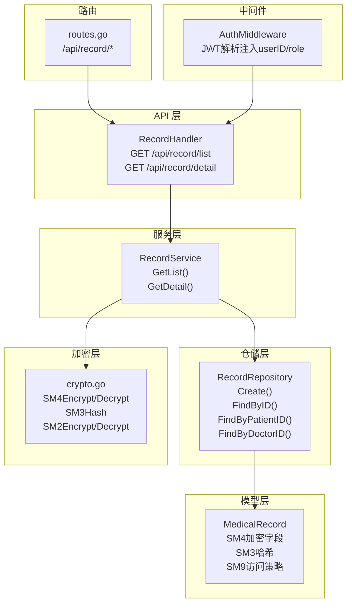
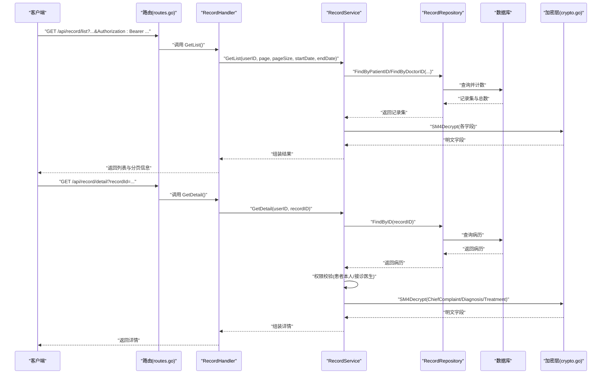
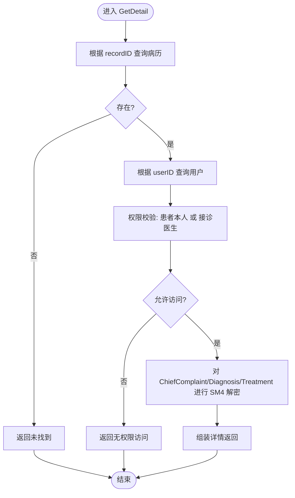
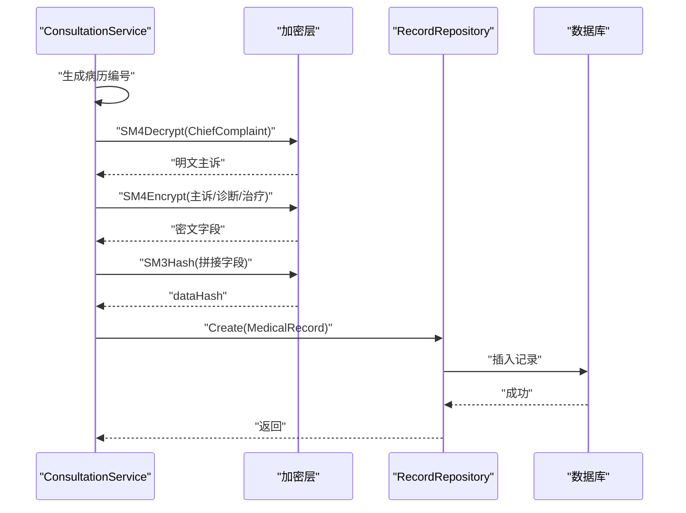
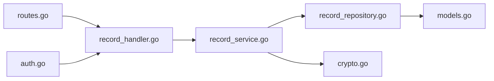

# 病历模块

<cite>
**本文引用的文件**
- [backed/internal/api/handler/record_handler.go](file://backed/internal/api/handler/record_handler.go)
- [backed/internal/service/record_service.go](file://backed/internal/service/record_service.go)
- [backed/internal/repository/record_repository.go](file://backed/internal/repository/record_repository.go)
- [backed/internal/model/models.go](file://backed/internal/model/models.go)
- [backed/internal/crypto/crypto.go](file://backed/internal/crypto/crypto.go)
- [backed/internal/middleware/auth.go](file://backed/internal/middleware/auth.go)
- [backed/internal/api/routes.go](file://backed/internal/api/routes.go)
- [backed/internal/service/consultation_service.go](file://backed/internal/service/consultation_service.go)
- [database/SM_user_module.sql](file://database/SM_user_module.sql)
- [开发文档.md](file://开发文档.md)
- [规划.md](file://规划.md)
</cite>

## 目录
1. [简介](#简介)
2. [项目结构](#项目结构)
3. [核心组件](#核心组件)
4. [架构总览](#架构总览)
5. [详细组件分析](#详细组件分析)
6. [依赖关系分析](#依赖关系分析)
7. [性能考量](#性能考量)
8. [故障排查指南](#故障排查指南)
9. [结论](#结论)
10. [附录](#附录)

## 简介
本文件围绕“病历模块”的电子病历创建、查看与管理能力展开，重点覆盖以下方面：
- record_handler.go 中的 API 实现：病历列表获取、病历详情获取
- record_service.go 的业务逻辑：权限校验、数据解密、角色差异化的返回字段
- record_repository.go 的数据持久化：按患者/医生维度查询、分页与日期筛选
- SM9 属性基加密在访问控制中的应用：基于医生属性（如科室、职称）进行细粒度授权
- 安全最佳实践：SM4 对称加密、SM3 哈希完整性校验、JWT 认证中间件、访问日志

## 项目结构
病历模块位于后端服务的三层结构中：
- API 层：路由注册与控制器（handler），负责接收请求、解析参数、返回响应
- 服务层：业务逻辑（service），负责权限校验、数据解密、聚合返回
- 仓储层：数据访问（repository），负责数据库查询与关联信息补全
- 模型层：数据结构定义（model），包含病历实体及字段注释
- 加密层：国密算法封装（crypto），提供 SM4/SM2/SM3/SM9 能力
- 中间件：认证中间件（auth），统一注入用户上下文

图表来源
- [backed/internal/api/handler/record_handler.go](file://backed/internal/api/handler/record_handler.go#L1-L61)
- [backed/internal/service/record_service.go](file://backed/internal/service/record_service.go#L1-L137)
- [backed/internal/repository/record_repository.go](file://backed/internal/repository/record_repository.go#L1-L97)
- [backed/internal/model/models.go](file://backed/internal/model/models.go#L99-L123)
- [backed/internal/crypto/crypto.go](file://backed/internal/crypto/crypto.go#L1-L121)
- [backed/internal/middleware/auth.go](file://backed/internal/middleware/auth.go#L1-L61)
- [backed/internal/api/routes.go](file://backed/internal/api/routes.go#L49-L56)

章节来源
- [backed/internal/api/routes.go](file://backed/internal/api/routes.go#L49-L56)
- [backed/internal/middleware/auth.go](file://backed/internal/middleware/auth.go#L1-L61)

## 核心组件
- 控制器（Handler）
  - 提供病历列表与详情两个接口，从上下文中读取 userID，并调用服务层执行业务逻辑
- 服务（Service）
  - 根据用户角色（医生/患者）分别查询对应病历
  - 在返回前对 SM4 加密字段进行解密
  - 详情接口进行权限校验（仅本人或接诊医生可见）
- 仓储（Repository）
  - 提供按患者/医生维度的分页查询、日期范围过滤、总数统计
  - 关联查询医生/患者信息，填充展示字段
- 模型（Model）
  - 病历实体包含 SM4 加密字段、SM3 哈希、SM9 访问策略等字段
- 加密（Crypto）
  - 提供 SM4/SM2/SM3 的加解密与摘要能力；SM9 作为访问控制机制在服务层与仓储层之间协作

章节来源
- [backed/internal/api/handler/record_handler.go](file://backed/internal/api/handler/record_handler.go#L20-L61)
- [backed/internal/service/record_service.go](file://backed/internal/service/record_service.go#L23-L137)
- [backed/internal/repository/record_repository.go](file://backed/internal/repository/record_repository.go#L14-L97)
- [backed/internal/model/models.go](file://backed/internal/model/models.go#L99-L123)
- [backed/internal/crypto/crypto.go](file://backed/internal/crypto/crypto.go#L36-L121)

## 架构总览
下图展示了从客户端到数据库的端到端流程，以及加密与访问控制的关键节点。

图表来源
- [backed/internal/api/routes.go](file://backed/internal/api/routes.go#L49-L56)
- [backed/internal/api/handler/record_handler.go](file://backed/internal/api/handler/record_handler.go#L20-L61)
- [backed/internal/service/record_service.go](file://backed/internal/service/record_service.go#L23-L137)
- [backed/internal/repository/record_repository.go](file://backed/internal/repository/record_repository.go#L14-L97)
- [backed/internal/crypto/crypto.go](file://backed/internal/crypto/crypto.go#L36-L121)

## 详细组件分析

### 控制器：RecordHandler
- GetList
  - 从上下文读取 userID，解析分页参数与日期范围
  - 调用服务层获取列表与总数，封装分页信息返回
- GetDetail
  - 解析 recordId 参数并校验格式
  - 调用服务层获取详情，若不存在则返回未找到

章节来源
- [backed/internal/api/handler/record_handler.go](file://backed/internal/api/handler/record_handler.go#L20-L61)

### 服务：RecordService
- GetList
  - 依据用户角色选择查询路径：医生按 doctor_id 查询，患者按 patient_id 查询
  - 对查询到的记录逐条解密 SM4 字段（主诉、诊断等）
  - 根据角色返回差异化字段：医生视角显示患者名，患者视角显示医生名与科室
- GetDetail
  - 先根据 recordID 查询病历是否存在
  - 再根据 userID 查询用户角色，进行权限校验（仅本人或接诊医生可查看）
  - 对关键字段进行 SM4 解密，组装返回详情

图表来源
- [backed/internal/service/record_service.go](file://backed/internal/service/record_service.go#L89-L137)

章节来源
- [backed/internal/service/record_service.go](file://backed/internal/service/record_service.go#L23-L137)

### 仓储：RecordRepository
- Create
  - 直接持久化病历实体
- FindByID
  - 查询单条病历并关联补全医生信息（姓名、科室）
- FindByPatientID
  - 按患者 ID 查询，支持日期范围过滤、分页与总数统计
  - 关联补全医生信息
- FindByDoctorID
  - 按医生 ID 查询，支持日期范围过滤、分页与总数统计
  - 关联补全患者信息（复用 DoctorName 字段存储患者名）

章节来源
- [backed/internal/repository/record_repository.go](file://backed/internal/repository/record_repository.go#L14-L97)

### 模型：MedicalRecord
- 字段要点
  - 主诉、现病史、既往史、诊断、治疗方案等均为 SM4 加密存储
  - 数据完整性使用 SM3 哈希
  - 访问策略字段预留 SM9 属性基加密
  - 关联字段 doctorName/doctorDept 用于前端展示

章节来源
- [backed/internal/model/models.go](file://backed/internal/model/models.go#L99-L123)
- [database/SM_user_module.sql](file://database/SM_user_module.sql#L133-L156)

### 加密与完整性
- SM4 对称加密
  - 用于病历敏感字段的存储与解密
- SM3 哈希
  - 用于数据完整性校验（服务层在创建病历时生成哈希）
- SM2 非对称加密
  - 用于通信场景（如密钥交换），在加密层提供相应函数
- SM9 属性基加密
  - 用于访问控制：基于医生属性（如科室、职称）进行细粒度授权
  - 该机制在服务层与仓储层之间协作，确保只有属性匹配的医生可解密病历

章节来源
- [backed/internal/crypto/crypto.go](file://backed/internal/crypto/crypto.go#L36-L121)
- [开发文档.md](file://开发文档.md#L1586-L1646)
- [规划.md](file://规划.md#L307-L367)

### 病历创建流程（与问诊联动）
- 问诊完成后，服务层创建病历：
  - 生成病历编号
  - 解密主诉
  - 对主诉、诊断、治疗方案进行 SM4 加密
  - 生成 SM3 哈希
  - 保存至数据库

图表来源
- [backed/internal/service/consultation_service.go](file://backed/internal/service/consultation_service.go#L239-L275)
- [backed/internal/crypto/crypto.go](file://backed/internal/crypto/crypto.go#L36-L121)
- [backed/internal/repository/record_repository.go](file://backed/internal/repository/record_repository.go#L14-L17)

章节来源
- [backed/internal/service/consultation_service.go](file://backed/internal/service/consultation_service.go#L239-L275)

### 访问控制：SM9 属性基加密
- 访问策略
  - 基于医生属性（如科室、职称）设定访问策略
  - 仅属性匹配的医生可获得解密密钥，从而解密病历
- 授权流程
  - 验证医生签名、访问令牌有效性
  - 检查医生属性是否满足策略
  - 返回授权结果与加密的病历存储密钥
- 解密与展示
  - 使用医生属性密钥解密存储密钥
  - 用解密出的存储密钥解密病历数据
  - 验证数据完整性（SM3 哈希）
  - 安全展示（防截屏等）

章节来源
- [规划.md](file://规划.md#L307-L367)
- [database/SM_user_module.sql](file://database/SM_user_module.sql#L133-L156)

## 依赖关系分析
- 控制器依赖服务层
- 服务层依赖仓储层与加密层
- 仓储层依赖模型与数据库
- 路由层统一挂载认证中间件，向控制器注入 userID/role

图表来源
- [backed/internal/api/routes.go](file://backed/internal/api/routes.go#L49-L56)
- [backed/internal/api/handler/record_handler.go](file://backed/internal/api/handler/record_handler.go#L1-L61)
- [backed/internal/service/record_service.go](file://backed/internal/service/record_service.go#L1-L137)
- [backed/internal/repository/record_repository.go](file://backed/internal/repository/record_repository.go#L1-L97)
- [backed/internal/model/models.go](file://backed/internal/model/models.go#L99-L123)
- [backed/internal/crypto/crypto.go](file://backed/internal/crypto/crypto.go#L1-L121)
- [backed/internal/middleware/auth.go](file://backed/internal/middleware/auth.go#L1-L61)

章节来源
- [backed/internal/api/routes.go](file://backed/internal/api/routes.go#L49-L56)
- [backed/internal/middleware/auth.go](file://backed/internal/middleware/auth.go#L1-L61)

## 性能考量
- 分页与排序
  - 仓储层使用 OFFSET/LIMIT 实现分页，配合 COUNT 统计总数
  - 列表查询默认按创建时间倒序，有利于热点数据快速检索
- 关联查询
  - 在列表查询中对每条记录进行关联查询补全医生/患者信息，注意在高并发场景下的 N+1 问题
- 加解密成本
  - SM4/SM3 在服务层进行，建议在批量解密时尽量减少重复解密与哈希计算
- 缓存策略
  - 对高频访问的病历详情可考虑缓存（需结合数据一致性与安全性）

[本节为通用性能建议，不直接分析具体文件]

## 故障排查指南
- 无权限访问
  - 现象：详情接口返回无权限
  - 排查：确认 recordID 是否存在、当前用户是否为患者本人或接诊医生
- 病历不存在
  - 现象：详情接口返回未找到
  - 排查：确认 recordId 参数是否正确、数据库中是否存在对应记录
- 参数格式错误
  - 现象：列表/详情接口返回参数错误
  - 排查：确认分页参数与日期格式、recordId 是否为合法整数
- 加密异常
  - 现象：解密失败或明文为空
  - 排查：确认 SM4 密钥初始化是否正确、字段是否为空或格式异常
- 认证失败
  - 现象：接口返回未授权
  - 排查：确认 Authorization 头格式、Token 是否有效

章节来源
- [backed/internal/api/handler/record_handler.go](file://backed/internal/api/handler/record_handler.go#L20-L61)
- [backed/internal/service/record_service.go](file://backed/internal/service/record_service.go#L89-L137)
- [backed/internal/middleware/auth.go](file://backed/internal/middleware/auth.go#L1-L61)

## 结论
- 病历模块通过清晰的三层架构实现了电子病历的创建、查看与管理
- 服务层承担了关键的权限校验与数据解密职责，确保敏感信息的安全与合规
- 仓储层提供了灵活的查询能力，支持按角色与时间范围进行分页检索
- SM9 属性基加密为访问控制提供了细粒度保障，结合 SM4/SM3 形成完整的数据安全体系
- 建议在后续迭代中进一步完善访问日志、审计与缓存策略，提升系统整体性能与可运维性

[本节为总结性内容，不直接分析具体文件]

## 附录
- API 路由
  - GET /api/record/list
  - GET /api/record/detail
- 认证中间件
  - 所有 /api/record 接口均受 JWT 认证中间件保护
- 数据模型要点
  - 病历实体包含 SM4 加密字段、SM3 哈希与 SM9 访问策略字段
- 安全最佳实践
  - 使用 SM4 对敏感字段进行存储加密
  - 使用 SM3 哈希进行完整性校验
  - 使用 SM9 属性基加密进行访问控制
  - 通过 JWT 中间件统一注入用户上下文，严格限制越权访问

章节来源
- [backed/internal/api/routes.go](file://backed/internal/api/routes.go#L49-L56)
- [backed/internal/middleware/auth.go](file://backed/internal/middleware/auth.go#L1-L61)
- [backed/internal/model/models.go](file://backed/internal/model/models.go#L99-L123)
- [规划.md](file://规划.md#L307-L367)