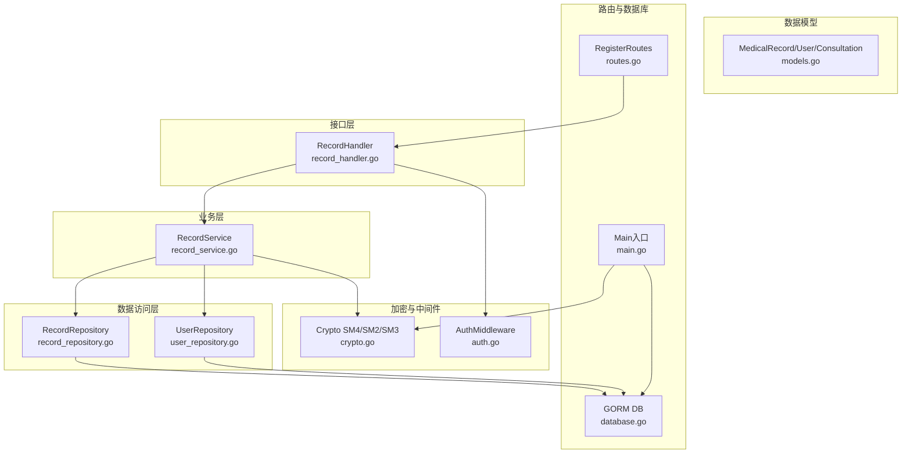
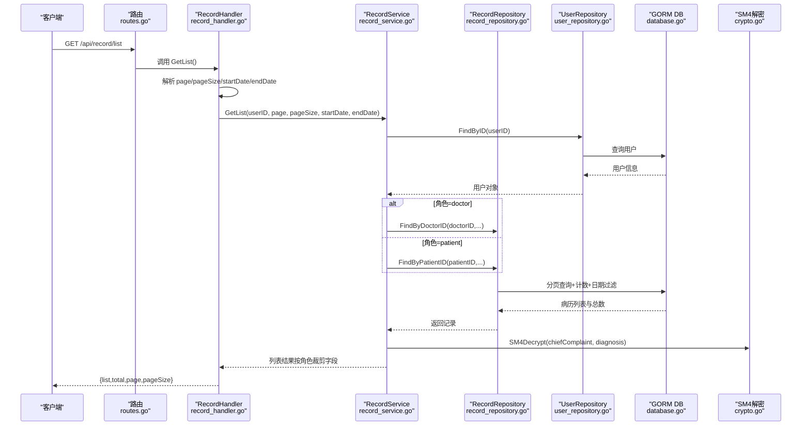
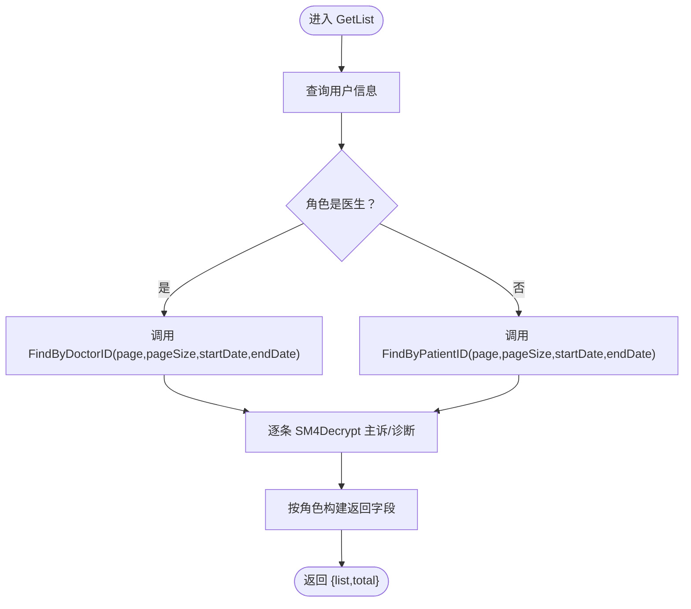
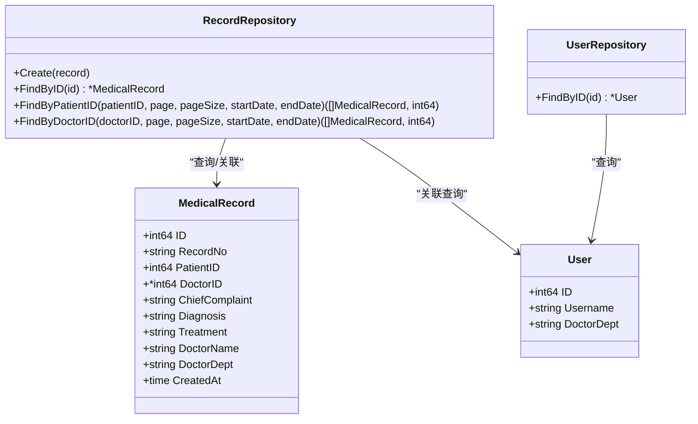
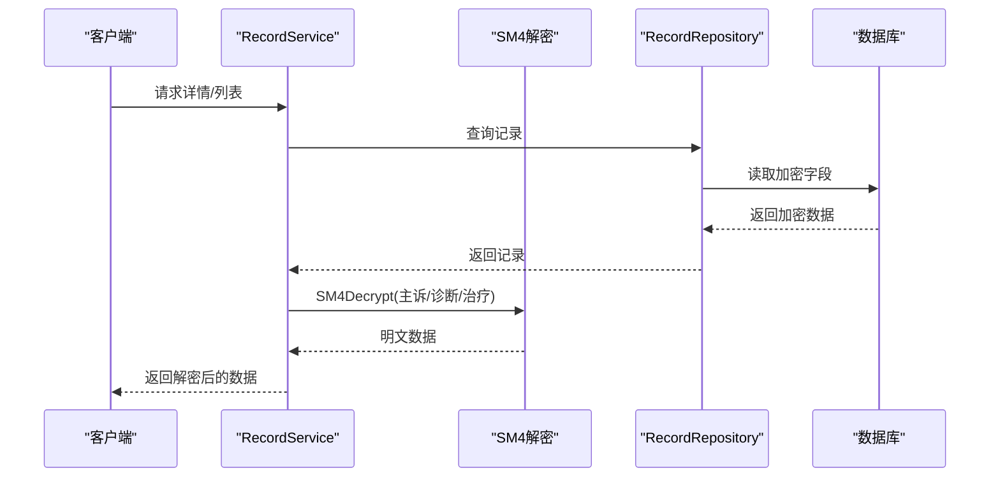
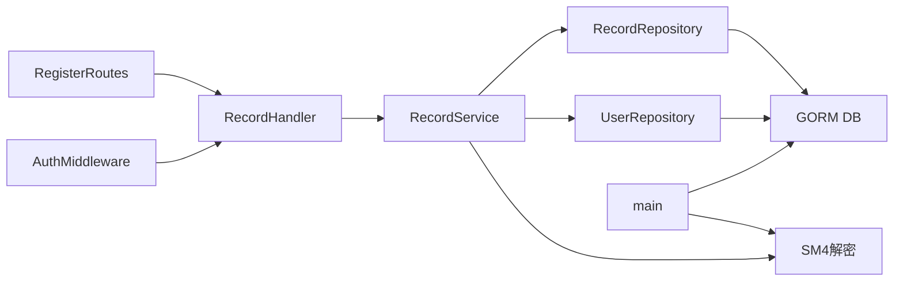

# 病历管理

<cite>
**本文引用的文件**
- [backed/internal/api/handler/record_handler.go](file://backed/internal/api/handler/record_handler.go)
- [backed/internal/service/record_service.go](file://backed/internal/service/record_service.go)
- [backed/internal/repository/record_repository.go](file://backed/internal/repository/record_repository.go)
- [backed/internal/repository/user_repository.go](file://backed/internal/repository/user_repository.go)
- [backed/internal/model/models.go](file://backed/internal/model/models.go)
- [backed/internal/crypto/crypto.go](file://backed/internal/crypto/crypto.go)
- [backed/internal/middleware/auth.go](file://backed/internal/middleware/auth.go)
- [backed/internal/api/routes.go](file://backed/internal/api/routes.go)
- [backed/pkg/database/database.go](file://backed/pkg/database/database.go)
- [backed/cmd/main.go](file://backed/cmd/main.go)
- [API接口总览.md](file://API接口总览.md)
- [规划.md](file://规划.md)
- [database/SM_user_module.sql](file://database/SM_user_module.sql)
</cite>

## 目录
1. [简介](#简介)
2. [项目结构](#项目结构)
3. [核心组件](#核心组件)
4. [架构总览](#架构总览)
5. [详细组件分析](#详细组件分析)
6. [依赖关系分析](#依赖关系分析)
7. [性能考虑](#性能考虑)
8. [故障排查指南](#故障排查指南)
9. [结论](#结论)
10. [附录](#附录)

## 简介
本文件聚焦“电子病历”的创建、查询与列表展示功能，围绕以下目标展开：
- 详细说明 record_handler.go 中 GetList 与 GetDetail 的实现，包括分页参数处理、日期范围过滤与用户身份验证。
- 阐述 record_service.go 中按用户角色（患者/医生）动态返回不同字段的业务逻辑，以及 SM4 解密敏感信息（主诉、诊断、治疗方案）的过程。
- 解释 record_repository.go 中基于 GORM 的数据库查询实现，涵盖 FindByID、FindByPatientID、FindByDoctorID 的数据关联查询机制。
- 提供病历数据加密存储与解密读取流程的实际代码示例路径，说明分页性能优化策略。

## 项目结构
后端采用分层架构：Handler（接口层）、Service（业务层）、Repository（数据访问层）、Model（数据模型）、Crypto（国密算法）、Middleware（中间件）、API Routes（路由注册）与数据库初始化。

图表来源
- [backed/internal/api/handler/record_handler.go](file://backed/internal/api/handler/record_handler.go#L1-L61)
- [backed/internal/service/record_service.go](file://backed/internal/service/record_service.go#L1-L137)
- [backed/internal/repository/record_repository.go](file://backed/internal/repository/record_repository.go#L1-L97)
- [backed/internal/repository/user_repository.go](file://backed/internal/repository/user_repository.go#L1-L121)
- [backed/internal/model/models.go](file://backed/internal/model/models.go#L1-L160)
- [backed/internal/crypto/crypto.go](file://backed/internal/crypto/crypto.go#L1-L121)
- [backed/internal/middleware/auth.go](file://backed/internal/middleware/auth.go#L1-L61)
- [backed/internal/api/routes.go](file://backed/internal/api/routes.go#L1-L95)
- [backed/pkg/database/database.go](file://backed/pkg/database/database.go#L1-L48)
- [backed/cmd/main.go](file://backed/cmd/main.go#L1-L64)

章节来源
- [backed/internal/api/routes.go](file://backed/internal/api/routes.go#L49-L56)
- [backed/internal/middleware/auth.go](file://backed/internal/middleware/auth.go#L9-L43)
- [backed/pkg/database/database.go](file://backed/pkg/database/database.go#L12-L48)
- [backed/cmd/main.go](file://backed/cmd/main.go#L15-L63)

## 核心组件
- Handler 层负责接收请求、解析参数、调用 Service 并返回响应。
- Service 层负责业务规则：角色判定、权限校验、分页与日期过滤、SM4 解密、字段裁剪。
- Repository 层负责与数据库交互：分页查询、计数、关联查询医生/患者信息。
- Model 层定义电子病历、用户、问诊等实体及字段。
- Crypto 层提供 SM4 加解密能力。
- Middleware 层提供 JWT 认证与跨域支持。
- 路由层统一注册 /api/record 的 GET /list 与 GET /detail。

章节来源
- [backed/internal/api/handler/record_handler.go](file://backed/internal/api/handler/record_handler.go#L20-L61)
- [backed/internal/service/record_service.go](file://backed/internal/service/record_service.go#L23-L137)
- [backed/internal/repository/record_repository.go](file://backed/internal/repository/record_repository.go#L14-L97)
- [backed/internal/model/models.go](file://backed/internal/model/models.go#L99-L119)
- [backed/internal/crypto/crypto.go](file://backed/internal/crypto/crypto.go#L48-L79)
- [backed/internal/middleware/auth.go](file://backed/internal/middleware/auth.go#L9-L43)
- [backed/internal/api/routes.go](file://backed/internal/api/routes.go#L49-L56)

## 架构总览
下面的序列图展示了“获取病历列表”从接口到数据库的完整调用链路，包含分页、日期过滤、角色判定与字段裁剪。

图表来源
- [backed/internal/api/routes.go](file://backed/internal/api/routes.go#L49-L56)
- [backed/internal/api/handler/record_handler.go](file://backed/internal/api/handler/record_handler.go#L20-L40)
- [backed/internal/service/record_service.go](file://backed/internal/service/record_service.go#L23-L87)
- [backed/internal/repository/record_repository.go](file://backed/internal/repository/record_repository.go#L35-L66)
- [backed/internal/repository/user_repository.go](file://backed/internal/repository/user_repository.go#L24-L29)
- [backed/internal/crypto/crypto.go](file://backed/internal/crypto/crypto.go#L62-L79)
- [backed/pkg/database/database.go](file://backed/pkg/database/database.go#L44-L48)

## 详细组件分析

### Handler：GetList 与 GetDetail
- GetList
  - 从上下文提取 userID，解析 page、pageSize 默认值，读取 startDate、endDate。
  - 调用 service.GetList，并将结果封装为 {list,total,page,pageSize} 返回。
- GetDetail
  - 从上下文提取 userID，解析 recordId 参数；若非法则返回错误。
  - 调用 service.GetDetail，返回病历详情。

章节来源
- [backed/internal/api/handler/record_handler.go](file://backed/internal/api/handler/record_handler.go#L20-L61)

### Service：角色判定、权限校验与字段裁剪
- GetList
  - 依据 userID 查询用户角色，分别调用 FindByDoctorID 或 FindByPatientID。
  - 对每条记录执行 SM4Decrypt 解密主诉与诊断。
  - 根据角色返回不同字段集：医生视角返回患者名字段，患者视角返回医生名与科室字段。
- GetDetail
  - 先 FindByID 获取病历，再 FindByID 获取当前用户。
  - 权限校验：仅当 record.PatientID == userID 或 record.DoctorID == userID 时才允许访问。
  - 对 chiefComplaint、diagnosis、treatment 执行 SM4Decrypt。
  - 返回统一字段集合。

图表来源
- [backed/internal/service/record_service.go](file://backed/internal/service/record_service.go#L23-L87)

章节来源
- [backed/internal/service/record_service.go](file://backed/internal/service/record_service.go#L23-L137)
- [backed/internal/crypto/crypto.go](file://backed/internal/crypto/crypto.go#L62-L79)

### Repository：GORM 查询与关联查询
- FindByID
  - 基础查询；若存在 DoctorID，则额外查询 User 表填充 DoctorName 与 DoctorDept。
- FindByPatientID
  - 按 patient_id 过滤；支持 startDate/endDate 日期范围；Count 计算总数；Offset/Limit 分页；DESC 排序。
  - 关联查询每个记录对应的医生信息，填充 DoctorName 与 DoctorDept。
- FindByDoctorID
  - 按 doctor_id 过滤；支持日期范围；Count 计算总数；Offset/Limit 分页；DESC 排序。
  - 关联查询每个记录对应的患者信息，填充 DoctorName（用于前端显示患者名）。

图表来源
- [backed/internal/repository/record_repository.go](file://backed/internal/repository/record_repository.go#L14-L97)
- [backed/internal/repository/user_repository.go](file://backed/internal/repository/user_repository.go#L24-L29)
- [backed/internal/model/models.go](file://backed/internal/model/models.go#L99-L119)

章节来源
- [backed/internal/repository/record_repository.go](file://backed/internal/repository/record_repository.go#L14-L97)
- [backed/internal/repository/user_repository.go](file://backed/internal/repository/user_repository.go#L24-L29)
- [backed/internal/model/models.go](file://backed/internal/model/models.go#L99-L119)

### 数据模型与加密字段
- MedicalRecord
  - 字段包含 record_no、patient_id、consultation_id、record_type、chief_complaint、present_illness、past_history、diagnosis、treatment_plan、doctor_id、ai_advice、data_hash、created_at、updated_at。
  - 主诉、诊断、治疗方案、现病史、既往史均为 SM4 加密存储。
- User
  - 字段包含 identify（角色）、doctor_dept、real_name、id_card、phone、email 等，其中部分字段为 SM4 加密存储。
- Consultation
  - 字段包含 chief_complaint、doctor_diagnosis、prescription 等，亦为 SM4 加密存储。

章节来源
- [backed/internal/model/models.go](file://backed/internal/model/models.go#L99-L119)
- [API接口总览.md](file://API接口总览.md#L31-L41)

### 加密与解密流程（SM4）
- 存储侧：后端在创建/更新病历前，应使用 SM4Encrypt 对敏感字段进行加密存储。
- 读取侧：在返回前对 chief_complaint、diagnosis、treatment 等字段执行 SM4Decrypt 解密，再返回给前端。

图表来源
- [backed/internal/service/record_service.go](file://backed/internal/service/record_service.go#L89-L137)
- [backed/internal/repository/record_repository.go](file://backed/internal/repository/record_repository.go#L19-L33)
- [backed/internal/crypto/crypto.go](file://backed/internal/crypto/crypto.go#L62-L79)

章节来源
- [backed/internal/crypto/crypto.go](file://backed/internal/crypto/crypto.go#L48-L79)
- [backed/internal/service/record_service.go](file://backed/internal/service/record_service.go#L89-L137)

### 分页参数处理与日期范围过滤
- 分页参数
  - page 默认 1，pageSize 默认 10；offset = (page - 1) * pageSize；Limit 指定每页大小；按 created_at DESC 排序。
- 日期范围过滤
  - 若 startDate 非空，则 added WHERE created_at >= startDate；
  - 若 endDate 非空，则 added WHERE created_at <= endDate。
- 计数
  - 使用 Count(&total) 获取满足条件的总记录数。

章节来源
- [backed/internal/api/handler/record_handler.go](file://backed/internal/api/handler/record_handler.go#L20-L40)
- [backed/internal/service/record_service.go](file://backed/internal/service/record_service.go#L23-L87)
- [backed/internal/repository/record_repository.go](file://backed/internal/repository/record_repository.go#L35-L66)

### 用户身份验证与权限校验
- 身份验证
  - 路由组 /api/record 使用 AuthMiddleware，要求 Authorization: Bearer <token>，解析后将 userID、username、role 写入上下文。
- 权限校验（GetDetail）
  - 仅当 record.PatientID == userID 或 record.DoctorID == userID 时才允许访问。

章节来源
- [backed/internal/api/routes.go](file://backed/internal/api/routes.go#L49-L56)
- [backed/internal/middleware/auth.go](file://backed/internal/middleware/auth.go#L9-L43)
- [backed/internal/service/record_service.go](file://backed/internal/service/record_service.go#L89-L115)

### 数据库索引与性能优化建议
- 索引
  - SM_medical_record 表包含 patient_id、consultation_id、record_no、created_at 等索引，有利于分页与过滤。
- 性能优化策略
  - 使用复合索引覆盖查询条件（如 patient_id+created_at DESC），减少回表次数。
  - 分页查询避免超大 offset，优先使用“基于游标/时间戳”的增量分页。
  - 对高频查询建立物化视图或缓存（如最近病历列表）。
  - 控制单次查询字段数量，仅返回必要字段。

章节来源
- [database/SM_user_module.sql](file://database/SM_user_module.sql#L133-L156)
- [backed/internal/repository/record_repository.go](file://backed/internal/repository/record_repository.go#L35-L66)

## 依赖关系分析
- Handler 依赖 Service；Service 依赖 Repository 与 Crypto；Repository 依赖 GORM DB；Service 依赖 UserRepository；路由依赖 Handler；中间件依赖 JWT 工具；Main 初始化 Crypto 与 DB。

图表来源
- [backed/internal/api/handler/record_handler.go](file://backed/internal/api/handler/record_handler.go#L1-L61)
- [backed/internal/service/record_service.go](file://backed/internal/service/record_service.go#L1-L137)
- [backed/internal/repository/record_repository.go](file://backed/internal/repository/record_repository.go#L1-L97)
- [backed/internal/repository/user_repository.go](file://backed/internal/repository/user_repository.go#L1-L121)
- [backed/internal/crypto/crypto.go](file://backed/internal/crypto/crypto.go#L1-L121)
- [backed/internal/middleware/auth.go](file://backed/internal/middleware/auth.go#L1-L61)
- [backed/internal/api/routes.go](file://backed/internal/api/routes.go#L1-L95)
- [backed/pkg/database/database.go](file://backed/pkg/database/database.go#L1-L48)
- [backed/cmd/main.go](file://backed/cmd/main.go#L1-L64)

章节来源
- [backed/internal/api/routes.go](file://backed/internal/api/routes.go#L49-L56)
- [backed/internal/middleware/auth.go](file://backed/internal/middleware/auth.go#L9-L43)
- [backed/pkg/database/database.go](file://backed/pkg/database/database.go#L12-L48)
- [backed/cmd/main.go](file://backed/cmd/main.go#L15-L63)

## 性能考虑
- 分页与排序
  - 使用 created_at DESC 排序，结合索引可显著降低排序成本。
- 计数与分页
  - 先 Count 再 Offset/Limit，适合中小规模数据；大规模场景建议使用基于时间戳的游标分页。
- 关联查询
  - FindByPatientID/FindByDoctorID 在循环中逐条关联查询医生/患者信息，可能产生 N+1 查询问题。建议改为批量预加载或一次性 JOIN 查询。
- 加解密开销
  - SM4 解密在 Service 层逐条执行，建议在 Repository 层返回明文字段或在上层批量处理以减少重复解密。

章节来源
- [backed/internal/repository/record_repository.go](file://backed/internal/repository/record_repository.go#L35-L66)
- [backed/internal/service/record_service.go](file://backed/internal/service/record_service.go#L55-L87)

## 故障排查指南
- 401 未授权
  - 检查 Authorization 头是否为 Bearer <token> 格式；确认 token 有效且未过期。
- 404 病历不存在
  - GetDetail 中若 FindByID 返回错误，将返回“病历不存在”。
- 403 无权限访问
  - GetDetail 中若非本人且非接诊医生，将返回“无权限访问”。
- 分页异常
  - 检查 page、pageSize 是否为正整数；startDate/endDate 格式是否正确；确认数据库索引是否覆盖查询条件。
- 解密失败
  - 确认 SM4Key 初始化正确；加密字段是否为空；前后端密钥一致。

章节来源
- [backed/internal/api/handler/record_handler.go](file://backed/internal/api/handler/record_handler.go#L20-L61)
- [backed/internal/service/record_service.go](file://backed/internal/service/record_service.go#L89-L137)
- [backed/internal/middleware/auth.go](file://backed/internal/middleware/auth.go#L9-L43)
- [backed/internal/crypto/crypto.go](file://backed/internal/crypto/crypto.go#L17-L34)

## 结论
本功能通过 Handler、Service、Repository 三层清晰分工，实现了基于角色的病历列表与详情查询，结合 SM4 解密与 JWT 权限校验，保证了数据安全与访问控制。建议后续优化关联查询与分页策略，提升大规模数据下的性能表现。

## 附录
- 数据库表结构参考：SM_medical_record 的字段与索引设计，支持高效分页与过滤。
- 病历访问控制规划：涉及 SM9 属性基加密与访问日志，详见规划文档。

章节来源
- [database/SM_user_module.sql](file://database/SM_user_module.sql#L133-L156)
- [规划.md](file://规划.md#L339-L367)