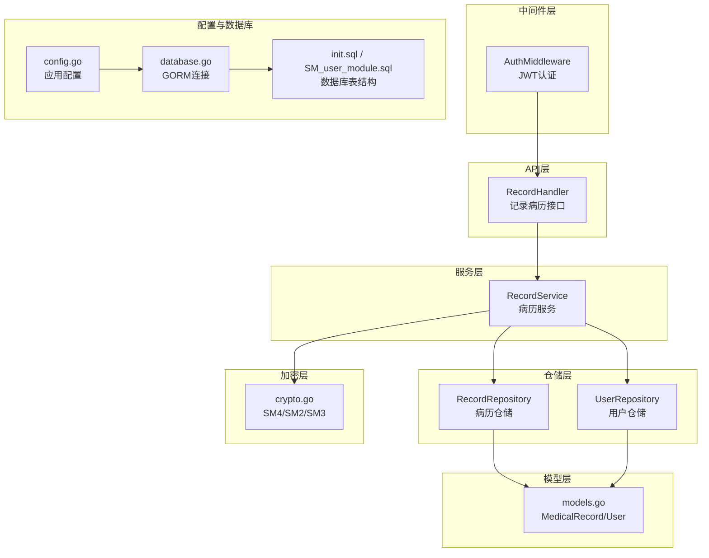
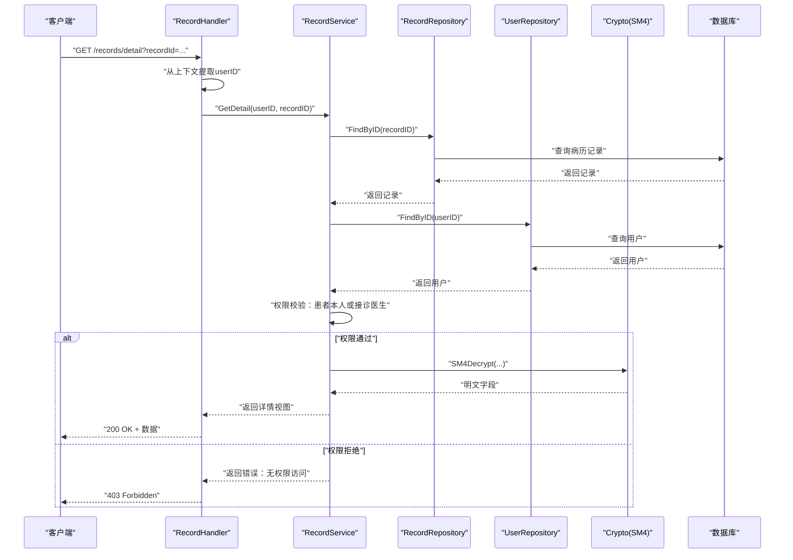
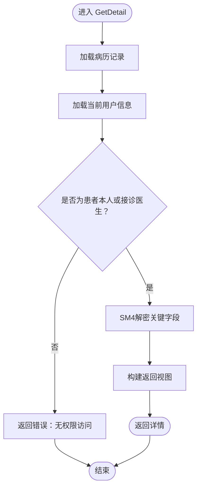
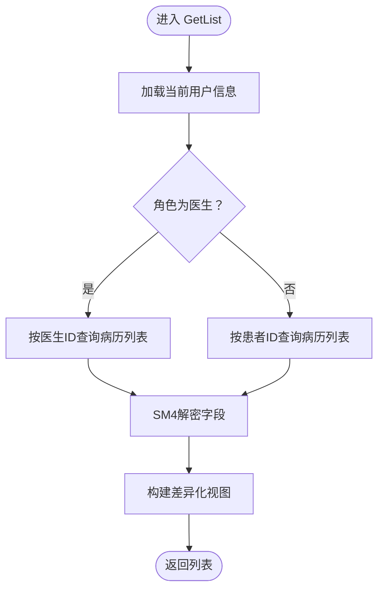
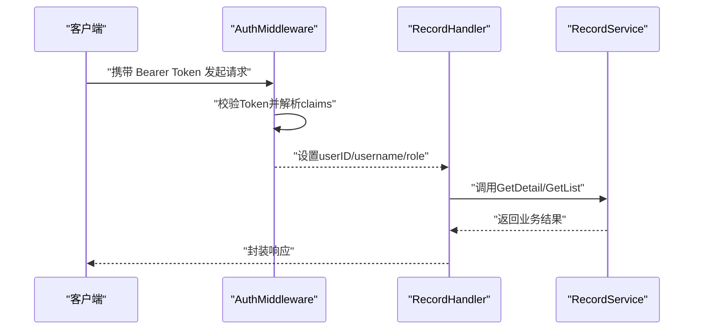
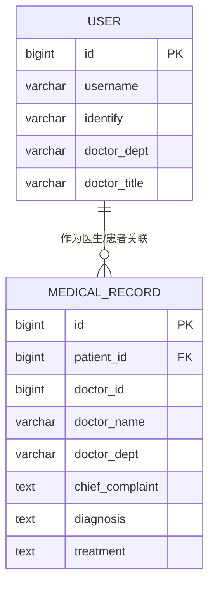
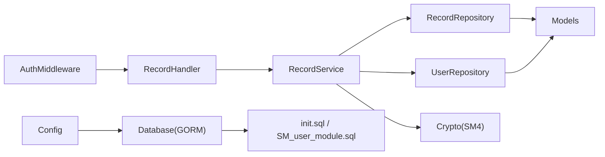
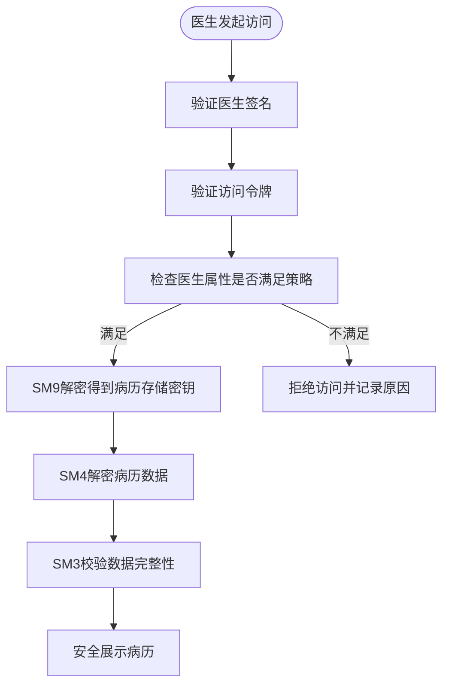

# 访问控制

<cite>
**本文引用的文件**
- [record_service.go](file://backed/internal/service/record_service.go)
- [record_repository.go](file://backed/internal/repository/record_repository.go)
- [user_repository.go](file://backed/internal/repository/user_repository.go)
- [models.go](file://backed/internal/model/models.go)
- [record_handler.go](file://backed/internal/api/handler/record_handler.go)
- [auth.go](file://backed/internal/middleware/auth.go)
- [jwt.go](file://backed/pkg/utils/jwt.go)
- [crypto.go](file://backed/internal/crypto/crypto.go)
- [config.go](file://backed/pkg/config/config.go)
- [database.go](file://backed/pkg/database/database.go)
- [init.sql](file://backed/init.sql)
- [SM_user_module.sql](file://database/SM_user_module.sql)
- [规划.md](file://规划.md)
</cite>

## 目录
1. [引言](#引言)
2. [项目结构](#项目结构)
3. [核心组件](#核心组件)
4. [架构总览](#架构总览)
5. [详细组件分析](#详细组件分析)
6. [依赖关系分析](#依赖关系分析)
7. [性能考量](#性能考量)
8. [故障排查指南](#故障排查指南)
9. [结论](#结论)
10. [附录](#附录)

## 引言
本文件聚焦“病历模块访问控制”的设计与实现，围绕“基于用户角色与资源所有权”的权限验证机制展开，重点解析 record_service.go 中 GetDetail 方法的权限检查逻辑，涵盖以下要点：
- 患者本人与接诊医生的双重验证条件
- 通过 userRepo.FindByID 获取用户角色信息，并据此返回差异化数据视图
- 权限拒绝场景的处理流程（返回“无权限访问”错误）
- 当前实现的安全边界与潜在风险（如水平权限提升）
- 基于国密 SM9 属性基加密的扩展方案，以实现更细粒度的访问控制

## 项目结构
本项目采用分层架构：API 层负责路由与响应封装；服务层承载业务逻辑；仓储层负责数据访问；模型层定义数据结构；中间件层提供认证与跨域；加密层提供国密算法能力；配置与数据库层提供运行时参数与连接。

图表来源
- [record_handler.go](file://backed/internal/api/handler/record_handler.go#L1-L61)
- [record_service.go](file://backed/internal/service/record_service.go#L1-L137)
- [record_repository.go](file://backed/internal/repository/record_repository.go#L1-L97)
- [user_repository.go](file://backed/internal/repository/user_repository.go#L1-L121)
- [models.go](file://backed/internal/model/models.go#L1-L160)
- [auth.go](file://backed/internal/middleware/auth.go#L1-L61)
- [jwt.go](file://backed/pkg/utils/jwt.go#L1-L53)
- [crypto.go](file://backed/internal/crypto/crypto.go#L1-L121)
- [config.go](file://backed/pkg/config/config.go#L1-L78)
- [database.go](file://backed/pkg/database/database.go#L1-L48)
- [init.sql](file://backed/init.sql#L1-L478)
- [SM_user_module.sql](file://database/SM_user_module.sql#L196-L324)

章节来源
- [record_handler.go](file://backed/internal/api/handler/record_handler.go#L1-L61)
- [record_service.go](file://backed/internal/service/record_service.go#L1-L137)
- [record_repository.go](file://backed/internal/repository/record_repository.go#L1-L97)
- [user_repository.go](file://backed/internal/repository/user_repository.go#L1-L121)
- [models.go](file://backed/internal/model/models.go#L1-L160)
- [auth.go](file://backed/internal/middleware/auth.go#L1-L61)
- [jwt.go](file://backed/pkg/utils/jwt.go#L1-L53)
- [crypto.go](file://backed/internal/crypto/crypto.go#L1-L121)
- [config.go](file://backed/pkg/config/config.go#L1-L78)
- [database.go](file://backed/pkg/database/database.go#L1-L48)
- [init.sql](file://backed/init.sql#L1-L478)
- [SM_user_module.sql](file://database/SM_user_module.sql#L196-L324)

## 核心组件
- 病历服务（RecordService）：封装病历列表与详情的业务逻辑，包含权限校验与数据视图差异化输出。
- 病历仓储（RecordRepository）：提供按患者/医生维度查询、按ID查询及关联医生/患者信息的能力。
- 用户仓储（UserRepository）：提供按ID查询用户信息的能力，用于判定角色。
- 模型（models.go）：定义 MedicalRecord 与 User 的字段，包括病历与用户的关键字段。
- 认证中间件（AuthMiddleware）：从请求头解析 JWT，注入 userID、username、role 到上下文。
- 加密工具（crypto.go）：提供 SM4 解密能力，用于解密病历字段。
- 配置与数据库（config.go、database.go、init.sql、SM_user_module.sql）：提供运行时配置、数据库连接与表结构。

章节来源
- [record_service.go](file://backed/internal/service/record_service.go#L1-L137)
- [record_repository.go](file://backed/internal/repository/record_repository.go#L1-L97)
- [user_repository.go](file://backed/internal/repository/user_repository.go#L1-L121)
- [models.go](file://backed/internal/model/models.go#L1-L160)
- [auth.go](file://backed/internal/middleware/auth.go#L1-L61)
- [crypto.go](file://backed/internal/crypto/crypto.go#L1-L121)
- [config.go](file://backed/pkg/config/config.go#L1-L78)
- [database.go](file://backed/pkg/database/database.go#L1-L48)
- [init.sql](file://backed/init.sql#L1-L478)
- [SM_user_module.sql](file://database/SM_user_module.sql#L196-L324)

## 架构总览
下图展示了从 API 请求到服务层权限校验与数据返回的整体流程，以及与认证中间件、仓储层、加密层的关系。

图表来源
- [record_handler.go](file://backed/internal/api/handler/record_handler.go#L1-L61)
- [record_service.go](file://backed/internal/service/record_service.go#L89-L137)
- [record_repository.go](file://backed/internal/repository/record_repository.go#L19-L33)
- [user_repository.go](file://backed/internal/repository/user_repository.go#L24-L29)
- [crypto.go](file://backed/internal/crypto/crypto.go#L62-L79)
- [auth.go](file://backed/internal/middleware/auth.go#L1-L61)

## 详细组件分析

### 组件A：RecordService.GetDetail 权限校验逻辑
- 输入：userID、recordID
- 步骤：
  1) 通过 RecordRepository.FindByID(recordID) 获取病历记录。
  2) 通过 UserRepository.FindByID(userID) 获取当前用户信息（含角色）。
  3) 权限检查：
     - 患者本人：record.PatientID == userID
     - 接诊医生：record.DoctorID != nil 且 *record.DoctorID == userID
  4) 若两者均不满足，则返回“无权限访问”错误。
  5) 若通过，使用 SM4 对 chiefComplaint、diagnosis、treatment 进行解密，组装返回视图。

图表来源
- [record_service.go](file://backed/internal/service/record_service.go#L89-L137)
- [record_repository.go](file://backed/internal/repository/record_repository.go#L19-L33)
- [user_repository.go](file://backed/internal/repository/user_repository.go#L24-L29)
- [crypto.go](file://backed/internal/crypto/crypto.go#L62-L79)

章节来源
- [record_service.go](file://backed/internal/service/record_service.go#L89-L137)

### 组件B：RecordService.GetList 角色驱动的数据视图
- 输入：userID、分页参数、时间范围
- 步骤：
  1) 通过 UserRepository.FindByID(userID) 获取用户角色。
  2) 若角色为 doctor：调用 RecordRepository.FindByDoctorID(userID, ...)，返回“患者名”视图（注意：此处使用 DoctorName 字段存储患者名）。
  3) 否则：调用 RecordRepository.FindByPatientID(userID, ...)，返回“医生名/科室”视图。
  4) 对关键字段进行 SM4 解密，组装返回列表。

图表来源
- [record_service.go](file://backed/internal/service/record_service.go#L23-L87)
- [record_repository.go](file://backed/internal/repository/record_repository.go#L35-L66)
- [record_repository.go](file://backed/internal/repository/record_repository.go#L68-L96)
- [user_repository.go](file://backed/internal/repository/user_repository.go#L24-L29)
- [crypto.go](file://backed/internal/crypto/crypto.go#L62-L79)

章节来源
- [record_service.go](file://backed/internal/service/record_service.go#L23-L87)

### 组件C：Handler 层与中间件集成
- Handler 从上下文中读取 userID，并调用服务层方法。
- AuthMiddleware 从 Authorization 头解析 JWT，将 userID、username、role 注入上下文，供 Handler 使用。
- 若缺少 Authorization 或 Token 无效，直接返回 401。

图表来源
- [record_handler.go](file://backed/internal/api/handler/record_handler.go#L1-L61)
- [auth.go](file://backed/internal/middleware/auth.go#L1-L61)
- [jwt.go](file://backed/pkg/utils/jwt.go#L1-L53)

章节来源
- [record_handler.go](file://backed/internal/api/handler/record_handler.go#L1-L61)
- [auth.go](file://backed/internal/middleware/auth.go#L1-L61)
- [jwt.go](file://backed/pkg/utils/jwt.go#L1-L53)

### 组件D：数据模型与字段映射
- MedicalRecord 关键字段：PatientID、DoctorID、DoctorName、DoctorDept、各加密字段（chiefComplaint、diagnosis、treatment 等）。
- User 关键字段：identify（即 Role）、doctor_dept、doctor_title 等。
- 仓储层在查询时会补充 DoctorName/DoctorDept 或患者名（通过 DoctorName 字段复用），用于视图构建。

图表来源
- [models.go](file://backed/internal/model/models.go#L1-L160)
- [record_repository.go](file://backed/internal/repository/record_repository.go#L19-L33)
- [record_repository.go](file://backed/internal/repository/record_repository.go#L35-L66)
- [record_repository.go](file://backed/internal/repository/record_repository.go#L68-L96)

章节来源
- [models.go](file://backed/internal/model/models.go#L1-L160)
- [record_repository.go](file://backed/internal/repository/record_repository.go#L19-L33)
- [record_repository.go](file://backed/internal/repository/record_repository.go#L35-L66)
- [record_repository.go](file://backed/internal/repository/record_repository.go#L68-L96)

## 依赖关系分析
- 服务层依赖仓储层与加密层；仓储层依赖数据库层；Handler 依赖服务层；认证中间件贯穿 API 层。
- 权限校验依赖用户角色（identify/Role），并通过 record.PatientID 与 record.DoctorID 进行资源所有权比对。
- 数据视图差异由角色决定，且涉及字段复用（DoctorName 用于存储患者名）。

图表来源
- [record_handler.go](file://backed/internal/api/handler/record_handler.go#L1-L61)
- [record_service.go](file://backed/internal/service/record_service.go#L1-L137)
- [record_repository.go](file://backed/internal/repository/record_repository.go#L1-L97)
- [user_repository.go](file://backed/internal/repository/user_repository.go#L1-L121)
- [models.go](file://backed/internal/model/models.go#L1-L160)
- [auth.go](file://backed/internal/middleware/auth.go#L1-L61)
- [config.go](file://backed/pkg/config/config.go#L1-L78)
- [database.go](file://backed/pkg/database/database.go#L1-L48)
- [init.sql](file://backed/init.sql#L1-L478)
- [SM_user_module.sql](file://database/SM_user_module.sql#L196-L324)

章节来源
- [record_service.go](file://backed/internal/service/record_service.go#L1-L137)
- [record_repository.go](file://backed/internal/repository/record_repository.go#L1-L97)
- [user_repository.go](file://backed/internal/repository/user_repository.go#L1-L121)
- [models.go](file://backed/internal/model/models.go#L1-L160)
- [auth.go](file://backed/internal/middleware/auth.go#L1-L61)
- [config.go](file://backed/pkg/config/config.go#L1-L78)
- [database.go](file://backed/pkg/database/database.go#L1-L48)
- [init.sql](file://backed/init.sql#L1-L478)
- [SM_user_module.sql](file://database/SM_user_module.sql#L196-L324)

## 性能考量
- 查询路径：
  - GetDetail：一次病历查询 + 一次用户查询 + 一次 SM4 解密。
  - GetList：根据角色选择按 PatientID 或 DoctorID 查询，分页与计数。
- 关联查询：
  - 仓储层在 FindByID/列表查询中会额外查询医生或患者信息，可能带来 N+1 查询开销。
- 建议：
  - 在高频查询场景下，考虑预加载关联信息或缓存常用用户信息。
  - 对 DoctorName/DoctorDept 的复用字段在视图层处理，避免重复查询。

[本节为通用性能讨论，无需列出具体文件来源]

## 故障排查指南
- 权限拒绝（403）：
  - 确认请求头 Authorization 是否正确（Bearer Token）。
  - 确认 Token 未过期且签发方一致。
  - 确认 record.PatientID 与 record.DoctorID 与 userID 的对应关系。
  - 检查服务日志中“无权限访问”的记录，定位 userID 与 recordID。
- 病历不存在（404）：
  - 确认 recordID 是否有效。
  - 检查数据库中是否存在该记录。
- 解密失败：
  - 确认 SM4Key 配置正确且与存储侧一致。
  - 检查字段是否为空或格式异常。
- 视图字段异常：
  - 确认角色为 doctor 时 DoctorName 用于显示患者名，为 patient 时 DoctorName 用于显示医生名。
  - 检查 DoctorName/DoctorDept 的赋值逻辑。

章节来源
- [record_service.go](file://backed/internal/service/record_service.go#L89-L137)
- [record_handler.go](file://backed/internal/api/handler/record_handler.go#L1-L61)
- [auth.go](file://backed/internal/middleware/auth.go#L1-L61)
- [jwt.go](file://backed/pkg/utils/jwt.go#L1-L53)
- [crypto.go](file://backed/internal/crypto/crypto.go#L1-L121)

## 结论
- 当前实现通过“角色 + 资源所有权”实现了基本的访问控制：患者仅能查看自己的病历，医生仅能查看自己接诊的病历。
- Handler 与中间件配合，确保请求上下文包含 userID、username、role，服务层据此进行权限校验。
- 数据视图差异化通过角色判断与字段复用实现，兼顾了隐私与可用性。
- 安全边界方面，当前实现依赖 JWT 与角色校验，未引入属性基访问控制（ABAC）。若需进一步细化访问控制（如按科室、职称等属性），可参考规划文档中的 SM9 属性基加密方案进行扩展。

[本节为总结性内容，无需列出具体文件来源]

## 附录

### A. 权限拒绝场景的处理流程（代码路径）
- Handler 层：当服务层返回错误时，统一通过工具函数返回 403/404。
- 服务层：GetDetail 中若 userID 既不等于 record.PatientID，也不等于 record.DoctorID，则返回“无权限访问”。

章节来源
- [record_handler.go](file://backed/internal/api/handler/record_handler.go#L42-L61)
- [record_service.go](file://backed/internal/service/record_service.go#L106-L114)

### B. 基于国密 SM9 的属性基访问控制扩展方案
- 方案概述：
  - 在现有 JWT 认证基础上，增加“医生属性（科室、职称）”与“病历访问策略（策略表达式）”的匹配。
  - 使用 SM9 属性基加密：只有属性满足策略的医生才能解密病历存储密钥，进而解密病历数据。
- 关键步骤（来自规划文档）：
  - 医生签名验证与访问令牌有效性校验。
  - 检查医生属性是否满足访问策略（例如“科室=心内科 且 职位≥住院医师”）。
  - 使用 SM9 属性基加密验证，生成访问记录并返回加密的病历存储密钥。
  - 医生工作站使用自身属性密钥解密存储密钥，再用 SM4 解密病历数据，并验证数据完整性（SM3 哈希）。

图表来源
- [规划.md](file://规划.md#L307-L366)

章节来源
- [规划.md](file://规划.md#L307-L366)
- [SM_user_module.sql](file://database/SM_user_module.sql#L306-L310)

### C. 数据库与配置要点
- 数据库表结构：
  - SM_medical_record：存储病历字段与 doctor_id、data_hash 等。
  - SM_user：存储 identify（角色）、doctor_dept、doctor_title 等。
- 配置项：
  - JWT Secret、ExpiresIn：用于签发与解析 Token。
  - Crypto SM4Key/SM2 公私钥：用于加密与解密。
  - Database 连接参数：主机、端口、用户名、密码、字符集、连接池参数。

章节来源
- [init.sql](file://backed/init.sql#L190-L225)
- [SM_user_module.sql](file://database/SM_user_module.sql#L196-L324)
- [config.go](file://backed/pkg/config/config.go#L1-L78)
- [database.go](file://backed/pkg/database/database.go#L1-L48)