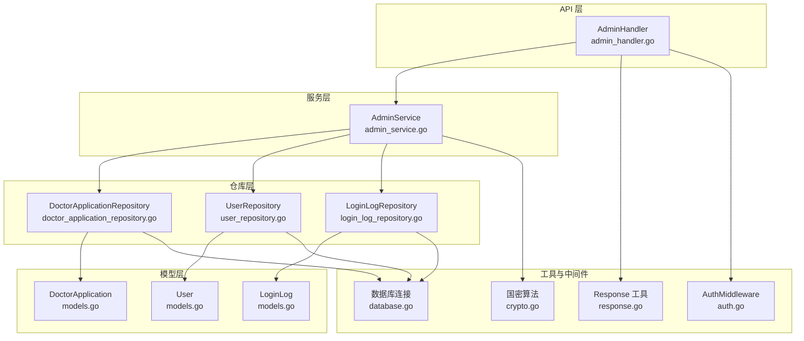
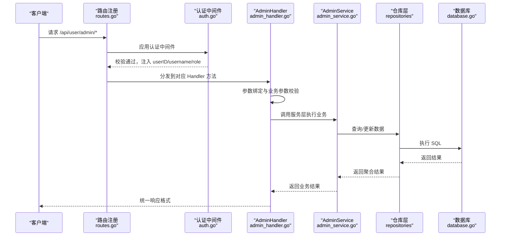
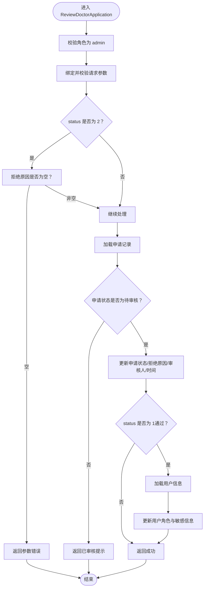
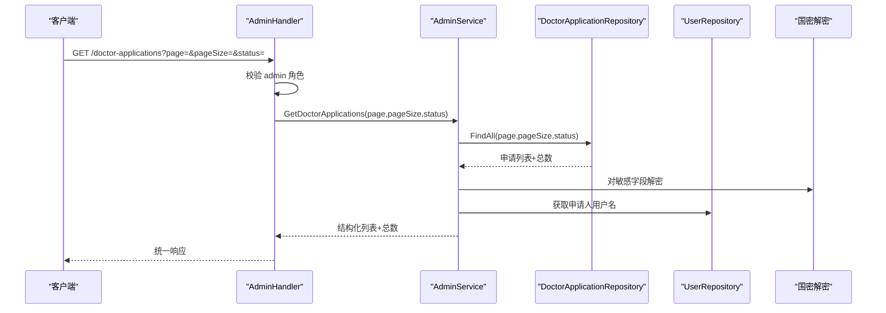
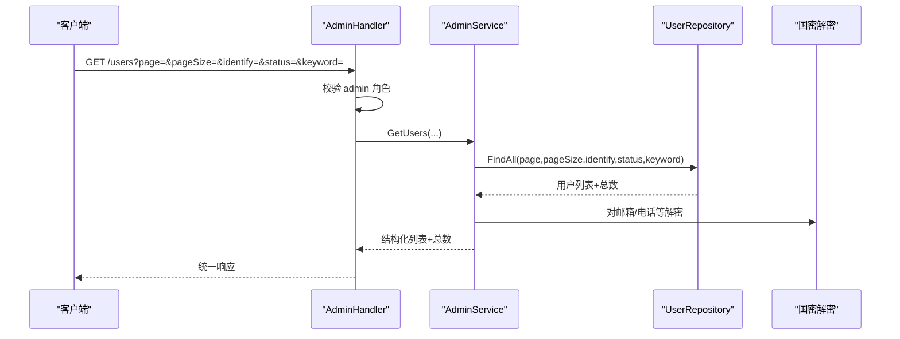
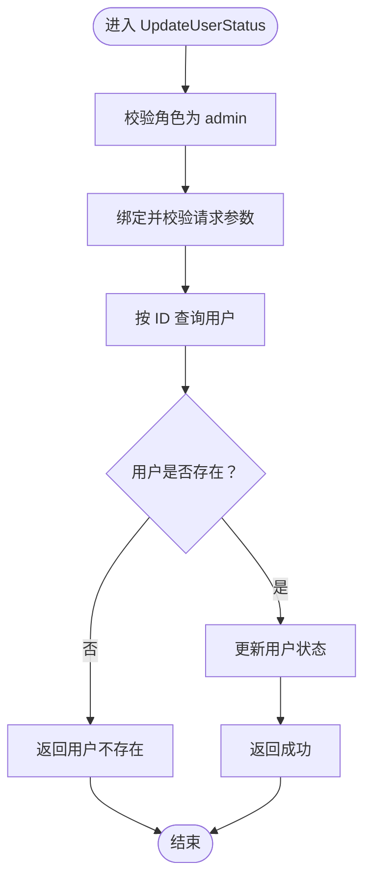
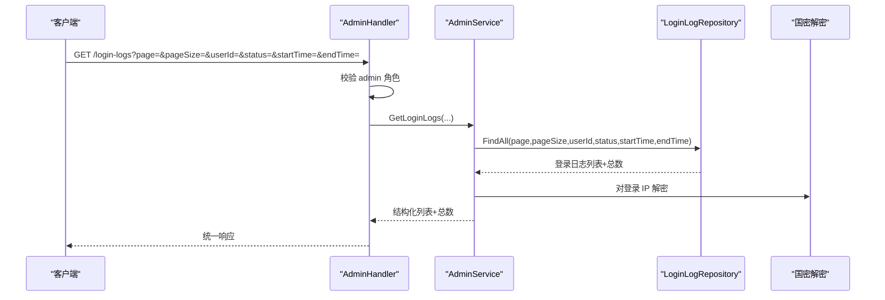
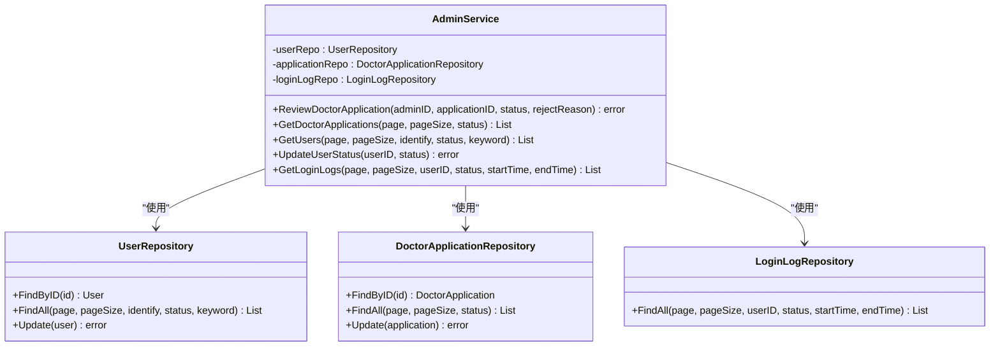
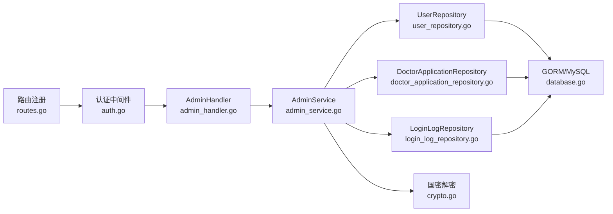

# 管理员模块

<cite>
**本文引用的文件**
- [admin_handler.go](file://backed/internal/api/handler/admin_handler.go)
- [admin_service.go](file://backed/internal/service/admin_service.go)
- [routes.go](file://backed/internal/api/routes.go)
- [auth.go](file://backed/internal/middleware/auth.go)
- [response.go](file://backed/pkg/utils/response.go)
- [models.go](file://backed/internal/model/models.go)
- [doctor_application_repository.go](file://backed/internal/repository/doctor_application_repository.go)
- [user_repository.go](file://backed/internal/repository/user_repository.go)
- [login_log_repository.go](file://backed/internal/repository/login_log_repository.go)
- [crypto.go](file://backed/internal/crypto/crypto.go)
- [database.go](file://backed/pkg/database/database.go)
</cite>

## 目录
1. [简介](#简介)
2. [项目结构](#项目结构)
3. [核心组件](#核心组件)
4. [架构总览](#架构总览)
5. [详细组件分析](#详细组件分析)
6. [依赖关系分析](#依赖关系分析)
7. [性能与安全考量](#性能与安全考量)
8. [故障排查指南](#故障排查指南)
9. [结论](#结论)

## 简介
本文件面向开发者，系统性梳理“管理员模块”的设计与实现，重点覆盖以下方面：
- 管理员的特殊权限与鉴权流程
- 审核医生申请、管理用户、查看登录日志等核心API在 admin_handler.go 中的实现
- 管理员业务逻辑在 admin_service.go 中的处理细节
- 数据模型与仓库层的配合，以及国密算法在敏感信息处理中的应用
- 安全控制方法与常见问题排查建议

## 项目结构
管理员模块位于后端服务的 API 层、服务层、仓库层与模型层之间，采用分层清晰的职责划分：
- API 层：接收请求、进行基础校验与鉴权，调用服务层执行业务逻辑
- 服务层：封装管理员业务规则，协调多个仓库进行数据读写
- 仓库层：封装数据库访问，提供分页、过滤、聚合等能力
- 模型层：定义数据库表结构及字段含义
- 加密与响应工具：提供国密算法与统一响应格式

图表来源
- [admin_handler.go](file://backed/internal/api/handler/admin_handler.go#L1-L186)
- [admin_service.go](file://backed/internal/service/admin_service.go#L1-L217)
- [doctor_application_repository.go](file://backed/internal/repository/doctor_application_repository.go#L1-L70)
- [user_repository.go](file://backed/internal/repository/user_repository.go#L1-L121)
- [login_log_repository.go](file://backed/internal/repository/login_log_repository.go#L1-L54)
- [models.go](file://backed/internal/model/models.go#L1-L160)
- [auth.go](file://backed/internal/middleware/auth.go#L1-L61)
- [response.go](file://backed/pkg/utils/response.go#L1-L69)
- [crypto.go](file://backed/internal/crypto/crypto.go#L1-L121)
- [database.go](file://backed/pkg/database/database.go#L1-L48)

章节来源
- [routes.go](file://backed/internal/api/routes.go#L83-L94)
- [auth.go](file://backed/internal/middleware/auth.go#L9-L43)
- [response.go](file://backed/pkg/utils/response.go#L1-L69)

## 核心组件
- 管理员处理器 AdminHandler：负责接收管理员相关请求，进行参数校验与权限拦截，并调用服务层执行业务
- 管理员服务 AdminService：封装管理员业务规则，协调仓库层完成数据读取与更新
- 仓库层：DoctorApplicationRepository、UserRepository、LoginLogRepository 提供分页查询、条件过滤、更新等能力
- 模型层：User、DoctorApplication、LoginLog 定义表结构与字段语义
- 中间件与工具：AuthMiddleware 进行 JWT 鉴权；Response 工具提供统一响应格式；国密算法用于敏感信息的解密展示

章节来源
- [admin_handler.go](file://backed/internal/api/handler/admin_handler.go#L1-L186)
- [admin_service.go](file://backed/internal/service/admin_service.go#L1-L217)
- [models.go](file://backed/internal/model/models.go#L1-L160)

## 架构总览
管理员模块遵循“请求-鉴权-参数校验-业务处理-数据持久化”的标准流程。路由组 /api/user/admin 下的所有接口均受认证中间件保护，且在 Handler 层进一步校验角色是否为 admin。

图表来源
- [routes.go](file://backed/internal/api/routes.go#L83-L94)
- [auth.go](file://backed/internal/middleware/auth.go#L9-L43)
- [admin_handler.go](file://backed/internal/api/handler/admin_handler.go#L20-L186)
- [admin_service.go](file://backed/internal/service/admin_service.go#L1-L217)
- [database.go](file://backed/pkg/database/database.go#L1-L48)

## 详细组件分析

### 审核医生申请：ReviewDoctorApplication
- 路由与鉴权
  - 路由：PUT /api/user/admin/review-doctor
  - 鉴权：需登录并通过 JWT 校验；Handler 再次校验角色为 admin
- 请求参数
  - applicationId：必填，申请记录 ID
  - status：必填，1 表示通过，2 表示拒绝
  - rejectReason：当 status=2 时必填
- 业务流程
  - 校验申请状态是否仍为待审核
  - 更新申请状态、拒绝原因、审核人、审核时间
  - 若通过：将用户角色提升为 doctor，并同步更新用户实名、身份证、电话、证书等信息
- 安全要点
  - 仅 admin 可操作
  - 拒绝时强制要求填写拒绝原因
  - 对敏感字段使用国密解密展示，避免明文泄露

图表来源
- [admin_handler.go](file://backed/internal/api/handler/admin_handler.go#L20-L52)
- [admin_service.go](file://backed/internal/service/admin_service.go#L24-L73)
- [doctor_application_repository.go](file://backed/internal/repository/doctor_application_repository.go#L24-L29)
- [user_repository.go](file://backed/internal/repository/user_repository.go#L24-L29)
- [models.go](file://backed/internal/model/models.go#L38-L66)

章节来源
- [routes.go](file://backed/internal/api/routes.go#L88-L88)
- [auth.go](file://backed/internal/middleware/auth.go#L9-L43)
- [admin_handler.go](file://backed/internal/api/handler/admin_handler.go#L20-L52)
- [admin_service.go](file://backed/internal/service/admin_service.go#L24-L73)

### 获取医生申请列表：GetDoctorApplications
- 路由与鉴权
  - 路由：GET /api/user/admin/doctor-applications
  - 鉴权：需登录并通过 JWT 校验；Handler 再次校验角色为 admin
- 查询参数
  - page/pageSize：分页
  - status：筛选状态（0 待审核、1 已通过、2 已拒绝）
- 业务流程
  - 仓库层按条件分页查询申请记录
  - 对敏感字段进行国密解密后再返回
  - 补充申请人用户名与状态文本
- 安全要点
  - 敏感字段解密仅在服务层进行，避免前端直接接触密文
  - 统一分页与条件过滤，防止越权与性能问题

图表来源
- [admin_handler.go](file://backed/internal/api/handler/admin_handler.go#L54-L84)
- [admin_service.go](file://backed/internal/service/admin_service.go#L75-L137)
- [doctor_application_repository.go](file://backed/internal/repository/doctor_application_repository.go#L47-L69)
- [user_repository.go](file://backed/internal/repository/user_repository.go#L90-L120)
- [crypto.go](file://backed/internal/crypto/crypto.go#L62-L79)

章节来源
- [routes.go](file://backed/internal/api/routes.go#L89-L89)
- [admin_handler.go](file://backed/internal/api/handler/admin_handler.go#L54-L84)
- [admin_service.go](file://backed/internal/service/admin_service.go#L75-L137)

### 获取用户列表：GetUsers
- 路由与鉴权
  - 路由：GET /api/user/admin/users
  - 鉴权：需登录并通过 JWT 校验；Handler 再次校验角色为 admin
- 查询参数
  - page/pageSize：分页
  - identify：筛选身份（如 doctor）
  - status：筛选状态（0 正常、1 禁用）
  - keyword：关键词搜索（用户名或邮箱）
- 业务流程
  - 仓库层按条件分页查询用户
  - 对敏感字段进行国密解密后再返回
- 安全要点
  - 严格限制 admin 权限范围，避免越权访问普通用户数据

图表来源
- [admin_handler.go](file://backed/internal/api/handler/admin_handler.go#L86-L118)
- [admin_service.go](file://backed/internal/service/admin_service.go#L139-L170)
- [user_repository.go](file://backed/internal/repository/user_repository.go#L90-L120)
- [crypto.go](file://backed/internal/crypto/crypto.go#L62-L79)

章节来源
- [routes.go](file://backed/internal/api/routes.go#L90-L90)
- [admin_handler.go](file://backed/internal/api/handler/admin_handler.go#L86-L118)
- [admin_service.go](file://backed/internal/service/admin_service.go#L139-L170)

### 更新用户状态：UpdateUserStatus
- 路由与鉴权
  - 路由：PUT /api/user/admin/status
  - 鉴权：需登录并通过 JWT 校验；Handler 再次校验角色为 admin
- 请求参数
  - userId：必填
  - status：必填，0 启用、1 禁用
- 业务流程
  - 仓库层根据 ID 查询用户并更新状态
- 安全要点
  - 仅 admin 可修改用户状态
  - 参数校验与错误处理完善

图表来源
- [admin_handler.go](file://backed/internal/api/handler/admin_handler.go#L120-L144)
- [admin_service.go](file://backed/internal/service/admin_service.go#L172-L181)
- [user_repository.go](file://backed/internal/repository/user_repository.go#L24-L29)

章节来源
- [routes.go](file://backed/internal/api/routes.go#L91-L91)
- [admin_handler.go](file://backed/internal/api/handler/admin_handler.go#L120-L144)
- [admin_service.go](file://backed/internal/service/admin_service.go#L172-L181)

### 获取登录日志：GetLoginLogs
- 路由与鉴权
  - 路由：GET /api/user/admin/login-logs
  - 鉴权：需登录并通过 JWT 校验；Handler 再次校验角色为 admin
- 查询参数
  - page/pageSize：分页
  - userId：筛选特定用户
  - status：筛选登录结果（0 失败、1 成功）
  - startTime/endTime：时间范围
- 业务流程
  - 仓库层按条件分页查询登录日志
  - 对登录 IP 进行国密解密后再返回
- 安全要点
  - 日志中 IP 字段采用国密解密展示，避免泄露原始密文

图表来源
- [admin_handler.go](file://backed/internal/api/handler/admin_handler.go#L146-L186)
- [admin_service.go](file://backed/internal/service/admin_service.go#L183-L216)
- [login_log_repository.go](file://backed/internal/repository/login_log_repository.go#L19-L53)
- [crypto.go](file://backed/internal/crypto/crypto.go#L62-L79)

章节来源
- [routes.go](file://backed/internal/api/routes.go#L92-L92)
- [admin_handler.go](file://backed/internal/api/handler/admin_handler.go#L146-L186)
- [admin_service.go](file://backed/internal/service/admin_service.go#L183-L216)

### 管理员服务层：AdminService
- 职责边界
  - 审核医生申请：校验申请状态、更新申请记录、必要时同步用户信息
  - 获取医生申请列表：聚合申请与用户信息，解密敏感字段
  - 获取用户列表：按条件分页查询用户，解密敏感字段
  - 更新用户状态：变更用户状态
  - 获取登录日志：按条件分页查询登录日志，解密 IP
- 依赖关系
  - 使用 UserRepository、DoctorApplicationRepository、LoginLogRepository
  - 使用国密解密工具对敏感字段进行展示解密
  - 使用 time 包处理时间戳

图表来源
- [admin_service.go](file://backed/internal/service/admin_service.go#L1-L217)
- [user_repository.go](file://backed/internal/repository/user_repository.go#L1-L121)
- [doctor_application_repository.go](file://backed/internal/repository/doctor_application_repository.go#L1-L70)
- [login_log_repository.go](file://backed/internal/repository/login_log_repository.go#L1-L54)

章节来源
- [admin_service.go](file://backed/internal/service/admin_service.go#L1-L217)

## 依赖关系分析
- 路由与中间件
  - /api/user/admin 下的接口全部受认证中间件保护，确保只有持有有效 JWT 的用户可访问
  - Handler 层再次校验角色为 admin，形成双重保障
- 服务层与仓库层
  - AdminService 通过三个仓库分别处理医生申请、用户与登录日志的数据读写
  - 仓库层统一使用 GORM 访问数据库，支持分页、条件过滤与聚合统计
- 加密与安全
  - 敏感字段（邮箱、电话、实名、身份证、登录 IP 等）在入库时可能采用 SM4 加密，在展示时由服务层进行解密
  - 国密算法初始化与工具函数集中于 crypto.go，便于统一管理

图表来源
- [routes.go](file://backed/internal/api/routes.go#L83-L94)
- [auth.go](file://backed/internal/middleware/auth.go#L9-L43)
- [admin_handler.go](file://backed/internal/api/handler/admin_handler.go#L1-L186)
- [admin_service.go](file://backed/internal/service/admin_service.go#L1-L217)
- [user_repository.go](file://backed/internal/repository/user_repository.go#L1-L121)
- [doctor_application_repository.go](file://backed/internal/repository/doctor_application_repository.go#L1-L70)
- [login_log_repository.go](file://backed/internal/repository/login_log_repository.go#L1-L54)
- [crypto.go](file://backed/internal/crypto/crypto.go#L1-L121)
- [database.go](file://backed/pkg/database/database.go#L1-L48)

章节来源
- [routes.go](file://backed/internal/api/routes.go#L83-L94)
- [auth.go](file://backed/internal/middleware/auth.go#L9-L43)
- [admin_service.go](file://backed/internal/service/admin_service.go#L1-L217)

## 性能与安全考量
- 性能
  - 分页查询：所有列表接口均支持 page/pageSize，避免一次性返回大量数据
  - 条件过滤：按 status、identify、keyword、时间范围等条件过滤，减少无关数据传输
  - 解密成本：仅在需要展示时进行解密，避免重复解密与不必要的计算
- 安全
  - 双重鉴权：中间件 + Handler 角色校验，降低越权风险
  - 参数校验：对关键参数进行必填与格式校验，拒绝非法输入
  - 敏感信息保护：对邮箱、电话、实名、身份证、登录 IP 等字段采用国密解密展示，避免明文泄露
  - 错误处理：统一使用响应工具输出标准化错误码与消息，便于前端处理与日志追踪

[本节为通用指导，不直接分析具体文件]

## 故障排查指南
- 401 未授权
  - 检查请求头 Authorization 是否包含 Bearer Token
  - 确认 Token 未过期且签名有效
- 403 禁止访问
  - 确认当前用户角色为 admin
  - 检查 Handler 层的角色校验逻辑
- 400 参数错误
  - 检查请求体 JSON 格式与必填字段
  - 特别注意拒绝审核时必须提供拒绝原因
- 500 服务器内部错误
  - 查看服务层异常返回与仓库层数据库操作日志
  - 确认数据库连接正常与表结构一致

章节来源
- [auth.go](file://backed/internal/middleware/auth.go#L9-L43)
- [response.go](file://backed/pkg/utils/response.go#L1-L69)
- [admin_handler.go](file://backed/internal/api/handler/admin_handler.go#L20-L52)
- [admin_service.go](file://backed/internal/service/admin_service.go#L24-L73)

## 结论
管理员模块通过清晰的分层设计与严格的权限控制，实现了对医生申请审核、用户管理与登录日志查看等核心能力。服务层在业务规则与数据一致性上承担关键职责，仓库层提供稳定的数据库访问能力，模型层与国密工具则保障了敏感信息的安全处理。建议在后续迭代中持续优化分页与过滤性能，并加强审计日志与异常监控，以进一步提升系统的稳定性与安全性。