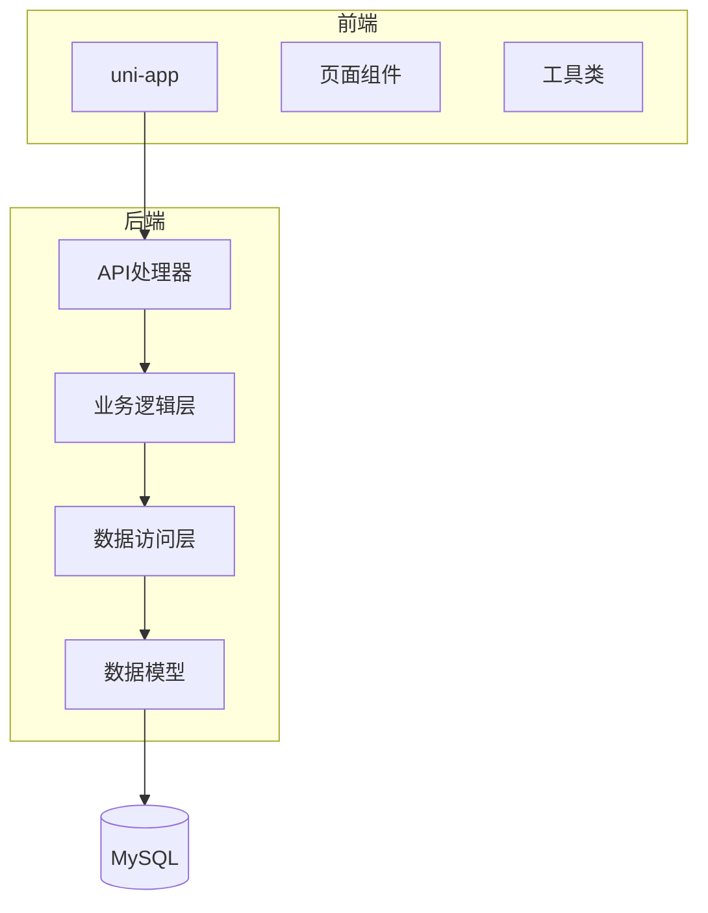
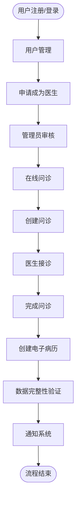
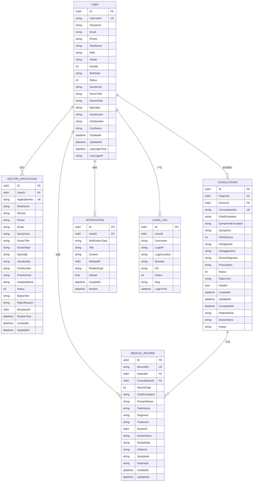
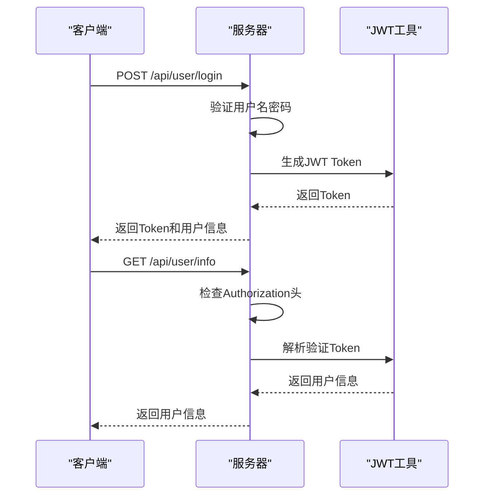
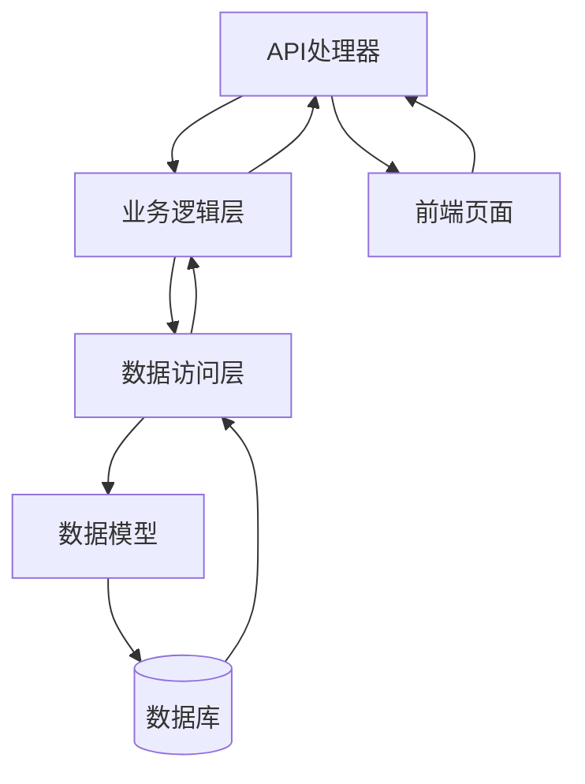
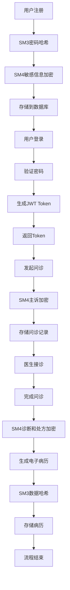

# 系统概述

<cite>
**本文档引用文件**  
- [main.go](file://backed/cmd/main.go)
- [config.yaml](file://backed/config/config.yaml)
- [routes.go](file://backed/internal/api/routes.go)
- [crypto.go](file://backed/internal/crypto/crypto.go)
- [jwt.go](file://backed/pkg/utils/jwt.go)
- [models.go](file://backed/internal/model/models.go)
- [auth.go](file://backed/internal/middleware/auth.go)
- [user_service.go](file://backed/internal/service/user_service.go)
- [consultation_service.go](file://backed/internal/service/consultation_service.go)
- [request.js](file://fonted/utils/request.js)
- [crypto.js](file://fonted/utils/crypto.js)
- [main.js](file://fonted/main.js)
- [pages.json](file://fonted/pages.json)
- [go.mod](file://backed/go.mod)
- [README.md](file://backed/README.md)
</cite>

## 目录
1. [项目背景与目标](#项目背景与目标)
2. [系统架构设计](#系统架构设计)
3. [国密加密技术实现](#国密加密技术实现)
4. [核心功能模块](#核心功能模块)
5. [技术栈与依赖](#技术栈与依赖)
6. [身份认证机制](#身份认证机制)
7. [MVC分层架构](#mvc分层架构)
8. [系统运行流程](#系统运行流程)
9. [技术决策与权衡](#技术决策与权衡)

## 项目背景与目标

本系统是基于国密算法的网上看诊平台，作为毕业设计项目，旨在构建一个安全、可靠、高效的在线医疗问诊系统。系统采用国密S系列算法（SM2/SM3/SM4）对通信内容和数据库数据进行加密，确保用户隐私和医疗数据的安全性。项目目标是实现一个完整的前后端分离架构，前端基于uni-app框架，后端使用Go语言和Gin框架，提供用户管理、医生认证、在线问诊、电子病历管理和通知系统等核心功能。

**Section sources**
- [README.md](file://backed/README.md#L1-L401)

## 系统架构设计

系统采用前后端分离的架构设计，前端基于uni-app框架，后端使用Go语言和Gin框架。后端系统采用MVC分层架构，分为API处理器、业务逻辑层、数据访问层和数据模型层。系统通过RESTful API进行前后端通信，使用JWT实现身份认证。



**Diagram sources**
- [main.go](file://backed/cmd/main.go#L1-L64)
- [routes.go](file://backed/internal/api/routes.go#L1-L95)
- [models.go](file://backed/internal/model/models.go#L1-L160)

**Section sources**
- [main.go](file://backed/cmd/main.go#L1-L64)
- [routes.go](file://backed/internal/api/routes.go#L1-L95)
- [models.go](file://backed/internal/model/models.go#L1-L160)

## 国密加密技术实现

系统采用国密S系列算法对通信内容和数据库数据进行加密，包括SM2/SM3/SM4算法。SM3用于密码哈希加密和数据完整性验证，SM4用于对称加密（邮箱、手机号、身份证等敏感信息），SM2用于非对称加密（密钥交换和敏感数据传输）。

```mermaid
classDiagram
class Crypto {
    +[]byte SM4Key
    +*sm2.PrivateKey SM2PrivateKey
    +*sm2.PublicKey SM2PublicKey
    +InitCrypto(sm4KeyHex string) error
    +SM3Hash(data string) string
    +SM3HashWithSalt(data, salt string) string
    +SM4Encrypt(plaintext string) (string, error)
    +SM4Decrypt(ciphertext string) (string, error)
    +SM2Encrypt(plaintext string) (string, error)
    +SM2Decrypt(ciphertext string) (string, error)
    +GetSM2PublicKeyHex() string
}
class UserService {
    +Register(username, password, email, phone string) (*User, error)
    +Login(username, password, clientIP string) (string, map[string]interface{}, error)
    +GetUserInfo(userID int64) (map[string]interface{}, error)
    +UpdateProfile(userID int64, avatar, realName string, gender int, birthDate, phone, email string) error
    +ChangePassword(userID int64, oldPassword, newPassword string) error
    +ApplyDoctor(userID int64, realName, idCard, phone, certImage, doctorTitle, doctorDept, specialty, introduction, certNumber string) (int64, error)
    +GetDoctorApplication(userID int64) (map[string]interface{}, error)
    +GetDoctors(page, pageSize int, dept, keyword string) (mapList []map[string]interface{}, total int64, err error)
}
class ConsultationService {
    +Create(patientID int64, doctorID *int64, chiefComplaint string, symptoms map[string]interface{}, needAI bool) (result map[string]interface{}, err error)
    +GetList(userID int64, role string, page, pageSize int, status *int) (list []map[string]interface{}, total int64, err error)
    +GetDetail(userID, consultationID int64) (map[string]interface{}, error)
    +Accept(doctorID, consultationID int64) error
    +Finish(doctorID, consultationID int64, diagnosis, prescription string) error
    +createMedicalRecord(consultation *Consultation, diagnosis, prescription string) error
}
Crypto --> UserService : "使用"
Crypto --> ConsultationService : "使用"
```

**Diagram sources**
- [crypto.go](file://backed/internal/crypto/crypto.go#L1-L121)
- [user_service.go](file://backed/internal/service/user_service.go#L1-L331)
- [consultation_service.go](file://backed/internal/service/consultation_service.go#L1-L302)

**Section sources**
- [crypto.go](file://backed/internal/crypto/crypto.go#L1-L121)
- [user_service.go](file://backed/internal/service/user_service.go#L1-L331)
- [consultation_service.go](file://backed/internal/service/consultation_service.go#L1-L302)

## 核心功能模块

系统主要功能模块包括用户管理、医生认证、在线问诊、电子病历管理和通知系统。用户管理模块提供用户注册、登录、信息管理和密码修改功能；医生认证模块支持用户申请成为医生和管理员审核；在线问诊模块实现创建问诊、接诊和完成问诊流程；电子病历模块提供病历创建、查询和数据完整性验证；通知系统用于消息推送和状态更新。



**Diagram sources**
- [routes.go](file://backed/internal/api/routes.go#L1-L95)
- [models.go](file://backed/internal/model/models.go#L1-L160)

**Section sources**
- [routes.go](file://backed/internal/api/routes.go#L1-L95)
- [models.go](file://backed/internal/model/models.go#L1-L160)

## 技术栈与依赖

系统整体技术栈包括Gin框架、GORM、Viper、tjfoc/gmsm等依赖库。后端使用Go语言开发，采用Gin作为Web框架，GORM作为ORM工具，Viper进行配置管理，tjfoc/gmsm实现国密算法。前端基于uni-app框架，使用Vue.js进行开发。



**Diagram sources**
- [models.go](file://backed/internal/model/models.go#L1-L160)
- [go.mod](file://backed/go.mod#L1-L58)

**Section sources**
- [models.go](file://backed/internal/model/models.go#L1-L160)
- [go.mod](file://backed/go.mod#L1-L58)

## 身份认证机制

系统通过JWT实现身份认证，使用HS256算法生成和验证Token。用户登录成功后，服务器生成JWT Token返回给客户端，客户端在后续请求中通过Authorization头携带Token进行身份验证。系统使用中间件对需要认证的接口进行保护。



**Diagram sources**
- [jwt.go](file://backed/pkg/utils/jwt.go#L1-L53)
- [auth.go](file://backed/internal/middleware/auth.go#L1-L61)

**Section sources**
- [jwt.go](file://backed/pkg/utils/jwt.go#L1-L53)
- [auth.go](file://backed/internal/middleware/auth.go#L1-L61)

## MVC分层架构

系统采用MVC分层架构组织代码，分为模型（Model）、视图（View）、控制器（Controller）三层。后端代码结构清晰，分为API处理器（Controller）、业务逻辑层（Service）、数据访问层（Repository）和数据模型层（Model）。这种分层架构提高了代码的可维护性和可扩展性。



**Diagram sources**
- [routes.go](file://backed/internal/api/routes.go#L1-L95)
- [user_service.go](file://backed/internal/service/user_service.go#L1-L331)
- [models.go](file://backed/internal/model/models.go#L1-L160)

**Section sources**
- [routes.go](file://backed/internal/api/routes.go#L1-L95)
- [user_service.go](file://backed/internal/service/user_service.go#L1-L331)
- [models.go](file://backed/internal/model/models.go#L1-L160)

## 系统运行流程

系统运行流程从用户注册开始，经过登录、信息管理、申请医生认证、发起问诊、医生接诊、完成问诊到生成电子病历的完整流程。每个步骤都涉及国密加密算法的应用，确保数据在传输和存储过程中的安全性。



**Diagram sources**
- [user_service.go](file://backed/internal/service/user_service.go#L1-L331)
- [consultation_service.go](file://backed/internal/service/consultation_service.go#L1-L302)
- [crypto.go](file://backed/internal/crypto/crypto.go#L1-L121)

**Section sources**
- [user_service.go](file://backed/internal/service/user_service.go#L1-L331)
- [consultation_service.go](file://backed/internal/service/consultation_service.go#L1-L302)
- [crypto.go](file://backed/internal/crypto/crypto.go#L1-L121)

## 技术决策与权衡

系统在技术选型上进行了多项权衡和约束。选择Go语言和Gin框架主要考虑其高性能和简洁的语法，适合构建高并发的Web服务。采用国密算法满足国内信息安全要求，但增加了开发复杂度。前后端分离架构提高了开发效率和系统可维护性，但需要处理跨域问题。MVC分层架构使代码结构清晰，但增加了代码量。JWT认证机制无状态，适合分布式系统，但需要处理Token过期和刷新问题。

**Section sources**
- [README.md](file://backed/README.md#L1-L401)
- [go.mod](file://backed/go.mod#L1-L58)