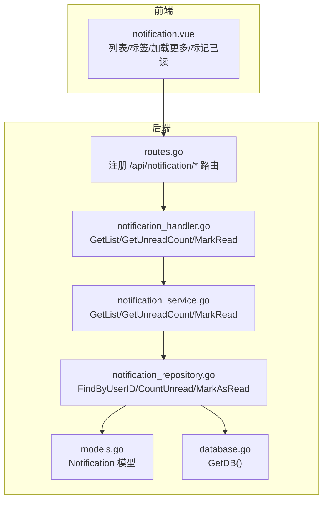
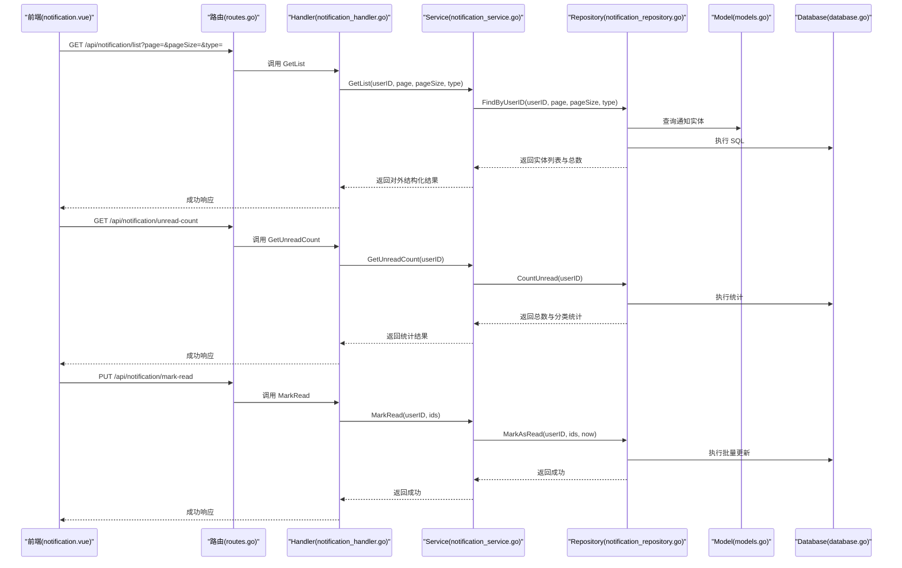
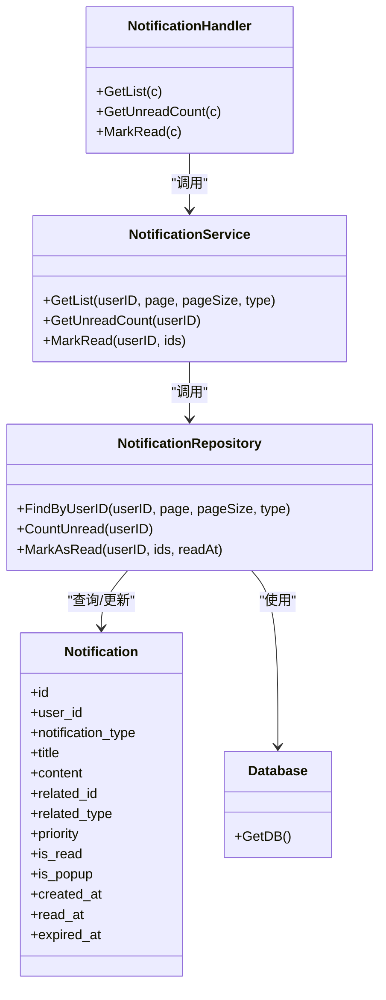

# 通知模块

<cite>
**本文引用的文件**
- [notification_handler.go](file://backed/internal/api/handler/notification_handler.go)
- [routes.go](file://backed/internal/api/routes.go)
- [notification_service.go](file://backed/internal/service/notification_service.go)
- [notification_repository.go](file://backed/internal/repository/notification_repository.go)
- [models.go](file://backed/internal/model/models.go)
- [database.go](file://backed/pkg/database/database.go)
- [notification.vue](file://fonted/pages/notification/notification.vue)
- [init.sql](file://backed/init.sql)
</cite>

## 目录
1. [简介](#简介)
2. [项目结构](#项目结构)
3. [核心组件](#核心组件)
4. [架构总览](#架构总览)
5. [详细组件分析](#详细组件分析)
6. [依赖关系分析](#依赖关系分析)
7. [性能考虑](#性能考虑)
8. [故障排查指南](#故障排查指南)
9. [结论](#结论)
10. [附录](#附录)

## 简介
本文件围绕通知模块的实现与使用进行系统性说明，覆盖后端 Handler、Service、Repository 的职责划分，以及前端页面对通知列表、未读统计与标记已读的交互流程。重点解读以下接口：
- 获取通知列表（分页、按类型过滤）
- 获取未读数量（总数、按类型）
- 标记已读（单条或多条）

同时说明通知数据模型、数据库表结构及索引设计，并给出前后端对接要点与最佳实践。

## 项目结构
通知模块在后端采用典型的三层架构：
- Handler 层：接收 HTTP 请求，解析参数，调用 Service 并返回统一响应格式
- Service 层：封装业务逻辑，协调 Repository 完成数据查询与状态更新
- Repository 层：封装数据库访问，提供按用户、类型、分页等查询能力

前端页面负责展示通知列表、切换类型标签、加载更多、点击跳转以及标记已读。

图表来源
- [routes.go](file://backed/internal/api/routes.go#L58-L66)
- [notification_handler.go](file://backed/internal/api/handler/notification_handler.go#L20-L73)
- [notification_service.go](file://backed/internal/service/notification_service.go#L18-L64)
- [notification_repository.go](file://backed/internal/repository/notification_repository.go#L15-L53)
- [models.go](file://backed/internal/model/models.go#L125-L141)
- [database.go](file://backed/pkg/database/database.go#L45-L47)

章节来源
- [routes.go](file://backed/internal/api/routes.go#L58-L66)
- [notification_handler.go](file://backed/internal/api/handler/notification_handler.go#L20-L73)
- [notification_service.go](file://backed/internal/service/notification_service.go#L18-L64)
- [notification_repository.go](file://backed/internal/repository/notification_repository.go#L15-L53)
- [models.go](file://backed/internal/model/models.go#L125-L141)
- [database.go](file://backed/pkg/database/database.go#L45-L47)

## 核心组件
- Handler：负责从上下文中提取用户标识，解析分页与类型参数，调用 Service 并返回统一响应
- Service：将 Repository 返回的实体转换为对外的 JSON 结构；计算未读统计；执行标记已读的时间戳写入
- Repository：基于 GORM 实现按用户、类型、分页查询；统计未读数量；批量更新已读状态与读取时间
- Model：定义通知表结构与字段映射，包含关联 ID、类型、优先级、是否已读、创建/读取时间等
- Database：提供全局数据库连接句柄，供 Repository 使用

章节来源
- [notification_handler.go](file://backed/internal/api/handler/notification_handler.go#L20-L73)
- [notification_service.go](file://backed/internal/service/notification_service.go#L18-L64)
- [notification_repository.go](file://backed/internal/repository/notification_repository.go#L15-L53)
- [models.go](file://backed/internal/model/models.go#L125-L141)
- [database.go](file://backed/pkg/database/database.go#L45-L47)

## 架构总览
通知模块遵循“请求-服务-仓储-模型-数据库”的调用链路，Handler 仅做参数校验与响应包装，Service 负责领域数据转换，Repository 专注数据持久化。

图表来源
- [routes.go](file://backed/internal/api/routes.go#L58-L66)
- [notification_handler.go](file://backed/internal/api/handler/notification_handler.go#L20-L73)
- [notification_service.go](file://backed/internal/service/notification_service.go#L18-L64)
- [notification_repository.go](file://backed/internal/repository/notification_repository.go#L15-L53)
- [models.go](file://backed/internal/model/models.go#L125-L141)
- [database.go](file://backed/pkg/database/database.go#L45-L47)

## 详细组件分析

### Handler：通知接口入口
- GetList：从上下文获取 userID，解析 page/pageSize/type 参数，调用 Service 获取列表与总数，统一返回
- GetUnreadCount：从上下文获取 userID，调用 Service 获取未读统计，统一返回
- MarkRead：从请求体解析 notificationIds 数组，调用 Service 标记已读，统一返回

章节来源
- [notification_handler.go](file://backed/internal/api/handler/notification_handler.go#L20-L73)
- [routes.go](file://backed/internal/api/routes.go#L58-L66)

### Service：通知业务逻辑
- GetList：调用 Repository 查询通知列表与总数，将实体字段映射为对外 JSON 结构，包含 notificationId、type、title、content、isRead、createdAt、relatedId（可选）
- GetUnreadCount：调用 Repository 统计未读总数与按类型（system、consultation）的未读数，返回聚合统计
- MarkRead：记录当前时间，调用 Repository 对指定通知批量更新 is_read 与 read_at

章节来源
- [notification_service.go](file://backed/internal/service/notification_service.go#L18-L64)
- [notification_repository.go](file://backed/internal/repository/notification_repository.go#L15-L53)

### Repository：通知数据持久化
- FindByUserID：按用户 ID 过滤，支持按 notification_type 过滤；先 Count 再 Offset/Limit 查询，按 created_at 降序排序
- CountUnread：统计未读总数，以及按 notification_type 分类的未读数
- MarkAsRead：按用户 ID 与通知 ID 集合进行批量更新，设置 is_read=true 与 read_at=当前时间

章节来源
- [notification_repository.go](file://backed/internal/repository/notification_repository.go#L15-L53)
- [database.go](file://backed/pkg/database/database.go#L45-L47)

### Model：通知数据模型
- 字段说明：id、user_id、notification_type、title、content、related_id、related_type、priority、is_read、is_popup、created_at、read_at、expired_at
- 索引：user_id、is_read、notification_type、priority、created_at

章节来源
- [models.go](file://backed/internal/model/models.go#L125-L141)
- [init.sql](file://backed/init.sql#L253-L275)

### 前端：通知页面交互
- 标签页：支持 all/system/consultation 三种类型筛选
- 列表：分页加载，支持上拉加载更多；未读项高亮显示
- 点击行为：若未读则自动标记已读；根据 type 与 relatedId 决定跳转或弹窗详情
- 全部标为已读：收集未读通知 ID，批量调用后端接口

章节来源
- [notification.vue](file://fonted/pages/notification/notification.vue#L1-L214)

## 依赖关系分析
- Handler 依赖 Service
- Service 依赖 Repository
- Repository 依赖 Model 与 Database
- 前端依赖后端路由与统一响应格式

图表来源
- [notification_handler.go](file://backed/internal/api/handler/notification_handler.go#L20-L73)
- [notification_service.go](file://backed/internal/service/notification_service.go#L18-L64)
- [notification_repository.go](file://backed/internal/repository/notification_repository.go#L15-L53)
- [models.go](file://backed/internal/model/models.go#L125-L141)
- [database.go](file://backed/pkg/database/database.go#L45-L47)

## 性能考虑
- 分页与排序：Repository 已按 created_at 降序排序并使用 Offset/Limit，建议结合索引提升分页效率
- 查询条件：按 user_id 与 notification_type 过滤，确保对应索引生效
- 统计未读：分别统计总数与分类未读，避免复杂聚合导致的性能问题
- 批量更新：MarkAsRead 使用 IN 条件批量更新，注意通知 ID 数量上限与事务控制
- 前端分页：前端默认每页 20 条，可根据业务调整以平衡网络与渲染压力

章节来源
- [notification_repository.go](file://backed/internal/repository/notification_repository.go#L15-L53)
- [init.sql](file://backed/init.sql#L253-L275)

## 故障排查指南
- 参数校验失败：Handler 在 MarkRead 中对请求体进行绑定校验，若传参不合法会返回错误响应
- 数据库连接异常：Repository 通过 GetDB() 获取连接，如连接失败会导致查询/更新失败
- 权限问题：路由已启用鉴权中间件，未登录用户无法访问通知接口
- 未读统计异常：确认 is_read 字段与 notification_type 是否正确设置
- 前端加载失败：检查 API 地址与分页参数，确认网络与跨域配置

章节来源
- [notification_handler.go](file://backed/internal/api/handler/notification_handler.go#L54-L73)
- [routes.go](file://backed/internal/api/routes.go#L58-L66)
- [database.go](file://backed/pkg/database/database.go#L45-L47)

## 结论
通知模块通过清晰的分层设计实现了“列表查询、未读统计、批量标记已读”的完整闭环。Handler 保持薄层职责，Service 负责数据转换与业务编排，Repository 提供稳定的数据库访问能力。前端页面与后端接口配合良好，具备良好的扩展性与可维护性。

## 附录

### 接口定义与使用方法
- 获取通知列表
  - 方法与路径：GET /api/notification/list
  - 查询参数：page、pageSize、type（可选）
  - 返回：list、total、page、pageSize
- 获取未读数量
  - 方法与路径：GET /api/notification/unread-count
  - 返回：totalUnread、systemUnread、consultationUnread
- 标记已读
  - 方法与路径：PUT /api/notification/mark-read
  - 请求体：notificationIds（数组）
  - 返回：成功消息

章节来源
- [routes.go](file://backed/internal/api/routes.go#L58-L66)
- [notification_handler.go](file://backed/internal/api/handler/notification_handler.go#L20-L73)
- [notification_service.go](file://backed/internal/service/notification_service.go#L18-L64)
- [notification_repository.go](file://backed/internal/repository/notification_repository.go#L15-L53)

### 数据模型与表结构
- 表名：SM_notification
- 关键字段：user_id、notification_type、title、content、related_id、related_type、priority、is_read、is_popup、created_at、read_at、expired_at
- 索引：user_id、is_read、notification_type、priority、created_at

章节来源
- [models.go](file://backed/internal/model/models.go#L125-L141)
- [init.sql](file://backed/init.sql#L253-L275)