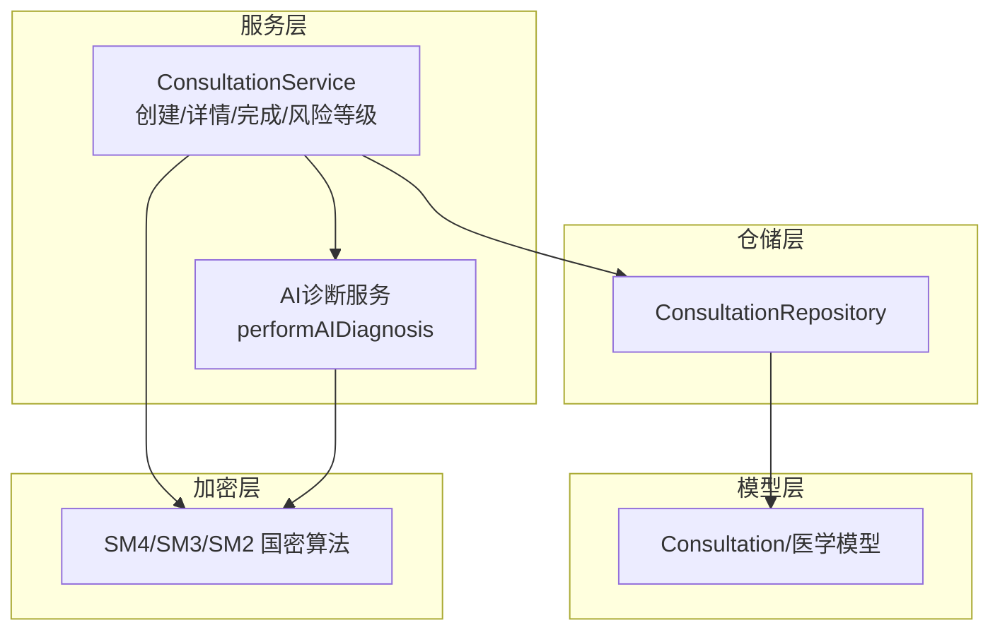
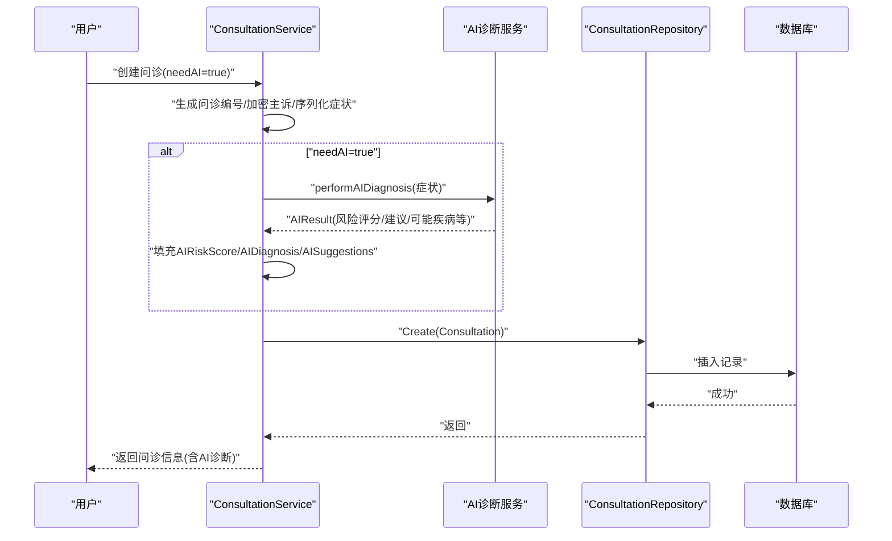
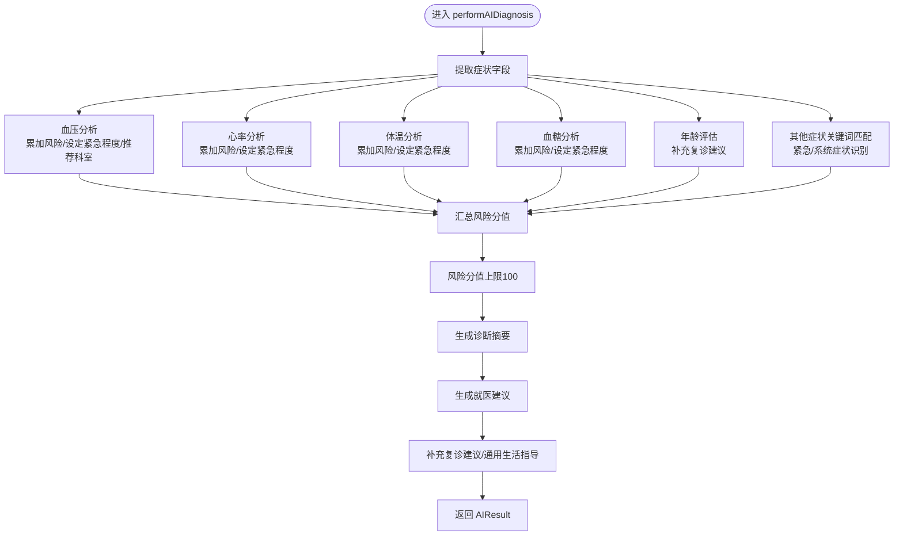
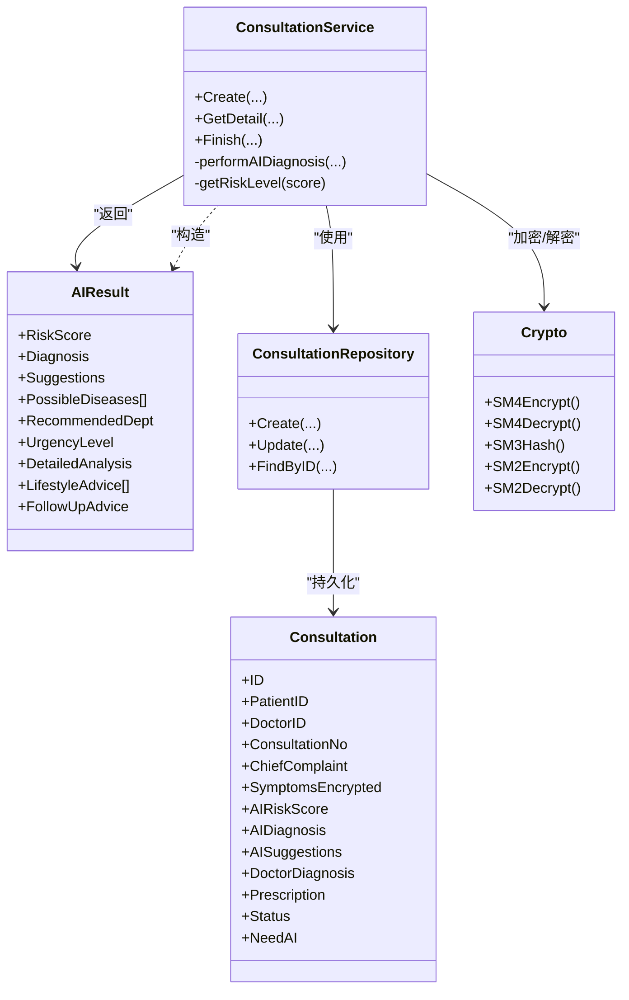

# AI智能诊断

<cite>
**本文引用的文件**
- [consultation_service.go](file://backed/internal/service/consultation_service.go)
- [ai_diagnosis.go](file://backed/internal/service/ai_diagnosis.go)
- [models.go](file://backed/internal/model/models.go)
- [consultation_repository.go](file://backed/internal/repository/consultation_repository.go)
- [crypto.go](file://backed/internal/crypto/crypto.go)
- [init.sql](file://backed/init.sql)
- [添加ai_suggestions字段.sql](file://添加ai_suggestions字段.sql)
- [规划.md](file://规划.md)
</cite>

## 目录
1. [简介](#简介)
2. [项目结构](#项目结构)
3. [核心组件](#核心组件)
4. [架构总览](#架构总览)
5. [详细组件分析](#详细组件分析)
6. [依赖关系分析](#依赖关系分析)
7. [性能考量](#性能考量)
8. [故障排查指南](#故障排查指南)
9. [结论](#结论)
10. [附录](#附录)

## 简介
本文件围绕“基于国密算法保护下的AI辅助诊断系统”的实现进行深入说明，重点覆盖以下方面：
- 在创建问诊时根据 needAI 参数触发 AI 分析的机制
- AIResult 结构体所承载的诊断信息维度（风险评分、可能疾病、推荐科室、紧急程度等）
- 问诊表中 ai_suggestions 字段的添加过程及在模型中的映射
- AI 诊断结果与医生诊断的互补关系，包括风险等级划分算法与诊断建议生成逻辑
- AI 诊断数据在数据库中的加密存储方式，以及在问诊详情中安全呈现的流程

## 项目结构
后端采用分层架构：服务层负责业务编排，仓储层负责数据持久化，模型层定义数据结构，加密层提供国密算法能力。AI 诊断逻辑集中在服务层，与问诊流程紧密耦合。

图表来源
- [consultation_service.go](file://backed/internal/service/consultation_service.go#L1-L120)
- [ai_diagnosis.go](file://backed/internal/service/ai_diagnosis.go#L1-L120)
- [models.go](file://backed/internal/model/models.go#L68-L97)
- [consultation_repository.go](file://backed/internal/repository/consultation_repository.go#L1-L83)
- [crypto.go](file://backed/internal/crypto/crypto.go#L1-L121)

章节来源
- [consultation_service.go](file://backed/internal/service/consultation_service.go#L1-L120)
- [ai_diagnosis.go](file://backed/internal/service/ai_diagnosis.go#L1-L120)
- [models.go](file://backed/internal/model/models.go#L68-L97)
- [consultation_repository.go](file://backed/internal/repository/consultation_repository.go#L1-L83)
- [crypto.go](file://backed/internal/crypto/crypto.go#L1-L121)

## 核心组件
- ConsultationService：封装问诊全流程，包括创建、列表、详情、完成；在创建时按需触发 AI 分析，并将结果写入数据库；在详情中按需重新执行 AI 以补齐缺失字段。
- AIResult：AI 诊断结果载体，包含风险评分、可能疾病、推荐科室、紧急程度、详细分析、生活指导、复诊建议等维度。
- Consultation 模型：定义问诊表结构，包含 ai_risk_score、ai_diagnosis、ai_suggestions 等字段。
- ConsultationRepository：封装问诊数据的增删改查。
- Crypto：提供 SM4 对称加密、SM3 哈希、SM2 非对称加密等能力。

章节来源
- [consultation_service.go](file://backed/internal/service/consultation_service.go#L28-L120)
- [ai_diagnosis.go](file://backed/internal/service/ai_diagnosis.go#L278-L309)
- [models.go](file://backed/internal/model/models.go#L68-L97)
- [consultation_repository.go](file://backed/internal/repository/consultation_repository.go#L1-L83)
- [crypto.go](file://backed/internal/crypto/crypto.go#L1-L121)

## 架构总览
AI 辅助诊断在创建问诊时按需触发，AI 服务根据症状特征计算风险评分与建议，并将结果持久化到问诊表。后续在详情页可再次触发 AI 以补齐缺失字段，最终与医生诊断共同构成完整的诊疗依据。

图表来源
- [consultation_service.go](file://backed/internal/service/consultation_service.go#L28-L86)
- [ai_diagnosis.go](file://backed/internal/service/ai_diagnosis.go#L8-L309)
- [consultation_repository.go](file://backed/internal/repository/consultation_repository.go#L14-L17)

章节来源
- [consultation_service.go](file://backed/internal/service/consultation_service.go#L28-L86)
- [ai_diagnosis.go](file://backed/internal/service/ai_diagnosis.go#L8-L309)
- [consultation_repository.go](file://backed/internal/repository/consultation_repository.go#L14-L17)

## 详细组件分析

### performAIDiagnosis 方法调用逻辑
- 输入：症状 map，包含年龄、血压、心率、体温、血糖、其他症状等关键字段
- 输出：AIResult，包含风险评分、可能疾病列表、推荐科室、紧急程度、详细分析、生活指导、复诊建议、诊断摘要
- 关键流程：
  - 血压、心率、体温、血糖分别按阈值累加风险分值，并设置紧急程度与推荐科室
  - 其他症状通过关键词匹配识别紧急情况与系统相关症状，动态调整风险与建议
  - 最终生成诊断摘要与就医建议，并补充通用生活指导与复诊建议
  - 风险评分上限限制在 0-100

图表来源
- [ai_diagnosis.go](file://backed/internal/service/ai_diagnosis.go#L8-L309)

章节来源
- [ai_diagnosis.go](file://backed/internal/service/ai_diagnosis.go#L8-L309)

### AIResult 结构体与 10 维度分析
AIResult 作为 AI 诊断结果载体，包含如下维度：
- 风险评分：整数，范围 0-100
- 诊断摘要：字符串，总结可能存在的问题
- 就医建议：字符串，结合风险评分与紧急程度给出建议
- 可能疾病：字符串数组，列出可能的疾病
- 推荐科室：字符串，建议就诊科室
- 紧急程度：字符串，枚举值（normal/attention/urgent/emergency）
- 详细分析：键值对，按系统维度给出分析
- 生活指导：字符串数组，提供健康生活方式建议
- 复诊建议：字符串，针对不同紧急程度给出复诊安排
- 诊断摘要（重复）：字符串，用于统一输出

章节来源
- [consultation_service.go](file://backed/internal/service/consultation_service.go#L278-L302)
- [ai_diagnosis.go](file://backed/internal/service/ai_diagnosis.go#L278-L309)

### 创建问诊时的 needAI 触发机制
- 在创建问诊时，若 needAI 为真，则调用 performAIDiagnosis 生成 AIResult，并将其中的关键字段映射到 Consultation：
  - AIRiskScore：风险评分
  - AIDiagnosis：诊断摘要
  - AISuggestions：就医建议
- 若 needAI 为假，则跳过 AI 分析，直接创建问诊记录

章节来源
- [consultation_service.go](file://backed/internal/service/consultation_service.go#L28-L86)

### 问诊表中 ai_suggestions 字段的添加与映射
- 字段添加：通过 SQL 脚本为 SM_consultation 表新增 ai_suggestions 字段，位于 ai_diagnosis 之后
- 模型映射：Consultation 模型中 ai_suggestions 字段映射到数据库列，用于存储 AI 就医建议
- 作用：在创建问诊时由服务层写入，在详情页展示给用户

章节来源
- [添加ai_suggestions字段.sql](file://添加ai_suggestions字段.sql#L1-L19)
- [models.go](file://backed/internal/model/models.go#L68-L97)
- [consultation_service.go](file://backed/internal/service/consultation_service.go#L49-L86)

### 风险等级划分算法（getRiskLevel）
- 算法逻辑：
  - ≥70：high
  - ≥40：medium
  - ≥20：low
  - <20：normal
- 该算法在详情页再次执行 AI 诊断时，用于将风险评分转换为风险等级，以便用户直观理解

章节来源
- [consultation_service.go](file://backed/internal/service/consultation_service.go#L291-L302)

### 诊断建议生成逻辑
- 建议生成基于风险评分与紧急程度：
  - emergency：立即拨打 120 或前往急诊
  - urgent：尽快就医，建议在 24-48 小时内
  - attention：需要重视，建议 3-7 天内就诊
  - medium：注意观察，症状持续超过 3 天或加重需就医
  - low/normal：持续关注，保持健康生活方式
- 同时补充复诊建议与通用生活指导，确保建议的完整性与可操作性

章节来源
- [ai_diagnosis.go](file://backed/internal/service/ai_diagnosis.go#L267-L309)

### AI 诊断数据在数据库中的加密存储与安全呈现
- 加密存储：
  - 问诊表中的主诉、医生诊断、处方等字段采用 SM4 对称加密存储
  - 病历表中的主诉、诊断、治疗等字段同样采用 SM4 加密存储，并通过 SM3 哈希校验数据完整性
- 安全呈现：
  - 在创建问诊时，若 needAI 为真，服务层将 AIResult 的关键字段写入数据库
  - 在详情页，若存在 AI 结果，服务层会重新执行 AI 以补齐缺失字段，然后将风险等级、诊断摘要、建议等安全地返回给前端
  - 问诊详情中展示的均为解密后的明文信息，但仅在服务层解密并在响应中返回，不暴露原始加密数据

章节来源
- [models.go](file://backed/internal/model/models.go#L68-L97)
- [consultation_service.go](file://backed/internal/service/consultation_service.go#L122-L176)
- [consultation_service.go](file://backed/internal/service/consultation_service.go#L195-L237)
- [init.sql](file://backed/init.sql#L121-L156)
- [规划.md](file://规划.md#L260-L320)

## 依赖关系分析
- ConsultationService 依赖：
  - AI 诊断服务：performAIDiagnosis
  - 问诊仓储：Create/Update/FindByID
  - 加密模块：SM4/SM3/SM2
- AI 诊断服务依赖：
  - 加密模块：SM4/SM3/SM2（用于生成哈希或加密数据）
- 问诊模型与仓储：
  - 模型定义 ai_risk_score、ai_diagnosis、ai_suggestions 等字段
  - 仓储负责持久化与查询

图表来源
- [consultation_service.go](file://backed/internal/service/consultation_service.go#L1-L302)
- [ai_diagnosis.go](file://backed/internal/service/ai_diagnosis.go#L278-L309)
- [models.go](file://backed/internal/model/models.go#L68-L97)
- [consultation_repository.go](file://backed/internal/repository/consultation_repository.go#L1-L83)
- [crypto.go](file://backed/internal/crypto/crypto.go#L1-L121)

章节来源
- [consultation_service.go](file://backed/internal/service/consultation_service.go#L1-L302)
- [ai_diagnosis.go](file://backed/internal/service/ai_diagnosis.go#L278-L309)
- [models.go](file://backed/internal/model/models.go#L68-L97)
- [consultation_repository.go](file://backed/internal/repository/consultation_repository.go#L1-L83)
- [crypto.go](file://backed/internal/crypto/crypto.go#L1-L121)

## 性能考量
- AI 诊断计算为纯逻辑运算，复杂度与症状数量线性相关，整体开销较小
- 数据库层面：
  - 问诊表与病历表均建立索引，查询效率较高
  - SM4 加密/解密与 SM3 哈希计算在服务层进行，单次请求开销可控
- 建议：
  - 对高频症状字段进行缓存（如通用健康建议模板）
  - 在 AI 诊断结果返回时，避免重复计算，尽量复用已生成的结果

[本节为通用建议，无需引用具体文件]

## 故障排查指南
- 创建问诊后未显示 AI 诊断
  - 检查 needAI 是否为真
  - 确认 performAIDiagnosis 是否返回有效结果
  - 确认数据库中 ai_risk_score、ai_diagnosis、ai_suggestions 是否写入
- 详情页缺少 AI 诊断字段
  - 详情页会重新执行 AI 以补齐缺失字段，确认症状数据可解析
  - 检查 getRiskLevel 的风险等级映射是否正确
- 数据安全问题
  - 确认 SM4 加密/解密流程正常
  - 病历数据完整性通过 SM3 哈希校验，若校验失败需检查数据是否被篡改

章节来源
- [consultation_service.go](file://backed/internal/service/consultation_service.go#L122-L176)
- [consultation_service.go](file://backed/internal/service/consultation_service.go#L291-L302)
- [models.go](file://backed/internal/model/models.go#L68-L97)
- [crypto.go](file://backed/internal/crypto/crypto.go#L1-L121)

## 结论
本系统通过 needAI 参数实现了 AI 辅助诊断的按需触发，AIResult 提供了从风险评分到就医建议的完整分析维度。数据库层采用 SM4 对称加密与 SM3 哈希保障数据安全，服务层在创建与详情场景下安全地呈现 AI 结果。AI 诊断与医生诊断相互补充，既提升了初筛效率，又保留了医生的专业判断空间。

[本节为总结性内容，无需引用具体文件]

## 附录
- 数据库初始化与问诊表结构参考：init.sql
- ai_suggestions 字段添加脚本：添加ai_suggestions字段.sql
- AI 诊断流程与界面展示参考：规划.md

章节来源
- [init.sql](file://backed/init.sql#L121-L156)
- [添加ai_suggestions字段.sql](file://添加ai_suggestions字段.sql#L1-L19)
- [规划.md](file://规划.md#L260-L320)