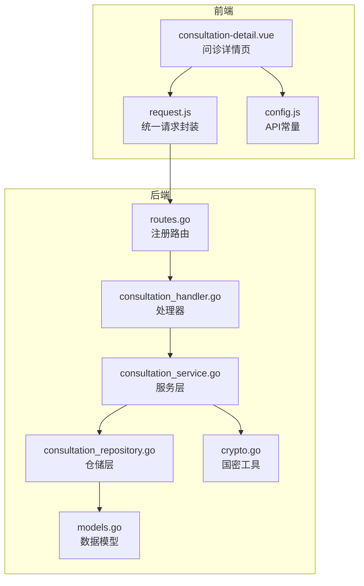
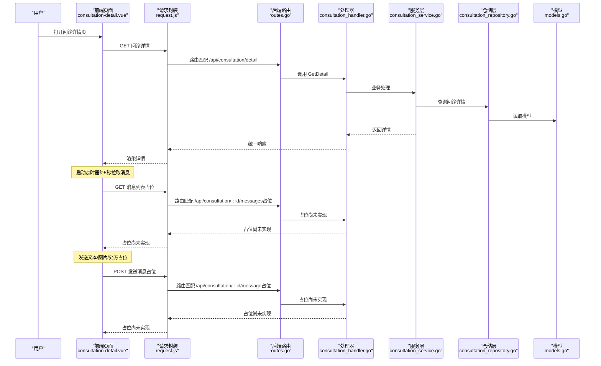
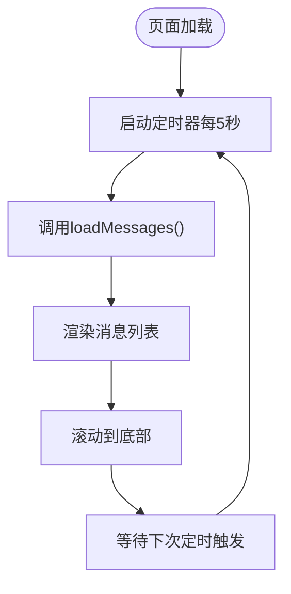
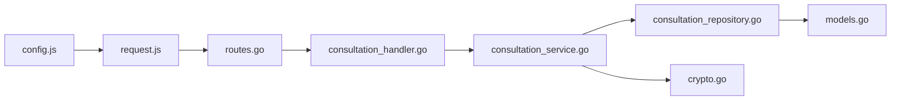

# 消息交互

<cite>
**本文引用的文件**
- [consultation_handler.go](file://backed/internal/api/handler/consultation_handler.go)
- [consultation-service.go](file://backed/internal/service/consultation_service.go)
- [consultation_repository.go](file://backed/internal/repository/consultation_repository.go)
- [routes.go](file://backed/internal/api/routes.go)
- [models.go](file://backed/internal/model/models.go)
- [consultation-detail.vue](file://fonted/pages/consultation/consultation-detail.vue)
- [request.js](file://fonted/utils/request.js)
- [config.js](file://fonted/utils/config.js)
- [crypto.go](file://backed/internal/crypto/crypto.go)
- [API接口总览.md](file://API接口总览.md)
</cite>

## 目录
1. [简介](#简介)
2. [项目结构](#项目结构)
3. [核心组件](#核心组件)
4. [架构总览](#架构总览)
5. [详细组件分析](#详细组件分析)
6. [依赖关系分析](#依赖关系分析)
7. [性能考量](#性能考量)
8. [故障排查指南](#故障排查指南)
9. [结论](#结论)
10. [附录](#附录)

## 简介
本章节聚焦“问诊消息交互”的实现机制，围绕以下目标展开：
- 后端发送消息API的处理逻辑与数据存储（文本、图片、处方等消息类型的抽象与落地）
- 前端消息列表加载机制（定时轮询）、消息发送交互（输入框、图片上传、处方入口）
- 消息在传输过程中的加密保护（国密SM4/SM2/SM3在系统中的应用）
- 前后端通过API进行消息同步的约定与流程
- 消息格式设计示例（时间戳、发送者标识、内容类型）
- 当前采用HTTP轮询而非WebSocket的架构选择及其性能影响与优化建议

## 项目结构
后端采用Gin框架，按模块划分处理器、服务层、仓储层；前端采用Vue生态（UniApp），通过统一请求封装与API常量进行通信。

图表来源
- [routes.go](file://backed/internal/api/routes.go#L37-L47)
- [consultation_handler.go](file://backed/internal/api/handler/consultation_handler.go#L1-L136)
- [consultation-service.go](file://backed/internal/service/consultation_service.go#L1-L302)
- [consultation_repository.go](file://backed/internal/repository/consultation_repository.go#L1-L83)
- [models.go](file://backed/internal/model/models.go#L68-L93)
- [crypto.go](file://backed/internal/crypto/crypto.go#L1-L121)
- [consultation-detail.vue](file://fonted/pages/consultation/consultation-detail.vue#L1-L416)
- [request.js](file://fonted/utils/request.js#L1-L222)
- [config.js](file://fonted/utils/config.js#L1-L65)

章节来源
- [routes.go](file://backed/internal/api/routes.go#L37-L47)
- [consultation_handler.go](file://backed/internal/api/handler/consultation_handler.go#L1-L136)
- [consultation-service.go](file://backed/internal/service/consultation_service.go#L1-L302)
- [consultation_repository.go](file://backed/internal/repository/consultation_repository.go#L1-L83)
- [models.go](file://backed/internal/model/models.go#L68-L93)
- [consultation-detail.vue](file://fonted/pages/consultation/consultation-detail.vue#L1-L416)
- [request.js](file://fonted/utils/request.js#L1-L222)
- [config.js](file://fonted/utils/config.js#L1-L65)

## 核心组件
- 后端处理器：负责接收HTTP请求、参数绑定、调用服务层、返回统一响应
- 服务层：封装业务逻辑（如问诊状态流转、加密存储、AI诊断结果组装）
- 仓储层：与数据库交互，提供增删改查能力
- 前端页面：负责消息列表渲染、定时轮询、消息发送、图片上传、处方入口
- 请求封装：统一封装GET/POST/上传等方法，自动注入Authorization头与错误处理

章节来源
- [consultation_handler.go](file://backed/internal/api/handler/consultation_handler.go#L1-L136)
- [consultation-service.go](file://backed/internal/service/consultation_service.go#L1-L302)
- [consultation_repository.go](file://backed/internal/repository/consultation_repository.go#L1-L83)
- [consultation-detail.vue](file://fonted/pages/consultation/consultation-detail.vue#L1-L416)
- [request.js](file://fonted/utils/request.js#L1-L222)

## 架构总览
后端通过Gin路由组对“问诊模块”进行鉴权保护，提供创建、列表、详情、接诊、完成等接口；前端通过API常量与统一请求封装与后端交互。当前消息发送与拉取接口在API文档中定义，但前端页面中仍处于“TODO”占位阶段，表示消息交互功能尚未完全上线。

图表来源
- [routes.go](file://backed/internal/api/routes.go#L37-L47)
- [consultation_handler.go](file://backed/internal/api/handler/consultation_handler.go#L73-L91)
- [consultation-service.go](file://backed/internal/service/consultation_service.go#L122-L176)
- [consultation_repository.go](file://backed/internal/repository/consultation_repository.go#L24-L29)
- [models.go](file://backed/internal/model/models.go#L68-L93)
- [consultation-detail.vue](file://fonted/pages/consultation/consultation-detail.vue#L183-L200)
- [request.js](file://fonted/utils/request.js#L1-L222)
- [API接口总览.md](file://API接口总览.md#L95-L103)

## 详细组件分析

### 后端发送消息API处理逻辑（当前状态与建议）
- 现状：后端路由中未注册“发送消息”和“获取消息列表”的具体实现，API文档中定义了占位路径，前端页面同样处于“TODO”占位。
- 建议实现要点：
  - 路由注册：在路由组中增加“POST /api/consultation/:consultationId/message”和“GET /api/consultation/:consultationId/messages”
  - 处理器：新增Send与List方法，参数校验（consultationId、content/type、分页等）
  - 服务层：新增消息实体与持久化逻辑（可复用问诊模型字段或独立消息表）
  - 仓储层：提供消息写入与查询接口
  - 加密策略：消息内容采用SM4加密存储，必要时结合SM2会话密钥进行传输加密

章节来源
- [routes.go](file://backed/internal/api/routes.go#L37-L47)
- [API接口总览.md](file://API接口总览.md#L95-L103)
- [consultation-detail.vue](file://fonted/pages/consultation/consultation-detail.vue#L226-L243)
- [consultation-detail.vue](file://fonted/pages/consultation/consultation-detail.vue#L317-L337)
- [consultation-detail.vue](file://fonted/pages/consultation/consultation-detail.vue#L260-L285)

### 消息类型处理与存储（文本、图片、处方）
- 文本消息：内容为纯文本，建议在服务层进行长度与敏感词校验，存储前采用SM4加密
- 图片消息：前端先上传至文件服务，返回文件URL；消息体保存URL，前端渲染图片
- 处方消息：预留消息类型，前端提供入口，后端需定义处方消息的数据结构与存储策略

章节来源
- [consultation-detail.vue](file://fonted/pages/consultation/consultation-detail.vue#L106-L131)
- [consultation-detail.vue](file://fonted/pages/consultation/consultation-detail.vue#L260-L285)
- [consultation-detail.vue](file://fonted/pages/consultation/consultation-detail.vue#L295-L315)
- [request.js](file://fonted/utils/request.js#L128-L175)

### 前端消息列表加载机制（定时轮询）
- 启动时机：页面加载时启动定时器，每5秒拉取一次消息列表
- 列表渲染：根据消息类型渲染文本、图片或处方卡片
- 滚动行为：每次拉取后滚动到底部，保证新消息可见

图表来源
- [consultation-detail.vue](file://fonted/pages/consultation/consultation-detail.vue#L183-L200)
- [consultation-detail.vue](file://fonted/pages/consultation/consultation-detail.vue#L226-L243)

章节来源
- [consultation-detail.vue](file://fonted/pages/consultation/consultation-detail.vue#L183-L200)
- [consultation-detail.vue](file://fonted/pages/consultation/consultation-detail.vue#L226-L243)

### 前端消息发送功能实现
- 文本消息：输入框输入后点击发送，清空输入并触发消息拉取
- 图片上传：通过ActionSheet选择“发送图片”，调用上传接口，上传成功后触发消息拉取
- 处方入口：医生角色可打开“开具处方”入口，当前为占位提示

章节来源
- [consultation-detail.vue](file://fonted/pages/consultation/consultation-detail.vue#L133-L161)
- [consultation-detail.vue](file://fonted/pages/consultation/consultation-detail.vue#L245-L257)
- [consultation-detail.vue](file://fonted/pages/consultation/consultation-detail.vue#L260-L285)
- [consultation-detail.vue](file://fonted/pages/consultation/consultation-detail.vue#L295-L315)
- [consultation-detail.vue](file://fonted/pages/consultation/consultation-detail.vue#L317-L337)

### 消息数据在传输中的加密保护
- 传输层：统一请求封装自动附加Authorization头，配合HTTPS保障传输安全
- 存储层：系统对敏感字段采用SM4加密存储（如问诊主诉、诊断、处方等）
- 计算层：AI诊断使用Paillier同态加密保护风险评分（系统特性）
- 建议：消息内容在服务层入库前统一SM4加密，避免明文落库

章节来源
- [request.js](file://fonted/utils/request.js#L1-L75)
- [consultation-service.go](file://backed/internal/service/consultation_service.go#L28-L86)
- [consultation-service.go](file://backed/internal/service/consultation_service.go#L195-L237)
- [models.go](file://backed/internal/model/models.go#L68-L93)
- [crypto.go](file://backed/internal/crypto/crypto.go#L48-L79)

### 前后端消息同步与API约定
- API常量：前端通过config.js集中管理后端接口路径
- 统一响应：后端通过utils包返回统一格式，前端request.js解析并做错误处理
- 同步策略：当前采用轮询，建议后续引入WebSocket实现实时推送

章节来源
- [config.js](file://fonted/utils/config.js#L34-L42)
- [request.js](file://fonted/utils/request.js#L1-L75)
- [API接口总览.md](file://API接口总览.md#L95-L103)

### 消息格式设计示例
- 字段建议：
  - id：消息唯一标识
  - consultationId：所属问诊ID
  - senderId：发送者ID（区分患者/医生）
  - type：消息类型（text/image/prescription）
  - content：消息内容（文本或图片URL）
  - createdAt：时间戳
  - avatar：头像URL（可选）
  - prescriptionId：当type为prescription时携带（可选）
- 传输建议：content字段在入库前SM4加密，必要时在传输层使用SM2会话密钥加密

章节来源
- [consultation-detail.vue](file://fonted/pages/consultation/consultation-detail.vue#L106-L131)
- [models.go](file://backed/internal/model/models.go#L68-L93)
- [crypto.go](file://backed/internal/crypto/crypto.go#L48-L79)

## 依赖关系分析
后端模块间依赖清晰：路由 -> 处理器 -> 服务层 -> 仓储层 -> 模型；前端通过API常量与请求封装与后端交互。

图表来源
- [config.js](file://fonted/utils/config.js#L34-L42)
- [request.js](file://fonted/utils/request.js#L1-L222)
- [routes.go](file://backed/internal/api/routes.go#L37-L47)
- [consultation_handler.go](file://backed/internal/api/handler/consultation_handler.go#L1-L136)
- [consultation-service.go](file://backed/internal/service/consultation_service.go#L1-L302)
- [consultation_repository.go](file://backed/internal/repository/consultation_repository.go#L1-L83)
- [models.go](file://backed/internal/model/models.go#L68-L93)
- [crypto.go](file://backed/internal/crypto/crypto.go#L1-L121)

章节来源
- [routes.go](file://backed/internal/api/routes.go#L37-L47)
- [consultation_handler.go](file://backed/internal/api/handler/consultation_handler.go#L1-L136)
- [consultation-service.go](file://backed/internal/service/consultation_service.go#L1-L302)
- [consultation_repository.go](file://backed/internal/repository/consultation_repository.go#L1-L83)
- [models.go](file://backed/internal/model/models.go#L68-L93)
- [consultation-detail.vue](file://fonted/pages/consultation/consultation-detail.vue#L1-L416)
- [request.js](file://fonted/utils/request.js#L1-L222)
- [config.js](file://fonted/utils/config.js#L1-L65)

## 性能考量
- 当前架构采用HTTP轮询（每5秒），优点是实现简单、兼容性强；缺点是存在固定延迟与额外网络开销
- WebSocket优化建议：
  - 降低延迟：消息到达即推送，无需等待轮询周期
  - 减少带宽：长连接复用，减少握手与头部开销
  - 提升体验：即时反馈，提升交互流畅度
- 实施步骤：
  - 后端：引入WebSocket库，建立连接池与房间（按问诊ID分房间）
  - 前端：建立连接，订阅消息主题，断线重连
  - 安全：保持HTTPS与Authorization不变，必要时在握手阶段进行SM2会话密钥协商

章节来源
- [consultation-detail.vue](file://fonted/pages/consultation/consultation-detail.vue#L183-L200)
- [API接口总览.md](file://API接口总览.md#L211-L216)

## 故障排查指南
- 前端常见问题
  - 无法加载消息：确认定时器是否启动、API路径是否正确、网络是否可用
  - 发送失败：检查上传接口返回、Authorization头是否注入、后端是否实现对应接口
- 后端常见问题
  - 参数校验失败：检查请求体结构与必填字段
  - 权限不足：确认JWT是否有效、用户角色是否匹配
  - 数据库异常：检查仓储层查询/更新是否成功
- 加密相关
  - SM4解密失败：确认密钥一致、密文格式正确
  - SM3哈希不一致：确认数据拼接规则与签名一致

章节来源
- [consultation-detail.vue](file://fonted/pages/consultation/consultation-detail.vue#L183-L200)
- [consultation-detail.vue](file://fonted/pages/consultation/consultation-detail.vue#L226-L243)
- [request.js](file://fonted/utils/request.js#L1-L222)
- [consultation_handler.go](file://backed/internal/api/handler/consultation_handler.go#L21-L43)
- [consultation-service.go](file://backed/internal/service/consultation_service.go#L122-L176)
- [crypto.go](file://backed/internal/crypto/crypto.go#L48-L79)

## 结论
- 当前系统的消息交互处于“占位实现”阶段：后端未注册消息发送/拉取接口，前端定时轮询与消息发送仍为占位
- 系统在传输与存储层面具备完善的国密加密能力（SM2/SM3/SM4），可作为消息内容加密的基础
- 建议优先补齐后端消息接口与前端交互，随后引入WebSocket实现真正“实时”消息体验

## 附录
- API接口总览（消息相关）
  - POST /api/consultation/:consultationId/message（发送消息）
  - GET /api/consultation/:consultationId/messages（获取消息列表）
- 前端API常量
  - CONSULTATION_MESSAGE、CONSULTATION_MESSAGES

章节来源
- [API接口总览.md](file://API接口总览.md#L95-L103)
- [config.js](file://fonted/utils/config.js#L34-L42)