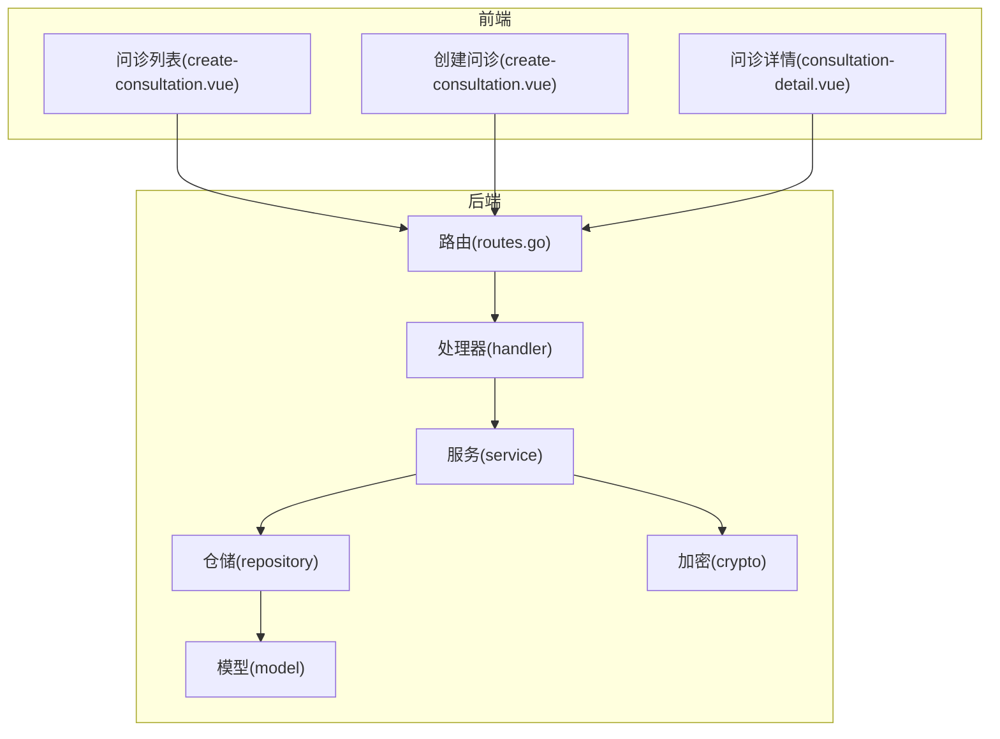
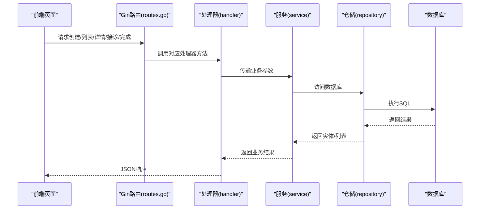
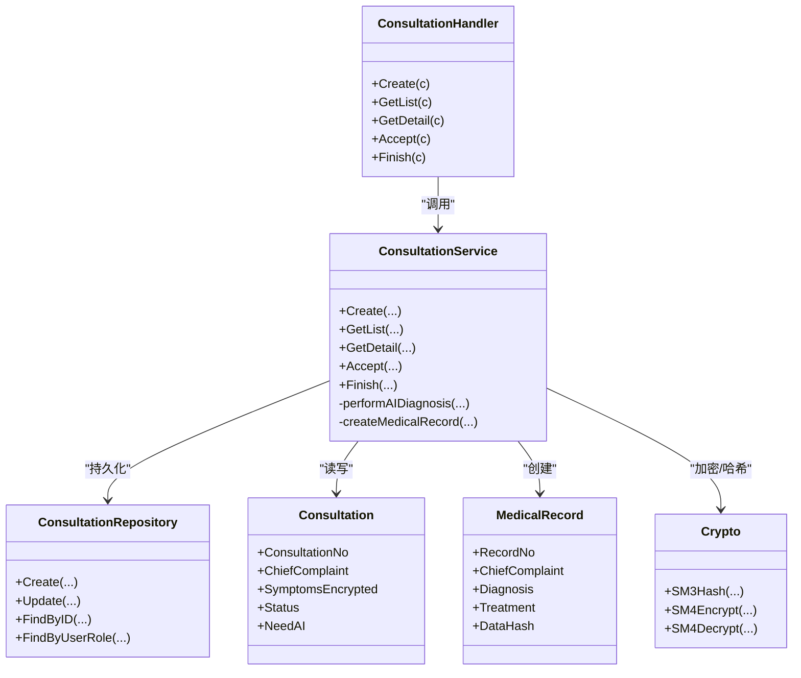

# 问诊模块

<cite>
**本文引用的文件**
- [consultation_handler.go](file://backed/internal/api/handler/consultation_handler.go)
- [routes.go](file://backed/internal/api/routes.go)
- [consultation_service.go](file://backed/internal/service/consultation_service.go)
- [ai_diagnosis.go](file://backed/internal/service/ai_diagnosis.go)
- [consultation_repository.go](file://backed/internal/repository/consultation_repository.go)
- [models.go](file://backed/internal/model/models.go)
- [consultation-list.vue](file://fonted/pages/consultation/consultation-list.vue)
- [create-consultation.vue](file://fonted/pages/consultation/create-consultation.vue)
- [consultation-detail.vue](file://fonted/pages/consultation/consultation-detail.vue)
- [init.sql](file://backed/init.sql)
- [crypto.go](file://backed/internal/crypto/crypto.go)
</cite>

## 目录
1. [简介](#简介)
2. [项目结构](#项目结构)
3. [核心组件](#核心组件)
4. [架构总览](#架构总览)
5. [详细组件分析](#详细组件分析)
6. [依赖关系分析](#依赖关系分析)
7. [性能考虑](#性能考虑)
8. [故障排查指南](#故障排查指南)
9. [结论](#结论)
10. [附录](#附录)

## 简介
本文件面向开发者，系统性梳理“在线问诊”模块的完整实现，覆盖后端API、业务逻辑、数据持久化以及前端交互，并重点说明以下能力：
- 在线问诊全流程：创建问诊、医生接诊、消息交互、完成问诊
- 问诊状态管理与权限控制
- 实时消息交流与AI智能诊断
- 国密加密在敏感数据保护中的应用
- 前后端对接与使用方法

## 项目结构
后端采用分层架构：API层负责路由与请求响应；服务层封装业务逻辑；仓储层负责数据持久化；模型层定义数据结构；加密层提供国密算法支持。前端采用Vue页面组件展示问诊列表、创建问诊与详情页。

图表来源
- [routes.go](file://backed/internal/api/routes.go#L37-L47)
- [consultation_handler.go](file://backed/internal/api/handler/consultation_handler.go#L1-L136)
- [consultation_service.go](file://backed/internal/service/consultation_service.go#L1-L302)
- [consultation_repository.go](file://backed/internal/repository/consultation_repository.go#L1-L83)
- [models.go](file://backed/internal/model/models.go#L68-L119)
- [create-consultation.vue](file://fonted/pages/consultation/create-consultation.vue#L1-L266)
- [consultation-list.vue](file://fonted/pages/consultation/consultation-list.vue#L1-L261)
- [consultation-detail.vue](file://fonted/pages/consultation/consultation-detail.vue#L1-L417)

章节来源
- [routes.go](file://backed/internal/api/routes.go#L37-L47)

## 核心组件
- API处理器：封装创建问诊、查询列表、详情、接诊、完成问诊等接口
- 服务层：实现业务规则、状态流转、AI诊断、加密与病历创建
- 仓储层：封装GORM对SM_consultation表的增删改查
- 模型层：定义Consultation、MedicalRecord等核心实体
- 加密层：提供SM3哈希与SM4对称加密能力
- 前端页面：提供问诊创建、列表与详情交互

章节来源
- [consultation_handler.go](file://backed/internal/api/handler/consultation_handler.go#L1-L136)
- [consultation_service.go](file://backed/internal/service/consultation_service.go#L1-L302)
- [consultation_repository.go](file://backed/internal/repository/consultation_repository.go#L1-L83)
- [models.go](file://backed/internal/model/models.go#L68-L119)
- [crypto.go](file://backed/internal/crypto/crypto.go#L1-L121)

## 架构总览
后端通过Gin框架注册问诊相关路由，统一鉴权中间件保障接口安全。前端页面通过HTTP请求与后端交互，完成问诊生命周期管理。

图表来源
- [routes.go](file://backed/internal/api/routes.go#L37-L47)
- [consultation_handler.go](file://backed/internal/api/handler/consultation_handler.go#L20-L136)
- [consultation_service.go](file://backed/internal/service/consultation_service.go#L28-L302)
- [consultation_repository.go](file://backed/internal/repository/consultation_repository.go#L14-L83)

## 详细组件分析

### API处理器：consultation_handler.go
- 职责
  - 接收前端请求，绑定参数，调用服务层执行业务
  - 统一返回成功/失败响应
- 关键接口
  - 创建问诊：接收主诉、症状、是否需要AI等，调用服务层创建并返回问诊基础信息
  - 查询列表：按角色、状态、分页查询，返回列表与总数
  - 查询详情：按ID查询，返回问诊详情及AI诊断（若存在）
  - 医生接诊：校验状态为待接诊，更新状态为问诊中
  - 完成问诊：校验医生权限，加密诊断与处方，更新状态为已完成，并自动创建电子病历

章节来源
- [consultation_handler.go](file://backed/internal/api/handler/consultation_handler.go#L20-L136)

### 服务层：consultation_service.go
- 职责
  - 业务编排：参数校验、状态检查、权限校验、加密/解密、AI诊断、病历创建
  - 状态管理：0待接诊、1问诊中、2已完成、3已取消
- 关键流程
  - 创建问诊：生成问诊编号，加密主诉，序列化症状，可选触发AI诊断，持久化
  - 列表/详情：对敏感字段进行解密展示，状态文本映射
  - 接诊：仅待接诊状态允许接诊，更新医生ID与状态
  - 完成问诊：仅问诊中状态允许完成，加密诊断与处方，更新完成时间，自动创建电子病历
  - 病历创建：生成病历编号，解密主诉，加密诊断与治疗，生成SM3数据哈希，写入SM_medical_record

章节来源
- [consultation_service.go](file://backed/internal/service/consultation_service.go#L28-L302)

### 仓储层：consultation_repository.go
- 职责
  - 对SM_consultation表进行增删改查
  - 列表查询支持按角色（患者/医生）、状态、分页与排序
  - 关联查询用户姓名（简化版）
- 关键点
  - FindByUserRole：医生可见“自己接诊的”或“待接诊”的问诊；患者仅能看到自己的
  - FindByID：按ID精确查询
  - Create/Update：封装GORM操作

章节来源
- [consultation_repository.go](file://backed/internal/repository/consultation_repository.go#L14-L83)

### 模型层：models.go
- 问诊模型（Consultation）
  - 字段：主诉、症状、AI诊断、医生诊断、处方、状态、是否需要AI、时间戳等
  - 关联字段：患者/医生姓名
- 病历模型（MedicalRecord）
  - 字段：主诉、诊断、治疗、AI建议、数据哈希、时间戳等
- 问诊消息模型（SM_consultation_message）
  - 字段：消息类型、内容、文件、已读标记、时间戳等
  - 该表用于后续完善实时消息功能

章节来源
- [models.go](file://backed/internal/model/models.go#L68-L119)
- [init.sql](file://backed/init.sql#L158-L184)

### AI智能诊断：ai_diagnosis.go
- 能力
  - 基于年龄、血压、心率、体温、血糖、其他症状等进行综合分析
  - 输出风险评分、风险等级、可能疾病、推荐科室、紧急程度、详细分析、生活方式建议、复诊建议
- 规则
  - 依据症状阈值与关键词匹配，动态累加风险分值
  - 根据最高风险级别决定就医建议与科室推荐

章节来源
- [ai_diagnosis.go](file://backed/internal/service/ai_diagnosis.go#L8-L309)

### 前端页面：创建与详情
- 创建问诊（create-consultation.vue）
  - 支持选择医生、填写主诉、症状信息（年龄、性别、血压、心率、体温、血糖、其他症状）、上传图片、开启AI辅助
  - 调用后端创建接口，跳转至详情页
- 问诊列表（consultation-list.vue）
  - 支持患者/医生双角色切换，状态筛选（全部/待接诊/问诊中/已完成），分页加载
- 问诊详情（consultation-detail.vue）
  - 展示问诊信息、AI诊断结果、聊天区域（计划中）
  - 医生端支持接诊与完成问诊操作；定时刷新问诊状态

章节来源
- [create-consultation.vue](file://fonted/pages/consultation/create-consultation.vue#L1-L266)
- [consultation-list.vue](file://fonted/pages/consultation/consultation-list.vue#L1-L261)
- [consultation-detail.vue](file://fonted/pages/consultation/consultation-detail.vue#L1-L417)

### 实时消息交流与AI智能诊断
- 实时消息
  - 数据库已设计SM_consultation_message表，支持文本、图片、语音、处方等消息类型
  - 前端页面已预留消息加载与发送入口（注释为“TODO”，后续接入后将实现真正的实时交互）
- AI智能诊断
  - 服务层提供performAIDiagnosis方法，结合症状与关键词生成AI诊断结果
  - 创建问诊时可选择是否启用AI；完成后可在详情页查看AI分析与建议

章节来源
- [init.sql](file://backed/init.sql#L158-L184)
- [consultation-detail.vue](file://fonted/pages/consultation/consultation-detail.vue#L225-L337)
- [ai_diagnosis.go](file://backed/internal/service/ai_diagnosis.go#L8-L309)

## 依赖关系分析

图表来源
- [consultation_handler.go](file://backed/internal/api/handler/consultation_handler.go#L1-L136)
- [consultation_service.go](file://backed/internal/service/consultation_service.go#L1-L302)
- [consultation_repository.go](file://backed/internal/repository/consultation_repository.go#L1-L83)
- [models.go](file://backed/internal/model/models.go#L68-L119)
- [crypto.go](file://backed/internal/crypto/crypto.go#L1-L121)

## 性能考虑
- 数据库索引
  - 问诊表：按patient_id、doctor_id、status、consultation_no、created_at建立索引，提升查询效率
- 分页与排序
  - 列表查询使用offset/limit与created_at倒序，避免全表扫描
- 加密成本
  - SM4加密/解密与SM3哈希在高频场景下需关注性能，建议在批量处理时合并加密批次
- 缓存策略
  - 可对常用问诊状态与AI诊断结果进行短期缓存，降低重复计算

章节来源
- [init.sql](file://backed/init.sql#L121-L156)
- [consultation_repository.go](file://backed/internal/repository/consultation_repository.go#L31-L83)

## 故障排查指南
- 参数校验失败
  - 现象：创建/接诊/完成接口返回参数错误
  - 排查：确认请求体字段是否完整（如主诉、症状、诊断、问诊ID等）
- 权限校验失败
  - 现象：完成问诊时报无权限
  - 排查：确认当前医生是否为该问诊的接诊医生，或是否为待接诊状态
- 问诊不存在
  - 现象：查询详情或接诊/完成时报问诊不存在
  - 排查：确认consultationId是否正确，或是否已被删除
- 数据解密异常
  - 现象：主诉/诊断等字段显示乱码
  - 排查：确认SM4密钥配置正确，前后端一致
- AI诊断未返回
  - 现象：创建问诊时未显示AI结果
  - 排查：确认前端勾选“需要AI”，后端performAIDiagnosis是否被调用

章节来源
- [consultation_handler.go](file://backed/internal/api/handler/consultation_handler.go#L20-L136)
- [consultation_service.go](file://backed/internal/service/consultation_service.go#L122-L237)
- [crypto.go](file://backed/internal/crypto/crypto.go#L1-L121)

## 结论
本模块实现了完整的在线问诊闭环：从前端创建问诊、医生接诊、到完成问诊并自动生成电子病历，同时内置AI智能诊断能力。通过国密算法对敏感数据进行加密与完整性校验，满足医疗数据安全要求。实时消息功能已在数据库层面完成建模，前端预留交互入口，后续可快速接入。

## 附录

### API定义与使用方法
- 创建问诊
  - 方法：POST /api/consultation/create
  - 请求体字段：doctorId、chiefComplaint、symptoms（含age、bloodPressure、heartRate、temperature、bloodSugar、otherSymptoms）、needAI
  - 响应：返回consultationId、consultationNo、status、createdAt，若启用AI，返回aiDiagnosis
- 查询问诊列表
  - 方法：GET /api/consultation/list
  - 查询参数：page、pageSize、role（patient/doctor）、status（0/1/2）
  - 响应：list、total、page、pageSize
- 查询问诊详情
  - 方法：GET /api/consultation/detail?consultationId=...
  - 响应：包含主诉、症状、状态、needAI、createdAt、aiDiagnosis（若存在）
- 医生接诊
  - 方法：POST /api/consultation/accept
  - 请求体：consultationId
  - 响应：成功提示
- 完成问诊
  - 方法：POST /api/consultation/finish
  - 请求体：consultationId、diagnosis、prescription（可选）
  - 响应：成功提示，并自动生成电子病历

章节来源
- [routes.go](file://backed/internal/api/routes.go#L37-L47)
- [consultation_handler.go](file://backed/internal/api/handler/consultation_handler.go#L20-L136)

### 数据模型与加密要点
- 问诊表（SM_consultation）
  - 主诉、症状、AI诊断、医生诊断、处方均采用SM4加密存储
  - 状态字段：0待接诊、1问诊中、2已完成、3已取消
- 病历表（SM_medical_record）
  - 主诉、诊断、治疗、AI建议等采用SM4加密
  - data_hash采用SM3哈希，确保数据完整性
- 加密工具
  - SM3Hash：生成数据哈希
  - SM4Encrypt/SM4Decrypt：对称加密/解密

章节来源
- [models.go](file://backed/internal/model/models.go#L68-L119)
- [init.sql](file://backed/init.sql#L121-L184)
- [crypto.go](file://backed/internal/crypto/crypto.go#L1-L121)