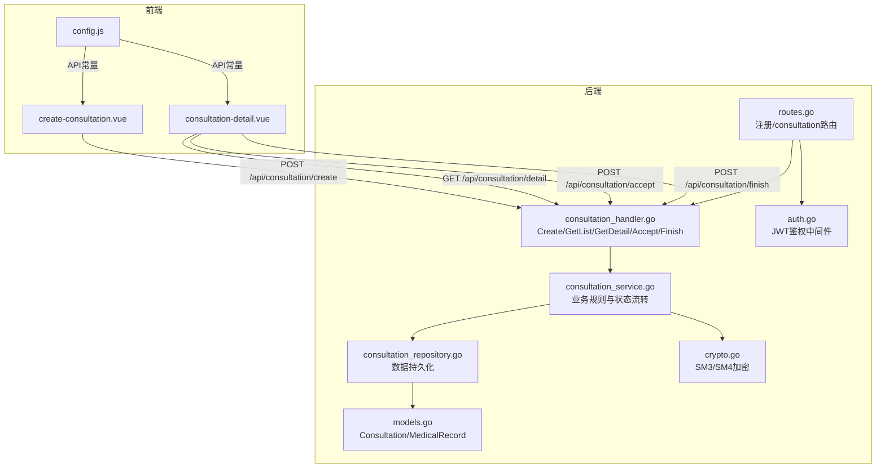
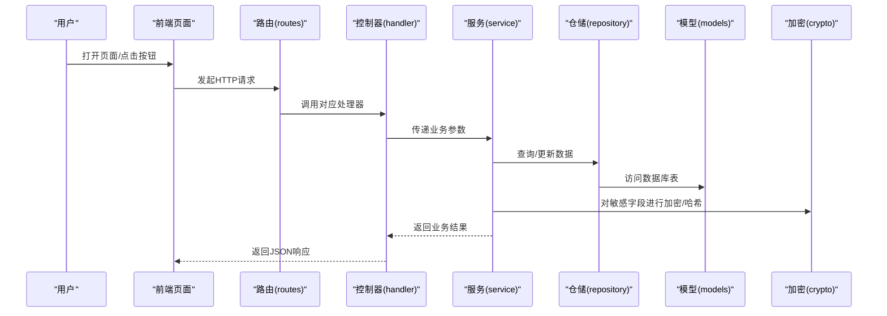
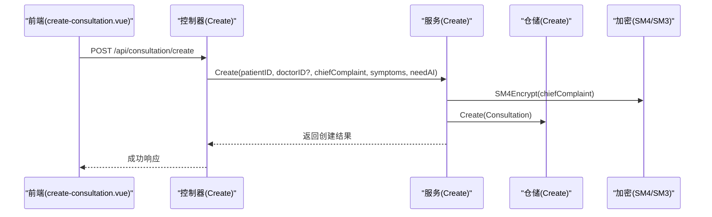
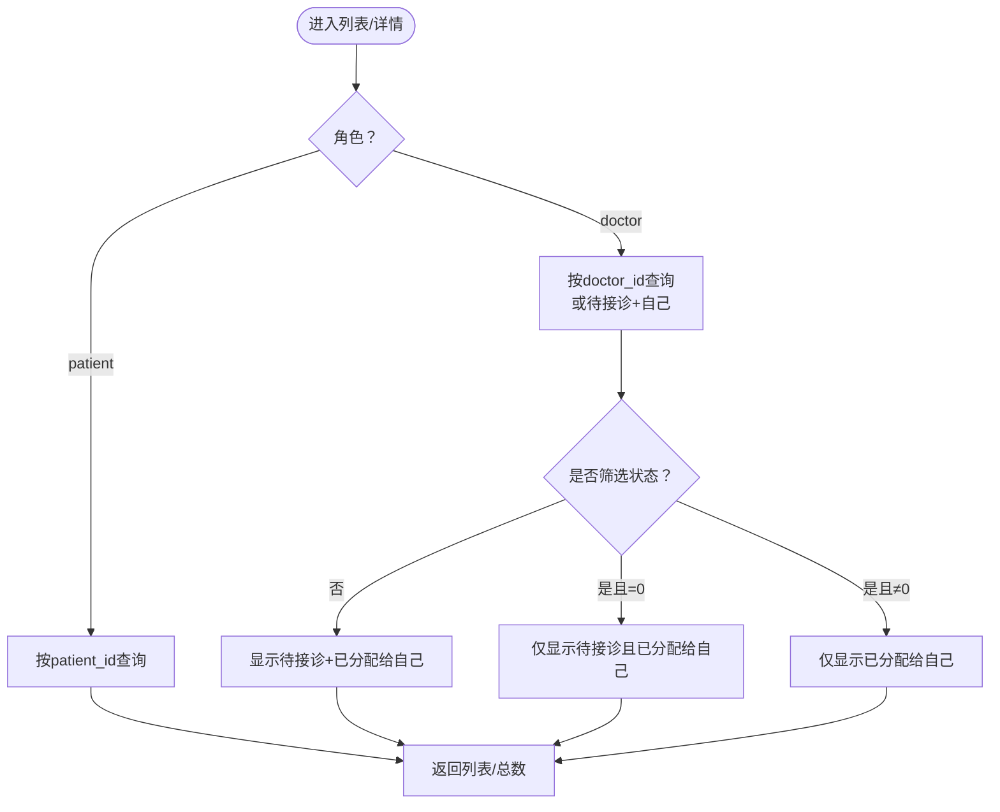
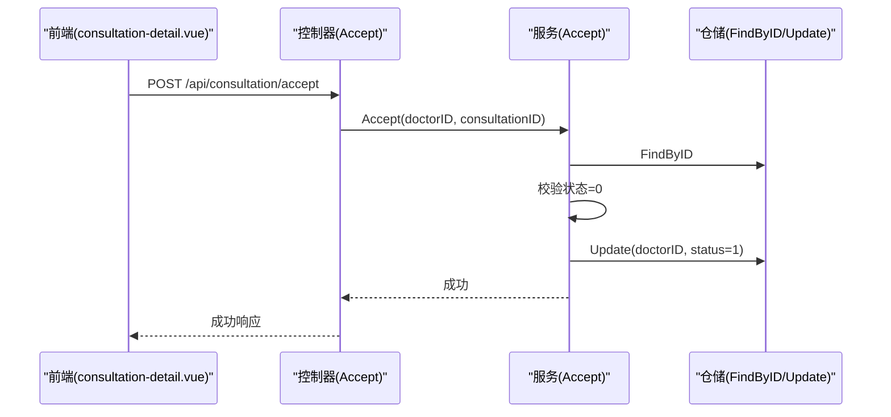
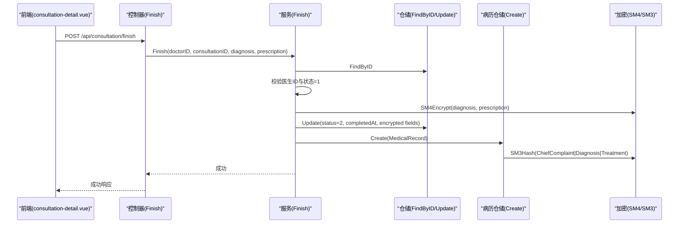
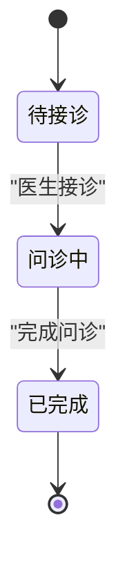
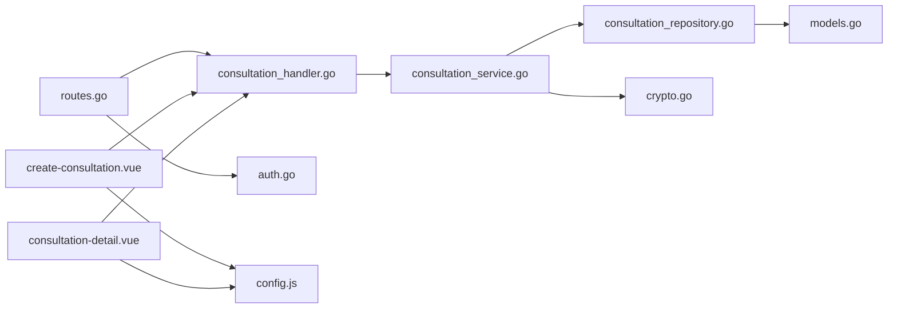

# 问诊流程

<cite>
**本文引用的文件**
- [consultation_handler.go](file://backed/internal/api/handler/consultation_handler.go)
- [consultation_service.go](file://backed/internal/service/consultation_service.go)
- [consultation_repository.go](file://backed/internal/repository/consultation_repository.go)
- [routes.go](file://backed/internal/api/routes.go)
- [auth.go](file://backed/internal/middleware/auth.go)
- [models.go](file://backed/internal/model/models.go)
- [crypto.go](file://backed/internal/crypto/crypto.go)
- [consultation-detail.vue](file://fonted/pages/consultation/consultation-detail.vue)
- [create-consultation.vue](file://fonted/pages/consultation/create-consultation.vue)
- [config.js](file://fonted/utils/config.js)
</cite>

## 目录
1. [简介](#简介)
2. [项目结构](#项目结构)
3. [核心组件](#核心组件)
4. [架构总览](#架构总览)
5. [详细组件分析](#详细组件分析)
6. [依赖关系分析](#依赖关系分析)
7. [性能与安全特性](#性能与安全特性)
8. [故障排查指南](#故障排查指南)
9. [结论](#结论)
10. [附录](#附录)

## 简介
本文件围绕“问诊流程”的完整生命周期进行深入解析，覆盖从前端创建问诊、后端鉴权与业务处理，到医生接诊、完成问诊以及自动创建电子病历的全过程。重点阐述以下内容：
- 后端API实现：consultation_handler.go中创建问诊、获取列表、详情、医生接诊、完成问诊等接口的控制层逻辑。
- 业务规则：consultation_service.go中状态流转（0:待接诊 → 1:问诊中 → 2:已完成）、权限校验、数据加密存储、AI辅助诊断触发与结果回显。
- 数据持久化：consultation_repository.go中问诊数据的增删改查与FindByUserRole按角色查询的差异逻辑。
- 前端交互：consultation-detail.vue中的“接诊”“完成问诊”按钮与状态联动，以及与后端API的对接。
- 状态机与异常处理：状态流转图、越权操作、重复接诊、非法状态变更等异常场景的处理策略。

## 项目结构
后端采用分层架构：API路由 → 控制器(handler) → 服务(service) → 仓储(repository) → 模型(model)；前端采用Vue页面组件与统一API配置。

图表来源
- [routes.go](file://backed/internal/api/routes.go#L37-L47)
- [consultation_handler.go](file://backed/internal/api/handler/consultation_handler.go#L20-L136)
- [consultation_service.go](file://backed/internal/service/consultation_service.go#L28-L302)
- [consultation_repository.go](file://backed/internal/repository/consultation_repository.go#L14-L82)
- [models.go](file://backed/internal/model/models.go#L68-L119)
- [crypto.go](file://backed/internal/crypto/crypto.go#L36-L121)
- [auth.go](file://backed/internal/middleware/auth.go#L9-L43)
- [config.js](file://fonted/utils/config.js#L34-L41)

章节来源
- [routes.go](file://backed/internal/api/routes.go#L37-L47)
- [auth.go](file://backed/internal/middleware/auth.go#L9-L43)
- [config.js](file://fonted/utils/config.js#L34-L41)

## 核心组件
- 控制器层：负责接收HTTP请求、参数绑定、调用服务层并返回响应。
- 服务层：封装业务规则，包含状态流转、权限校验、数据加密、AI诊断触发与病历创建。
- 仓储层：封装数据库操作，提供创建、更新、按ID查询、按角色查询列表等方法。
- 模型层：定义问诊与电子病历的数据结构及字段含义。
- 加密层：提供SM3哈希与SM4对称加密能力，用于敏感数据保护。
- 中间件：JWT鉴权，确保只有登录用户才能访问受保护接口。
- 前端页面：创建问诊、查看详情、医生接诊与完成问诊的交互。

章节来源
- [consultation_handler.go](file://backed/internal/api/handler/consultation_handler.go#L20-L136)
- [consultation_service.go](file://backed/internal/service/consultation_service.go#L28-L302)
- [consultation_repository.go](file://backed/internal/repository/consultation_repository.go#L14-L82)
- [models.go](file://backed/internal/model/models.go#L68-L119)
- [crypto.go](file://backed/internal/crypto/crypto.go#L36-L121)
- [auth.go](file://backed/internal/middleware/auth.go#L9-L43)
- [consultation-detail.vue](file://fonted/pages/consultation/consultation-detail.vue#L149-L161)
- [create-consultation.vue](file://fonted/pages/consultation/create-consultation.vue#L204-L258)

## 架构总览
后端整体遵循“控制器-服务-仓储-模型”的分层设计，前端通过统一API常量调用后端接口，JWT中间件保障接口安全。

图表来源
- [routes.go](file://backed/internal/api/routes.go#L37-L47)
- [consultation_handler.go](file://backed/internal/api/handler/consultation_handler.go#L20-L136)
- [consultation_service.go](file://backed/internal/service/consultation_service.go#L28-L302)
- [consultation_repository.go](file://backed/internal/repository/consultation_repository.go#L14-L82)
- [models.go](file://backed/internal/model/models.go#L68-L119)
- [crypto.go](file://backed/internal/crypto/crypto.go#L36-L121)

## 详细组件分析

### 1) 创建问诊（Create）
- 前端入口：用户在“创建问诊”页面填写主诉、症状、是否启用AI，并提交到后端。
- 后端流程：
  - 控制器接收JSON参数，绑定主诉、症状、是否需要AI等字段。
  - 调用服务层创建问诊，生成问诊编号，加密主诉，序列化症状，设置初始状态为“待接诊”，必要时触发AI诊断并写入风险评分与诊断建议。
  - 返回创建结果（含问诊ID、编号、状态、创建时间等）。
- 安全与合规：
  - 主诉使用SM4对称加密存储。
  - 若启用AI，服务层会执行AI诊断并将结果写入数据库（仅部分字段）。
- 前端交互：
  - 提交成功后跳转至“问诊详情”页面，展示状态与AI结果（若启用）。

图表来源
- [create-consultation.vue](file://fonted/pages/consultation/create-consultation.vue#L204-L258)
- [consultation_handler.go](file://backed/internal/api/handler/consultation_handler.go#L20-L43)
- [consultation_service.go](file://backed/internal/service/consultation_service.go#L28-L86)
- [consultation_repository.go](file://backed/internal/repository/consultation_repository.go#L14-L17)
- [crypto.go](file://backed/internal/crypto/crypto.go#L48-L79)

章节来源
- [consultation_handler.go](file://backed/internal/api/handler/consultation_handler.go#L20-L43)
- [consultation_service.go](file://backed/internal/service/consultation_service.go#L28-L86)
- [create-consultation.vue](file://fonted/pages/consultation/create-consultation.vue#L204-L258)

### 2) 获取问诊列表与详情（GetList/GetDetail）
- 列表查询：
  - 支持按角色（patient/doctor）与状态过滤。
  - 医生角色可看到“待接诊”（doctor_id IS NULL 且 status=0）与“已分配给自己的”两类数据，具体取决于是否筛选状态。
- 详情查询：
  - 校验访问权限：仅患者本人或指定医生可见。
  - 解密主诉与症状，组装返回字段。
- 前端交互：
  - 列表页支持切换角色与状态筛选；详情页根据状态显示“接诊/完成问诊”按钮。

图表来源
- [consultation_repository.go](file://backed/internal/repository/consultation_repository.go#L31-L82)
- [consultation_service.go](file://backed/internal/service/consultation_service.go#L88-L120)

章节来源
- [consultation_repository.go](file://backed/internal/repository/consultation_repository.go#L31-L82)
- [consultation_service.go](file://backed/internal/service/consultation_service.go#L88-L120)
- [consultation-detail.vue](file://fonted/pages/consultation/consultation-detail.vue#L149-L161)

### 3) 医生接诊（Accept）
- 业务规则：
  - 仅当问诊状态为“待接诊”（0）时允许接诊。
  - 接诊成功后，将医生ID写入并状态置为“问诊中”（1）。
- 权限校验：
  - 控制器从上下文提取userID作为医生ID，直接调用服务层进行状态变更。
- 前端交互：
  - 详情页中，医生且状态为“待接诊”时显示“接诊”按钮，点击后调用后端接口并刷新页面。

图表来源
- [consultation-detail.vue](file://fonted/pages/consultation/consultation-detail.vue#L149-L161)
- [consultation_handler.go](file://backed/internal/api/handler/consultation_handler.go#L93-L112)
- [consultation_service.go](file://backed/internal/service/consultation_service.go#L178-L193)
- [consultation_repository.go](file://backed/internal/repository/consultation_repository.go#L24-L30)

章节来源
- [consultation_handler.go](file://backed/internal/api/handler/consultation_handler.go#L93-L112)
- [consultation_service.go](file://backed/internal/service/consultation_service.go#L178-L193)

### 4) 完成问诊（Finish）
- 业务规则：
  - 仅“问诊中”（1）状态可完成。
  - 仅当前医生（doctorID匹配）可完成。
  - 完成时对诊断与处方进行SM4加密，状态置为“已完成”（2），记录完成时间。
  - 自动创建电子病历，使用SM3对关键数据生成哈希，保证数据完整性。
- 前端交互：
  - 详情页中，医生且状态为“问诊中”时显示“完成问诊”按钮，弹窗输入诊断后提交，完成后刷新页面。

图表来源
- [consultation-detail.vue](file://fonted/pages/consultation/consultation-detail.vue#L359-L403)
- [consultation_handler.go](file://backed/internal/api/handler/consultation_handler.go#L114-L136)
- [consultation_service.go](file://backed/internal/service/consultation_service.go#L195-L237)
- [consultation_repository.go](file://backed/internal/repository/consultation_repository.go#L19-L22)
- [models.go](file://backed/internal/model/models.go#L99-L119)
- [crypto.go](file://backed/internal/crypto/crypto.go#L36-L79)

章节来源
- [consultation_handler.go](file://backed/internal/api/handler/consultation_handler.go#L114-L136)
- [consultation_service.go](file://backed/internal/service/consultation_service.go#L195-L237)
- [models.go](file://backed/internal/model/models.go#L99-L119)

### 5) 状态机与业务规则
- 状态定义：
  - 0: 待接诊
  - 1: 问诊中
  - 2: 已完成
  - 3: 已取消（模型存在，但未在当前流程中暴露）
- 状态流转：
  - 创建问诊 → 0（待接诊）
  - 医生接诊 → 1（问诊中）
  - 完成问诊 → 2（已完成）
- 权限校验：
  - 详情查询：仅患者本人或指定医生可见。
  - 接诊/完成：仅当前医生可操作。
- 数据加密：
  - 主诉、诊断、处方、病历关键字段均使用SM4对称加密。
  - 病历数据完整性使用SM3哈希校验。
- AI辅助：
  - 创建问诊时可选择启用AI，服务层会执行AI诊断并将结果写入数据库（部分字段）。

图表来源
- [models.go](file://backed/internal/model/models.go#L78-L87)
- [consultation_service.go](file://backed/internal/service/consultation_service.go#L178-L237)

章节来源
- [models.go](file://backed/internal/model/models.go#L78-L87)
- [consultation_service.go](file://backed/internal/service/consultation_service.go#L178-L237)

### 6) 异常处理策略
- 重复接诊/非法状态：
  - 若状态非“待接诊”，接诊接口返回错误提示。
  - 完成问诊时若状态非“问诊中”，返回错误提示。
- 越权操作：
  - 详情查询时若非患者本人或未被分配给该医生，则返回无权限。
  - 完成问诊时若医生ID不匹配，返回无权限。
- 参数错误：
  - 控制器对JSON参数进行绑定校验，错误时返回参数错误。
- 数据库异常：
  - 仓储层的Create/Update返回错误，服务层捕获并向上抛出，最终由控制器返回内部错误。

章节来源
- [consultation_handler.go](file://backed/internal/api/handler/consultation_handler.go#L31-L43)
- [consultation_service.go](file://backed/internal/service/consultation_service.go#L178-L237)
- [consultation_repository.go](file://backed/internal/repository/consultation_repository.go#L14-L22)

## 依赖关系分析
- 控制器依赖服务层，服务层依赖仓储与加密模块，仓储依赖模型与数据库。
- 路由层统一挂载JWT中间件，确保所有问诊接口均需登录。
- 前端通过统一API常量调用后端接口，便于维护与替换。

图表来源
- [consultation_handler.go](file://backed/internal/api/handler/consultation_handler.go#L20-L136)
- [consultation_service.go](file://backed/internal/service/consultation_service.go#L28-L302)
- [consultation_repository.go](file://backed/internal/repository/consultation_repository.go#L14-L82)
- [models.go](file://backed/internal/model/models.go#L68-L119)
- [crypto.go](file://backed/internal/crypto/crypto.go#L36-L121)
- [routes.go](file://backed/internal/api/routes.go#L37-L47)
- [auth.go](file://backed/internal/middleware/auth.go#L9-L43)
- [config.js](file://fonted/utils/config.js#L34-L41)
- [create-consultation.vue](file://fonted/pages/consultation/create-consultation.vue#L204-L258)
- [consultation-detail.vue](file://fonted/pages/consultation/consultation-detail.vue#L149-L161)

章节来源
- [routes.go](file://backed/internal/api/routes.go#L37-L47)
- [auth.go](file://backed/internal/middleware/auth.go#L9-L43)
- [config.js](file://fonted/utils/config.js#L34-L41)

## 性能与安全特性
- 性能：
  - 列表查询支持分页与状态过滤，减少一次性传输数据量。
  - 详情查询时仅解密必要字段，避免不必要的解密开销。
- 安全：
  - 使用JWT中间件进行统一鉴权，防止未授权访问。
  - 敏感字段（主诉、诊断、处方、病历关键字段）采用SM4对称加密存储。
  - 病历数据完整性通过SM3哈希校验，防止篡改。
  - AI诊断结果仅部分字段入库，其余在查询时动态重算，兼顾性能与安全性。

[本节为通用建议，无需列出具体文件来源]

## 故障排查指南
- 接口返回“参数错误”：
  - 检查请求体字段是否符合绑定要求（如主诉、症状、诊断等）。
- 接口返回“无权限访问/无权限操作”：
  - 确认当前用户角色与问诊关联关系（患者本人或指定医生）。
  - 确认问诊状态是否符合操作要求（待接诊/问诊中）。
- 接口返回“问诊不存在”：
  - 检查传入的问诊ID是否正确。
- 完成问诊后未生成病历：
  - 查看服务层日志，确认病历创建是否异常；若异常，不影响问诊完成流程。

章节来源
- [consultation_handler.go](file://backed/internal/api/handler/consultation_handler.go#L31-L43)
- [consultation_service.go](file://backed/internal/service/consultation_service.go#L195-L237)

## 结论
本系统围绕“问诊流程”实现了从创建、列表/详情、医生接诊到完成问诊的完整闭环，配合JWT鉴权与国密算法（SM4/SM3），在保障用户体验的同时强化了数据安全与完整性。状态机清晰、权限校验严格、异常处理明确，适合在医疗场景下推广使用。

[本节为总结性内容，无需列出具体文件来源]

## 附录
- 前端API常量与页面交互：
  - 统一API常量集中于config.js，便于前后端协作。
  - 前端页面通过按钮事件触发后端接口，完成问诊生命周期的关键操作。

章节来源
- [config.js](file://fonted/utils/config.js#L34-L41)
- [consultation-detail.vue](file://fonted/pages/consultation/consultation-detail.vue#L149-L161)
- [create-consultation.vue](file://fonted/pages/consultation/create-consultation.vue#L204-L258)