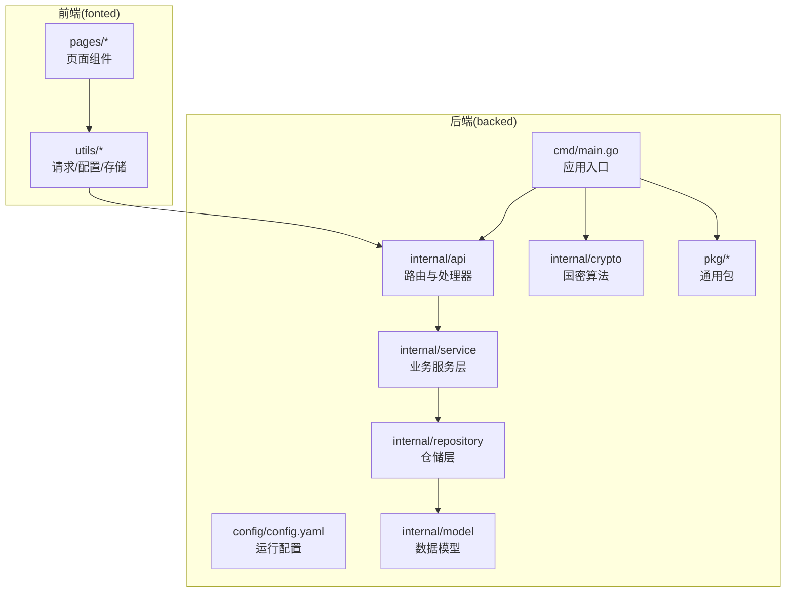
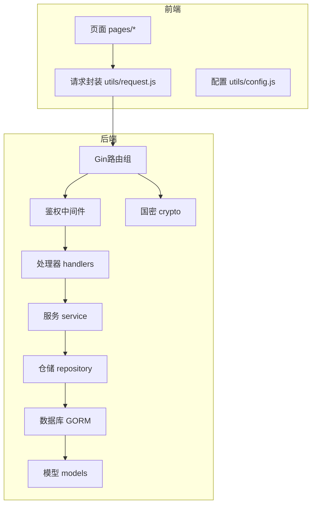
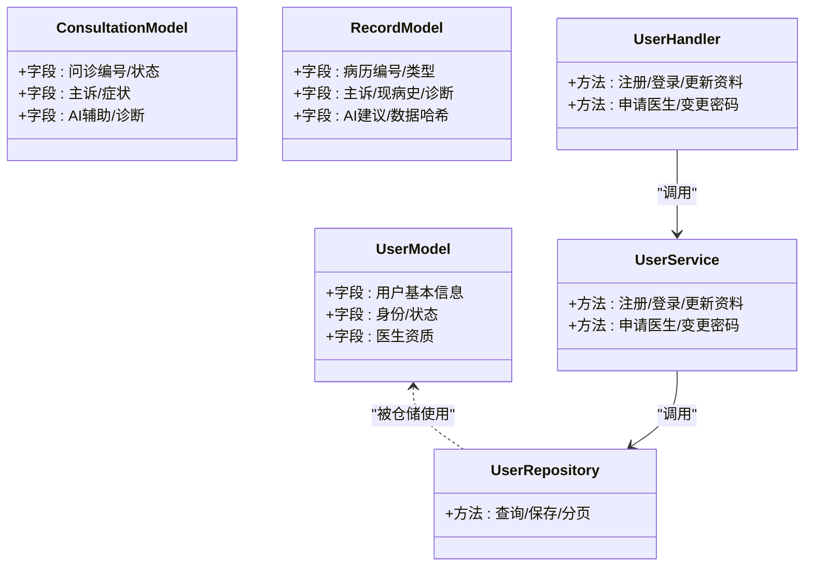
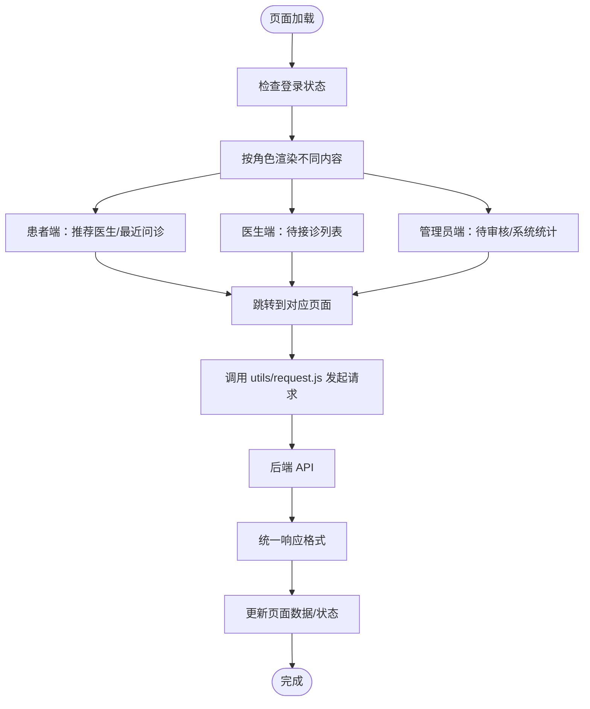
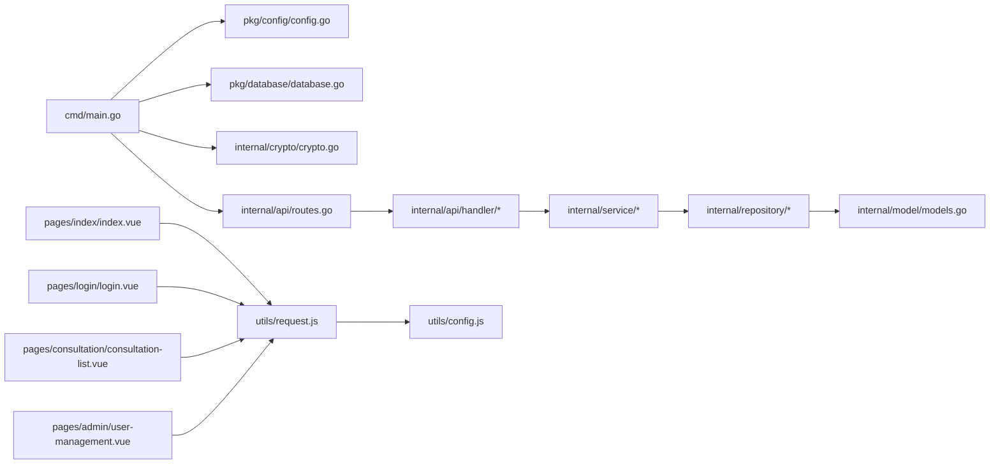

# 项目结构详解

<cite>
**本文引用的文件**
- [main.go](file://backed/cmd/main.go)
- [config.yaml](file://backed/config/config.yaml)
- [routes.go](file://backed/internal/api/routes.go)
- [models.go](file://backed/internal/model/models.go)
- [user_handler.go](file://backed/internal/api/handler/user_handler.go)
- [crypto.go](file://backed/internal/crypto/crypto.go)
- [config.go](file://backed/pkg/config/config.go)
- [database.go](file://backed/pkg/database/database.go)
- [index.vue](file://fonted/pages/index/index.vue)
- [login.vue](file://fonted/pages/login/login.vue)
- [consultation-list.vue](file://fonted/pages/consultation/consultation-list.vue)
- [user-management.vue](file://fonted/pages/admin/user-management.vue)
- [request.js](file://fonted/utils/request.js)
- [config.js](file://fonted/utils/config.js)
- [init.sql](file://backed/init.sql)
</cite>

## 目录
1. [引言](#引言)
2. [项目结构](#项目结构)
3. [核心组件](#核心组件)
4. [架构总览](#架构总览)
5. [详细组件分析](#详细组件分析)
6. [依赖关系分析](#依赖关系分析)
7. [性能与安全考量](#性能与安全考量)
8. [故障排查指南](#故障排查指南)
9. [结论](#结论)
10. [附录：新开发者导航指南](#附录新开发者导航指南)

## 引言
本文件面向新加入项目的开发者，系统性梳理“基于国密加密的网上看诊系统”的整体结构与组织方式，重点覆盖：
- 后端（backed）目录的职责划分与层次化设计
- 前端（fonted）页面组织与交互流程
- 配置文件、数据库脚本与其他辅助文件的作用与位置
- 为快速上手提供清晰的导航路径与最佳实践

## 项目结构
项目采用前后端分离架构，后端以 Go 语言实现，前端基于 uni-app（Vue 3）。后端采用 MVC 分层与模块化目录组织，前端按功能页面分层组织，辅以统一的请求封装与配置管理。

图表来源
- [main.go](file://backed/cmd/main.go#L1-L64)
- [routes.go](file://backed/internal/api/routes.go#L1-L95)
- [config.go](file://backed/pkg/config/config.go#L1-L78)
- [database.go](file://backed/pkg/database/database.go#L1-L48)
- [config.js](file://fonted/utils/config.js#L1-L65)

章节来源
- [main.go](file://backed/cmd/main.go#L1-L64)
- [config.yaml](file://backed/config/config.yaml#L1-L37)

## 核心组件
- 后端入口与初始化
  - 应用入口负责加载配置、初始化国密算法、建立数据库连接、设置静态文件服务、注册路由并启动服务。
- 配置体系
  - 运行配置（YAML）与结构化解析（Viper），集中管理服务端口、数据库、Redis、JWT、国密参数与上传策略。
- 数据模型与仓储
  - 模型定义涵盖用户、医生申请、问诊、病历、通知、登录日志等；仓储层封装数据库访问。
- 业务服务与路由
  - 服务层聚合领域逻辑；路由层按模块划分，结合鉴权中间件控制访问。
- 前端页面与请求
  - 页面按功能域组织；统一请求封装处理鉴权、错误与 Mock；配置集中管理 API 地址与本地存储键名。

章节来源
- [main.go](file://backed/cmd/main.go#L1-L64)
- [config.go](file://backed/pkg/config/config.go#L1-L78)
- [models.go](file://backed/internal/model/models.go#L1-L160)
- [routes.go](file://backed/internal/api/routes.go#L1-L95)
- [request.js](file://fonted/utils/request.js#L1-L222)
- [config.js](file://fonted/utils/config.js#L1-L65)

## 架构总览
后端采用“入口 → 中间件/路由 → 处理器 → 服务 → 仓储 → 模型”的典型 MVC 分层；前端通过统一请求封装与后端 API 对接，页面按角色与功能进行组织。

图表来源
- [routes.go](file://backed/internal/api/routes.go#L1-L95)
- [user_handler.go](file://backed/internal/api/handler/user_handler.go#L1-L200)
- [models.go](file://backed/internal/model/models.go#L1-L160)
- [crypto.go](file://backed/internal/crypto/crypto.go#L1-L121)
- [request.js](file://fonted/utils/request.js#L1-L222)
- [config.js](file://fonted/utils/config.js#L1-L65)

## 详细组件分析

### 后端目录结构与职责
- cmd
  - main.go：应用入口，负责加载配置、初始化国密、数据库连接、静态文件服务、注册路由与启动服务。
- config
  - config.yaml：运行期配置，包含 server、database、redis、jwt、crypto、upload 等关键参数。
- internal
  - api：路由与处理器
    - routes.go：按模块注册路由，公开接口与需要鉴权的接口分离，结合鉴权中间件。
    - handler：具体业务处理器，如用户、问诊、病历、通知、文件、密钥等。
  - crypto：国密算法封装，包括 SM2/SM3/SM4 的初始化与加解密工具。
  - model：数据模型定义，涵盖用户、医生申请、问诊、病历、通知、登录日志等。
  - repository：仓储层，封装数据库访问与事务。
  - service：业务服务层，组合仓储与模型，实现领域逻辑。
- pkg
  - config：结构化解析配置文件。
  - database：数据库连接初始化与连接池配置。
  - utils：响应与 JWT 工具。
- tools：辅助工具，如密码哈希工具。
- init.sql：数据库初始化脚本，包含用户、医生申请、登录日志、问诊、问诊消息、电子病历等核心表及索引。

章节来源
- [main.go](file://backed/cmd/main.go#L1-L64)
- [config.yaml](file://backed/config/config.yaml#L1-L37)
- [routes.go](file://backed/internal/api/routes.go#L1-L95)
- [user_handler.go](file://backed/internal/api/handler/user_handler.go#L1-L200)
- [crypto.go](file://backed/internal/crypto/crypto.go#L1-L121)
- [models.go](file://backed/internal/model/models.go#L1-L160)
- [config.go](file://backed/pkg/config/config.go#L1-L78)
- [database.go](file://backed/pkg/database/database.go#L1-L48)
- [init.sql](file://backed/init.sql#L1-L200)

### 后端 MVC 层级设计
- Model（模型）
  - 定义实体与字段约束，标注 GORM 映射与索引，体现业务实体与安全字段（如 SM4 加密字段）。
- Repository（仓储）
  - 封装数据库操作，提供查询、插入、更新、分页等能力，隔离底层细节。
- Service（服务）
  - 组合仓储与模型，实现业务规则与流程编排，如用户注册、登录、医生申请、问诊流程、通知与病历管理。
- Handler（处理器）
  - 接收请求、参数校验、调用服务、返回统一响应格式。
- Routes（路由）
  - 分模块注册接口，区分公开与鉴权接口，统一挂载鉴权中间件。

图表来源
- [models.go](file://backed/internal/model/models.go#L1-L160)
- [user_handler.go](file://backed/internal/api/handler/user_handler.go#L1-L200)

章节来源
- [models.go](file://backed/internal/model/models.go#L1-L160)
- [user_handler.go](file://backed/internal/api/handler/user_handler.go#L1-L200)

### 前端页面组织与交互
- pages 目录按功能域组织：
  - index：首页，按角色展示快捷入口、推荐医生、最近问诊、待接诊、待审核与系统统计。
  - login：登录页，集成验证码生成与国密密码加密。
  - consultation：问诊模块，包含列表、详情、创建问诊等页面。
  - admin：管理员模块，包含数据统计、医生审核、用户管理、登录日志、系统设置等。
  - user：用户模块，包含资料编辑、密码修改、医生资料、申请医生等。
  - 其他：如医生详情、病历列表/详情、通知、测试页面等。
- utils：
  - config.js：集中管理 API 基础地址与各模块接口路径，以及本地存储键名。
  - request.js：统一请求封装，支持 Mock、鉴权头注入、错误处理与上传封装。
  - crypto.js、storage.js、mock.js：加密、存储与 Mock 辅助。

图表来源
- [index.vue](file://fonted/pages/index/index.vue#L1-L200)
- [login.vue](file://fonted/pages/login/login.vue#L1-L200)
- [consultation-list.vue](file://fonted/pages/consultation/consultation-list.vue#L1-L200)
- [user-management.vue](file://fonted/pages/admin/user-management.vue#L1-L200)
- [request.js](file://fonted/utils/request.js#L1-L222)
- [config.js](file://fonted/utils/config.js#L1-L65)

章节来源
- [index.vue](file://fonted/pages/index/index.vue#L1-L200)
- [login.vue](file://fonted/pages/login/login.vue#L1-L200)
- [consultation-list.vue](file://fonted/pages/consultation/consultation-list.vue#L1-L200)
- [user-management.vue](file://fonted/pages/admin/user-management.vue#L1-L200)
- [request.js](file://fonted/utils/request.js#L1-L222)
- [config.js](file://fonted/utils/config.js#L1-L65)

### 配置文件、数据库脚本与辅助文件
- 配置文件
  - backed/config/config.yaml：运行配置，包含 server、database、redis、jwt、crypto、upload 等。
  - backed/pkg/config/config.go：结构化解析 YAML，提供全局配置对象。
- 数据库脚本
  - backed/init.sql：初始化数据库与核心业务表，包含用户、医生申请、登录日志、问诊、问诊消息、电子病历等，明确加密字段与索引。
- 辅助文件
  - backed/tools/hash_password.go：密码哈希工具（示例用途）。
  - backed/pkg/utils/jwt.go、response.go：JWT 与统一响应工具。
  - backed/pkg/database/database.go：数据库连接与连接池配置。
  - backed/internal/crypto/crypto.go：国密算法封装（SM2/SM3/SM4）。

章节来源
- [config.yaml](file://backed/config/config.yaml#L1-L37)
- [config.go](file://backed/pkg/config/config.go#L1-L78)
- [init.sql](file://backed/init.sql#L1-L200)
- [database.go](file://backed/pkg/database/database.go#L1-L48)
- [crypto.go](file://backed/internal/crypto/crypto.go#L1-L121)

## 依赖关系分析
- 后端
  - cmd/main.go 依赖 pkg/config、pkg/database、internal/crypto、internal/api。
  - internal/api/routes.go 依赖 handler 与 middleware，按模块注册路由。
  - internal/service 依赖 repository，repository 依赖 model 与数据库。
- 前端
  - 各页面依赖 utils/request.js 与 utils/config.js。
  - request.js 依赖 utils/config.js、utils/storage.js、utils/mock.js。

图表来源
- [main.go](file://backed/cmd/main.go#L1-L64)
- [routes.go](file://backed/internal/api/routes.go#L1-L95)
- [models.go](file://backed/internal/model/models.go#L1-L160)
- [index.vue](file://fonted/pages/index/index.vue#L1-L200)
- [login.vue](file://fonted/pages/login/login.vue#L1-L200)
- [consultation-list.vue](file://fonted/pages/consultation/consultation-list.vue#L1-L200)
- [user-management.vue](file://fonted/pages/admin/user-management.vue#L1-L200)
- [request.js](file://fonted/utils/request.js#L1-L222)
- [config.js](file://fonted/utils/config.js#L1-L65)

章节来源
- [main.go](file://backed/cmd/main.go#L1-L64)
- [routes.go](file://backed/internal/api/routes.go#L1-L95)
- [models.go](file://backed/internal/model/models.go#L1-L160)
- [request.js](file://fonted/utils/request.js#L1-L222)
- [config.js](file://fonted/utils/config.js#L1-L65)

## 性能与安全考量
- 性能
  - 数据库连接池：通过 pkg/database 配置最大空闲/打开连接数与生命周期。
  - 请求并发：前端统一请求封装，避免重复请求与过度重试。
  - 文件上传：限制上传大小与类型，后端静态服务提供上传文件访问。
- 安全
  - 国密算法：后端初始化 SM2/SM3/SM4，敏感字段（如用户邮箱、电话、实名、身份证、登录 IP 等）采用 SM4 加密；密码采用 SM3 哈希。
  - 鉴权：路由层统一鉴权中间件，前端请求自动附加 Authorization 头。
  - 配置安全：生产环境应替换默认密钥与密码，避免硬编码。

章节来源
- [database.go](file://backed/pkg/database/database.go#L1-L48)
- [config.yaml](file://backed/config/config.yaml#L1-L37)
- [crypto.go](file://backed/internal/crypto/crypto.go#L1-L121)
- [request.js](file://fonted/utils/request.js#L1-L222)

## 故障排查指南
- 启动失败
  - 检查配置文件路径与权限，确认 config.yaml 存在且可读。
  - 确认数据库连接参数正确，数据库服务可用。
- 登录异常
  - 前端：确认 utils/config.js 中 API_BASE_URL 正确指向后端地址。
  - 后端：查看日志输出，确认鉴权中间件与处理器返回的错误信息。
- 文件上传失败
  - 检查 upload 配置与上传目录权限，确认静态服务映射正确。
- 数据库初始化
  - 使用 backed/init.sql 初始化数据库与表结构，确保字段与索引符合模型定义。

章节来源
- [config.yaml](file://backed/config/config.yaml#L1-L37)
- [config.go](file://backed/pkg/config/config.go#L1-L78)
- [database.go](file://backed/pkg/database/database.go#L1-L48)
- [init.sql](file://backed/init.sql#L1-L200)
- [request.js](file://fonted/utils/request.js#L1-L222)

## 结论
本项目通过清晰的目录划分与 MVC 分层，实现了后端的可维护性与扩展性；前端以页面域组织与统一请求封装，提升了开发效率与一致性。配合国密算法与完善的配置体系，项目在安全性与工程化方面具备良好基础。建议后续补充单元测试、接口文档与部署脚本，进一步完善质量与交付流程。

## 附录：新开发者导航指南
- 后端
  - 入口与配置：cmd/main.go、config/config.yaml、pkg/config/config.go
  - 路由与处理器：internal/api/routes.go、internal/api/handler/*
  - 业务与仓储：internal/service/*、internal/repository/*
  - 数据模型：internal/model/models.go
  - 数据库：pkg/database/database.go、init.sql
  - 国密：internal/crypto/crypto.go
- 前端
  - 页面：pages/*（index、login、consultation、admin、user 等）
  - 请求与配置：utils/request.js、utils/config.js
  - 存储与加密：utils/storage.js、utils/crypto.js、utils/mock.js

章节来源
- [main.go](file://backed/cmd/main.go#L1-L64)
- [config.yaml](file://backed/config/config.yaml#L1-L37)
- [routes.go](file://backed/internal/api/routes.go#L1-L95)
- [models.go](file://backed/internal/model/models.go#L1-L160)
- [index.vue](file://fonted/pages/index/index.vue#L1-L200)
- [login.vue](file://fonted/pages/login/login.vue#L1-L200)
- [consultation-list.vue](file://fonted/pages/consultation/consultation-list.vue#L1-L200)
- [user-management.vue](file://fonted/pages/admin/user-management.vue#L1-L200)
- [request.js](file://fonted/utils/request.js#L1-L222)
- [config.js](file://fonted/utils/config.js#L1-L65)