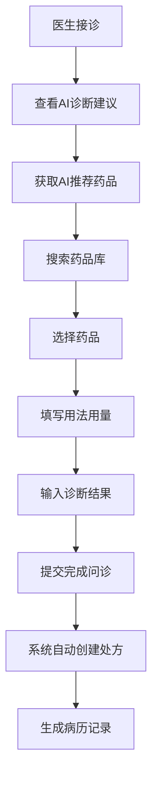
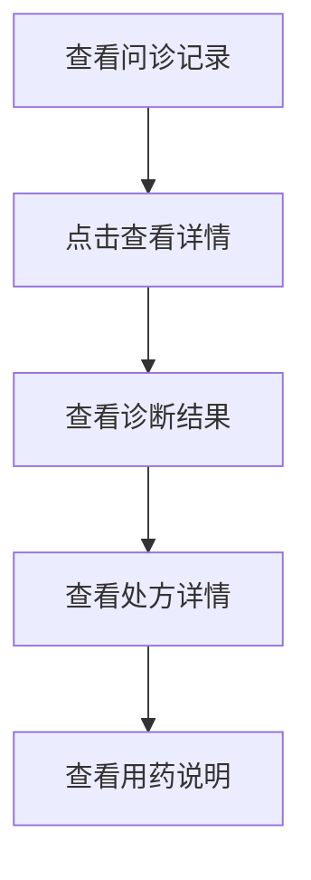

# 处方功能API文档

## 基础信息

**Base URL**: `http://localhost:3000/api`  
**认证方式**: Bearer Token  
**Content-Type**: `application/json`

---

## 1. 药品管理

### 1.1 搜索药品

**接口**: `GET /prescription/medicines/search`

**权限**: 需要登录(医生/患者均可)

**请求参数**:
| 参数 | 类型 | 必填 | 说明 |
|------|------|------|------|
| keyword | string | 否 | 搜索关键词(药品名/通用名/编码) |
| category | string | 否 | 药品分类 |
| page | int | 否 | 页码,默认1 |
| pageSize | int | 否 | 每页数量,默认20 |

**药品分类枚举**:
- 抗生素
- 降压药
- 降糖药
- 感冒药
- 止咳化痰
- 消化系统
- 维生素

**请求示例**:
```bash
GET /api/prescription/medicines/search?keyword=阿莫西林&page=1&pageSize=10
Authorization: Bearer YOUR_TOKEN
```

**成功响应**:
```json
{
  "code": 200,
  "message": "success",
  "data": {
    "list": [
      {
        "medicineId": 1,
        "medicineCode": "M001",
        "medicineName": "阿莫西林胶囊",
        "commonName": "阿莫西林",
        "medicineType": "西药",
        "category": "抗生素",
        "specification": "0.25g*24粒",
        "dosageForm": "胶囊",
        "manufacturer": "华北制药",
        "price": 12.50,
        "unit": "盒",
        "indications": "适用于敏感菌所致的呼吸道感染、泌尿道感染等",
        "usageDosage": "口服，成人一次0.5g，每6-8小时1次",
        "prescriptionType": 1,
        "isOtc": false,
        "stockQuantity": 100
      }
    ],
    "total": 1,
    "page": 1,
    "pageSize": 10
  }
}
```

---

### 1.2 获取AI推荐药品

**接口**: `POST /prescription/medicines/recommend`

**权限**: 需要登录(医生)

**请求体**:
```json
{
  "aiDiagnosis": "患者主诉头痛、发热,体温38.5°C,咽部充血,初步诊断为上呼吸道感染"
}
```

**请求示例**:
```bash
POST /api/prescription/medicines/recommend
Authorization: Bearer DOCTOR_TOKEN
Content-Type: application/json

{
  "aiDiagnosis": "患者主诉头痛、发热,体温38.5°C"
}
```

**成功响应**:
```json
{
  "code": 200,
  "message": "success",
  "data": [
    {
      "medicineId": 10,
      "medicineName": "复方氨酚烷胺片",
      "specification": "12片",
      "price": 8.50,
      "unit": "盒",
      "category": "感冒药",
      "indications": "适用于缓解感冒引起的发热、头痛等症状",
      "usageDosage": "口服，成人一次1片，每日2次"
    },
    {
      "medicineId": 11,
      "medicineName": "板蓝根颗粒",
      "specification": "10g*20袋",
      "price": 15.00,
      "unit": "盒",
      "category": "感冒药",
      "indications": "清热解毒，用于感冒发热、咽喉肿痛",
      "usageDosage": "开水冲服，一次5-10g，每日3-4次"
    }
  ]
}
```

---

## 2. 处方开具

### 2.1 完成问诊并开具处方

**接口**: `POST /consultation/finish`

**权限**: 需要登录(医生)

**请求体**:
```json
{
  "consultationId": 123,
  "diagnosis": "上呼吸道感染",
  "prescription": [
    {
      "medicineId": 1,
      "quantity": 2,
      "usage": "口服",
      "frequency": "每日3次",
      "dosage": "每次2粒",
      "duration": "7天",
      "notes": "饭后服用,多饮水",
      "unitPrice": 12.50
    },
    {
      "medicineId": 10,
      "quantity": 1,
      "usage": "口服",
      "frequency": "每日2次",
      "dosage": "每次1片",
      "duration": "5天",
      "notes": "",
      "unitPrice": 8.50
    }
  ]
}
```

**参数说明**:

**主体参数**:
| 参数 | 类型 | 必填 | 说明 |
|------|------|------|------|
| consultationId | int64 | 是 | 问诊ID |
| diagnosis | string | 是 | 诊断结果 |
| prescription | array/string | 否 | 处方信息 |

**prescription数组元素**:
| 参数 | 类型 | 必填 | 说明 |
|------|------|------|------|
| medicineId | int64 | 是 | 药品ID |
| quantity | int | 是 | 数量 |
| usage | string | 是 | 用法(口服/外用/注射等) |
| frequency | string | 是 | 频次(每日3次/每日2次等) |
| dosage | string | 是 | 单次剂量(1片/2粒等) |
| duration | string | 是 | 疗程(7天/14天等) |
| notes | string | 否 | 特殊说明 |
| unitPrice | float64 | 是 | 单价 |

**请求示例**:
```bash
POST /api/consultation/finish
Authorization: Bearer DOCTOR_TOKEN
Content-Type: application/json

{
  "consultationId": 1,
  "diagnosis": "上呼吸道感染",
  "prescription": [
    {
      "medicineId": 1,
      "quantity": 2,
      "usage": "口服",
      "frequency": "每日3次",
      "dosage": "每次2粒",
      "duration": "7天",
      "unitPrice": 12.50
    }
  ]
}
```

**成功响应**:
```json
{
  "code": 200,
  "message": "问诊已完成",
  "data": null
}
```

**兼容旧版本**:

如果传入prescription为字符串,则按旧版本处理:
```json
{
  "consultationId": 123,
  "diagnosis": "上呼吸道感染",
  "prescription": "阿莫西林胶囊 0.25g*24粒 2盒\n用法: 口服\n用量: 每次2粒,每日3次\n疗程: 7天"
}
```

---

## 3. 处方查询

### 3.1 获取处方详情

**接口**: `GET /prescription/:prescriptionId`

**权限**: 需要登录(患者查看自己的/医生查看开具的)

**路径参数**:
| 参数 | 类型 | 必填 | 说明 |
|------|------|------|------|
| prescriptionId | int64 | 是 | 处方ID |

**请求示例**:
```bash
GET /api/prescription/1
Authorization: Bearer YOUR_TOKEN
```

**成功响应**:
```json
{
  "code": 200,
  "message": "success",
  "data": {
    "prescriptionId": 1,
    "prescriptionNo": "RX1734412345",
    "consultationId": 123,
    "diagnosis": "上呼吸道感染",
    "prescriptionType": 1,
    "totalAmount": 33.50,
    "status": 1,
    "details": [
      {
        "medicineName": "阿莫西林胶囊",
        "specification": "0.25g*24粒",
        "quantity": 2,
        "unit": "盒",
        "unitPrice": 12.50,
        "totalPrice": 25.00,
        "usage": "口服",
        "frequency": "每日3次",
        "dosage": "每次2粒",
        "duration": "7天",
        "notes": "饭后服用,多饮水"
      },
      {
        "medicineName": "复方氨酚烷胺片",
        "specification": "12片",
        "quantity": 1,
        "unit": "盒",
        "unitPrice": 8.50,
        "totalPrice": 8.50,
        "usage": "口服",
        "frequency": "每日2次",
        "dosage": "每次1片",
        "duration": "5天",
        "notes": ""
      }
    ],
    "createdAt": "2025-12-17 14:30:45"
  }
}
```

---

## 错误码说明

| 错误码 | 说明 |
|--------|------|
| 200 | 成功 |
| 400 | 请求参数错误 |
| 401 | 未登录或token无效 |
| 403 | 无权限访问 |
| 404 | 资源不存在 |
| 500 | 服务器内部错误 |

**错误响应示例**:
```json
{
  "code": 400,
  "message": "处方药品不能为空",
  "data": null
}
```

---

## 业务流程

### 医生开具处方流程



### 患者查看处方流程



---

## 附录

### 处方状态枚举
| 值 | 说明 |
|----|------|
| 0 | 待审核 |
| 1 | 已审核 |
| 2 | 已配药 |
| 3 | 已取药 |
| 4 | 已作废 |

### 处方类型枚举
| 值 | 说明 |
|----|------|
| 1 | 普通处方 |
| 2 | 急诊处方 |
| 3 | 儿科处方 |
| 4 | 麻精处方 |

---

**文档版本**: v1.0  
**更新时间**: 2025-12-17
