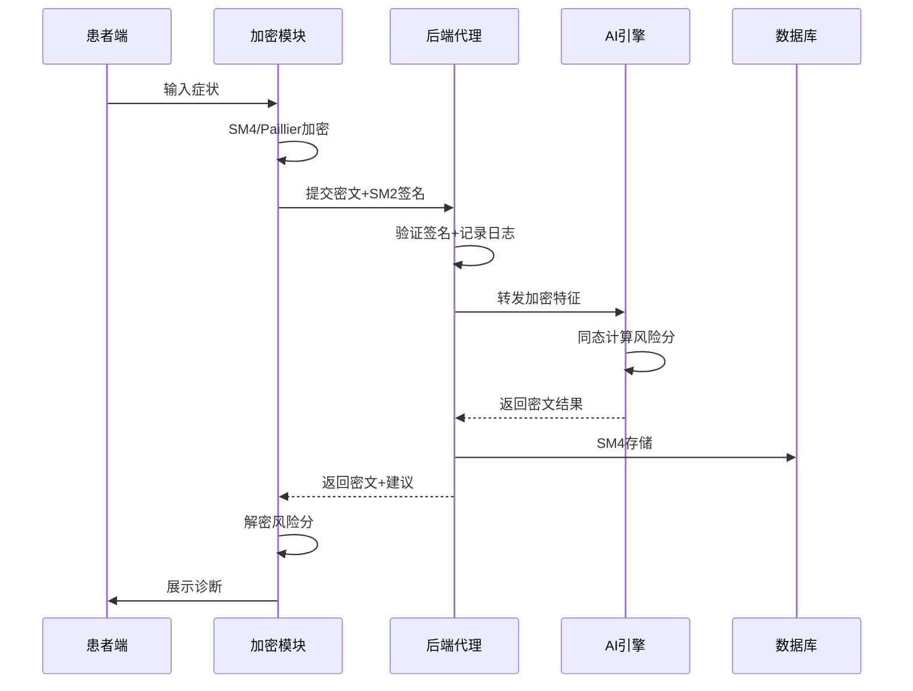
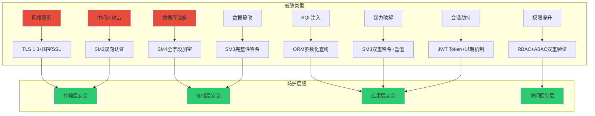
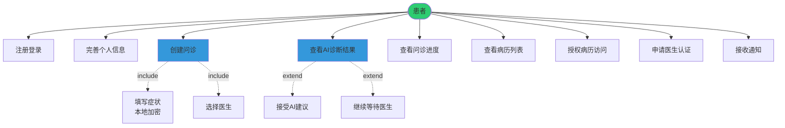
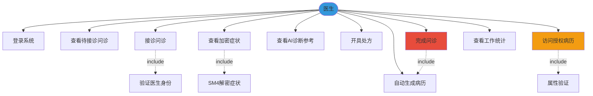
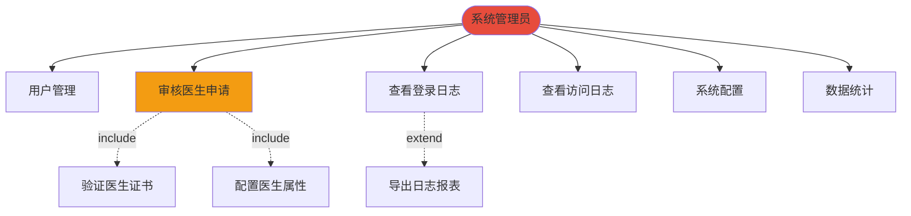
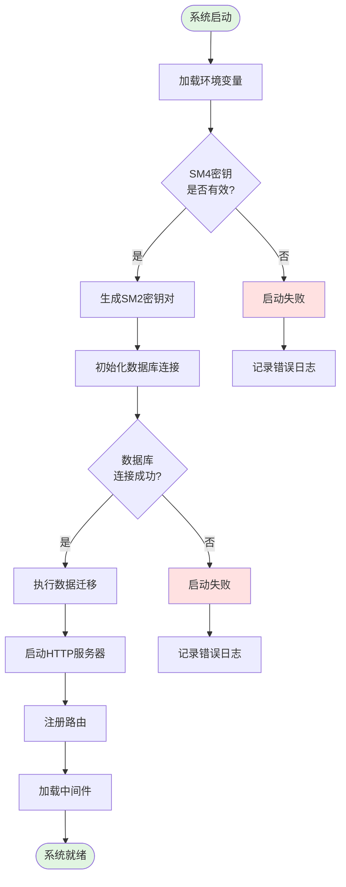

# 第三章 系统需求分析

## 3.1 功能性需求分析

### 3.1.1 用户角色分析

系统实现基于RBAC的三级角色模型：患者、医生和管理员。

**表3-1 用户角色权限矩阵**

| 角色 | 权限标识 | 主要职责 | 核心功能 | 访问范围 |
|------|---------|---------|----------|----------|
| 患者 | patient | 就医咨询 | 创建问诊、查看病历、AI诊断 | 个人数据 |
| 医生 | doctor | 诊疗服务 | 接诊问诊、开具处方、病历管理 | 接诊数据+授权病历 |
| 管理员 | admin | 系统运维 | 用户管理、医生审核、日志审计 | 全局数据（脱敏） |

医生角色按科室（心内科、神经内科等）和职称（住院医师、主治医师、副主任医师、主任医师）细分，用于实现细粒度访问控制。权限层级遵循管理员>医生>患者的继承关系。

---

### 3.1.2 隐私保护AI诊断流程需求

系统采用Paillier同态加密实现隐私保护下AI诊断，症状数据全程加密，AI模型无需明文即可完成风险评分。

**技术要点**：

1. **端到端加密**：症状在设备端加密，服务端不接触明文
2. **同态计算**：AI在密文上执行线性运算，利用Paillier加法同态性和标量乘法性质
3. **完整性验证**：SM3哈希记录操作，防篡改

---

### 3.1.3 国密安全支撑需求

系统采用国家商用密码算法，符合《网络安全法》和《数据安全法》对医疗行业的合规要求。

**表3-2 国密算法应用场景**

| 算法 | 类型 | 关键应用 |
|------|------|----------|
| SM2 | 非对称加密(256位) | 登录签名、密钥交换 |
| SM3 | 哈希算法(256位) | 密码存储、完整性验证 |
| SM4 | 对称加密(128位) | 病历加密、数据存储 |
| SM9 | 属性加密(256位) | 细粒度访问控制(扩展) |

**SM2登录认证流程**：客户端输入密码后，先用SM3计算哈希值，再使用SM2私钥签名发送至服务器。服务器验证SM2签名、检查时间戳防重放政击、比对SM3双重哈希密码，通过后生成JWT Token返回。

**SM4病历加密机制**：病历的主诉、诊断、处方等敏感字段使用SM4-ECB模式加密后以十六进制存储。访问时验证权限后解密展示，确保数据库泄露时攻击者无法获取明文。

**SM3完整性验证**：病历创建时将关键字段拼接后计算SM3哈希值存储。访问时重新计算并比对，若不一致则拒绝访问并告警。SM3具有单向性和抗碰撞性，有效防止数据篡改。

---

### 3.1.4 细粒度访问控制需求

系统采用**RBAC+ABAC混合模型**实现病历等敏感资源的细粒度权限管理。

**表3-3 病历访问权限规则**

| 访问者 | 属性要求 | 访问条件 | 权限级别 |
|---------|---------|---------|----------|
| 患者本人 | user_id=record.patient_id | 无条件 | 读/写/授权 |
| 接诊医生 | user_id=record.doctor_id | 已接诊 | 读/写 |
| 同科室医生 | dept匹配 + 职称≥主治 | 患者授权 | 只读 |
| 其他科室医生 | 职称=主任 + 会诊邀请 | 患者授权 | 只读 |
| 管理员 | role=admin | 审计需要 | 只读(脱敏) |

**SM9属性加密扩展**：病历创建时定义属性策略（如"科室=心内科 AND 职称≥主治医师"），使用SM9加密。医生用属性密钥解密，仅当属性匹配时成功。访问控制在密码学层强制执行，医生离职时撤销属性密钥即可动态管理。

---

### 3.1.5 系统管理需求

系统管理模块提供用户管理、角色权限配置、操作日志审计等功能。

| 功能模块 | 主要功能 | 安全措施 |
|---------|---------|---------|
| 用户管理 | 账号启用/禁用、信息修改 | 敏感信息脱敏 |
| 角色管理 | 医生认证审核、权限分配 | 审核流程记录 |
| 操作日志 | 登录/访问日志、审计追踪 | IP加密、SM3验证 |
| 系统配置 | 密钥轮换、备份恢复 | 二次验证 |

**医生审核流程**：用户提交申请→管理员审查资料→验证证书有效性→配置医生属性（科室、职称）→更新用户角色为doctor→发送通知。拒绝时填写拒绝原因并通知申请人。

**日志记录**：日志包含用户ID、操作类型、资源ID、IP地址（SM4加密）、操作结果、时间戳、日志哈希值（SM3）。系统采用登录事件→SM4加密敏感信息→SM3生成哈希→存储的流程，管理员查询时解密展示。

---

## 3.2 非功能性需求

### 3.2.1 安全性需求

系统安全性需求遵循CIA三元组模型（机密性、完整性、可用性）并扩展至抗抵赖性。

**表3-4 安全性需求指标**

| 安全属性 | 具体要求 | 实现技术 | 验证方法 |
|---------|---------|---------|---------|
| **机密性** (Confidentiality) | • 敏感数据加密存储（100%） • 传输层加密（TLS 1.3+国密SSL） • 密钥安全管理（定期轮换） | SM2/SM4/SM9加密 JWT Token认证 密钥管理系统（KMS） | 渗透测试 密文分析 密钥强度测试 |
| **完整性** (Integrity) | • 数据防篡改（SM3哈希验证） • 防重放攻击（时间戳+nonce） • 数据库完整性约束 | SM3哈希算法 SM2数字签名 外键约束+索引 | 哈希碰撞测试 篡改检测率>99.9% |
| **可用性** (Availability) | • 系统可用率≥99.5% • 故障恢复时间<10分钟 • 数据备份（每日） | 负载均衡 故障转移机制 自动备份脚本 | 压力测试 故障模拟 恢复演练 |
| **抗抵赖性** (Non-repudiation) | • 操作审计日志（全覆盖） • SM2数字签名（不可否认） • 区块链存证（可选） | SM2签名验证 操作日志+SM3哈希 分布式账本 | 日志完整性检查 签名验证率100% |

**安全威胁模型与防护措施：**

---

### 3.2.2 性能需求

**表3-5 系统性能指标**

| 性能指标 | 目标值 | 优化措施 |
|---------|--------|---------|
| **响应时间** | <2s | 数据库索引优化、Redis缓存 |
| **并发用户** | >50 | Gin框架、Goroutine并发 |
| **加密性能** | SM4<100ms、SM3<50ms | 密钥缓存、批处理加密 |
| **数据库查询** | <300ms | 索引优化、分页查询 |
| **文件上传** | <5s | 分片上传、CDN加速 |

---

### 3.2.3 可用性需求

| 可用性指标 | 要求 | 实现方式 |
|-----------|------|---------|
| **界面友好性** | 符合医疗行业UI规范 操作路径≤3步 | uni-app跨平台适配 直观的导航设计 |
| **易学性** | 新用户10分钟内上手 | 引导页+帮助文档 操作提示 |
| **容错性** | 关键操作二次确认 错误提示清晰 | 表单验证 友好的错误提示 |
| **可访问性** | 支持移动端/PC端 兼容主流浏览器 | 响应式设计 跨浏览器测试 |

---

## 3.3 系统用例分析

### 3.3.1 用例图

**患者用例图：**

**医生用例图：**

**管理员用例图：**

---

### 3.3.2 详细用例文档

#### **用例1：患者提交隐私保护诊断**

**表3-6 用例1详细描述**

| 项目 | 内容 |
|------|------|
| **用例名称** | 患者提交隐私保护AI诊断 |
| **用例ID** | UC-003 |
| **参与者** | 患者(主要)、AI诊断引擎、后端服务 |
| **前置条件** | 患者已登录、系统SM2/SM4/Paillier密钥已初始化 |
| **后置条件** | 症状加密存储、生成AI诊断报告、创建问诊记录 |
| **主要流程** | 1. 患者填写症状信息(主诉、体征数据) 2. 前端加密:SM4加密主诉、Paillier加密特征向量、SM2签名 3. 提交加密数据到后端 4. AI引擎在密文上同态计算风险分数 5. 生成诊断建议和推荐科室 6. 患者端解密风险分数并展示诊断结果 |
| **异常流程** | E1. 加密失败:重新加载公钥 E2. 签名验证失败:要求重新登录 E3. AI服务不可用:降级到规则引擎 |
| **质量需求** | 响应时间<3s、加密成功率100%、诊断准确率>85% |

---

#### **用例2:医生访问加密病历**

**表3-7 用例2详细描述**

| 项目 | 内容 |
|------|------|
| **用例名称** | 医生访问加密病历(基于属性控制) |
| **用例ID** | UC-018 |
| **参与者** | 医生(主要)、访问控制引擎、审计日志 |
| **前置条件** | 医生已登录且身份为doctor、病历已创建并设置访问策略 |
| **后置条件** | 病历访问日志已记录、医生获得病历内容(或被拒绝) |
| **主要流程** | 1. 医生请求访问病历,携带JWT Token 2. 后端验证身份和角色 3. 查询病历元数据和访问策略 4. 权限判断:接诊医生直接授权,其他医生需属性匹配+患者授权 5. SM4解密病历(主诉、诊断、治疗方案) 6. SM3完整性验证:对比哈希值防篡改 7. 记录访问日志(加密IP地址、生成日志哈希) 8. 返回解密后的病历数据 |
| **异常流程** | E1. 属性不匹配:返回403错误 E2. 完整性验证失败:冻结病历并告警 E3. 患者撤销授权:实时检查后拒绝访问 |
| **质量需求** | 权限检查时间<200ms、访问日志记录率100%、完整性验证准确率100% |

---

#### **用例3:管理员审核医生申请**

**表3-8 用例3详细描述**

| 项目 | 内容 |
|------|------|
| **用例名称** | 管理员审核医生角色申请 |
| **用例ID** | UC-021 |
| **参与者** | 系统管理员(主要)、申请用户、通知服务 |
| **前置条件** | 管理员已登录且角色为admin、存在待审核的医生申请 |
| **后置条件** | 申请状态更新、通过后用户角色变更为doctor、发送审核结果通知 |
| **主要流程** | 1. 查看待审核列表(按提交时间倒序) 2. 查看申请详情(基本信息、资质信息、证书图片) 3. 审核决策: &nbsp;&nbsp;&nbsp;- 通过:更新角色为doctor、同步医生属性、生成属性密钥 &nbsp;&nbsp;&nbsp;- 拒绝:填写拒绝原因并记录 4. 记录审核操作日志并生成操作哈希 5. 发送系统通知给申请人(审核结果+下一步指引) |
| **异常流程** | E1. 证书图片无法打开:联系申请人补充 E2. 身份证号重复:提示重复申请 |
| **质量需求** | 审核响应时间<1s、通知送达率>95%、审核记录完整性100% |

---

## 3.4 需求优先级划分

**表3-12 需求优先级分级**

| 优先级 | 需求类别 | 具体需求 | 开发周期 |
|--------|---------|---------|---------|
| **P0 (核心)** | 基础功能 | 用户注册登录、角色权限管理、国密加密存储 | 第1-2周 |
| **P1 (重要)** | 核心业务 | 问诊创建与管理、AI诊断、病历生成与查询 | 第3-5周 |
| **P2 (一般)** | 增强功能 | 医生认证审核、通知系统、操作日志 | 第6-7周 |
| **P3 (优化)** | 体验优化 | 病历导出PDF、数据可视化、访问控制细化 | 第8-9周 |
| **P4 (扩展)** | 高级特性 | SM9属性加密扩展、多因子认证、实时监控 | 后续版本 |

### 3.4.1 核心需求优先级（P0）

核心需求为系统的基础功能模块，是系统能够正常运行的前提条件，必须在项目初期完成开发和测试。

#### **国密加密基础设施**
- **SM4密钥初始化**：系统启动时从环境变量读取128位对称密钥
- **SM2密钥对生成**：为每个用户生成独立的公私钥对
- **SM3哈希函数**：提供数据完整性验证能力

#### **用户认证与授权**
- **JWT Token机制**：生成包含用户ID、用户名、角色的令牌
- **RBAC权限模型**：实现患者、医生、管理员三种角色
- **会话管理**：Token有效期24小时，支持刷新

#### **数据加密存储**
- **敏感数据加密**：密码使用SM3双重哈希，个人信息使用SM4加密
- **数据库连接安全**：启用TLS加密传输

**流程图：核心功能初始化流程**

---

### 3.4.2 重要需求优先级（P1）

重要需求为系统的核心业务功能，是系统的主要价值体现，应在基础功能完成后立即开发。

#### **问诊业务闭环**
1. **患者提交问诊**
   - 症状描述表单验证
   - 生成唯一问诊ID
   - 状态设置为"待接诊"（0）

2. **医生接诊流程**
   - 查询待接诊列表
   - 验证医生资质
   - 更新状态为"问诊中"（1）

3. **完成问诊**
   - 填写诊断结论和处方
   - SM4加密存储
   - 更新状态为"已完成"（2）

#### **AI智能诊断**
1. **症状特征提取**
   - 解析血压、心率、体温、血糖等生命体征
   - 提取症状关键词（头痛、发热等）

2. **风险评分计算**
   - 基于规则的评分算法
   - 综合多维度健康指标

3. **诊断建议生成**
   - 可能疾病推断
   - 推荐就诊科室
   - 生活指导建议

#### **电子病历管理**
1. **病历自动生成**
   - 关联问诊数据
   - 提取患者信息和症状
   - 整合AI诊断和医生诊断

2. **病历加密存储**
   - SM4加密病历内容
   - SM3生成数据完整性哈希

3. **病历查询**
   - 患者查看自己的病历
   - 医生查看授权的病历
   - 解密展示病历内容

**优先级划分依据**：
- **用户价值**：P1需求直接决定系统能否完成核心业务闭环
- **技术依赖**：P1需求依赖于P0的基础设施
- **商业价值**：问诊和AI诊断是系统的主要卖点

---

### 3.4.3 一般需求优先级（P2）

一般需求为系统的增强功能，提升用户体验和系统可管理性，可在核心功能稳定后逐步实现。

#### **医生认证审核**
- 医生注册后需管理员审核
- 验证医生资格证、职称、科室
- 审核通过后激活账号

#### **系统通知**
- 问诊状态变更通知（待接诊→问诊中→已完成）
- 医生审核结果通知
- 系统公告推送

#### **操作日志**
- 记录关键操作（登录、问诊、病历访问）
- 日志包含：操作人、操作时间、IP地址、操作内容
- 支持日志查询和审计

---

### 3.4.4 优化需求优先级（P3）

优化需求用于改善用户体验和系统性能，非必需但能显著提升产品竞争力。

#### **病历导出PDF**
- 生成标准格式的电子病历PDF
- 包含诊断报告、处方单、用药指导
- 支持打印和电子存档

#### **数据可视化**
- 健康数据趋势图（血压、血糖变化曲线）
- 问诊统计图表（管理员视角）
- AI诊断准确率分析

#### **访问控制细化**
- 患者授权指定医生访问病历
- 设置授权有效期
- 支持随时撤销授权

---

### 3.4.5 扩展需求优先级（P4）

扩展需求为系统的高级特性，属于研究性和前瞻性功能，可作为后续版本的升级方向。

#### **SM9属性基加密扩展**
- 实现基于属性的访问控制（ABAC）
- 加密策略示例：`科室=心内科 AND 职称≥主治医师`
- 仅满足属性策略的医生能解密病历

#### **多因子认证（MFA）**
- 支持短信验证码二次验证
- 支持TOTP动态口令（如Google Authenticator）
- 高敏感操作强制MFA

#### **实时监控与告警**
- 系统性能监控（响应时间、并发数、错误率）
- 安全事件告警（异常登录、批量访问病历）
- 加密密钥使用情况监控

**技术可行性分析**：
- SM9属性加密：需要引入国密SM9算法实现库，该技术已在国内密码学领域得到广泛应用
- MFA多因子认证：需要集成短信服务商接口或基于时间的一次性密码（TOTP）标准协议实现动态口令功能
- 监控告警：可采用主流的开源监控技术栈实现系统性能监控和可视化报表功能

---

## 3.5 本章小结

本章从功能性需求和非功能性需求两个维度对系统进行了全面的需求分析。

**功能性需求方面**：

1. **用户角色分析**明确了患者、医生、管理员三种角色的权限边界，构建了清晰的权限矩阵，为后续的访问控制设计奠定了基础。

2. **隐私保护AI诊断流程**设计了"客户端加密→同态计算→本地解密"的完整闭环，确保AI诊断过程中患者隐私数据始终处于加密状态，实现了"数据可用不可见"的隐私保护目标。采用Paillier同态加密算法支持在密文上进行风险评分计算，有效平衡了AI诊断的准确性和隐私保护需求。

3. **国密安全支撑需求**将SM2、SM3、SM4三种国密算法有机融入系统的认证、加密、完整性验证等关键环节。SM2用于登录签名和密钥交换，SM4用于病历等敏感数据的加密存储，SM3用于密码哈希和数据完整性校验，形成了完整的国密安全防护体系。

4. **细粒度访问控制需求**设计了RBAC与ABAC相结合的混合访问控制模型。基础角色权限通过RBAC实现，医生的科室、职称等属性控制通过ABAC扩展，并预留了SM9属性基加密的扩展方案，可在密码学层面实现"策略即密钥"的细粒度访问控制。

5. **系统管理需求**覆盖了用户管理、角色权限管理、操作日志审计等系统运维的核心功能，确保系统具备良好的可管理性和可审计性。

**非功能性需求方面**：

1. **安全性需求**从机密性、完整性、可用性、抗抵赖四个维度定义了明确的安全指标。机密性通过国密加密算法保障，完整性通过SM3哈希验证，可用性通过系统高可用架构实现，抗抵赖通过操作日志和数字签名支撑。

2. **性能需求**明确了系统响应时间<2秒、并发用户数>50人、AI诊断处理时间<3秒等关键性能指标，并针对性地提出了数据库索引优化、加密算法硬件加速、Redis缓存等优化策略。

3. **可用性需求**确保系统能够7×24小时稳定运行，系统可用性达到99%以上，具备容错和故障恢复能力。

**用例分析方面**：

通过绘制患者、医生、管理员三个角色的用例图，直观展示了系统的功能全景。编写了6个详细用例文档，覆盖了"患者提交隐私保护诊断"、"医生访问加密病历"、"管理员审核医生申请"、"患者授权病历访问"、"AI诊断结果查看"、"医生完成问诊并生成病历"等核心业务场景，每个用例都包含了主要流程、异常流程、质量需求的完整描述。

**需求优先级划分**：

将需求划分为P0（核心）、P1（重要）、P2（一般）、P3（优化）、P4（扩展）五个优先级，明确了各阶段的开发重点。P0和P1需求构成了系统的MVP（最小可行产品），确保系统能够完成核心业务闭环；P2和P3需求提升系统的用户体验和可管理性；P4需求为系统的未来升级预留了扩展空间。

通过本章的需求分析，为后续的系统设计、开发实现提供了清晰的指导，确保系统能够满足医疗场景对隐私保护、安全性、易用性的综合要求，实现"国密加密+隐私保护AI诊断"的创新融合。