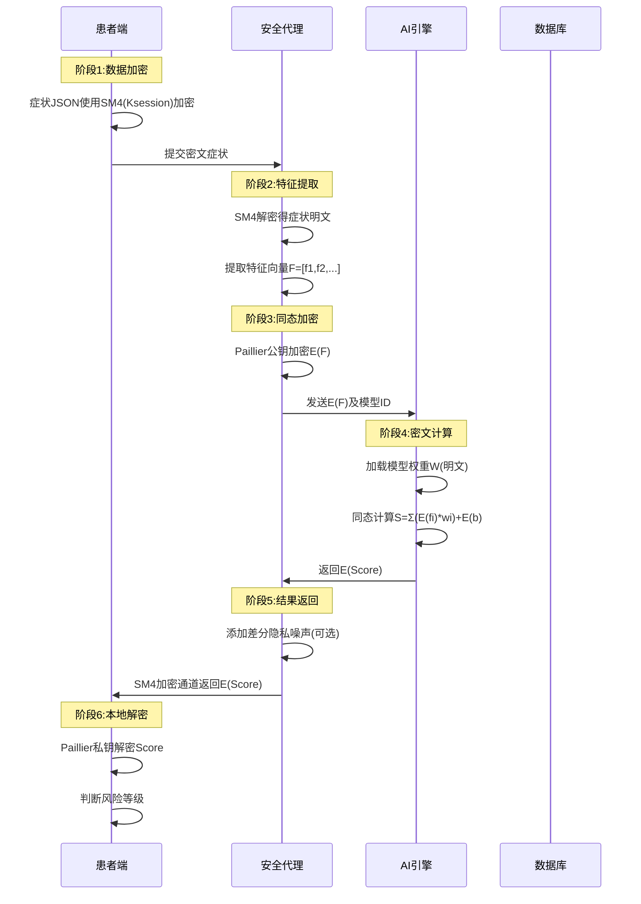

## 第五章 系统详细设计与实现

## 5.1 开发环境搭建与项目结构

### 5.1.1 开发环境配置

**表5-1 开发环境**

| 组件类型 | 名称/版本 | 用途 |
|---------|----------|------|
| **语言** | Go 1.20+ | 后端开发 |
| **框架** | Gin 1.9 | HTTP路由 |
| **ORM** | GORM 1.25 | 数据持久化 |
| **前端** | uni-app 3.0 | 跨平台界面 |
| **数据库** | MySQL 8.0 | 数据存储 |
| **缓存** | Redis 7.0 | 会话管理 |
| **国密库** | github.com/tjfoc/gmsm | SM2/SM3/SM4算法 |

### 5.1.2 项目目录结构

```
med-privacy-system/
├── cmd/
│   └── server/
│       └── main.go              # 主入口
├── internal/
│   ├── config/                  # 配置解析
│   ├── handler/                 # HTTP处理器
│   │   ├── patient.go           # 患者接口
│   │   ├── doctor.go            # 医生接口
│   │   └── admin.go             # 管理接口
│   ├── service/                 # 业务逻辑
│   │   ├── ai_service.go        # AI诊断服务
│   │   ├── crypto_service.go    # 加密服务
│   │   └── access_service.go    # 访问控制
│   ├── repository/              # 数据访问层
│   │   └── gorm_repo.go
│   ├── model/                   # GORM模型
│   ├── middleware/              # Gin中间件
│   │   ├── auth.go              # JWT认证
│   │   └── security.go          # 安全校验
│   └── pkg/                     # 公共库
│       ├── gmssl/               # 国密封装
│       ├── paillier/            # Paillier实现
│       └── utils/
├── web/                         # 前端Vue项目
├── configs/                     # 配置文件
├── scripts/                     # 部署脚本
├── go.mod
└── go.sum
```

采用分层架构：Handler(HTTP处理) → Service(业务逻辑) → Repository(数据访问)，`pkg`目录封装国密和Paillier算法库供复用

---

## 5.2 隐私保护AI诊断模块实现

### 5.2.1 数据流与加密流程设计



**图5-1 隐私保护AI诊断流程**

**表5-2 数据流关键节点**

| 阶段 | 操作 | 加密算法 | 安全目标 |
|------|------|---------|----------|
| **症状提交** | 患者端SM4加密症状JSON | SM4-128 | 传输层隐私保护 |
| **特征提取** | 服务端解密并提取特征向量 | SM4解密 | 获取明文特征 |
| **同态加密** | 特征向量Paillier加密 | Paillier-2048 | AI计算隐私保护 |
| **密文计算** | 加密特征与模型权重计算 | 同态加法/标量乘 | 不解密完成诊断 |
| **结果返回** | 加密分数通过SM4返回 | SM4+Paillier | 端到端隐私保护 |
| **本地解密** | 患者端私钥解密分数 | Paillier解密 | 只有患者知晓结果 |

### 5.2.2 Paillier同态加密核心算法

Paillier算法基于复合剩余类问题，支持加法同态：`E(m1)*E(m2)=E(m1+m2)`、`E(m)^k=E(m*k)`，加密公式：`c=g^m*r^n mod n²`

**核心数据结构**：公钥包含模数n(2048位)、n²和生成元g；私钥继承公钥并包含λ和μ参数用于解密

**加密操作**：选择随机数r确保gcd(r,n)=1，计算密文c=g^m·r^n mod n²

**同态运算**：加法同态通过密文相乘实现E(m1)·E(m2) mod n²=E(m1+m2)；标量乘法通过密文幂运算实现E(m)^k mod n²=E(m·k)

### 5.2.3 安全计算代理服务实现

**服务架构**：AIDiagnosisService封装Paillier公钥、模型仓库和加密服务三个核心依赖

**加密诊断流程**：①SM4解密症状JSON获取明文；②提取特征向量(年龄、血压、血糖等)并缩放100倍转整数；③Paillier加密所有特征值；④加载模型权重；⑤同态计算加权和Score=Σ(wi·xi)+b，权重缩放1000倍保持精度；⑥构造密文结果(包含加密分数和加密阈值)返回客户端

特征提取将症状转为6维数值向量(年龄、收缩压、舒张压、血糖、BMI、家族史)，浮点数缩放100倍转整数

**表5-3 AI诊断模型参数示例**

| 特征 | 权重 | 说明 |
|------|------|------|
| 年龄 | 0.25 | 年龄越大风险越高 |
| 收缩压 | 0.35 | 高血压指标 |
| 舒张压 | 0.20 | 高血压指标 |
| 血糖值 | 0.45 | 糖尿病核心指标 |
| BMI | 0.15 | 肥胖相关 |
| 家族史 | 0.60 | 遗传因素 |
| 偏置项b | -15.0 | 基准调整 |


**客户端解密**：患者端使用Paillier私钥解密分数和阈值，本地判断风险等级(LOW/MEDIUM/HIGH)，分数仅客户端可见

---

## 5.3 国密算法集成模块实现

### 5.3.1 国密算法封装架构

**表5-4 国密算法模块**

| 算法 | 功能 | 应用场景 | 关键参数 |
|------|------|---------|----------|
| **SM2** | 非对称加密/签名 | 登录签名、密钥交换 | 256位椭圆曲线 |
| **SM3** | 哈希算法 | 密码存储、数据完整性 | 256位摘要 |
| **SM4** | 对称加密 | 敏感数据加密 | 128位密钥ECB模式 |

### 5.3.2 SM2签名验证实现

**表5-4 SM2签名验证流程**

| 阶段 | 操作 | 说明 |
|------|------|------|
| **密钥生成** | GenerateKey(rand.Reader) | 客户端生成256位椭圆曲线密钥对 |
| **客户端签名** | ①计算SM3哈希 ②SM2私钥签名得(r,s) ③编码为r\|\|s | 登录时对数据签名 |
| **服务端验证** | ①提取签名和数据 ②查询用户公钥 ③SM2.Verify验证 | 中间件拦截验证签名 |
| **失败处理** | 返回401错误 | 签名无效拒绝请求 |

### 5.3.3 SM3密码哈希实现

**双重哈希**：前端`H1=SM3(password)`，后端`H2=SM3(H1||salt)`，HashPassword和VerifyPassword方法封装哈希计算和验证逻辑


### 5.3.4 SM4敏感数据加密实现

**加密服务封装**：CryptoService使用16字节主密钥(环境变量加载)，EncryptSM4采用ECB模式分块加密(PKCS7填充至16字节倍数)后Base64编码；DecryptSM4逆向解密并去填充

**病历加密存储**：CreateRecord方法①SM4加密主诉、诊断、治疗、处方四个敏感字段；②SM3计算明文拼接的完整性哈希；③构造MedicalRecord模型入库(包含密文和哈希)


---

## 5.4 基于SM9的访问控制模块实现

### 5.4.1 SM9属性基加密原理

SM9是基于身份的密码体制，支持属性策略加密：
- **密钥生成中心(KGC)**：根据用户属性派生私钥
- **访问策略**：定义访问规则，如"(科室=内科 AND 职称=主治医师) OR 角色=管理员"
- **密文关联**：病历密文与访问策略绑定，只有满足策略的用户能解密

**表5-5 SM9访问控制策略示例**

| 病历类型 | 访问策略 | 授权对象 |
|---------|---------|----------|
| 普通病历 | (role=doctor AND dept=患者科室) OR (role=patient AND id=患者本人) | 主治医生、患者本人 |
| 传染病病历 | role=doctor AND dept=传染科 AND title>=主治 | 传染科主治及以上 |
| 精神病历 | role=doctor AND dept=精神科 AND certification=有 | 持证精神科医生 |
| 急诊病历 | role=doctor AND dept=急诊科 | 急诊科所有医生 |

### 5.4.2 策略评估引擎实现

**策略评估引擎**：EvaluatePolicy解析JSON策略树，evaluateNode递归评估节点(AND逻辑全部为真、OR逻辑一个为真即可)，evaluateRule比对用户属性(role/dept/user_id/title)与规则值

**访问权限验证**：CheckRecordAccess中间件①从JWT提取用户ID；②获取用户属性(role、dept、title)；③查询病历访问策略；④评估策略，失败返回403；⑤记录访问日志

### 5.4.4 简化的SM9实现方案

系统采用RBAC+ABAC混合方案替代完整SM9实现，策略评估引擎实现细粒度控制，为高敏感数据预留SM9接口

**表5-6 访问控制实现对比**

| 方案 | 实现难度 | 性能 | 灵活性 | 应用场景 |
|------|---------|------|--------|----------|
| **RBAC** | 低 | 高 | 低 | 基础权限管理 |
| **ABAC策略评估** | 中 | 中 | 高 | 细粒度访问控制 |
| **SM9属性加密** | 高 | 低 | 高 | 极高敏感数据 |
| **混合方案** | 中 | 中 | 高 | 本系统采用 |

---

## 5.5 系统关键业务接口实现

### 5.5.1 API接口设计规范

**表5-7 RESTful API规范**

| 资源 | 方法 | 路径 | 功能 | 认证 |
|------|------|------|------|------|
| 用户 | POST | /api/v1/auth/register | 用户注册 | 无 |
| 用户 | POST | /api/v1/auth/login | 用户登录 | SM2签名 |
| 问诊 | POST | /api/v1/consultations | 创建问诊 | JWT |
| 问诊 | GET | /api/v1/consultations/:id | 查询问诊 | JWT+RBAC |
| AI诊断 | POST | /api/v1/ai/diagnose | AI诊断 | JWT |
| 病历 | POST | /api/v1/records | 创建病历 | JWT+医生角色 |
| 病历 | GET | /api/v1/records/:id | 查询病历 | JWT+ABAC |

### 5.5.2 用户登录接口实现

**表5-9 登录接口实现流程**

| 层次 | 操作 | 说明 |
|------|------|------|
| **Handler层** | ①绑定请求参数 ②调用VerifyCredentials ③生成JWT ④生成会话密钥 ⑤存入Redis ⑥返回token和session_key | AuthHandler.Login处理登录请求 |
| **Service层** | ①查询用户 ②验证双重SM3哈希 ③检查账户状态 | UserService.VerifyCredentials验证凭证 |
| **返回结果** | {token, session_key, user:{id, username, role}} | JWT+会话密钥+用户信息 |

### 5.5.3 创建问诊接口实现

**Handler层**：①从JWT提取用户ID；②绑定请求参数；③调用ConsultationService.Create；④返回问诊ID、状态和创建时间


### 5.5.4 查询病历接口实现

**Handler层**：①解析病历ID；②查询病历(ABAC已验证权限)；③SM4解密敏感字段；④记录审计日志；⑤返回解密后的病历数据


**表5-8 核心API接口汇总**

| 接口路径 | 功能 | 关键技术 | 性能要求 |
|---------|------|---------|----------|
| POST /api/v1/auth/login | 用户登录 | SM2签名验证、SM3密码哈希、JWT生成 | <500ms |
| POST /api/v1/consultations | 创建问诊 | SM4加密主诉、异步AI预诊断 | <1s |
| POST /api/v1/ai/diagnose | AI诊断 | Paillier同态加密、密文计算 | <3s |
| POST /api/v1/records | 创建病历 | SM4加密、SM3完整性哈希、RBAC | <800ms |
| GET /api/v1/records/:id | 查询病历 | SM4解密、ABAC策略评估、审计日志 | <600ms |

---

## 5.6 系统管理后台实现

### 5.6.1 前端技术栈

**表5-9 前端技术选型**

| 技术 | 版本 | 用途 |
|------|------|------|
| **Vue.js** | 3.2 | 响应式框架 |
| **Element-Plus** | 2.3 | UI组件库 |
| **Axios** | 1.4 | HTTP请求 |
| **Pinia** | 2.1 | 状态管理 |
| **Vue Router** | 4.2 | 路由管理 |

### 5.6.2 权限按钮动态渲染

**权限指令**：封装Vue自定义指令`v-permission`，通过比对用户权限列表与按钮所需权限，动态移除无权限按钮节点


---

### 5.6.3 管理后台功能模块

**表5-10 管理后台功能模块**

| 模块 | 功能 | 权限要求 | 关键技术 |
|------|------|---------|----------|
| **用户管理** | 用户CRUD、角色分配、账户启停 | admin | SM3密码哈希、SM4敏感信息加密 |
| **角色管理** | 角色CRUD、权限绑定 | admin | RBAC模型 |
| **权限管理** | 权限CRUD、资源路径配置 | admin | 权限树组件 |
| **病历管理** | 病历查询、审核、导出 | admin, doctor | SM4解密、ABAC策略 |
| **审计日志** | 操作日志查询、导出、统计 | admin | 日志检索、IP解密 |
| **系统配置** | 参数配置、密钥管理 | admin | 配置加密存储 |

---

## 5.7 本章小结

本章实现了系统核心功能模块，包括隐私保护AI诊断、国密算法集成、访问控制和管理后台。

AI诊断模块采用Paillier同态加密，实现特征向量密文计算，服务端不接触明文数据。国密模块集成SM2数字签名(登录验证)、SM3哈希(密码存储、数据完整性)、SM4对称加密(敏感字段加密)。访问控制采用RBAC+ABAC混合方案，通过策略评估引擎实现细粒度权限管理。管理后台基于Vue+Element-Plus构建，实现用户管理、角色权限配置、审计日志查询等功能，通过自定义指令实现按钮级权限控制。

系统实现充分体现了安全合规、隐私保护和可维护性原则，核心加密算法封装为独立模块便于测试和复用，分层架构确保业务逻辑与数据访问分离。
