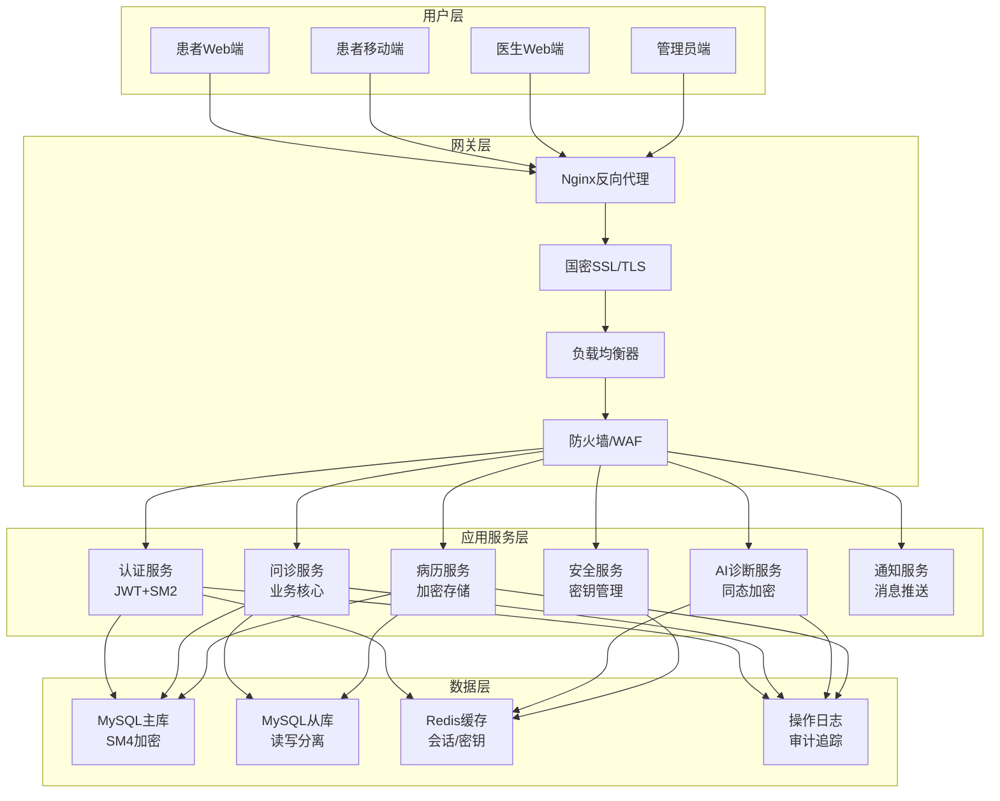
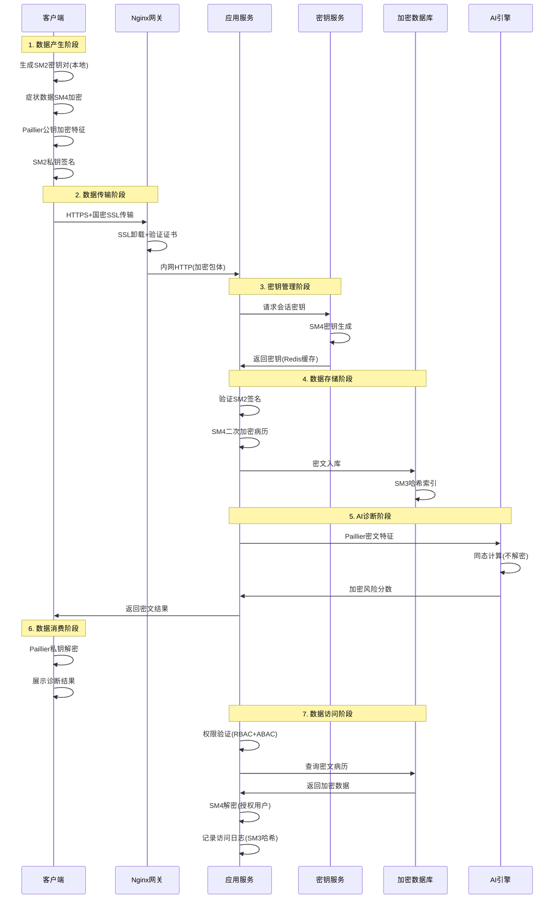
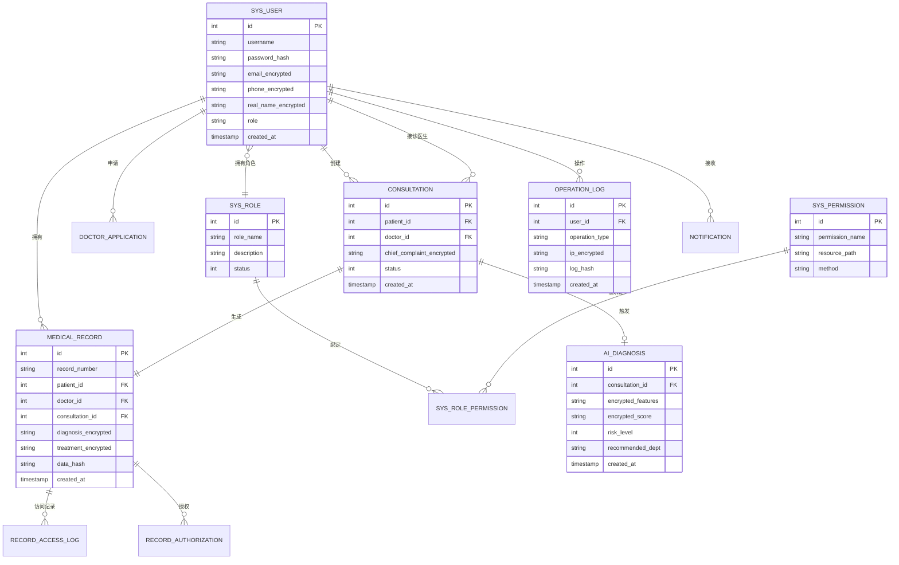

## 第四章 系统总体设计

## 4.1 设计目标与原则

系统以安全合规和隐私保护为核心，采用模块化架构设计。关键策略：敏感数据全流程SM系列加密、Paillier同态AI计算、RBAC+ABAC访问控制、高内聚低耦合模块划分、连接池与索引优化支撑高并发

---

## 4.2 系统架构设计

### 4.2.1 总体架构图

**表4-2 系统四层架构**

| 层次 | 核心组件 | 主要职责 | 关键技术 |
|------|---------|---------|---------|
| **用户层** | Web端、移动端 | 用户交互界面、本地加密、数据展示 | uni-app、Vue.js、SM4客户端加密 |
| **网关层** | Nginx、负载均衡 | 流量分发、SSL卸载、安全防护 | 国密SSL、WAF、反向代理 |
| **应用服务层** | 6大核心服务 | 业务逻辑处理、加密解密、权限控制 | Go+Gin、SM2/SM3/SM4、JWT |
| **数据层** | MySQL、Redis | 持久化存储、缓存加速、日志审计 | GORM、主从复制、密文存储 |

---

### 4.2.2 全链路加密架构

**表4-3 数据全链路加密策略**

| 阶段 | 加密算法 | 安全目标 |
|------|---------|----------|
| **客户端加密** | SM4(症状)、Paillier(特征) | 端到端隐私保护 |
| **传输加密** | 国密SSL/TLS 1.3 | 防中间人攻击 |
| **签名验证** | SM2数字签名 | 身份认证、防篡改 |
| **存储加密** | SM4-ECB-128 | 数据库泄露防护 |
| **同态计算** | Paillier加法同态 | AI隐私诊断 |
| **完整性校验** | SM3哈希算法 | 防数据篡改 |

---

### 4.2.3 安全防护体系

系统实施四层纵深防御：网络层(防火墙、DDoS、IP白名单)、传输层(国密SSL双向认证)、应用层(JWT+SM2签名、限流、SQL注入防护)、数据层(SM4加密、SM3校验、RBAC+审计日志)

---

## 4.3 系统功能模块设计

**表4-4 核心功能模块**

| 模块名称 | 主要职责 | 关键功能 |
|---------|---------|----------|
| **认证与权限** | 用户认证、角色管理 | 用户注册(邮箱SM4加密)、登录(SM2签名验证)、JWT Token生成、权限验证(RBAC+ABAC) |
| **问诊管理** | 在线问诊全流程 | 创建问诊(症状SM4加密)、医生接诊、开具诊断(处方加密)、完成问诊，状态流转:0−1−2 |
| **AI诊断服务** | 隐私保护AI智能诊断 | 特征提取、Paillier同态计算(密文上线性运算)、疾病匹配、科室推荐、生活指导 |
| **病历管理** | 电子病历加密存储 | 病历生成(关联问诊)、SM4加密存储、SM3完整性校验、访问控制(患者/医生/管理员)、授权管理 |
| **安全服务** | 密钥管理、加解密 | 密钥初始化(SM4主密钥)、SM4加解密、SM2签名验证、SM3哈希计算，会话密钥Redis缓存 |
| **通知与日志** | 消息推送、操作审计 | 系统通知(消息队列)、操作日志(IP加密、日志哈希)、日志查询(管理员)、审计报表 |

---

## 4.4 数据库设计

系统采用GORM模型设计，确保类型安全和查询性能。

---

### 4.4.1 E-R图

---

### 4.4.2 核心表结构设计

#### **表4-9 sys_user 用户表**

| 字段名 | 类型 | 约束 | 说明 |
|-------|------|------|------|
| id | INT | PK, AUTO_INCREMENT | 用户ID |
| username | VARCHAR(50) | UNIQUE, NOT NULL | 用户名 |
| password_hash | VARCHAR(64) | NOT NULL | SM3双重哈希密码 |
| email_encrypted | VARCHAR(200) | UNIQUE | SM4加密邮箱 |
| phone_encrypted | VARCHAR(200) | NULL | SM4加密手机号 |
| real_name_encrypted | VARCHAR(200) | NULL | SM4加密真实姓名 |
| id_card_encrypted | VARCHAR(200) | NULL | SM4加密身份证号 |
| role | VARCHAR(20) | NOT NULL, DEFAULT 'patient' | 用户角色 |
| status | TINYINT | NOT NULL, DEFAULT 1 | 状态(0禁用1正常) |
| created_at | TIMESTAMP | DEFAULT CURRENT_TIMESTAMP | 创建时间 |
| updated_at | TIMESTAMP | ON UPDATE CURRENT_TIMESTAMP | 更新时间 |

**索引**：PK(id)、UK(username, email_encrypted)、IDX(role, status) | **说明**：密码双重SM3哈希、敏感字段SM4加密

#### **表4-10 sys_role 角色表**

| 字段名 | 类型 | 约束 | 说明 |
|-------|------|------|------|
| id | INT | PK, AUTO_INCREMENT | 角色ID |
| role_name | VARCHAR(50) | UNIQUE, NOT NULL | 角色名称 |
| description | VARCHAR(200) | NULL | 角色描述 |
| status | TINYINT | NOT NULL, DEFAULT 1 | 状态(0禁用1正常) |
| created_at | TIMESTAMP | DEFAULT CURRENT_TIMESTAMP | 创建时间 |
| updated_at | TIMESTAMP | ON UPDATE CURRENT_TIMESTAMP | 更新时间 |

**索引**：PK(id)、UK(role_name)

#### **表4-11 sys_permission 权限表**

| 字段名 | 类型 | 约束 | 说明 |
|-------|------|------|------|
| id | INT | PK, AUTO_INCREMENT | 权限ID |
| permission_name | VARCHAR(50) | UNIQUE, NOT NULL | 权限名称 |
| resource_path | VARCHAR(200) | NOT NULL | 资源路径 |
| method | VARCHAR(10) | NOT NULL | HTTP方法 |
| description | VARCHAR(200) | NULL | 权限描述 |
| created_at | TIMESTAMP | DEFAULT CURRENT_TIMESTAMP | 创建时间 |

**索引**：PK(id)、UK(permission_name)、IDX(resource_path, method)

#### **表4-12 medical_record 病历表**

| 字段名 | 类型 | 约束 | 说明 |
|-------|------|------|------|
| id | INT | PK, AUTO_INCREMENT | 病历ID |
| record_number | VARCHAR(50) | UNIQUE, NOT NULL | 病历编号(MR+时间戳) |
| patient_id | INT | FK, NOT NULL | 患者ID |
| doctor_id | INT | FK, NOT NULL | 医生ID |
| consultation_id | INT | FK, UNIQUE | 关联问诊ID |
| chief_complaint_encrypted | TEXT | NOT NULL | SM4加密主诉 |
| diagnosis_encrypted | TEXT | NOT NULL | SM4加密诊断结论 |
| treatment_encrypted | TEXT | NULL | SM4加密治疗方案 |
| prescription_encrypted | TEXT | NULL | SM4加密处方信息 |
| ai_advice | TEXT | NULL | AI诊断建议 |
| data_hash | VARCHAR(64) | NOT NULL | SM3完整性哈希 |
| created_at | TIMESTAMP | DEFAULT CURRENT_TIMESTAMP | 创建时间 |
| updated_at | TIMESTAMP | ON UPDATE CURRENT_TIMESTAMP | 更新时间 |

**索引**：PK(id)、UK(record_number, consultation_id)、IDX(patient_id, doctor_id, created_at) | **完整性**：SM3哈希校验防篡改

#### **表4-13 consultation 问诊表**

| 字段名 | 类型 | 约束 | 说明 |
|-------|------|------|------|
| id | INT | PK, AUTO_INCREMENT | 问诊ID |
| patient_id | INT | FK, NOT NULL | 患者ID |
| doctor_id | INT | FK, NULL | 医生ID |
| chief_complaint_encrypted | TEXT | NOT NULL | SM4加密主诉 |
| status | TINYINT | NOT NULL, DEFAULT 0 | 状态(0待接诊1问诊中2已完成3已取消) |
| created_at | TIMESTAMP | DEFAULT CURRENT_TIMESTAMP | 创建时间 |
| accepted_at | TIMESTAMP | NULL | 接诊时间 |
| completed_at | TIMESTAMP | NULL | 完成时间 |

**索引**：PK(id)、IDX(patient_id, doctor_id+status, created_at)

#### **表4-14 ai_diagnosis AI诊断表**

| 字段名 | 类型 | 约束 | 说明 |
|-------|------|------|------|
| id | INT | PK, AUTO_INCREMENT | 诊断ID |
| consultation_id | INT | FK, UNIQUE, NOT NULL | 关联问诊ID |
| encrypted_features | TEXT | NOT NULL | Paillier加密特征向量 |
| encrypted_score | VARCHAR(500) | NOT NULL | Paillier加密分数 |
| risk_level | TINYINT | NOT NULL | 风险等级(0低1中2高3紧急) |
| possible_diseases | VARCHAR(500) | NULL | 可能疾病(JSON) |
| recommended_dept | VARCHAR(100) | NULL | 推荐科室 |
| urgency_level | VARCHAR(50) | NULL | 紧急程度 |
| lifestyle_advice | TEXT | NULL | 生活指导 |
| created_at | TIMESTAMP | DEFAULT CURRENT_TIMESTAMP | 创建时间 |

**索引**：PK(id)、UK(consultation_id)、IDX(risk_level, created_at)

#### **表4-15 operation_log 操作日志表**

| 字段名 | 类型 | 约束 | 说明 |
|-------|------|------|------|
| id | BIGINT | PK, AUTO_INCREMENT | 日志ID |
| user_id | INT | FK, NULL | 操作用户ID |
| operation_type | VARCHAR(50) | NOT NULL | 操作类型(LOGIN/QUERY/UPDATE) |
| resource_type | VARCHAR(50) | NULL | 资源类型(USER/RECORD/CONSULTATION) |
| resource_id | INT | NULL | 资源ID |
| operation_detail | VARCHAR(500) | NULL | 操作详情 |
| ip_encrypted | VARCHAR(200) | NULL | SM4加密IP地址 |
| user_agent | VARCHAR(500) | NULL | 用户代理 |
| log_hash | VARCHAR(64) | NOT NULL | SM3日志完整性哈希 |
| status | TINYINT | NOT NULL | 操作状态(0失败1成功) |
| created_at | TIMESTAMP | DEFAULT CURRENT_TIMESTAMP | 创建时间 |

**索引**：PK(id)、IDX(user_id, operation_type, created_at, resource_type+resource_id) | **说明**：IP加密、日志哈希防篡改

---

### 4.4.3 数据库性能优化

**表4-16 GORM优化策略**

| 优化类型 | 配置/策略 |
|---------|----------|
| **连接池** | MaxIdleConns=10, MaxOpenConns=100, ConnMaxLifetime=1h |
| **索引** | 单列(patient_id, doctor_id, status)、复合(doctor_id+status)、唯一(username, email_encrypted) |
| **查询** | 预编译语句防SQL注入、LIMIT分页、最左前缀原则 |

---

## 4.5 本章小结

本章设计了四层架构体系(用户层、网关层、应用服务层、数据层)，通过国密SSL传输、SM4存储加密、Paillier同态AI计算构建全链路安全防护。功能划分为认证权限、问诊管理、AI诊断、病历管理、安全服务、通知日志6大模块。数据库采用GORM模型，核心表SM4加密+SM3校验，复合索引与连接池优化查询性能。系统设计贯彻安全合规与隐私保护理念，为实现阶段提供架构基础。
